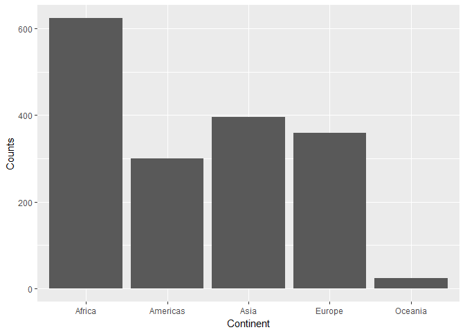
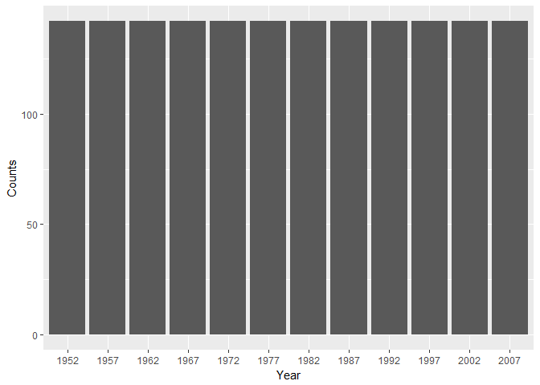
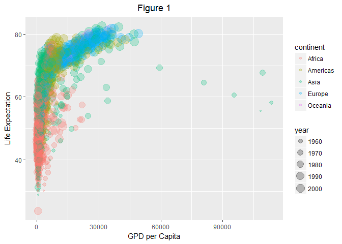
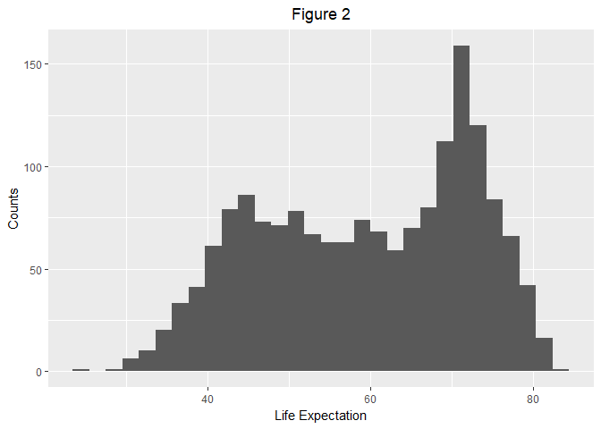
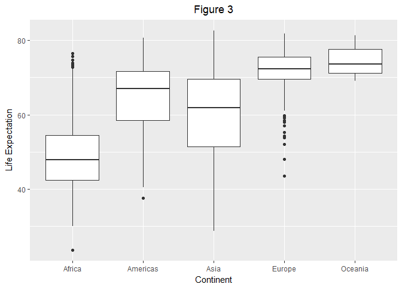
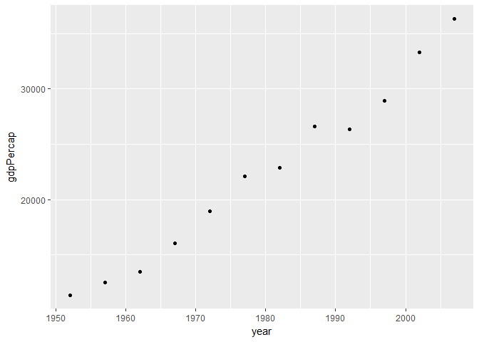
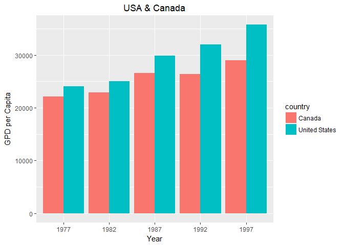

Homework 02
================
Yuanji Sun
September 25, 2017

STAT 545A Homework 02
=====================

Report progress
---------------

1.  This homework did not go smoothly and took a longer time for me to finish.

2.  Problems I ran into

    -   ggplot2() or ggplot(): I am confused about them. I used ggplot2 at the beginning and got error messages. When loading tidyverse, ggplot2 was also loaded, which made me more and more confused. Actually, ggplot2 is a library, which includes ggplot.
    -   Labels and titles: I tried to learn more by adding labels and titles for figures. Actually, the way to do this depends on which function you use (e.g. plot vs ggplot). I spent a long time working on this.
    -   By assigning a figure to a value, we can add additional "layers" to it and replacing it by adding a new layer. However, a much easier way to do this is add + again and again.
    -   After coding, the results were not displayed automatically. At the beginning, I added a line of code to print the results. But the easiest way to do this is put what needs to be printed in a ().
    -   As you can see below, I plotted a barplot with Canada and USA side by side. However, I did not figure this out for a long time. This is because I missed "group". Here, "group" doesn't refer to a function called "group". As you can see below, I used "fill" instead. This is because when filling the color according to countries, data will be grouped automatically.
    -   When using ggplot, dataset must be specified first. What should I do if I only have x and y? Here I piped the data and solved this problem in another way.
    -   After adding a title, it was not centered. This problem is now fixed by adding additional codes (see below).
    -   In the first figure in Part 5, the x-axis was wrong which displayed years ending with 0 and 5 instead of years like 1982 and 1987. This is because R took years as continuous number. In order to solve this problem, I turned years into factors and it worked.
    -   When writing this report, my number list doesn't work. This is because if I add bullets below a number list, the number next will be reset and start from 1. In order to solve this issue, I added a space before each bullet.
    -   I was also confused with class, type and data type. This problem is solved now.
    -   Using ggplot to make different figure type. I went through many materials and finally figured this out.
    -   The biggest difficulty I am having now is that I am not used to how R works. I am used to MATLAB and plot is easy. But R is different. It adds layers to the plots and combines them together. I still need more time to get used with this.

3.  Useful materials

    -   Google: Google knows almost everything
    -   R documentation, both online and within RStudio

4.  Conclusion

I don't think this homework is difficult. The reason why I spent a long time on it is that I am still not familiar with R language. By doing this homework, I reviewed all knowledge discussed in class and tried more interesting things. I learned a lot from this homework.

Part 1. Bring rectangular data in
---------------------------------

Load the library

``` r
library(gapminder)
library(tidyverse)
```

    ## Loading tidyverse: ggplot2
    ## Loading tidyverse: tibble
    ## Loading tidyverse: tidyr
    ## Loading tidyverse: readr
    ## Loading tidyverse: purrr
    ## Loading tidyverse: dplyr

    ## Conflicts with tidy packages ----------------------------------------------

    ## filter(): dplyr, stats
    ## lag():    dplyr, stats

Part 2. Smell test the data
---------------------------

**Question 1**: Is it a data.frame, a matrix, a vector, a list?

Answer: It is both a list and data.frame.

``` r
typeof(gapminder)
```

    ## [1] "list"

``` r
is.list(gapminder)
```

    ## [1] TRUE

``` r
is.data.frame(gapminder)
```

    ## [1] TRUE

**Question 2**: What’s its class?

Answer: The class is data.frame.

``` r
class(gapminder)
```

    ## [1] "tbl_df"     "tbl"        "data.frame"

**Question 3**: How many variables/columns?

Answer: There are 6 variables/columns.

``` r
ncol(gapminder)
```

    ## [1] 6

**Question 4**: How many rows/observations?

Answer: There are 1704 rows/observations.

``` r
nrow(gapminder)
```

    ## [1] 1704

**Question 5**: Can you get these facts about “extent” or “size” in more than one way? Can you imagine different functions being useful in different contexts?

Answer: Of course, I can!

I can know there are 6 variables using the following code, which will return the names of all variables.

``` r
names(gapminder)
```

    ## [1] "country"   "continent" "year"      "lifeExp"   "pop"       "gdpPercap"

I can also konw the number of variables using the following code.

``` r
length(gapminder)
```

    ## [1] 6

I can use the following code"head"" to view the first 6 rows of the data, which will tell me what variables are included. Of course, using "tail" returns the last 6 rows, but I can still get variable names from it.

``` r
head(gapminder)
```

    ## # A tibble: 6 x 6
    ##       country continent  year lifeExp      pop gdpPercap
    ##        <fctr>    <fctr> <int>   <dbl>    <int>     <dbl>
    ## 1 Afghanistan      Asia  1952  28.801  8425333  779.4453
    ## 2 Afghanistan      Asia  1957  30.332  9240934  820.8530
    ## 3 Afghanistan      Asia  1962  31.997 10267083  853.1007
    ## 4 Afghanistan      Asia  1967  34.020 11537966  836.1971
    ## 5 Afghanistan      Asia  1972  36.088 13079460  739.9811
    ## 6 Afghanistan      Asia  1977  38.438 14880372  786.1134

``` r
tail(gapminder)
```

    ## # A tibble: 6 x 6
    ##    country continent  year lifeExp      pop gdpPercap
    ##     <fctr>    <fctr> <int>   <dbl>    <int>     <dbl>
    ## 1 Zimbabwe    Africa  1982  60.363  7636524  788.8550
    ## 2 Zimbabwe    Africa  1987  62.351  9216418  706.1573
    ## 3 Zimbabwe    Africa  1992  60.377 10704340  693.4208
    ## 4 Zimbabwe    Africa  1997  46.809 11404948  792.4500
    ## 5 Zimbabwe    Africa  2002  39.989 11926563  672.0386
    ## 6 Zimbabwe    Africa  2007  43.487 12311143  469.7093

I can even using the following code to preview the dataset, which will give me the variable names.

``` r
str(gapminder)
```

    ## Classes 'tbl_df', 'tbl' and 'data.frame':    1704 obs. of  6 variables:
    ##  $ country  : Factor w/ 142 levels "Afghanistan",..: 1 1 1 1 1 1 1 1 1 1 ...
    ##  $ continent: Factor w/ 5 levels "Africa","Americas",..: 3 3 3 3 3 3 3 3 3 3 ...
    ##  $ year     : int  1952 1957 1962 1967 1972 1977 1982 1987 1992 1997 ...
    ##  $ lifeExp  : num  28.8 30.3 32 34 36.1 ...
    ##  $ pop      : int  8425333 9240934 10267083 11537966 13079460 14880372 12881816 13867957 16317921 22227415 ...
    ##  $ gdpPercap: num  779 821 853 836 740 ...

It is a good idea to get the summary of the dataset, which will include variable names.

``` r
summary(gapminder)
```

    ##         country        continent        year         lifeExp     
    ##  Afghanistan:  12   Africa  :624   Min.   :1952   Min.   :23.60  
    ##  Albania    :  12   Americas:300   1st Qu.:1966   1st Qu.:48.20  
    ##  Algeria    :  12   Asia    :396   Median :1980   Median :60.71  
    ##  Angola     :  12   Europe  :360   Mean   :1980   Mean   :59.47  
    ##  Argentina  :  12   Oceania : 24   3rd Qu.:1993   3rd Qu.:70.85  
    ##  Australia  :  12                  Max.   :2007   Max.   :82.60  
    ##  (Other)    :1632                                                
    ##       pop              gdpPercap       
    ##  Min.   :6.001e+04   Min.   :   241.2  
    ##  1st Qu.:2.794e+06   1st Qu.:  1202.1  
    ##  Median :7.024e+06   Median :  3531.8  
    ##  Mean   :2.960e+07   Mean   :  7215.3  
    ##  3rd Qu.:1.959e+07   3rd Qu.:  9325.5  
    ##  Max.   :1.319e+09   Max.   :113523.1  
    ## 

I can use the following code to get both row \# and column \#. The first output is row \# and the second one is column \#.

``` r
dim(gapminder)
```

    ## [1] 1704    6

The code below will return all variables, row \# and column \# at the same time.

``` r
glimpse(gapminder)
```

    ## Observations: 1,704
    ## Variables: 6
    ## $ country   <fctr> Afghanistan, Afghanistan, Afghanistan, Afghanistan,...
    ## $ continent <fctr> Asia, Asia, Asia, Asia, Asia, Asia, Asia, Asia, Asi...
    ## $ year      <int> 1952, 1957, 1962, 1967, 1972, 1977, 1982, 1987, 1992...
    ## $ lifeExp   <dbl> 28.801, 30.332, 31.997, 34.020, 36.088, 38.438, 39.8...
    ## $ pop       <int> 8425333, 9240934, 10267083, 11537966, 13079460, 1488...
    ## $ gdpPercap <dbl> 779.4453, 820.8530, 853.1007, 836.1971, 739.9811, 78...

I think that's all. I am moving to the next question.

**Question 6**: What data type is each variable?

Answer:

-   country: factor
-   continent: factor
-   year: integer
-   lifeExp: double
-   pop: integer
-   gdpPercap: double

``` r
glimpse(gapminder)
```

    ## Observations: 1,704
    ## Variables: 6
    ## $ country   <fctr> Afghanistan, Afghanistan, Afghanistan, Afghanistan,...
    ## $ continent <fctr> Asia, Asia, Asia, Asia, Asia, Asia, Asia, Asia, Asi...
    ## $ year      <int> 1952, 1957, 1962, 1967, 1972, 1977, 1982, 1987, 1992...
    ## $ lifeExp   <dbl> 28.801, 30.332, 31.997, 34.020, 36.088, 38.438, 39.8...
    ## $ pop       <int> 8425333, 9240934, 10267083, 11537966, 13079460, 1488...
    ## $ gdpPercap <dbl> 779.4453, 820.8530, 853.1007, 836.1971, 739.9811, 78...

Part 3. Explore individual variables
------------------------------------

**Question 1**: What are possible values (or range, whichever is appropriate) of each variable?

Answer:

Using the code below, I can get the value/range of each variable.

-   country: there are 142 countries in gapminder
-   continent: Africa, Americas, Asia, Europe, Oceania
-   year: range from 1952 to 2007
-   lifeExp: range from 23.60 to 82.60
-   pop: range from 6.001e+04 to 1.319e+09
-   gdpPercap: range from 241.2 to 113523.1

``` r
summary(gapminder)
```

    ##         country        continent        year         lifeExp     
    ##  Afghanistan:  12   Africa  :624   Min.   :1952   Min.   :23.60  
    ##  Albania    :  12   Americas:300   1st Qu.:1966   1st Qu.:48.20  
    ##  Algeria    :  12   Asia    :396   Median :1980   Median :60.71  
    ##  Angola     :  12   Europe  :360   Mean   :1980   Mean   :59.47  
    ##  Argentina  :  12   Oceania : 24   3rd Qu.:1993   3rd Qu.:70.85  
    ##  Australia  :  12                  Max.   :2007   Max.   :82.60  
    ##  (Other)    :1632                                                
    ##       pop              gdpPercap       
    ##  Min.   :6.001e+04   Min.   :   241.2  
    ##  1st Qu.:2.794e+06   1st Qu.:  1202.1  
    ##  Median :7.024e+06   Median :  3531.8  
    ##  Mean   :2.960e+07   Mean   :  7215.3  
    ##  3rd Qu.:1.959e+07   3rd Qu.:  9325.5  
    ##  Max.   :1.319e+09   Max.   :113523.1  
    ## 

``` r
# There are too many countries which are not shown in summary. Codes below solves this problem.
(country_list <- unique(gapminder$country)) # Return a list of all countries
```

    ##   [1] Afghanistan              Albania                 
    ##   [3] Algeria                  Angola                  
    ##   [5] Argentina                Australia               
    ##   [7] Austria                  Bahrain                 
    ##   [9] Bangladesh               Belgium                 
    ##  [11] Benin                    Bolivia                 
    ##  [13] Bosnia and Herzegovina   Botswana                
    ##  [15] Brazil                   Bulgaria                
    ##  [17] Burkina Faso             Burundi                 
    ##  [19] Cambodia                 Cameroon                
    ##  [21] Canada                   Central African Republic
    ##  [23] Chad                     Chile                   
    ##  [25] China                    Colombia                
    ##  [27] Comoros                  Congo, Dem. Rep.        
    ##  [29] Congo, Rep.              Costa Rica              
    ##  [31] Cote d'Ivoire            Croatia                 
    ##  [33] Cuba                     Czech Republic          
    ##  [35] Denmark                  Djibouti                
    ##  [37] Dominican Republic       Ecuador                 
    ##  [39] Egypt                    El Salvador             
    ##  [41] Equatorial Guinea        Eritrea                 
    ##  [43] Ethiopia                 Finland                 
    ##  [45] France                   Gabon                   
    ##  [47] Gambia                   Germany                 
    ##  [49] Ghana                    Greece                  
    ##  [51] Guatemala                Guinea                  
    ##  [53] Guinea-Bissau            Haiti                   
    ##  [55] Honduras                 Hong Kong, China        
    ##  [57] Hungary                  Iceland                 
    ##  [59] India                    Indonesia               
    ##  [61] Iran                     Iraq                    
    ##  [63] Ireland                  Israel                  
    ##  [65] Italy                    Jamaica                 
    ##  [67] Japan                    Jordan                  
    ##  [69] Kenya                    Korea, Dem. Rep.        
    ##  [71] Korea, Rep.              Kuwait                  
    ##  [73] Lebanon                  Lesotho                 
    ##  [75] Liberia                  Libya                   
    ##  [77] Madagascar               Malawi                  
    ##  [79] Malaysia                 Mali                    
    ##  [81] Mauritania               Mauritius               
    ##  [83] Mexico                   Mongolia                
    ##  [85] Montenegro               Morocco                 
    ##  [87] Mozambique               Myanmar                 
    ##  [89] Namibia                  Nepal                   
    ##  [91] Netherlands              New Zealand             
    ##  [93] Nicaragua                Niger                   
    ##  [95] Nigeria                  Norway                  
    ##  [97] Oman                     Pakistan                
    ##  [99] Panama                   Paraguay                
    ## [101] Peru                     Philippines             
    ## [103] Poland                   Portugal                
    ## [105] Puerto Rico              Reunion                 
    ## [107] Romania                  Rwanda                  
    ## [109] Sao Tome and Principe    Saudi Arabia            
    ## [111] Senegal                  Serbia                  
    ## [113] Sierra Leone             Singapore               
    ## [115] Slovak Republic          Slovenia                
    ## [117] Somalia                  South Africa            
    ## [119] Spain                    Sri Lanka               
    ## [121] Sudan                    Swaziland               
    ## [123] Sweden                   Switzerland             
    ## [125] Syria                    Taiwan                  
    ## [127] Tanzania                 Thailand                
    ## [129] Togo                     Trinidad and Tobago     
    ## [131] Tunisia                  Turkey                  
    ## [133] Uganda                   United Kingdom          
    ## [135] United States            Uruguay                 
    ## [137] Venezuela                Vietnam                 
    ## [139] West Bank and Gaza       Yemen, Rep.             
    ## [141] Zambia                   Zimbabwe                
    ## 142 Levels: Afghanistan Albania Algeria Angola Argentina ... Zimbabwe

``` r
(country_list2 <- table(gapminder$country)) # This is even a better way to get a list of all countries
```

    ## 
    ##              Afghanistan                  Albania                  Algeria 
    ##                       12                       12                       12 
    ##                   Angola                Argentina                Australia 
    ##                       12                       12                       12 
    ##                  Austria                  Bahrain               Bangladesh 
    ##                       12                       12                       12 
    ##                  Belgium                    Benin                  Bolivia 
    ##                       12                       12                       12 
    ##   Bosnia and Herzegovina                 Botswana                   Brazil 
    ##                       12                       12                       12 
    ##                 Bulgaria             Burkina Faso                  Burundi 
    ##                       12                       12                       12 
    ##                 Cambodia                 Cameroon                   Canada 
    ##                       12                       12                       12 
    ## Central African Republic                     Chad                    Chile 
    ##                       12                       12                       12 
    ##                    China                 Colombia                  Comoros 
    ##                       12                       12                       12 
    ##         Congo, Dem. Rep.              Congo, Rep.               Costa Rica 
    ##                       12                       12                       12 
    ##            Cote d'Ivoire                  Croatia                     Cuba 
    ##                       12                       12                       12 
    ##           Czech Republic                  Denmark                 Djibouti 
    ##                       12                       12                       12 
    ##       Dominican Republic                  Ecuador                    Egypt 
    ##                       12                       12                       12 
    ##              El Salvador        Equatorial Guinea                  Eritrea 
    ##                       12                       12                       12 
    ##                 Ethiopia                  Finland                   France 
    ##                       12                       12                       12 
    ##                    Gabon                   Gambia                  Germany 
    ##                       12                       12                       12 
    ##                    Ghana                   Greece                Guatemala 
    ##                       12                       12                       12 
    ##                   Guinea            Guinea-Bissau                    Haiti 
    ##                       12                       12                       12 
    ##                 Honduras         Hong Kong, China                  Hungary 
    ##                       12                       12                       12 
    ##                  Iceland                    India                Indonesia 
    ##                       12                       12                       12 
    ##                     Iran                     Iraq                  Ireland 
    ##                       12                       12                       12 
    ##                   Israel                    Italy                  Jamaica 
    ##                       12                       12                       12 
    ##                    Japan                   Jordan                    Kenya 
    ##                       12                       12                       12 
    ##         Korea, Dem. Rep.              Korea, Rep.                   Kuwait 
    ##                       12                       12                       12 
    ##                  Lebanon                  Lesotho                  Liberia 
    ##                       12                       12                       12 
    ##                    Libya               Madagascar                   Malawi 
    ##                       12                       12                       12 
    ##                 Malaysia                     Mali               Mauritania 
    ##                       12                       12                       12 
    ##                Mauritius                   Mexico                 Mongolia 
    ##                       12                       12                       12 
    ##               Montenegro                  Morocco               Mozambique 
    ##                       12                       12                       12 
    ##                  Myanmar                  Namibia                    Nepal 
    ##                       12                       12                       12 
    ##              Netherlands              New Zealand                Nicaragua 
    ##                       12                       12                       12 
    ##                    Niger                  Nigeria                   Norway 
    ##                       12                       12                       12 
    ##                     Oman                 Pakistan                   Panama 
    ##                       12                       12                       12 
    ##                 Paraguay                     Peru              Philippines 
    ##                       12                       12                       12 
    ##                   Poland                 Portugal              Puerto Rico 
    ##                       12                       12                       12 
    ##                  Reunion                  Romania                   Rwanda 
    ##                       12                       12                       12 
    ##    Sao Tome and Principe             Saudi Arabia                  Senegal 
    ##                       12                       12                       12 
    ##                   Serbia             Sierra Leone                Singapore 
    ##                       12                       12                       12 
    ##          Slovak Republic                 Slovenia                  Somalia 
    ##                       12                       12                       12 
    ##             South Africa                    Spain                Sri Lanka 
    ##                       12                       12                       12 
    ##                    Sudan                Swaziland                   Sweden 
    ##                       12                       12                       12 
    ##              Switzerland                    Syria                   Taiwan 
    ##                       12                       12                       12 
    ##                 Tanzania                 Thailand                     Togo 
    ##                       12                       12                       12 
    ##      Trinidad and Tobago                  Tunisia                   Turkey 
    ##                       12                       12                       12 
    ##                   Uganda           United Kingdom            United States 
    ##                       12                       12                       12 
    ##                  Uruguay                Venezuela                  Vietnam 
    ##                       12                       12                       12 
    ##       West Bank and Gaza              Yemen, Rep.                   Zambia 
    ##                       12                       12                       12 
    ##                 Zimbabwe 
    ##                       12

**Question 2**: What values are typical? What’s the spread? What’s the distribution? Etc., tailored to the variable at hand.

Answer: Here I selected continent and year to answer questions above.

For continent, the typical value is Africa because it has much more countries than other continents. Africa has 624 countries (max) while oceania has only 24 countries (min). Thus, the spread is 600. (See the data and figure below.)

``` r
summary(gapminder$continent)
```

    ##   Africa Americas     Asia   Europe  Oceania 
    ##      624      300      396      360       24

``` r
(q1 <- ggplot(gapminder, aes(x = continent)) +
        geom_histogram(stat="count") +
        labs(x="Continent", y="Counts"))
```

    ## Warning: Ignoring unknown parameters: binwidth, bins, pad



For year, the distribution is uniform because all years have the same amount of observations (thus there is no typical number). The spread of year is 55, because the min is 1952 and the max is 2007. (See the data and figure below.)

``` r
summary(gapminder$year)
```

    ##    Min. 1st Qu.  Median    Mean 3rd Qu.    Max. 
    ##    1952    1966    1980    1980    1993    2007

``` r
(q2 <- ggplot(gapminder, aes(x = factor(year))) +
        geom_histogram(stat="count") +
        labs(x="Year", y="Counts"))
```

    ## Warning: Ignoring unknown parameters: binwidth, bins, pad



Part 4. Explore various plot types
----------------------------------

**Question 1**: A scatterplot of two quantitative variables.

Answer: A scatterplot of gdpPercap vs lifeExp.

``` r
# Select x and y data. Set the size of year indicating years and the color representing cotinents. Set transparency. Add labels and a title.
(p <- ggplot(gapminder, aes(x=gdpPercap, y=lifeExp)) +
        geom_point(aes(size=year, color=continent),alpha = 0.25) +
        labs(x="GPD per Capita", y="Life Expectation", title="Figure 1") +
        # Center the title
        theme(plot.title = element_text(hjust = 0.5)))
```



**Question 2**: A plot of one quantitative variable. Maybe a histogram or densityplot or frequency polygon.

Answer: This figure shows the counts for each life expectation.

``` r
(p1 <- ggplot(gapminder, aes(x = lifeExp)) +
        geom_histogram() +
        labs(x="Life Expectation", y="Counts", title="Figure 2")) +
        theme(plot.title = element_text(hjust = 0.5))
```

    ## `stat_bin()` using `bins = 30`. Pick better value with `binwidth`.



**Question 3**: A plot of one quantitative variable and one categorical. Maybe boxplots for several continents or countries.

Answer: Plot life expectation for each continent.

``` r
(p10 <- ggplot(gapminder, aes(x = continent, y = lifeExp)) +
        geom_boxplot() +
        labs(x="Continent", y="Life Expectation", title="Figure 3") +
        theme(plot.title = element_text(hjust = 0.5)))
```



**Additional Practice**

Explore how gdpPercap changes over year in Canada.

``` r
# Extract gdpPercap of Canada
canada_gdpPercap = filter(gapminder, country=="Canada")$gdpPercap
# Extract year of Canada
canada_year = filter(gapminder, country=="Canada")$year
# Plot gdpPercap vs year of Canada
(p9 <- gapminder %>%
                filter(country=="Canada") %>%
                ggplot(aes(x = year, y = gdpPercap)) +
                geom_point())
```



``` r
# Alternatively, I can use the code below to plot the same figure.
# (p8 <- ggplot(filter(gapminder, country=="Canada"), aes(x = year, y = gdpPercap)) + geom_point())
```

Part 5. Use filter(), select() and %&gt;%
-----------------------------------------

**Question 1**: Use filter() to create data subsets that you want to plot.

**Question 2**: Practice piping together filter() and select(). Possibly even piping into ggplot().

Answer: I combine two questions together.

``` r
# Filter data: year between 1977 and 1997, only Canada and USA.
(usa_can <- gapminder %>%
        filter(year>=1977 & year<=1997) %>%
        filter(country %in% c("Canada", "United States")) %>%
        # Re-order the result
        select (country, year, pop, lifeExp, gdpPercap))
```

    ## # A tibble: 10 x 5
    ##          country  year       pop lifeExp gdpPercap
    ##           <fctr> <int>     <int>   <dbl>     <dbl>
    ##  1        Canada  1977  23796400   74.21  22090.88
    ##  2        Canada  1982  25201900   75.76  22898.79
    ##  3        Canada  1987  26549700   76.86  26626.52
    ##  4        Canada  1992  28523502   77.95  26342.88
    ##  5        Canada  1997  30305843   78.61  28954.93
    ##  6 United States  1977 220239000   73.38  24072.63
    ##  7 United States  1982 232187835   74.65  25009.56
    ##  8 United States  1987 242803533   75.02  29884.35
    ##  9 United States  1992 256894189   76.09  32003.93
    ## 10 United States  1997 272911760   76.81  35767.43

``` r
# Make a plot: gdpPercap vs year of USA
(m <- ggplot(usa_can, aes(fill=country, x=factor(year), y=gdpPercap)) +
        geom_bar(stat='identity', position='dodge') +
        labs(x="Year", y="GPD per Capita", title="USA & Canada") +
        theme(plot.title = element_text(hjust=0.5)))
```



Part 6. But I want to do more!
------------------------------

**Question 1**: Evaluate this code and describe the result. Presumably the analyst’s intent was to get the data for Rwanda and Afghanistan. Did they succeed? Why or why not? If not, what is the correct way to do this?

filter(gapminder, country == c("Rwanda", "Afghanistan"))

Answer: This code is wrong, although it looks correct. The correct code is shown below. The mistake is using == instead of %in%. I am not sure how to explain this mistake, but one possible reason is that when using ==, it loops inside.

``` r
filter(gapminder, country %in% c("Rwanda", "Afghanistan"))
```

    ## # A tibble: 24 x 6
    ##        country continent  year lifeExp      pop gdpPercap
    ##         <fctr>    <fctr> <int>   <dbl>    <int>     <dbl>
    ##  1 Afghanistan      Asia  1952  28.801  8425333  779.4453
    ##  2 Afghanistan      Asia  1957  30.332  9240934  820.8530
    ##  3 Afghanistan      Asia  1962  31.997 10267083  853.1007
    ##  4 Afghanistan      Asia  1967  34.020 11537966  836.1971
    ##  5 Afghanistan      Asia  1972  36.088 13079460  739.9811
    ##  6 Afghanistan      Asia  1977  38.438 14880372  786.1134
    ##  7 Afghanistan      Asia  1982  39.854 12881816  978.0114
    ##  8 Afghanistan      Asia  1987  40.822 13867957  852.3959
    ##  9 Afghanistan      Asia  1992  41.674 16317921  649.3414
    ## 10 Afghanistan      Asia  1997  41.763 22227415  635.3414
    ## # ... with 14 more rows

**Question 2**: Present numerical tables in a more attractive form, such as using knitr::kable().

Answer: I would like to format gapminder using kable().

``` r
# Load the library
library(knitr)
# Only keep 2 digits. Center all elements. Change the column name.
# Since gapminder is too long to be displayed. Only the first 10 rows are displayed using head().
(new_format <- kable(head(gapminder, 10), digits = 2, align="c", col.names=c("Country     Name","Continent","Year","Life Expectation","Population","GDP per Capita")))
```

| Country Name | Continent | Year | Life Expectation | Population | GDP per Capita |
|:------------:|:---------:|:----:|:----------------:|:----------:|:--------------:|
|  Afghanistan |    Asia   | 1952 |       28.80      |   8425333  |     779.45     |
|  Afghanistan |    Asia   | 1957 |       30.33      |   9240934  |     820.85     |
|  Afghanistan |    Asia   | 1962 |       32.00      |  10267083  |     853.10     |
|  Afghanistan |    Asia   | 1967 |       34.02      |  11537966  |     836.20     |
|  Afghanistan |    Asia   | 1972 |       36.09      |  13079460  |     739.98     |
|  Afghanistan |    Asia   | 1977 |       38.44      |  14880372  |     786.11     |
|  Afghanistan |    Asia   | 1982 |       39.85      |  12881816  |     978.01     |
|  Afghanistan |    Asia   | 1987 |       40.82      |  13867957  |     852.40     |
|  Afghanistan |    Asia   | 1992 |       41.67      |  16317921  |     649.34     |
|  Afghanistan |    Asia   | 1997 |       41.76      |  22227415  |     635.34     |

**Question 3**: Use more of the dplyr functions for operating on a single table.

Answer:

``` r
# Subset Americas data between 1977 and 1997 from gapminder
americas_data <- gapminder %>%
        filter(continent == "Americas") %>%
        filter(year>=1977 & year<=1997)
# Calculate GPD and add to the result. Arrange the result first by country, second by year
americas_data %>%
        mutate(GDP = gdpPercap * pop) %>%
        arrange(country, year) %>%
        # Group by year and summrize
        group_by(year) %>% 
        summarize(mean_pop=mean(pop), sd_pop=sd(pop))
```

    ## # A tibble: 5 x 3
    ##    year mean_pop   sd_pop
    ##   <int>    <dbl>    <dbl>
    ## 1  1977 23122708 47904058
    ## 2  1982 25211637 51294380
    ## 3  1987 27310159 54459691
    ## 4  1992 29570964 58109222
    ## 5  1997 31876016 62032823

\[This is the end of Homework 2.\]
