# Homework 3
Yuanji Sun  
September 30, 2017  
## Report process

1. Problems I ran into

    - summary vs summrize: I am confuzed with these two functions. Summary only gives me a summary of exisint data, but summrize can be used with calculation (like get min_GDP) with specific outputs.
    - arrange vs group_by: I am confuzed with these two functions as well. Arrange gives me an output with arranged table, but group_by will group everything internally and nothing will be displayed except one line indicating the group.
    - melt: I used this function in Question 1. If I don't use it, I will not be able to put max_GDP and min_GDP side by side.
    - Print the table and the figure at the same time (without repeating the same code): This was solved by assigning the table to a variable and piping this viable into ggplot.
    - When using linear regression model to make a prediction, I realized that the new input data must also be a data frame. Otherwise I will get an error message.
    - Overflow issue. When calculating the total population of all countries in each year, the error message indicated the overflow issue. This was solved by using `as.numeric()`.
    - When making a plot, using log scaled y-axis can make the figure easier to read.
    - Trimmed mean. I spent a long time how to remove the top 20% and the bottom 20% data. But this can be easily solved using `mean()`, just check the document `?mean`.
    - Put figures and tables side by side. I figured out that the output must be HTML in order to realize this goal.
    - After putting figure and table side by side, the RMD file in GitHub repo looked messy. The reason is that I missed an empty line between R code and HTML code. Now the problem is solved.
    
2. Useful rescources

    - Lecture notes
    - Website: https://stackoverflow.com
    - Google
    - Vincenzo's help
    - Book: R for Data Science

3. Conclusion

I think this homework is still easy to do. I challenged myself by making complex figures and setting up a model. By doing "I want to do more", I learned how to format my report. It is really a good practice.

## Load libraries

```r
library(gapminder)
library(tidyverse)
```

```
## Loading tidyverse: ggplot2
## Loading tidyverse: tibble
## Loading tidyverse: tidyr
## Loading tidyverse: readr
## Loading tidyverse: purrr
## Loading tidyverse: dplyr
```

```
## Conflicts with tidy packages ----------------------------------------------
```

```
## filter(): dplyr, stats
## lag():    dplyr, stats
```

```r
library(reshape2)
```

```
## Warning: package 'reshape2' was built under R version 3.4.2
```

```
## 
## Attaching package: 'reshape2'
```

```
## The following object is masked from 'package:tidyr':
## 
##     smiths
```

```r
library(pander)
```

```
## Warning: package 'pander' was built under R version 3.4.2
```

```r
library(knitr)
```

## Question 1
Get the maximum and minimum of GDP per capita for all continents.

Answer:

Since getting max and min data throughout all years is meaningless, I used `melt` function to "reconstruct" the data frame. So the max and min GDP per capita are calculated for each year and for each continent. Since the table is long, I won't be able to describe it using words. Please see the table and the figure below.

From the results below, we can see that (1) Africa has the lowest GDP per capita for all years, (2) the difference between max and min GDP/cap was huge in Americas but now the difference is much smaller, (3) the min GDP/cap for all continents increases over time, which means all countries are now developing.

<div class="twoC">


----------------------------------------------
 Continent   Year   Min GPD/cap   Max GPD/cap 
----------- ------ ------------- -------------
  Africa     1952      298.8         4725     

  Africa     1957       336          5487     

  Africa     1962      355.2         6757     

  Africa     1967       413          18773    

  Africa     1972      464.1         21011    

  Africa     1977      502.3         21951    

  Africa     1982      462.2         17364    

  Africa     1987      389.9         11864    

  Africa     1992      410.9         13522    

  Africa     1997      312.2         14723    

  Africa     2002      241.2         12522    

  Africa     2007      277.6         13206    

 Americas    1952      1398          13990    

 Americas    1957      1544          14847    

 Americas    1962      1662          16173    

 Americas    1967      1452          19530    

 Americas    1972      1654          21806    

 Americas    1977      1874          24073    

 Americas    1982      2011          25010    

 Americas    1987      1823          29884    

 Americas    1992      1456          32004    

 Americas    1997      1342          35767    

 Americas    2002      1270          39097    

 Americas    2007      1202          42952    

   Asia      1952       331         108382    

   Asia      1957       350         113523    

   Asia      1962       388          95458    

   Asia      1967       349          80895    

   Asia      1972       357         109348    

   Asia      1977       371          59265    

   Asia      1982       424          33693    

   Asia      1987       385          28118    

   Asia      1992       347          34933    

   Asia      1997       415          40301    

   Asia      2002       611          36023    

   Asia      2007       944          47307    

  Europe     1952      973.5         14734    

  Europe     1957      1354          17909    

  Europe     1962      1710          20431    

  Europe     1967      2172          22966    

  Europe     1972      2860          27195    

  Europe     1977      3528          26982    

  Europe     1982      3631          28398    

  Europe     1987      3739          31541    

  Europe     1992      2497          33966    

  Europe     1997      3193          41283    

  Europe     2002      4604          44684    

  Europe     2007      5937          49357    

  Oceania    1952      10040         10557    

  Oceania    1957      10950         12247    

  Oceania    1962      12217         13176    

  Oceania    1967      14464         14526    

  Oceania    1972      16046         16789    

  Oceania    1977      16234         18334    

  Oceania    1982      17632         19477    

  Oceania    1987      19007         21889    

  Oceania    1992      18363         23425    

  Oceania    1997      21050         26998    

  Oceania    2002      23190         30688    

  Oceania    2007      25185         34435    
----------------------------------------------

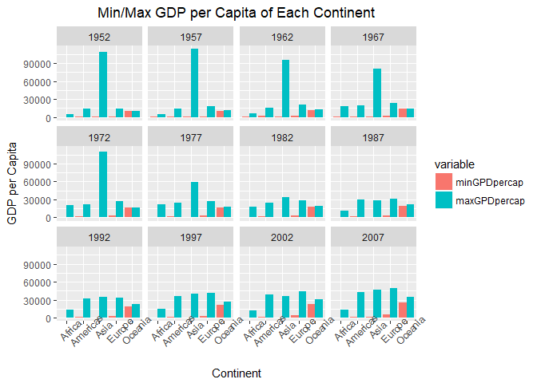<!-- -->
</div>
<div class="clearer"></div>

## Question 2
Look at the spread of GDP per capita within the continents.

Answer:

The figure below shows the spread of GDP per capita within each continent. We can see how it changes over time. Generally speaking, the GDP per capita increases over time for all continents except Africa. Oceania data is not representative and the difference between each country is not obvious since there are only a few countries.

<div class="twoC">


     Continent            Year            Min GDP/cap            Max GDP/cap            Mean GDP/cap            Median GDP/cap     
-------------------  --------------  ---------------------  ---------------------  ----------------------  ------------------------
      Africa              1952              298.85                 4725.30                1252.57                   987.03         
      Africa              1957              336.00                 5487.10                1385.24                  1024.02         
      Africa              1962              355.20                 6757.03                1598.08                  1133.78         
      Africa              1967              412.98                18772.75                2050.36                  1210.38         
      Africa              1972              464.10                21011.50                2339.62                  1443.37         
      Africa              1977              502.32                21951.21                2585.94                  1399.64         
      Africa              1982              462.21                17364.28                2481.59                  1323.73         
      Africa              1987              389.88                11864.41                2282.67                  1219.59         
      Africa              1992              410.90                13522.16                2281.81                  1161.63         
      Africa              1997              312.19                14722.84                2378.76                  1179.88         
      Africa              2002              241.17                12521.71                2599.39                  1215.68         
      Africa              2007              277.55                13206.48                3089.03                  1452.27         
     Americas             1952              1397.72               13990.48                4079.06                  3048.30         
     Americas             1957              1544.40               14847.13                4616.04                  3780.55         
     Americas             1962              1662.14               16173.15                4901.54                  4086.11         
     Americas             1967              1452.06               19530.37                5668.25                  4643.39         
     Americas             1972              1654.46               21806.04                6491.33                  5305.45         
     Americas             1977              1874.30               24072.63                7352.01                  6281.29         
     Americas             1982              2011.16               25009.56                7506.74                  6434.50         
     Americas             1987              1823.02               29884.35                7793.40                  6360.94         
     Americas             1992              1456.31               32003.93                8044.93                  6618.74         
     Americas             1997              1341.73               35767.43                8889.30                  7113.69         
     Americas             2002              1270.36               39097.10                9287.68                  6994.77         
     Americas             2007              1201.64               42951.65                11003.03                 8948.10         
       Asia               1952              331.00                108382.35               5195.48                  1206.95         
       Asia               1957              350.00                113523.13               5787.73                  1547.94         
       Asia               1962              388.00                95458.11                5729.37                  1649.55         
       Asia               1967              349.00                80894.88                5971.17                  2029.23         
       Asia               1972              357.00                109347.87               8187.47                  2571.42         
       Asia               1977              371.00                59265.48                7791.31                  3195.48         
       Asia               1982              424.00                33693.18                7434.14                  4106.53         
       Asia               1987              385.00                28118.43                7608.23                  4106.49         
       Asia               1992              347.00                34932.92                8639.69                  3726.06         
       Asia               1997              415.00                40300.62                9834.09                  3645.38         
       Asia               2002              611.00                36023.11                10174.09                 4090.93         
       Asia               2007              944.00                47306.99                12473.03                 4471.06         
      Europe              1952              973.53                14734.23                5661.06                  5142.47         
      Europe              1957              1353.99               17909.49                6963.01                  6066.72         
      Europe              1962              1709.68               20431.09                8365.49                  7515.73         
      Europe              1967              2172.35               22966.14                10143.82                 9366.07         
      Europe              1972              2860.17               27195.11                12479.58                 12326.38        
      Europe              1977              3528.48               26982.29                14283.98                 14225.75        
      Europe              1982              3630.88               28397.72                15617.90                 15322.82        
      Europe              1987              3738.93               31540.97                17214.31                 16215.49        
      Europe              1992              2497.44               33965.66                17061.57                 17550.16        
      Europe              1997              3193.05               41283.16                19076.78                 19596.50        
      Europe              2002              4604.21               44683.98                21711.73                 23674.86        
      Europe              2007              5937.03               49357.19                25054.48                 28054.07        
      Oceania             1952             10039.60               10556.58                10298.09                 10298.09        
      Oceania             1957             10949.65               12247.40                11598.52                 11598.52        
      Oceania             1962             12217.23               13175.68                12696.45                 12696.45        
      Oceania             1967             14463.92               14526.12                14495.02                 14495.02        
      Oceania             1972             16046.04               16788.63                16417.33                 16417.33        
      Oceania             1977             16233.72               18334.20                17283.96                 17283.96        
      Oceania             1982             17632.41               19477.01                18554.71                 18554.71        
      Oceania             1987             19007.19               21888.89                20448.04                 20448.04        
      Oceania             1992             18363.32               23424.77                20894.05                 20894.05        
      Oceania             1997             21050.41               26997.94                24024.18                 24024.18        
      Oceania             2002             23189.80               30687.75                26938.78                 26938.78        
      Oceania             2007             25185.01               34435.37                29810.19                 29810.19        

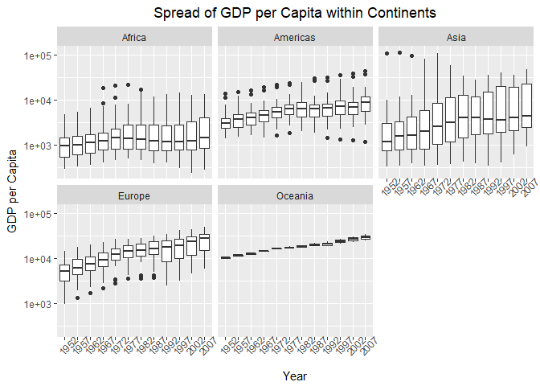<!-- -->
</div>
<div class="clearer"></div>

## Question 3
Compute a trimmed mean of life expectancy for different years. Or a weighted mean, weighting by population. Just try something other than the plain vanilla mean.

Answer:

First, I used the trimmed mean of all countries through each year. The trimmed mean here removed the first and last 20% of data.

To make it easier, I start from the trimmed mean of all countries of each year. From the figure below, we can see that the life expectancy increasing sharply with year, from ~ 40 in the past to ~ 70 in 2007.

<div class="twoC">


     Year            Trimmed Mean     
--------------  ----------------------
     1952               47.75         
     1957               50.64         
     1962               53.13         
     1967               55.64         
     1972               58.12         
     1977               60.39         
     1982               62.47         
     1987               64.48         
     1992               65.89         
     1997               66.84         
     2002               67.77         
     2007               69.17         

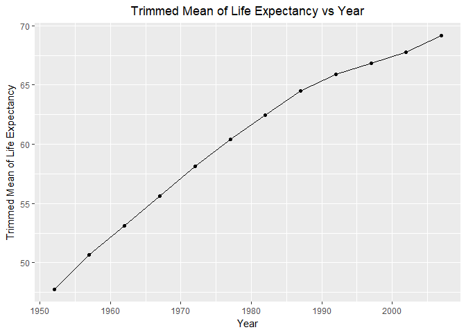<!-- -->
</div>
<div class="clearer"></div>

The figure above only reflects the overall trend of the whole world. What is the trend for each country? I can get trimmed mean of life expectancy of each continent of different years. By comparing the figure for each continent, it is obvious that (1) Africa has the shortest life expectancy, (2) the mean life expectancy increases fastest in Asia, and (3) Oceania has the highest life expectancy.

<div class="twoC">


---------------------------------
 Continent   Year   Trimmed Mean 
----------- ------ --------------
  Africa     1952      39.05     

  Africa     1957      41.05     

  Africa     1962      43.06     

  Africa     1967      45.07     

  Africa     1972      47.19     

  Africa     1977      49.28     

  Africa     1982      51.17     

  Africa     1987      52.77     

  Africa     1992       53.6     

  Africa     1997      52.78     

  Africa     2002      51.73     

  Africa     2007      53.47     

 Americas    1952      53.17     

 Americas    1957      56.18     

 Americas    1962      58.96     

 Americas    1967      61.06     

 Americas    1972      63.08     

 Americas    1977      65.02     

 Americas    1982        67      

 Americas    1987      68.67     

 Americas    1992      70.02     

 Americas    1997      71.54     

 Americas    2002      72.74     

 Americas    2007       73.9     

   Asia      1952      45.42     

   Asia      1957      48.62     

   Asia      1962      50.91     

   Asia      1967      54.49     

   Asia      1972      57.77     

   Asia      1977      60.67     

   Asia      1982      63.26     

   Asia      1987      65.58     

   Asia      1992      67.26     

   Asia      1997      68.72     

   Asia      2002      70.06     

   Asia      2007      71.42     

  Europe     1952      65.18     

  Europe     1957      67.55     

  Europe     1962      69.29     

  Europe     1967      70.27     

  Europe     1972      71.08     

  Europe     1977       72.1     

  Europe     1982      73.06     

  Europe     1987      73.98     

  Europe     1992      74.86     

  Europe     1997      75.91     

  Europe     2002      77.02     

  Europe     2007      77.99     

  Oceania    1952      69.25     

  Oceania    1957       70.3     

  Oceania    1962      71.09     

  Oceania    1967      71.31     

  Oceania    1972      71.91     

  Oceania    1977      72.85     

  Oceania    1982      74.29     

  Oceania    1987      75.32     

  Oceania    1992      76.94     

  Oceania    1997      78.19     

  Oceania    2002      79.74     

  Oceania    2007      80.72     
---------------------------------

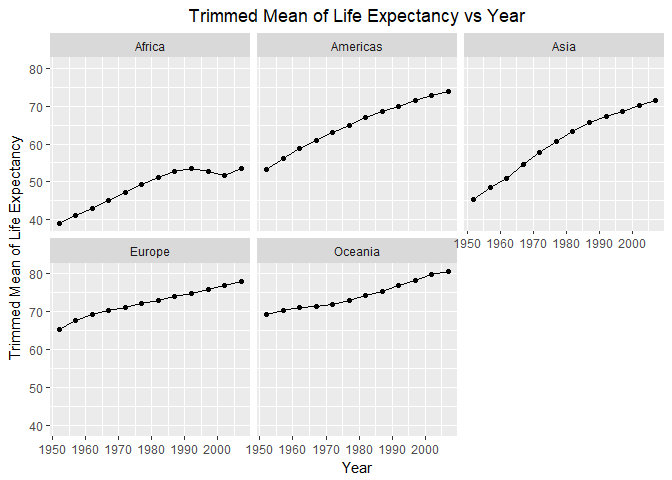<!-- -->
</div>
<div class="clearer"></div>

Third, let me try the weighted mean. To make it easier, just get the weighted mean of all countries for each year. From the figure below, we can see the trend of the life expectancy is silimar to that of the trimmed mean. However, the trend of the first 4 data points are different. This is resulted from the difference in methods used in calculating the mean value.

<div class="twoC">


----------------------
 Year   Weighted Mean 
------ ---------------
 1952       48.94     

 1957       52.12     

 1962       52.32     

 1967       56.98     

 1972       59.51     

 1977       61.24     

 1982       62.88     

 1987       64.42     

 1992       65.65     

 1997       66.85     

 2002       67.84     

 2007       68.92     
----------------------

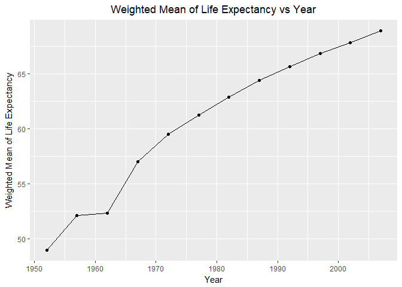<!-- -->
</div>
<div class="clearer"></div>

Now, I am making seperate figures for each continent to see how the weighted mean life expectancy change over time. The result is almost the same as that of trimmed mean. So I will not repeat the short analysis here.

<div class="twoC">


----------------------------------
 Year   Continent   Weighted Mean 
------ ----------- ---------------
 1952    Africa         38.8      

 1952   Americas        60.24     

 1952     Asia          42.94     

 1952    Europe         64.91     

 1952    Oceania        69.17     

 1957    Africa         40.94     

 1957   Americas        62.02     

 1957     Asia          47.29     

 1957    Europe         66.89     

 1957    Oceania        70.32     

 1962    Africa         43.1      

 1962   Americas        63.44     

 1962     Asia          46.57     

 1962    Europe         68.46     

 1962    Oceania        70.99     

 1967    Africa         45.18     

 1967   Americas        64.51     

 1967     Asia          53.88     

 1967    Europe         69.55     

 1967    Oceania        71.18     

 1972    Africa         47.21     

 1972   Americas        65.7      

 1972     Asia          57.52     

 1972    Europe         70.47     

 1972    Oceania        71.92     

 1977    Africa         49.21     

 1977   Americas        67.61     

 1977     Asia          59.56     

 1977    Europe         71.54     

 1977    Oceania        73.26     

 1982    Africa         51.02     

 1982   Americas        69.19     

 1982     Asia          61.57     

 1982    Europe         72.56     

 1982    Oceania        74.58     

 1987    Africa         52.82     

 1987   Americas        70.36     

 1987     Asia          63.54     

 1987    Europe         73.45     

 1987    Oceania        75.98     

 1992    Africa         53.37     

 1992   Americas        71.72     

 1992     Asia          65.15     

 1992    Europe         74.44     

 1992    Oceania        77.36     

 1997    Africa         53.28     

 1997   Americas        73.19     

 1997     Asia          66.77     

 1997    Europe         75.71     

 1997    Oceania        78.62     

 2002    Africa         53.3      

 2002   Americas        74.25     

 2002     Asia          68.14     

 2002    Europe         77.02     

 2002    Oceania        80.16     

 2007    Africa         54.56     

 2007   Americas        75.36     

 2007     Asia          69.44     

 2007    Europe         77.89     

 2007    Oceania        81.06     
----------------------------------

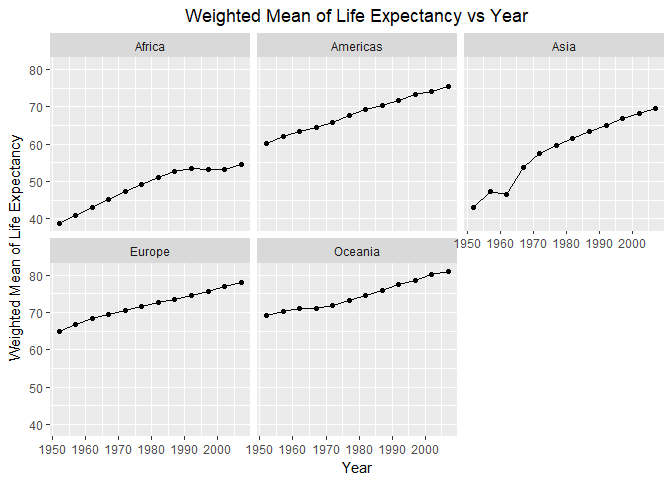<!-- -->
</div>
<div class="clearer"></div>

## Question 4
How is life expectancy changing over time on different continents?

Answer:

Actually, this question is answered in Question 3. However, I would like to use another figure type to answer this question.

The figure below shows how life expectancy is changing over time on different continents. Generally speaking, the overall life expectancy is increasing over year, especially Asia. However, the life expectancy in Africa is still quite low.

<div class="twoC">


     Continent            Year            Min lifeExp            Max lifeExp            Mean lifeExp            Median lifeExp     
-------------------  --------------  ---------------------  ---------------------  ----------------------  ------------------------
      Africa              1952               30.00                  52.72                  39.14                    38.83          
      Africa              1957               31.57                  58.09                  41.27                    40.59          
      Africa              1962               32.77                  60.25                  43.32                    42.63          
      Africa              1967               34.11                  61.56                  45.33                    44.70          
      Africa              1972               35.40                  64.27                  47.45                    47.03          
      Africa              1977               36.79                  67.06                  49.58                    49.27          
      Africa              1982               38.45                  69.89                  51.59                    50.76          
      Africa              1987               39.91                  71.91                  53.34                    51.64          
      Africa              1992               23.60                  73.61                  53.63                    52.43          
      Africa              1997               36.09                  74.77                  53.60                    52.76          
      Africa              2002               39.19                  75.74                  53.33                    51.24          
      Africa              2007               39.61                  76.44                  54.81                    52.93          
     Americas             1952               37.58                  68.75                  53.28                    54.74          
     Americas             1957               40.70                  69.96                  55.96                    56.07          
     Americas             1962               43.43                  71.30                  58.40                    58.30          
     Americas             1967               45.03                  72.13                  60.41                    60.52          
     Americas             1972               46.71                  72.88                  62.39                    63.44          
     Americas             1977               49.92                  74.21                  64.39                    66.35          
     Americas             1982               51.46                  75.76                  66.23                    67.41          
     Americas             1987               53.64                  76.86                  68.09                    69.50          
     Americas             1992               55.09                  77.95                  69.57                    69.86          
     Americas             1997               56.67                  78.61                  71.15                    72.15          
     Americas             2002               58.14                  79.77                  72.42                    72.05          
     Americas             2007               60.92                  80.65                  73.61                    72.90          
       Asia               1952               28.80                  65.39                  46.31                    44.87          
       Asia               1957               30.33                  67.84                  49.32                    48.28          
       Asia               1962               32.00                  69.39                  51.56                    49.33          
       Asia               1967               34.02                  71.43                  54.66                    53.66          
       Asia               1972               36.09                  73.42                  57.32                    56.95          
       Asia               1977               31.22                  75.38                  59.61                    60.77          
       Asia               1982               39.85                  77.11                  62.62                    63.74          
       Asia               1987               40.82                  78.67                  64.85                    66.30          
       Asia               1992               41.67                  79.36                  66.54                    68.69          
       Asia               1997               41.76                  80.69                  68.02                    70.27          
       Asia               2002               42.13                  82.00                  69.23                    71.03          
       Asia               2007               43.83                  82.60                  70.73                    72.40          
      Europe              1952               43.59                  72.67                  64.41                    65.90          
      Europe              1957               48.08                  73.47                  66.70                    67.65          
      Europe              1962               52.10                  73.68                  68.54                    69.53          
      Europe              1967               54.34                  74.16                  69.74                    70.61          
      Europe              1972               57.01                  74.72                  70.78                    70.89          
      Europe              1977               59.51                  76.11                  71.94                    72.34          
      Europe              1982               61.04                  76.99                  72.81                    73.49          
      Europe              1987               63.11                  77.41                  73.64                    74.81          
      Europe              1992               66.15                  78.77                  74.44                    75.45          
      Europe              1997               68.83                  79.39                  75.51                    76.12          
      Europe              2002               70.84                  80.62                  76.70                    77.54          
      Europe              2007               71.78                  81.76                  77.65                    78.61          
      Oceania             1952               69.12                  69.39                  69.25                    69.25          
      Oceania             1957               70.26                  70.33                  70.30                    70.30          
      Oceania             1962               70.93                  71.24                  71.09                    71.09          
      Oceania             1967               71.10                  71.52                  71.31                    71.31          
      Oceania             1972               71.89                  71.93                  71.91                    71.91          
      Oceania             1977               72.22                  73.49                  72.85                    72.85          
      Oceania             1982               73.84                  74.74                  74.29                    74.29          
      Oceania             1987               74.32                  76.32                  75.32                    75.32          
      Oceania             1992               76.33                  77.56                  76.94                    76.94          
      Oceania             1997               77.55                  78.83                  78.19                    78.19          
      Oceania             2002               79.11                  80.37                  79.74                    79.74          
      Oceania             2007               80.20                  81.23                  80.72                    80.72          

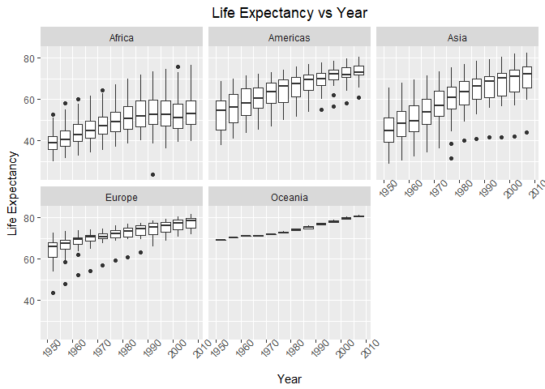<!-- -->
</div>
<div class="clearer"></div>

## Question 5
Report the absolute and/or relative abundance of countries with low life expectancy over time by continent: Compute some measure of worldwide life expectancy – you decide – a mean or median or some other quantile or perhaps your current age. Then determine how many countries on each continent have a life expectancy less than this benchmark, for each year.

Answer:

The threshold (average life expenctancy of each year) used in this exercise is the average life expectation of all countries in each year. The absolute number of countries whose life expectancy is less than the threshold is reported.

From the figure, we can get the conclusion that people in Africa has shorter life expectancy than other continents. This can also be verified from the figure in the previous question. The life expectancy in Asia is increasing fastly since the number of country below average is getting fewer.

<div class="twoC">


     Year            Continent            Counts     
--------------  -------------------  ----------------
     1952             Africa                27       
     1952            Americas               12       
     1952              Asia                 19       
     1952             Europe                12       
     1952             Oceania               1        
     1957             Africa                28       
     1957            Americas               12       
     1957              Asia                 18       
     1957             Europe                12       
     1957             Oceania               1        
     1962             Africa                28       
     1962            Americas               13       
     1962              Asia                 19       
     1962             Europe                10       
     1962             Oceania               1        
     1967             Africa                28       
     1967            Americas               12       
     1967              Asia                 18       
     1967             Europe                11       
     1967             Oceania               1        
     1972             Africa                27       
     1972            Americas               12       
     1972              Asia                 18       
     1972             Europe                13       
     1972             Oceania               1        
     1977             Africa                27       
     1977            Americas               11       
     1977              Asia                 14       
     1977             Europe                13       
     1977             Oceania               1        
     1982             Africa                27       
     1982            Americas               10       
     1982              Asia                 14       
     1982             Europe                13       
     1982             Oceania               1        
     1987             Africa                28       
     1987            Americas               12       
     1987              Asia                 13       
     1987             Europe                12       
     1987             Oceania               1        
     1992             Africa                28       
     1992            Americas               11       
     1992              Asia                 13       
     1992             Europe                12       
     1992             Oceania               1        
     1997             Africa                29       
     1997            Americas               12       
     1997              Asia                 13       
     1997             Europe                13       
     1997             Oceania               1        
     2002             Africa                29       
     2002            Americas               13       
     2002              Asia                 13       
     2002             Europe                13       
     2002             Oceania               1        
     2007             Africa                30       
     2007            Americas               13       
     2007              Asia                 13       
     2007             Europe                12       
     2007             Oceania               1        

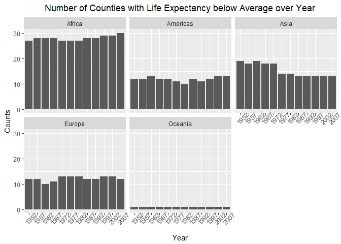<!-- -->
</div>
<div class="clearer"></div>

Here I print the threshold used in the calculation above, which is the average life expectancy of the world of each year.

```r
# Print the threshold
gapminder %>%
        group_by(year) %>%
        summarize(mean_life_exp=mean(lifeExp))
```

```
## # A tibble: 12 x 2
##     year mean_life_exp
##    <int>         <dbl>
##  1  1952      49.05762
##  2  1957      51.50740
##  3  1962      53.60925
##  4  1967      55.67829
##  5  1972      57.64739
##  6  1977      59.57016
##  7  1982      61.53320
##  8  1987      63.21261
##  9  1992      64.16034
## 10  1997      65.01468
## 11  2002      65.69492
## 12  2007      67.00742
```

## Question 6
Find countries with interesting stories. Open-ended and, therefore, hard. Promising but unsuccessful attempts are encouraged. This will generate interesting questions to follow up on in class.

Answer:

I want to explore how GDP of China and US changes over time (both GDP and the GDP ratio). The figure below indicates that (1) GDP of both countries is increasing, and (2) althogh GDP of China is still less than US, but the difference between these two countries is getting smaller and smaller.

This work will lay the foundation for the linear regression model in Question 7.

<div class="twoC">


     Year               Country                   GDP          
--------------  -----------------------  ----------------------
     1952                China                2.227550e+11     
     1952            United States            2.204242e+12     
     1957                China                3.671387e+11     
     1957            United States            2.553468e+12     
     1962                China                3.246787e+11     
     1962            United States            3.016906e+12     
     1967                China                4.623171e+11     
     1967            United States            3.880918e+12     
     1972                China                5.835082e+11     
     1972            United States            4.577000e+12     
     1977                China                6.993242e+11     
     1977            United States            5.301732e+12     
     1982                China                9.626918e+11     
     1982            United States            5.806915e+12     
     1987                China                1.494780e+12     
     1987            United States            7.256026e+12     
     1992                China                1.928939e+12     
     1992            United States            8.221624e+12     
     1997                China                2.815930e+12     
     1997            United States            9.761353e+12     
     2002                China                3.993927e+12     
     2002            United States            1.124728e+13     
     2007                China                6.539501e+12     
     2007            United States            1.293446e+13     

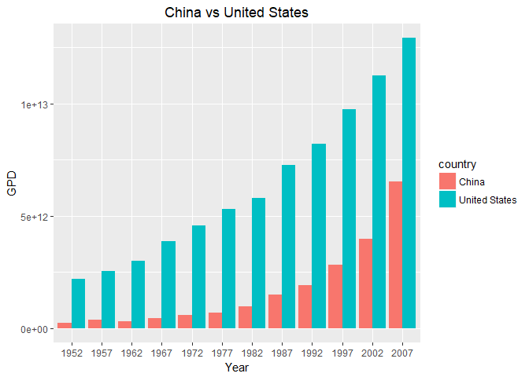<!-- -->
</div>
<div class="clearer"></div>

<div class="twoC">


---------------------
 Year   GDP China/US 
------ --------------
 1952      0.1011    

 1957      0.1438    

 1962      0.1076    

 1967      0.1191    

 1972      0.1275    

 1977      0.1319    

 1982      0.1658    

 1987      0.206     

 1992      0.2346    

 1997      0.2885    

 2002      0.3551    

 2007      0.5056    
---------------------

<!-- -->
</div>
<div class="clearer"></div>

## Question 7
Make up your own! Between the dplyr coverage in class and the list above, I think you get the idea.

Answer:

Based on the result in Question 6 and assume the trend of GDP keeps the same, when will China and US have the same GDP (or when will GDP of China exceeds which of US)?

First, let's see the log scaled GDP ratio of China to US.

```r
n1 %>%
        ggplot(aes(x=factor(year),y=log10(China2US))) +
        geom_point() +
        geom_line() +
        labs(x="Year", y="GPD: China/US", title="GDP Ratio between China and US") +
        theme(plot.title = element_text(hjust=0.5))
```

```
## geom_path: Each group consists of only one observation. Do you need to
## adjust the group aesthetic?
```

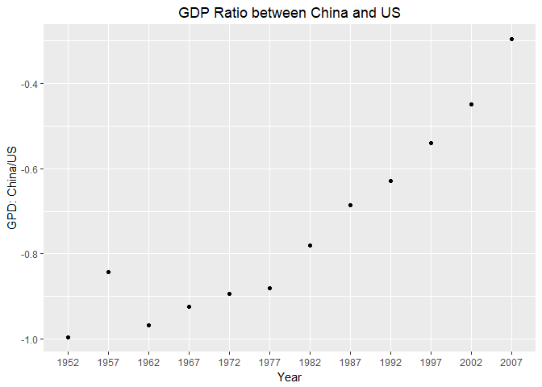<!-- -->

We can see that from 1977 till now, the log scaled ratio is linear. Thus, I would like to select the data since 1977 and make linear regression here based on the results obtained from the previous question.

Actually, removing data before 1977 is reasonable. The "Reform and Opening-up Policy" was launched in China since 1978. Thus, the ratio keeps increase since ~1977.


```r
# Select all data after 1977 for linear regression model
c1 <- gapminder %>%
        filter(country %in% c("China","United States"), year >=1977) %>%
        mutate(GDP=gdpPercap*pop) %>%
        group_by(year) %>%
        arrange(country) %>%
        summarize(log_China2US=log10(GDP[1]/GDP[2]))
# Change the outpur format of the table
kable(c1, digits=3, align="c", col.names=c("Year","GDP China/US (log)"))
```


 Year    GDP China/US (log) 
------  --------------------
 1977          -0.880       
 1982          -0.780       
 1987          -0.686       
 1992          -0.630       
 1997          -0.540       
 2002          -0.450       
 2007          -0.296       

```r
# Set up the model
fit1 <- lm(log_China2US ~ year, data=c1)
# Print the model results
(sum_fit1 <- summary(fit1))
```

```
## 
## Call:
## lm(formula = log_China2US ~ year, data = c1)
## 
## Residuals:
##         1         2         3         4         5         6         7 
##  0.003196  0.011103  0.014066 -0.020825 -0.022448 -0.023581  0.038489 
## 
## Coefficients:
##               Estimate Std. Error t value Pr(>|t|)    
## (Intercept) -37.012072   1.936154  -19.12 7.22e-06 ***
## year          0.018275   0.000972   18.80 7.84e-06 ***
## ---
## Signif. codes:  0 '***' 0.001 '**' 0.01 '*' 0.05 '.' 0.1 ' ' 1
## 
## Residual standard error: 0.02572 on 5 degrees of freedom
## Multiple R-squared:  0.9861,	Adjusted R-squared:  0.9833 
## F-statistic: 353.5 on 1 and 5 DF,  p-value: 7.838e-06
```

```r
# Create a new input for prediction
new_year <- data.frame(year=c(2008:2030))
# Make a prediction
predict(fit1, new_year)
```

```
##            1            2            3            4            5 
## -0.316418251 -0.298143523 -0.279868796 -0.261594068 -0.243319340 
##            6            7            8            9           10 
## -0.225044612 -0.206769884 -0.188495157 -0.170220429 -0.151945701 
##           11           12           13           14           15 
## -0.133670973 -0.115396245 -0.097121517 -0.078846790 -0.060572062 
##           16           17           18           19           20 
## -0.042297334 -0.024022606 -0.005747878  0.012526849  0.030801577 
##           21           22           23 
##  0.049076305  0.067351033  0.085625761
```

```r
# Plot and select the key year point
qplot(new_year$year,predict(fit1, new_year)) + 
        geom_hline(yintercept=0, linetype="dashed") +
        geom_vline(xintercept=2025, linetype="dashed")
```

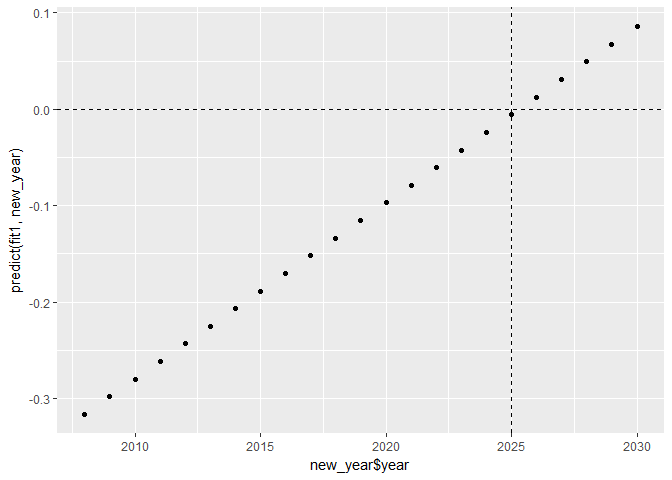<!-- -->

When the GDP of China equals to that of US, the ratio will be 1 and the log scaled ratio will be 0. From the results above, it is clear that between the year 2025 (#18) and the year 2026 (#19), the ratio is 0. From the figure above, we can clearly see that the year 2025 is the key year, in which the GDP of China will be higher than US.

## But I want to do more!

Layout stretch goal: get table and figure side-by-side.

Table stretch goal: there are some really nice fancy table helper packages.

Answer:

1. Layout stretch goal is realized above, which is applied to Questions 1~6. In order to realize the goal, the output format has been changed to HTML.

2. Table stretch goal is also realized using `kable()` and `pandoc()`.

[This is the end of Homework 03.]


