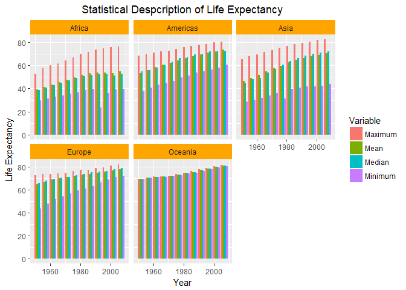

Homework 4
================
Yuanji Sun
October 4, 2017

Report porcess
==============

I chose three questions in the reshaping part and two questinos in the join dataframe part.

1.  Problems I ran into

    -   The order of `x` and `y` in the `XXX_join`. This problem was solved by reading online documents, which are provided below. Although I understand it in class, I was still confuzed a bit when doing this homework.
    -   Difference between `gather()`, `spread()`, `union()`. I tried to read the build-in documentation in RStudio but it was difficult to understand. The websites below helped me a lot. The most important part for me is the `key` and `value` in the function and how they work.

2.  Useful resources

    -   <https://www.rdocumentation.org/>
    -   Lecture notes
    -   <https://rpubs.com/bradleyboehmke/data_wrangling> This website provides very good summary and compares several functions with good examples.

3.  Conclusion

This homework went on smoothly with only a few questions. I checked online resources and fixed them. I am now clear with different types of join and reshape the table.

Preparation: load libraries
===========================

``` r
library(gapminder)
library(tidyverse)
```

    ## Loading tidyverse: ggplot2
    ## Loading tidyverse: tibble
    ## Loading tidyverse: tidyr
    ## Loading tidyverse: readr
    ## Loading tidyverse: purrr
    ## Loading tidyverse: dplyr

    ## Warning: package 'dplyr' was built under R version 3.4.2

    ## Conflicts with tidy packages ----------------------------------------------

    ## filter(): dplyr, stats
    ## lag():    dplyr, stats

``` r
library(knitr)
```

Choose your own adventure
=========================

1.  Pick one of the data reshaping prompts and do it.
2.  Pick a join prompt and do it.
3.  It is fine to work with a new dataset and/or create variations on these problem themes.

General data reshaping and relationship to aggregation
======================================================

**Problem**: You have data in one “shape” but you wish it were in another. Usually this is because the alternative shape is superior for presenting a table, making a figure, or doing aggregation and statistical analysis.

**Solution**: Reshape your data. For simple reshaping, gather() and spread() from tidyr will suffice. Do the thing that it possible / easier now that your data has a new shape.

Activity \#1
------------

Make a tibble with one row per year and columns for life expectancy for two or more countries.

-   Use `knitr::kable()` to make this table look pretty in your rendered homework.
-   Take advantage of this new data shape to scatterplot life expectancy for one country against that of another.

Answer:

Here I would like to select the following three countries: Canada, USA and Mexico, and reshape the table.

``` r
# Select data and reshape the table
a2 <- gapminder %>%
        filter(country %in% c("Canada", "United States", "Mexico")) %>%
        select(country, year, lifeExp) %>%
        gather(Variable, Value, lifeExp)
# Format the output
kable(a2, format = "pandoc",digits = 2, align="c", padding = 5,
      col.names=c("Country","Year","Variable", "Value"))
```

|    Country    | Year | Variable | Value |
|:-------------:|:----:|:--------:|:-----:|
|     Canada    | 1952 |  lifeExp | 68.75 |
|     Canada    | 1957 |  lifeExp | 69.96 |
|     Canada    | 1962 |  lifeExp | 71.30 |
|     Canada    | 1967 |  lifeExp | 72.13 |
|     Canada    | 1972 |  lifeExp | 72.88 |
|     Canada    | 1977 |  lifeExp | 74.21 |
|     Canada    | 1982 |  lifeExp | 75.76 |
|     Canada    | 1987 |  lifeExp | 76.86 |
|     Canada    | 1992 |  lifeExp | 77.95 |
|     Canada    | 1997 |  lifeExp | 78.61 |
|     Canada    | 2002 |  lifeExp | 79.77 |
|     Canada    | 2007 |  lifeExp | 80.65 |
|     Mexico    | 1952 |  lifeExp | 50.79 |
|     Mexico    | 1957 |  lifeExp | 55.19 |
|     Mexico    | 1962 |  lifeExp | 58.30 |
|     Mexico    | 1967 |  lifeExp | 60.11 |
|     Mexico    | 1972 |  lifeExp | 62.36 |
|     Mexico    | 1977 |  lifeExp | 65.03 |
|     Mexico    | 1982 |  lifeExp | 67.41 |
|     Mexico    | 1987 |  lifeExp | 69.50 |
|     Mexico    | 1992 |  lifeExp | 71.45 |
|     Mexico    | 1997 |  lifeExp | 73.67 |
|     Mexico    | 2002 |  lifeExp | 74.90 |
|     Mexico    | 2007 |  lifeExp | 76.19 |
| United States | 1952 |  lifeExp | 68.44 |
| United States | 1957 |  lifeExp | 69.49 |
| United States | 1962 |  lifeExp | 70.21 |
| United States | 1967 |  lifeExp | 70.76 |
| United States | 1972 |  lifeExp | 71.34 |
| United States | 1977 |  lifeExp | 73.38 |
| United States | 1982 |  lifeExp | 74.65 |
| United States | 1987 |  lifeExp | 75.02 |
| United States | 1992 |  lifeExp | 76.09 |
| United States | 1997 |  lifeExp | 76.81 |
| United States | 2002 |  lifeExp | 77.31 |
| United States | 2007 |  lifeExp | 78.24 |

Activity \#2
------------

Compute some measure of life expectancy (mean? median? min? max?) for all possible combinations of continent and year. Reshape that to have one row per year and one variable for each continent. Or the other way around: one row per continent and one variable per year.

-   Use `knitr::kable()` to make these tables look pretty in your rendered homework.
-   Is there a plot that is easier to make with the data in this shape versis the usual form? If so (or you think so), try it! Reflect.

Answer:

1.  The min, max, median and mean life expectancy are calculated below. The table has been reshaped into one continent per row with one variable per year. `kable()` is used to change the format of the table.

2.  See the figure below for a plot that is easier to make with the data in this shape.

``` r
# Reshape the table and calculate all values
a3 <- gapminder %>%
        group_by(continent, year) %>%
        summarize(Mean=mean(lifeExp), Median=median(lifeExp), Minimum=min(lifeExp),
                  Maximum=max(lifeExp)) %>%
        gather(Variable, Value, -continent, -year)
# Format the output
kable(a3, format = "pandoc",digits = 3, align="c", padding = 5,
      col.names=c("Continent","Year","Variable", "Value"))
```

| Continent | Year | Variable |  Value |
|:---------:|:----:|:--------:|:------:|
|   Africa  | 1952 |   Mean   | 39.136 |
|   Africa  | 1957 |   Mean   | 41.266 |
|   Africa  | 1962 |   Mean   | 43.319 |
|   Africa  | 1967 |   Mean   | 45.335 |
|   Africa  | 1972 |   Mean   | 47.451 |
|   Africa  | 1977 |   Mean   | 49.580 |
|   Africa  | 1982 |   Mean   | 51.593 |
|   Africa  | 1987 |   Mean   | 53.345 |
|   Africa  | 1992 |   Mean   | 53.630 |
|   Africa  | 1997 |   Mean   | 53.598 |
|   Africa  | 2002 |   Mean   | 53.325 |
|   Africa  | 2007 |   Mean   | 54.806 |
|  Americas | 1952 |   Mean   | 53.280 |
|  Americas | 1957 |   Mean   | 55.960 |
|  Americas | 1962 |   Mean   | 58.399 |
|  Americas | 1967 |   Mean   | 60.411 |
|  Americas | 1972 |   Mean   | 62.395 |
|  Americas | 1977 |   Mean   | 64.392 |
|  Americas | 1982 |   Mean   | 66.229 |
|  Americas | 1987 |   Mean   | 68.091 |
|  Americas | 1992 |   Mean   | 69.568 |
|  Americas | 1997 |   Mean   | 71.150 |
|  Americas | 2002 |   Mean   | 72.422 |
|  Americas | 2007 |   Mean   | 73.608 |
|    Asia   | 1952 |   Mean   | 46.314 |
|    Asia   | 1957 |   Mean   | 49.319 |
|    Asia   | 1962 |   Mean   | 51.563 |
|    Asia   | 1967 |   Mean   | 54.664 |
|    Asia   | 1972 |   Mean   | 57.319 |
|    Asia   | 1977 |   Mean   | 59.611 |
|    Asia   | 1982 |   Mean   | 62.618 |
|    Asia   | 1987 |   Mean   | 64.851 |
|    Asia   | 1992 |   Mean   | 66.537 |
|    Asia   | 1997 |   Mean   | 68.021 |
|    Asia   | 2002 |   Mean   | 69.234 |
|    Asia   | 2007 |   Mean   | 70.728 |
|   Europe  | 1952 |   Mean   | 64.409 |
|   Europe  | 1957 |   Mean   | 66.703 |
|   Europe  | 1962 |   Mean   | 68.539 |
|   Europe  | 1967 |   Mean   | 69.738 |
|   Europe  | 1972 |   Mean   | 70.775 |
|   Europe  | 1977 |   Mean   | 71.938 |
|   Europe  | 1982 |   Mean   | 72.806 |
|   Europe  | 1987 |   Mean   | 73.642 |
|   Europe  | 1992 |   Mean   | 74.440 |
|   Europe  | 1997 |   Mean   | 75.505 |
|   Europe  | 2002 |   Mean   | 76.701 |
|   Europe  | 2007 |   Mean   | 77.649 |
|  Oceania  | 1952 |   Mean   | 69.255 |
|  Oceania  | 1957 |   Mean   | 70.295 |
|  Oceania  | 1962 |   Mean   | 71.085 |
|  Oceania  | 1967 |   Mean   | 71.310 |
|  Oceania  | 1972 |   Mean   | 71.910 |
|  Oceania  | 1977 |   Mean   | 72.855 |
|  Oceania  | 1982 |   Mean   | 74.290 |
|  Oceania  | 1987 |   Mean   | 75.320 |
|  Oceania  | 1992 |   Mean   | 76.945 |
|  Oceania  | 1997 |   Mean   | 78.190 |
|  Oceania  | 2002 |   Mean   | 79.740 |
|  Oceania  | 2007 |   Mean   | 80.719 |
|   Africa  | 1952 |  Median  | 38.833 |
|   Africa  | 1957 |  Median  | 40.593 |
|   Africa  | 1962 |  Median  | 42.630 |
|   Africa  | 1967 |  Median  | 44.698 |
|   Africa  | 1972 |  Median  | 47.032 |
|   Africa  | 1977 |  Median  | 49.272 |
|   Africa  | 1982 |  Median  | 50.756 |
|   Africa  | 1987 |  Median  | 51.639 |
|   Africa  | 1992 |  Median  | 52.429 |
|   Africa  | 1997 |  Median  | 52.759 |
|   Africa  | 2002 |  Median  | 51.236 |
|   Africa  | 2007 |  Median  | 52.927 |
|  Americas | 1952 |  Median  | 54.745 |
|  Americas | 1957 |  Median  | 56.074 |
|  Americas | 1962 |  Median  | 58.299 |
|  Americas | 1967 |  Median  | 60.523 |
|  Americas | 1972 |  Median  | 63.441 |
|  Americas | 1977 |  Median  | 66.353 |
|  Americas | 1982 |  Median  | 67.405 |
|  Americas | 1987 |  Median  | 69.498 |
|  Americas | 1992 |  Median  | 69.862 |
|  Americas | 1997 |  Median  | 72.146 |
|  Americas | 2002 |  Median  | 72.047 |
|  Americas | 2007 |  Median  | 72.899 |
|    Asia   | 1952 |  Median  | 44.869 |
|    Asia   | 1957 |  Median  | 48.284 |
|    Asia   | 1962 |  Median  | 49.325 |
|    Asia   | 1967 |  Median  | 53.655 |
|    Asia   | 1972 |  Median  | 56.950 |
|    Asia   | 1977 |  Median  | 60.765 |
|    Asia   | 1982 |  Median  | 63.739 |
|    Asia   | 1987 |  Median  | 66.295 |
|    Asia   | 1992 |  Median  | 68.690 |
|    Asia   | 1997 |  Median  | 70.265 |
|    Asia   | 2002 |  Median  | 71.028 |
|    Asia   | 2007 |  Median  | 72.396 |
|   Europe  | 1952 |  Median  | 65.900 |
|   Europe  | 1957 |  Median  | 67.650 |
|   Europe  | 1962 |  Median  | 69.525 |
|   Europe  | 1967 |  Median  | 70.610 |
|   Europe  | 1972 |  Median  | 70.885 |
|   Europe  | 1977 |  Median  | 72.335 |
|   Europe  | 1982 |  Median  | 73.490 |
|   Europe  | 1987 |  Median  | 74.815 |
|   Europe  | 1992 |  Median  | 75.451 |
|   Europe  | 1997 |  Median  | 76.116 |
|   Europe  | 2002 |  Median  | 77.537 |
|   Europe  | 2007 |  Median  | 78.608 |
|  Oceania  | 1952 |  Median  | 69.255 |
|  Oceania  | 1957 |  Median  | 70.295 |
|  Oceania  | 1962 |  Median  | 71.085 |
|  Oceania  | 1967 |  Median  | 71.310 |
|  Oceania  | 1972 |  Median  | 71.910 |
|  Oceania  | 1977 |  Median  | 72.855 |
|  Oceania  | 1982 |  Median  | 74.290 |
|  Oceania  | 1987 |  Median  | 75.320 |
|  Oceania  | 1992 |  Median  | 76.945 |
|  Oceania  | 1997 |  Median  | 78.190 |
|  Oceania  | 2002 |  Median  | 79.740 |
|  Oceania  | 2007 |  Median  | 80.719 |
|   Africa  | 1952 |  Minimum | 30.000 |
|   Africa  | 1957 |  Minimum | 31.570 |
|   Africa  | 1962 |  Minimum | 32.767 |
|   Africa  | 1967 |  Minimum | 34.113 |
|   Africa  | 1972 |  Minimum | 35.400 |
|   Africa  | 1977 |  Minimum | 36.788 |
|   Africa  | 1982 |  Minimum | 38.445 |
|   Africa  | 1987 |  Minimum | 39.906 |
|   Africa  | 1992 |  Minimum | 23.599 |
|   Africa  | 1997 |  Minimum | 36.087 |
|   Africa  | 2002 |  Minimum | 39.193 |
|   Africa  | 2007 |  Minimum | 39.613 |
|  Americas | 1952 |  Minimum | 37.579 |
|  Americas | 1957 |  Minimum | 40.696 |
|  Americas | 1962 |  Minimum | 43.428 |
|  Americas | 1967 |  Minimum | 45.032 |
|  Americas | 1972 |  Minimum | 46.714 |
|  Americas | 1977 |  Minimum | 49.923 |
|  Americas | 1982 |  Minimum | 51.461 |
|  Americas | 1987 |  Minimum | 53.636 |
|  Americas | 1992 |  Minimum | 55.089 |
|  Americas | 1997 |  Minimum | 56.671 |
|  Americas | 2002 |  Minimum | 58.137 |
|  Americas | 2007 |  Minimum | 60.916 |
|    Asia   | 1952 |  Minimum | 28.801 |
|    Asia   | 1957 |  Minimum | 30.332 |
|    Asia   | 1962 |  Minimum | 31.997 |
|    Asia   | 1967 |  Minimum | 34.020 |
|    Asia   | 1972 |  Minimum | 36.088 |
|    Asia   | 1977 |  Minimum | 31.220 |
|    Asia   | 1982 |  Minimum | 39.854 |
|    Asia   | 1987 |  Minimum | 40.822 |
|    Asia   | 1992 |  Minimum | 41.674 |
|    Asia   | 1997 |  Minimum | 41.763 |
|    Asia   | 2002 |  Minimum | 42.129 |
|    Asia   | 2007 |  Minimum | 43.828 |
|   Europe  | 1952 |  Minimum | 43.585 |
|   Europe  | 1957 |  Minimum | 48.079 |
|   Europe  | 1962 |  Minimum | 52.098 |
|   Europe  | 1967 |  Minimum | 54.336 |
|   Europe  | 1972 |  Minimum | 57.005 |
|   Europe  | 1977 |  Minimum | 59.507 |
|   Europe  | 1982 |  Minimum | 61.036 |
|   Europe  | 1987 |  Minimum | 63.108 |
|   Europe  | 1992 |  Minimum | 66.146 |
|   Europe  | 1997 |  Minimum | 68.835 |
|   Europe  | 2002 |  Minimum | 70.845 |
|   Europe  | 2007 |  Minimum | 71.777 |
|  Oceania  | 1952 |  Minimum | 69.120 |
|  Oceania  | 1957 |  Minimum | 70.260 |
|  Oceania  | 1962 |  Minimum | 70.930 |
|  Oceania  | 1967 |  Minimum | 71.100 |
|  Oceania  | 1972 |  Minimum | 71.890 |
|  Oceania  | 1977 |  Minimum | 72.220 |
|  Oceania  | 1982 |  Minimum | 73.840 |
|  Oceania  | 1987 |  Minimum | 74.320 |
|  Oceania  | 1992 |  Minimum | 76.330 |
|  Oceania  | 1997 |  Minimum | 77.550 |
|  Oceania  | 2002 |  Minimum | 79.110 |
|  Oceania  | 2007 |  Minimum | 80.204 |
|   Africa  | 1952 |  Maximum | 52.724 |
|   Africa  | 1957 |  Maximum | 58.089 |
|   Africa  | 1962 |  Maximum | 60.246 |
|   Africa  | 1967 |  Maximum | 61.557 |
|   Africa  | 1972 |  Maximum | 64.274 |
|   Africa  | 1977 |  Maximum | 67.064 |
|   Africa  | 1982 |  Maximum | 69.885 |
|   Africa  | 1987 |  Maximum | 71.913 |
|   Africa  | 1992 |  Maximum | 73.615 |
|   Africa  | 1997 |  Maximum | 74.772 |
|   Africa  | 2002 |  Maximum | 75.744 |
|   Africa  | 2007 |  Maximum | 76.442 |
|  Americas | 1952 |  Maximum | 68.750 |
|  Americas | 1957 |  Maximum | 69.960 |
|  Americas | 1962 |  Maximum | 71.300 |
|  Americas | 1967 |  Maximum | 72.130 |
|  Americas | 1972 |  Maximum | 72.880 |
|  Americas | 1977 |  Maximum | 74.210 |
|  Americas | 1982 |  Maximum | 75.760 |
|  Americas | 1987 |  Maximum | 76.860 |
|  Americas | 1992 |  Maximum | 77.950 |
|  Americas | 1997 |  Maximum | 78.610 |
|  Americas | 2002 |  Maximum | 79.770 |
|  Americas | 2007 |  Maximum | 80.653 |
|    Asia   | 1952 |  Maximum | 65.390 |
|    Asia   | 1957 |  Maximum | 67.840 |
|    Asia   | 1962 |  Maximum | 69.390 |
|    Asia   | 1967 |  Maximum | 71.430 |
|    Asia   | 1972 |  Maximum | 73.420 |
|    Asia   | 1977 |  Maximum | 75.380 |
|    Asia   | 1982 |  Maximum | 77.110 |
|    Asia   | 1987 |  Maximum | 78.670 |
|    Asia   | 1992 |  Maximum | 79.360 |
|    Asia   | 1997 |  Maximum | 80.690 |
|    Asia   | 2002 |  Maximum | 82.000 |
|    Asia   | 2007 |  Maximum | 82.603 |
|   Europe  | 1952 |  Maximum | 72.670 |
|   Europe  | 1957 |  Maximum | 73.470 |
|   Europe  | 1962 |  Maximum | 73.680 |
|   Europe  | 1967 |  Maximum | 74.160 |
|   Europe  | 1972 |  Maximum | 74.720 |
|   Europe  | 1977 |  Maximum | 76.110 |
|   Europe  | 1982 |  Maximum | 76.990 |
|   Europe  | 1987 |  Maximum | 77.410 |
|   Europe  | 1992 |  Maximum | 78.770 |
|   Europe  | 1997 |  Maximum | 79.390 |
|   Europe  | 2002 |  Maximum | 80.620 |
|   Europe  | 2007 |  Maximum | 81.757 |
|  Oceania  | 1952 |  Maximum | 69.390 |
|  Oceania  | 1957 |  Maximum | 70.330 |
|  Oceania  | 1962 |  Maximum | 71.240 |
|  Oceania  | 1967 |  Maximum | 71.520 |
|  Oceania  | 1972 |  Maximum | 71.930 |
|  Oceania  | 1977 |  Maximum | 73.490 |
|  Oceania  | 1982 |  Maximum | 74.740 |
|  Oceania  | 1987 |  Maximum | 76.320 |
|  Oceania  | 1992 |  Maximum | 77.560 |
|  Oceania  | 1997 |  Maximum | 78.830 |
|  Oceania  | 2002 |  Maximum | 80.370 |
|  Oceania  | 2007 |  Maximum | 81.235 |

``` r
# Make a figure
a3 %>%
        ggplot(aes(x=year,y=Value)) +
        geom_bar(aes(fill=Variable),stat='identity', position='dodge') +
        facet_wrap(~continent) +
        labs(x="Year",y="Life Expectancy", title="Statistical Despcription of Life Expectancy") +
        theme(plot.title = element_text(hjust=0.5),
              strip.background = element_rect(fill="orange"))
```



Activity \#3
------------

In Window functions, we formed a tibble with 24 rows: 2 per year, giving the country with both the lowest and highest life expectancy (in Asia). Take that table (or a similar one for all continents) and reshape it so you have one row per year or per year \* continent combination.

Answer:

I am using the same table discussed in lecture.

``` r
# Reproduce the same table used in the lecture
a4 <- gapminder %>%
  filter(continent == "Asia") %>%
  select(year, country, lifeExp) %>%
  group_by(year) %>%
  filter(min_rank(desc(lifeExp)) < 2 | min_rank(lifeExp) < 2) %>% 
  arrange(year)
# Reshape the table above
a5 <- a4 %>%
        gather(variable, value, lifeExp)
# Format the output
kable(a5, format = "pandoc",digits = 2, align="c", padding = 5,
      col.names=c("Year","Country","Variable", "Value"))
```

| Year |   Country   | Variable | Value |
|:----:|:-----------:|:--------:|:-----:|
| 1952 | Afghanistan |  lifeExp | 28.80 |
| 1952 |    Israel   |  lifeExp | 65.39 |
| 1957 | Afghanistan |  lifeExp | 30.33 |
| 1957 |    Israel   |  lifeExp | 67.84 |
| 1962 | Afghanistan |  lifeExp | 32.00 |
| 1962 |    Israel   |  lifeExp | 69.39 |
| 1967 | Afghanistan |  lifeExp | 34.02 |
| 1967 |    Japan    |  lifeExp | 71.43 |
| 1972 | Afghanistan |  lifeExp | 36.09 |
| 1972 |    Japan    |  lifeExp | 73.42 |
| 1977 |   Cambodia  |  lifeExp | 31.22 |
| 1977 |    Japan    |  lifeExp | 75.38 |
| 1982 | Afghanistan |  lifeExp | 39.85 |
| 1982 |    Japan    |  lifeExp | 77.11 |
| 1987 | Afghanistan |  lifeExp | 40.82 |
| 1987 |    Japan    |  lifeExp | 78.67 |
| 1992 | Afghanistan |  lifeExp | 41.67 |
| 1992 |    Japan    |  lifeExp | 79.36 |
| 1997 | Afghanistan |  lifeExp | 41.76 |
| 1997 |    Japan    |  lifeExp | 80.69 |
| 2002 | Afghanistan |  lifeExp | 42.13 |
| 2002 |    Japan    |  lifeExp | 82.00 |
| 2007 | Afghanistan |  lifeExp | 43.83 |
| 2007 |    Japan    |  lifeExp | 82.60 |

Join, merge, look up
====================

**Problem**: You have two data sources and you need info from both in one new data object.

**Solution**: Perform a join, which borrows terminology from the database world, specifically SQL.

Activity \#1
------------

Create a second data frame, complementary to Gapminder. Join this with (part of) Gapminder using a `dplyr` join function and make some observations about the process and result. Explore the different types of joins. Examples of a second data frame you could build:

-   One row per country, a country variable and one or more variables with extra info, such as language spoken, NATO membership, national animal, or capitol city. If you really want to be helpful, you could attempt to make a pull request to resolve this issue, where I would like to bring ISO country codes into the gapminder package.
-   One row per continent, a continent variable and one or more variables with extra info, such as northern versus southern hemisphere.

Answer:

First, I created a dataframe of all NATO countries (29 countries in total at present) and the year when they joined NATO.

``` r
# Create a dataframe of NATO countries.
country <- c("Albania","Belgium","Bulgaria","Canada","Croatia","Czech Republic",
          "Denmark","Estonia","France","Germany","Greece","Hungary","Iceland","Italy",
          "Latvia","Lithuania","Luxembourg","Montenegro","Netherlands","Norway","Poland",
          "Portugal","Romania","Slovakia","Slovenia","Spain","Turkey","United Kingdom",
          "United States")
year_nato <- c(2009, 1949, 2004, 1949, 2009, 1999, 1949, 2004, 1949, 1955, 1952, 1999, 1949, 1949,
               2004, 2004, 1949, 2017, 1949, 1949, 1999, 1949, 2004, 2004, 2004, 1982, 1952,
               1949, 1949)
NATO <- data.frame(country, year_nato)
kable(NATO, format = "pandoc",align="c", padding = 5, col.names=c("Country","Year Joined NATO"))
```

|     Country    | Year Joined NATO |
|:--------------:|:----------------:|
|     Albania    |       2009       |
|     Belgium    |       1949       |
|    Bulgaria    |       2004       |
|     Canada     |       1949       |
|     Croatia    |       2009       |
| Czech Republic |       1999       |
|     Denmark    |       1949       |
|     Estonia    |       2004       |
|     France     |       1949       |
|     Germany    |       1955       |
|     Greece     |       1952       |
|     Hungary    |       1999       |
|     Iceland    |       1949       |
|      Italy     |       1949       |
|     Latvia     |       2004       |
|    Lithuania   |       2004       |
|   Luxembourg   |       1949       |
|   Montenegro   |       2017       |
|   Netherlands  |       1949       |
|     Norway     |       1949       |
|     Poland     |       1999       |
|    Portugal    |       1949       |
|     Romania    |       2004       |
|    Slovakia    |       2004       |
|    Slovenia    |       2004       |
|      Spain     |       1982       |
|     Turkey     |       1952       |
| United Kingdom |       1949       |
|  United States |       1949       |

Second, I would like to add additional information (GDP/cap, lifeExp, etc.) to the table NATO. From the result, we can see that the data for 5 countries is not available with "NA" throughout the whole row.

``` r
b1 <- left_join(NATO, gapminder, by="country")
```

    ## Warning: Column `country` joining factors with different levels, coercing
    ## to character vector

``` r
kable(b1, format = "pandoc",digits = 2, align="c", padding = 5,
      col.names=c("Country","Year Joined NATO","Continent","Year", "Life Expentancy","Population", "GDP per Capita"))
```

|     Country    | Year Joined NATO | Continent | Year | Life Expentancy | Population | GDP per Capita |
|:--------------:|:----------------:|:---------:|:----:|:---------------:|:----------:|:--------------:|
|     Albania    |       2009       |   Europe  | 1952 |      55.23      |   1282697  |     1601.06    |
|     Albania    |       2009       |   Europe  | 1957 |      59.28      |   1476505  |     1942.28    |
|     Albania    |       2009       |   Europe  | 1962 |      64.82      |   1728137  |     2312.89    |
|     Albania    |       2009       |   Europe  | 1967 |      66.22      |   1984060  |     2760.20    |
|     Albania    |       2009       |   Europe  | 1972 |      67.69      |   2263554  |     3313.42    |
|     Albania    |       2009       |   Europe  | 1977 |      68.93      |   2509048  |     3533.00    |
|     Albania    |       2009       |   Europe  | 1982 |      70.42      |   2780097  |     3630.88    |
|     Albania    |       2009       |   Europe  | 1987 |      72.00      |   3075321  |     3738.93    |
|     Albania    |       2009       |   Europe  | 1992 |      71.58      |   3326498  |     2497.44    |
|     Albania    |       2009       |   Europe  | 1997 |      72.95      |   3428038  |     3193.05    |
|     Albania    |       2009       |   Europe  | 2002 |      75.65      |   3508512  |     4604.21    |
|     Albania    |       2009       |   Europe  | 2007 |      76.42      |   3600523  |     5937.03    |
|     Belgium    |       1949       |   Europe  | 1952 |      68.00      |   8730405  |     8343.11    |
|     Belgium    |       1949       |   Europe  | 1957 |      69.24      |   8989111  |     9714.96    |
|     Belgium    |       1949       |   Europe  | 1962 |      70.25      |   9218400  |    10991.21    |
|     Belgium    |       1949       |   Europe  | 1967 |      70.94      |   9556500  |    13149.04    |
|     Belgium    |       1949       |   Europe  | 1972 |      71.44      |   9709100  |    16672.14    |
|     Belgium    |       1949       |   Europe  | 1977 |      72.80      |   9821800  |    19117.97    |
|     Belgium    |       1949       |   Europe  | 1982 |      73.93      |   9856303  |    20979.85    |
|     Belgium    |       1949       |   Europe  | 1987 |      75.35      |   9870200  |    22525.56    |
|     Belgium    |       1949       |   Europe  | 1992 |      76.46      |  10045622  |    25575.57    |
|     Belgium    |       1949       |   Europe  | 1997 |      77.53      |  10199787  |    27561.20    |
|     Belgium    |       1949       |   Europe  | 2002 |      78.32      |  10311970  |    30485.88    |
|     Belgium    |       1949       |   Europe  | 2007 |      79.44      |  10392226  |    33692.61    |
|    Bulgaria    |       2004       |   Europe  | 1952 |      59.60      |   7274900  |     2444.29    |
|    Bulgaria    |       2004       |   Europe  | 1957 |      66.61      |   7651254  |     3008.67    |
|    Bulgaria    |       2004       |   Europe  | 1962 |      69.51      |   8012946  |     4254.34    |
|    Bulgaria    |       2004       |   Europe  | 1967 |      70.42      |   8310226  |     5577.00    |
|    Bulgaria    |       2004       |   Europe  | 1972 |      70.90      |   8576200  |     6597.49    |
|    Bulgaria    |       2004       |   Europe  | 1977 |      70.81      |   8797022  |     7612.24    |
|    Bulgaria    |       2004       |   Europe  | 1982 |      71.08      |   8892098  |     8224.19    |
|    Bulgaria    |       2004       |   Europe  | 1987 |      71.34      |   8971958  |     8239.85    |
|    Bulgaria    |       2004       |   Europe  | 1992 |      71.19      |   8658506  |     6302.62    |
|    Bulgaria    |       2004       |   Europe  | 1997 |      70.32      |   8066057  |     5970.39    |
|    Bulgaria    |       2004       |   Europe  | 2002 |      72.14      |   7661799  |     7696.78    |
|    Bulgaria    |       2004       |   Europe  | 2007 |      73.00      |   7322858  |    10680.79    |
|     Canada     |       1949       |  Americas | 1952 |      68.75      |  14785584  |    11367.16    |
|     Canada     |       1949       |  Americas | 1957 |      69.96      |  17010154  |    12489.95    |
|     Canada     |       1949       |  Americas | 1962 |      71.30      |  18985849  |    13462.49    |
|     Canada     |       1949       |  Americas | 1967 |      72.13      |  20819767  |    16076.59    |
|     Canada     |       1949       |  Americas | 1972 |      72.88      |  22284500  |    18970.57    |
|     Canada     |       1949       |  Americas | 1977 |      74.21      |  23796400  |    22090.88    |
|     Canada     |       1949       |  Americas | 1982 |      75.76      |  25201900  |    22898.79    |
|     Canada     |       1949       |  Americas | 1987 |      76.86      |  26549700  |    26626.52    |
|     Canada     |       1949       |  Americas | 1992 |      77.95      |  28523502  |    26342.88    |
|     Canada     |       1949       |  Americas | 1997 |      78.61      |  30305843  |    28954.93    |
|     Canada     |       1949       |  Americas | 2002 |      79.77      |  31902268  |    33328.97    |
|     Canada     |       1949       |  Americas | 2007 |      80.65      |  33390141  |    36319.24    |
|     Croatia    |       2009       |   Europe  | 1952 |      61.21      |   3882229  |     3119.24    |
|     Croatia    |       2009       |   Europe  | 1957 |      64.77      |   3991242  |     4338.23    |
|     Croatia    |       2009       |   Europe  | 1962 |      67.13      |   4076557  |     5477.89    |
|     Croatia    |       2009       |   Europe  | 1967 |      68.50      |   4174366  |     6960.30    |
|     Croatia    |       2009       |   Europe  | 1972 |      69.61      |   4225310  |     9164.09    |
|     Croatia    |       2009       |   Europe  | 1977 |      70.64      |   4318673  |    11305.39    |
|     Croatia    |       2009       |   Europe  | 1982 |      70.46      |   4413368  |    13221.82    |
|     Croatia    |       2009       |   Europe  | 1987 |      71.52      |   4484310  |    13822.58    |
|     Croatia    |       2009       |   Europe  | 1992 |      72.53      |   4494013  |     8447.79    |
|     Croatia    |       2009       |   Europe  | 1997 |      73.68      |   4444595  |     9875.60    |
|     Croatia    |       2009       |   Europe  | 2002 |      74.88      |   4481020  |    11628.39    |
|     Croatia    |       2009       |   Europe  | 2007 |      75.75      |   4493312  |    14619.22    |
| Czech Republic |       1999       |   Europe  | 1952 |      66.87      |   9125183  |     6876.14    |
| Czech Republic |       1999       |   Europe  | 1957 |      69.03      |   9513758  |     8256.34    |
| Czech Republic |       1999       |   Europe  | 1962 |      69.90      |   9620282  |    10136.87    |
| Czech Republic |       1999       |   Europe  | 1967 |      70.38      |   9835109  |    11399.44    |
| Czech Republic |       1999       |   Europe  | 1972 |      70.29      |   9862158  |    13108.45    |
| Czech Republic |       1999       |   Europe  | 1977 |      70.71      |  10161915  |    14800.16    |
| Czech Republic |       1999       |   Europe  | 1982 |      70.96      |  10303704  |    15377.23    |
| Czech Republic |       1999       |   Europe  | 1987 |      71.58      |  10311597  |    16310.44    |
| Czech Republic |       1999       |   Europe  | 1992 |      72.40      |  10315702  |    14297.02    |
| Czech Republic |       1999       |   Europe  | 1997 |      74.01      |  10300707  |    16048.51    |
| Czech Republic |       1999       |   Europe  | 2002 |      75.51      |  10256295  |    17596.21    |
| Czech Republic |       1999       |   Europe  | 2007 |      76.49      |  10228744  |    22833.31    |
|     Denmark    |       1949       |   Europe  | 1952 |      70.78      |   4334000  |     9692.39    |
|     Denmark    |       1949       |   Europe  | 1957 |      71.81      |   4487831  |    11099.66    |
|     Denmark    |       1949       |   Europe  | 1962 |      72.35      |   4646899  |    13583.31    |
|     Denmark    |       1949       |   Europe  | 1967 |      72.96      |   4838800  |    15937.21    |
|     Denmark    |       1949       |   Europe  | 1972 |      73.47      |   4991596  |    18866.21    |
|     Denmark    |       1949       |   Europe  | 1977 |      74.69      |   5088419  |    20422.90    |
|     Denmark    |       1949       |   Europe  | 1982 |      74.63      |   5117810  |    21688.04    |
|     Denmark    |       1949       |   Europe  | 1987 |      74.80      |   5127024  |    25116.18    |
|     Denmark    |       1949       |   Europe  | 1992 |      75.33      |   5171393  |    26406.74    |
|     Denmark    |       1949       |   Europe  | 1997 |      76.11      |   5283663  |    29804.35    |
|     Denmark    |       1949       |   Europe  | 2002 |      77.18      |   5374693  |    32166.50    |
|     Denmark    |       1949       |   Europe  | 2007 |      78.33      |   5468120  |    35278.42    |
|     Estonia    |       2004       |     NA    |  NA  |        NA       |     NA     |       NA       |
|     France     |       1949       |   Europe  | 1952 |      67.41      |  42459667  |     7029.81    |
|     France     |       1949       |   Europe  | 1957 |      68.93      |  44310863  |     8662.83    |
|     France     |       1949       |   Europe  | 1962 |      70.51      |  47124000  |    10560.49    |
|     France     |       1949       |   Europe  | 1967 |      71.55      |  49569000  |    12999.92    |
|     France     |       1949       |   Europe  | 1972 |      72.38      |  51732000  |    16107.19    |
|     France     |       1949       |   Europe  | 1977 |      73.83      |  53165019  |    18292.64    |
|     France     |       1949       |   Europe  | 1982 |      74.89      |  54433565  |    20293.90    |
|     France     |       1949       |   Europe  | 1987 |      76.34      |  55630100  |    22066.44    |
|     France     |       1949       |   Europe  | 1992 |      77.46      |  57374179  |    24703.80    |
|     France     |       1949       |   Europe  | 1997 |      78.64      |  58623428  |    25889.78    |
|     France     |       1949       |   Europe  | 2002 |      79.59      |  59925035  |    28926.03    |
|     France     |       1949       |   Europe  | 2007 |      80.66      |  61083916  |    30470.02    |
|     Germany    |       1955       |   Europe  | 1952 |      67.50      |  69145952  |     7144.11    |
|     Germany    |       1955       |   Europe  | 1957 |      69.10      |  71019069  |    10187.83    |
|     Germany    |       1955       |   Europe  | 1962 |      70.30      |  73739117  |    12902.46    |
|     Germany    |       1955       |   Europe  | 1967 |      70.80      |  76368453  |    14745.63    |
|     Germany    |       1955       |   Europe  | 1972 |      71.00      |  78717088  |    18016.18    |
|     Germany    |       1955       |   Europe  | 1977 |      72.50      |  78160773  |    20512.92    |
|     Germany    |       1955       |   Europe  | 1982 |      73.80      |  78335266  |    22031.53    |
|     Germany    |       1955       |   Europe  | 1987 |      74.85      |  77718298  |    24639.19    |
|     Germany    |       1955       |   Europe  | 1992 |      76.07      |  80597764  |    26505.30    |
|     Germany    |       1955       |   Europe  | 1997 |      77.34      |  82011073  |    27788.88    |
|     Germany    |       1955       |   Europe  | 2002 |      78.67      |  82350671  |    30035.80    |
|     Germany    |       1955       |   Europe  | 2007 |      79.41      |  82400996  |    32170.37    |
|     Greece     |       1952       |   Europe  | 1952 |      65.86      |   7733250  |     3530.69    |
|     Greece     |       1952       |   Europe  | 1957 |      67.86      |   8096218  |     4916.30    |
|     Greece     |       1952       |   Europe  | 1962 |      69.51      |   8448233  |     6017.19    |
|     Greece     |       1952       |   Europe  | 1967 |      71.00      |   8716441  |     8513.10    |
|     Greece     |       1952       |   Europe  | 1972 |      72.34      |   8888628  |    12724.83    |
|     Greece     |       1952       |   Europe  | 1977 |      73.68      |   9308479  |    14195.52    |
|     Greece     |       1952       |   Europe  | 1982 |      75.24      |   9786480  |    15268.42    |
|     Greece     |       1952       |   Europe  | 1987 |      76.67      |   9974490  |    16120.53    |
|     Greece     |       1952       |   Europe  | 1992 |      77.03      |  10325429  |    17541.50    |
|     Greece     |       1952       |   Europe  | 1997 |      77.87      |  10502372  |    18747.70    |
|     Greece     |       1952       |   Europe  | 2002 |      78.26      |  10603863  |    22514.25    |
|     Greece     |       1952       |   Europe  | 2007 |      79.48      |  10706290  |    27538.41    |
|     Hungary    |       1999       |   Europe  | 1952 |      64.03      |   9504000  |     5263.67    |
|     Hungary    |       1999       |   Europe  | 1957 |      66.41      |   9839000  |     6040.18    |
|     Hungary    |       1999       |   Europe  | 1962 |      67.96      |  10063000  |     7550.36    |
|     Hungary    |       1999       |   Europe  | 1967 |      69.50      |  10223422  |     9326.64    |
|     Hungary    |       1999       |   Europe  | 1972 |      69.76      |  10394091  |    10168.66    |
|     Hungary    |       1999       |   Europe  | 1977 |      69.95      |  10637171  |    11674.84    |
|     Hungary    |       1999       |   Europe  | 1982 |      69.39      |  10705535  |    12545.99    |
|     Hungary    |       1999       |   Europe  | 1987 |      69.58      |  10612740  |    12986.48    |
|     Hungary    |       1999       |   Europe  | 1992 |      69.17      |  10348684  |    10535.63    |
|     Hungary    |       1999       |   Europe  | 1997 |      71.04      |  10244684  |    11712.78    |
|     Hungary    |       1999       |   Europe  | 2002 |      72.59      |  10083313  |    14843.94    |
|     Hungary    |       1999       |   Europe  | 2007 |      73.34      |   9956108  |    18008.94    |
|     Iceland    |       1949       |   Europe  | 1952 |      72.49      |   147962   |     7267.69    |
|     Iceland    |       1949       |   Europe  | 1957 |      73.47      |   165110   |     9244.00    |
|     Iceland    |       1949       |   Europe  | 1962 |      73.68      |   182053   |    10350.16    |
|     Iceland    |       1949       |   Europe  | 1967 |      73.73      |   198676   |    13319.90    |
|     Iceland    |       1949       |   Europe  | 1972 |      74.46      |   209275   |    15798.06    |
|     Iceland    |       1949       |   Europe  | 1977 |      76.11      |   221823   |    19654.96    |
|     Iceland    |       1949       |   Europe  | 1982 |      76.99      |   233997   |    23269.61    |
|     Iceland    |       1949       |   Europe  | 1987 |      77.23      |   244676   |    26923.21    |
|     Iceland    |       1949       |   Europe  | 1992 |      78.77      |   259012   |    25144.39    |
|     Iceland    |       1949       |   Europe  | 1997 |      78.95      |   271192   |    28061.10    |
|     Iceland    |       1949       |   Europe  | 2002 |      80.50      |   288030   |    31163.20    |
|     Iceland    |       1949       |   Europe  | 2007 |      81.76      |   301931   |    36180.79    |
|      Italy     |       1949       |   Europe  | 1952 |      65.94      |  47666000  |     4931.40    |
|      Italy     |       1949       |   Europe  | 1957 |      67.81      |  49182000  |     6248.66    |
|      Italy     |       1949       |   Europe  | 1962 |      69.24      |  50843200  |     8243.58    |
|      Italy     |       1949       |   Europe  | 1967 |      71.06      |  52667100  |    10022.40    |
|      Italy     |       1949       |   Europe  | 1972 |      72.19      |  54365564  |    12269.27    |
|      Italy     |       1949       |   Europe  | 1977 |      73.48      |  56059245  |    14255.98    |
|      Italy     |       1949       |   Europe  | 1982 |      74.98      |  56535636  |    16537.48    |
|      Italy     |       1949       |   Europe  | 1987 |      76.42      |  56729703  |    19207.23    |
|      Italy     |       1949       |   Europe  | 1992 |      77.44      |  56840847  |    22013.64    |
|      Italy     |       1949       |   Europe  | 1997 |      78.82      |  57479469  |    24675.02    |
|      Italy     |       1949       |   Europe  | 2002 |      80.24      |  57926999  |    27968.10    |
|      Italy     |       1949       |   Europe  | 2007 |      80.55      |  58147733  |    28569.72    |
|     Latvia     |       2004       |     NA    |  NA  |        NA       |     NA     |       NA       |
|    Lithuania   |       2004       |     NA    |  NA  |        NA       |     NA     |       NA       |
|   Luxembourg   |       1949       |     NA    |  NA  |        NA       |     NA     |       NA       |
|   Montenegro   |       2017       |   Europe  | 1952 |      59.16      |   413834   |     2647.59    |
|   Montenegro   |       2017       |   Europe  | 1957 |      61.45      |   442829   |     3682.26    |
|   Montenegro   |       2017       |   Europe  | 1962 |      63.73      |   474528   |     4649.59    |
|   Montenegro   |       2017       |   Europe  | 1967 |      67.18      |   501035   |     5907.85    |
|   Montenegro   |       2017       |   Europe  | 1972 |      70.64      |   527678   |     7778.41    |
|   Montenegro   |       2017       |   Europe  | 1977 |      73.07      |   560073   |     9595.93    |
|   Montenegro   |       2017       |   Europe  | 1982 |      74.10      |   562548   |    11222.59    |
|   Montenegro   |       2017       |   Europe  | 1987 |      74.86      |   569473   |    11732.51    |
|   Montenegro   |       2017       |   Europe  | 1992 |      75.44      |   621621   |     7003.34    |
|   Montenegro   |       2017       |   Europe  | 1997 |      75.44      |   692651   |     6465.61    |
|   Montenegro   |       2017       |   Europe  | 2002 |      73.98      |   720230   |     6557.19    |
|   Montenegro   |       2017       |   Europe  | 2007 |      74.54      |   684736   |     9253.90    |
|   Netherlands  |       1949       |   Europe  | 1952 |      72.13      |  10381988  |     8941.57    |
|   Netherlands  |       1949       |   Europe  | 1957 |      72.99      |  11026383  |    11276.19    |
|   Netherlands  |       1949       |   Europe  | 1962 |      73.23      |  11805689  |    12790.85    |
|   Netherlands  |       1949       |   Europe  | 1967 |      73.82      |  12596822  |    15363.25    |
|   Netherlands  |       1949       |   Europe  | 1972 |      73.75      |  13329874  |    18794.75    |
|   Netherlands  |       1949       |   Europe  | 1977 |      75.24      |  13852989  |    21209.06    |
|   Netherlands  |       1949       |   Europe  | 1982 |      76.05      |  14310401  |    21399.46    |
|   Netherlands  |       1949       |   Europe  | 1987 |      76.83      |  14665278  |    23651.32    |
|   Netherlands  |       1949       |   Europe  | 1992 |      77.42      |  15174244  |    26790.95    |
|   Netherlands  |       1949       |   Europe  | 1997 |      78.03      |  15604464  |    30246.13    |
|   Netherlands  |       1949       |   Europe  | 2002 |      78.53      |  16122830  |    33724.76    |
|   Netherlands  |       1949       |   Europe  | 2007 |      79.76      |  16570613  |    36797.93    |
|     Norway     |       1949       |   Europe  | 1952 |      72.67      |   3327728  |    10095.42    |
|     Norway     |       1949       |   Europe  | 1957 |      73.44      |   3491938  |    11653.97    |
|     Norway     |       1949       |   Europe  | 1962 |      73.47      |   3638919  |    13450.40    |
|     Norway     |       1949       |   Europe  | 1967 |      74.08      |   3786019  |    16361.88    |
|     Norway     |       1949       |   Europe  | 1972 |      74.34      |   3933004  |    18965.06    |
|     Norway     |       1949       |   Europe  | 1977 |      75.37      |   4043205  |    23311.35    |
|     Norway     |       1949       |   Europe  | 1982 |      75.97      |   4114787  |    26298.64    |
|     Norway     |       1949       |   Europe  | 1987 |      75.89      |   4186147  |    31540.97    |
|     Norway     |       1949       |   Europe  | 1992 |      77.32      |   4286357  |    33965.66    |
|     Norway     |       1949       |   Europe  | 1997 |      78.32      |   4405672  |    41283.16    |
|     Norway     |       1949       |   Europe  | 2002 |      79.05      |   4535591  |    44683.98    |
|     Norway     |       1949       |   Europe  | 2007 |      80.20      |   4627926  |    49357.19    |
|     Poland     |       1999       |   Europe  | 1952 |      61.31      |  25730551  |     4029.33    |
|     Poland     |       1999       |   Europe  | 1957 |      65.77      |  28235346  |     4734.25    |
|     Poland     |       1999       |   Europe  | 1962 |      67.64      |  30329617  |     5338.75    |
|     Poland     |       1999       |   Europe  | 1967 |      69.61      |  31785378  |     6557.15    |
|     Poland     |       1999       |   Europe  | 1972 |      70.85      |  33039545  |     8006.51    |
|     Poland     |       1999       |   Europe  | 1977 |      70.67      |  34621254  |     9508.14    |
|     Poland     |       1999       |   Europe  | 1982 |      71.32      |  36227381  |     8451.53    |
|     Poland     |       1999       |   Europe  | 1987 |      70.98      |  37740710  |     9082.35    |
|     Poland     |       1999       |   Europe  | 1992 |      70.99      |  38370697  |     7738.88    |
|     Poland     |       1999       |   Europe  | 1997 |      72.75      |  38654957  |    10159.58    |
|     Poland     |       1999       |   Europe  | 2002 |      74.67      |  38625976  |    12002.24    |
|     Poland     |       1999       |   Europe  | 2007 |      75.56      |  38518241  |    15389.92    |
|    Portugal    |       1949       |   Europe  | 1952 |      59.82      |   8526050  |     3068.32    |
|    Portugal    |       1949       |   Europe  | 1957 |      61.51      |   8817650  |     3774.57    |
|    Portugal    |       1949       |   Europe  | 1962 |      64.39      |   9019800  |     4727.95    |
|    Portugal    |       1949       |   Europe  | 1967 |      66.60      |   9103000  |     6361.52    |
|    Portugal    |       1949       |   Europe  | 1972 |      69.26      |   8970450  |     9022.25    |
|    Portugal    |       1949       |   Europe  | 1977 |      70.41      |   9662600  |    10172.49    |
|    Portugal    |       1949       |   Europe  | 1982 |      72.77      |   9859650  |    11753.84    |
|    Portugal    |       1949       |   Europe  | 1987 |      74.06      |   9915289  |    13039.31    |
|    Portugal    |       1949       |   Europe  | 1992 |      74.86      |   9927680  |    16207.27    |
|    Portugal    |       1949       |   Europe  | 1997 |      75.97      |  10156415  |    17641.03    |
|    Portugal    |       1949       |   Europe  | 2002 |      77.29      |  10433867  |    19970.91    |
|    Portugal    |       1949       |   Europe  | 2007 |      78.10      |  10642836  |    20509.65    |
|     Romania    |       2004       |   Europe  | 1952 |      61.05      |  16630000  |     3144.61    |
|     Romania    |       2004       |   Europe  | 1957 |      64.10      |  17829327  |     3943.37    |
|     Romania    |       2004       |   Europe  | 1962 |      66.80      |  18680721  |     4735.00    |
|     Romania    |       2004       |   Europe  | 1967 |      66.80      |  19284814  |     6470.87    |
|     Romania    |       2004       |   Europe  | 1972 |      69.21      |  20662648  |     8011.41    |
|     Romania    |       2004       |   Europe  | 1977 |      69.46      |  21658597  |     9356.40    |
|     Romania    |       2004       |   Europe  | 1982 |      69.66      |  22356726  |     9605.31    |
|     Romania    |       2004       |   Europe  | 1987 |      69.53      |  22686371  |     9696.27    |
|     Romania    |       2004       |   Europe  | 1992 |      69.36      |  22797027  |     6598.41    |
|     Romania    |       2004       |   Europe  | 1997 |      69.72      |  22562458  |     7346.55    |
|     Romania    |       2004       |   Europe  | 2002 |      71.32      |  22404337  |     7885.36    |
|     Romania    |       2004       |   Europe  | 2007 |      72.48      |  22276056  |    10808.48    |
|    Slovakia    |       2004       |     NA    |  NA  |        NA       |     NA     |       NA       |
|    Slovenia    |       2004       |   Europe  | 1952 |      65.57      |   1489518  |     4215.04    |
|    Slovenia    |       2004       |   Europe  | 1957 |      67.85      |   1533070  |     5862.28    |
|    Slovenia    |       2004       |   Europe  | 1962 |      69.15      |   1582962  |     7402.30    |
|    Slovenia    |       2004       |   Europe  | 1967 |      69.18      |   1646912  |     9405.49    |
|    Slovenia    |       2004       |   Europe  | 1972 |      69.82      |   1694510  |    12383.49    |
|    Slovenia    |       2004       |   Europe  | 1977 |      70.97      |   1746919  |    15277.03    |
|    Slovenia    |       2004       |   Europe  | 1982 |      71.06      |   1861252  |    17866.72    |
|    Slovenia    |       2004       |   Europe  | 1987 |      72.25      |   1945870  |    18678.53    |
|    Slovenia    |       2004       |   Europe  | 1992 |      73.64      |   1999210  |    14214.72    |
|    Slovenia    |       2004       |   Europe  | 1997 |      75.13      |   2011612  |    17161.11    |
|    Slovenia    |       2004       |   Europe  | 2002 |      76.66      |   2011497  |    20660.02    |
|    Slovenia    |       2004       |   Europe  | 2007 |      77.93      |   2009245  |    25768.26    |
|      Spain     |       1982       |   Europe  | 1952 |      64.94      |  28549870  |     3834.03    |
|      Spain     |       1982       |   Europe  | 1957 |      66.66      |  29841614  |     4564.80    |
|      Spain     |       1982       |   Europe  | 1962 |      69.69      |  31158061  |     5693.84    |
|      Spain     |       1982       |   Europe  | 1967 |      71.44      |  32850275  |     7993.51    |
|      Spain     |       1982       |   Europe  | 1972 |      73.06      |  34513161  |    10638.75    |
|      Spain     |       1982       |   Europe  | 1977 |      74.39      |  36439000  |    13236.92    |
|      Spain     |       1982       |   Europe  | 1982 |      76.30      |  37983310  |    13926.17    |
|      Spain     |       1982       |   Europe  | 1987 |      76.90      |  38880702  |    15764.98    |
|      Spain     |       1982       |   Europe  | 1992 |      77.57      |  39549438  |    18603.06    |
|      Spain     |       1982       |   Europe  | 1997 |      78.77      |  39855442  |    20445.30    |
|      Spain     |       1982       |   Europe  | 2002 |      79.78      |  40152517  |    24835.47    |
|      Spain     |       1982       |   Europe  | 2007 |      80.94      |  40448191  |    28821.06    |
|     Turkey     |       1952       |   Europe  | 1952 |      43.59      |  22235677  |     1969.10    |
|     Turkey     |       1952       |   Europe  | 1957 |      48.08      |  25670939  |     2218.75    |
|     Turkey     |       1952       |   Europe  | 1962 |      52.10      |  29788695  |     2322.87    |
|     Turkey     |       1952       |   Europe  | 1967 |      54.34      |  33411317  |     2826.36    |
|     Turkey     |       1952       |   Europe  | 1972 |      57.01      |  37492953  |     3450.70    |
|     Turkey     |       1952       |   Europe  | 1977 |      59.51      |  42404033  |     4269.12    |
|     Turkey     |       1952       |   Europe  | 1982 |      61.04      |  47328791  |     4241.36    |
|     Turkey     |       1952       |   Europe  | 1987 |      63.11      |  52881328  |     5089.04    |
|     Turkey     |       1952       |   Europe  | 1992 |      66.15      |  58179144  |     5678.35    |
|     Turkey     |       1952       |   Europe  | 1997 |      68.83      |  63047647  |     6601.43    |
|     Turkey     |       1952       |   Europe  | 2002 |      70.84      |  67308928  |     6508.09    |
|     Turkey     |       1952       |   Europe  | 2007 |      71.78      |  71158647  |     8458.28    |
| United Kingdom |       1949       |   Europe  | 1952 |      69.18      |  50430000  |     9979.51    |
| United Kingdom |       1949       |   Europe  | 1957 |      70.42      |  51430000  |    11283.18    |
| United Kingdom |       1949       |   Europe  | 1962 |      70.76      |  53292000  |    12477.18    |
| United Kingdom |       1949       |   Europe  | 1967 |      71.36      |  54959000  |    14142.85    |
| United Kingdom |       1949       |   Europe  | 1972 |      72.01      |  56079000  |    15895.12    |
| United Kingdom |       1949       |   Europe  | 1977 |      72.76      |  56179000  |    17428.75    |
| United Kingdom |       1949       |   Europe  | 1982 |      74.04      |  56339704  |    18232.42    |
| United Kingdom |       1949       |   Europe  | 1987 |      75.01      |  56981620  |    21664.79    |
| United Kingdom |       1949       |   Europe  | 1992 |      76.42      |  57866349  |    22705.09    |
| United Kingdom |       1949       |   Europe  | 1997 |      77.22      |  58808266  |    26074.53    |
| United Kingdom |       1949       |   Europe  | 2002 |      78.47      |  59912431  |    29479.00    |
| United Kingdom |       1949       |   Europe  | 2007 |      79.42      |  60776238  |    33203.26    |
|  United States |       1949       |  Americas | 1952 |      68.44      |  157553000 |    13990.48    |
|  United States |       1949       |  Americas | 1957 |      69.49      |  171984000 |    14847.13    |
|  United States |       1949       |  Americas | 1962 |      70.21      |  186538000 |    16173.15    |
|  United States |       1949       |  Americas | 1967 |      70.76      |  198712000 |    19530.37    |
|  United States |       1949       |  Americas | 1972 |      71.34      |  209896000 |    21806.04    |
|  United States |       1949       |  Americas | 1977 |      73.38      |  220239000 |    24072.63    |
|  United States |       1949       |  Americas | 1982 |      74.65      |  232187835 |    25009.56    |
|  United States |       1949       |  Americas | 1987 |      75.02      |  242803533 |    29884.35    |
|  United States |       1949       |  Americas | 1992 |      76.09      |  256894189 |    32003.93    |
|  United States |       1949       |  Americas | 1997 |      76.81      |  272911760 |    35767.43    |
|  United States |       1949       |  Americas | 2002 |      77.31      |  287675526 |    39097.10    |
|  United States |       1949       |  Americas | 2007 |      78.24      |  301139947 |    42951.65    |

Third, I want to see which NATO countries in NATO dataframe are not available in gapminder. Although we can see these countries with `NA` in the table above, I want to see a very short and clear table instead of a long and complex table.

``` r
m2 <- anti_join(NATO, gapminder, by="country")
```

    ## Warning: Column `country` joining factors with different levels, coercing
    ## to character vector

``` r
kable(m2, format = "pandoc", align="c", padding = 5, col.names=c("Country","Year Joined NATO"))
```

|   Country  | Year Joined NATO |
|:----------:|:----------------:|
|   Estonia  |       2004       |
|   Latvia   |       2004       |
|  Lithuania |       2004       |
| Luxembourg |       1949       |
|  Slovakia  |       2004       |

Fourth, I want to select the data in gapminder by removing those 5 countries without data in gapminder.

``` r
y1 <- semi_join(gapminder, NATO, by="country")
```

    ## Warning: Column `country` joining factors with different levels, coercing
    ## to character vector

``` r
kable(y1, format = "pandoc",digits = 2, align="c", padding = 5,
      col.names=c("Country","Continent","Year", "Life Expentancy","Population", "GDP per Capita"))
```

|     Country    | Continent | Year | Life Expentancy | Population | GDP per Capita |
|:--------------:|:---------:|:----:|:---------------:|:----------:|:--------------:|
|     Albania    |   Europe  | 1952 |      55.23      |   1282697  |     1601.06    |
|     Albania    |   Europe  | 1957 |      59.28      |   1476505  |     1942.28    |
|     Albania    |   Europe  | 1962 |      64.82      |   1728137  |     2312.89    |
|     Albania    |   Europe  | 1967 |      66.22      |   1984060  |     2760.20    |
|     Albania    |   Europe  | 1972 |      67.69      |   2263554  |     3313.42    |
|     Albania    |   Europe  | 1977 |      68.93      |   2509048  |     3533.00    |
|     Albania    |   Europe  | 1982 |      70.42      |   2780097  |     3630.88    |
|     Albania    |   Europe  | 1987 |      72.00      |   3075321  |     3738.93    |
|     Albania    |   Europe  | 1992 |      71.58      |   3326498  |     2497.44    |
|     Albania    |   Europe  | 1997 |      72.95      |   3428038  |     3193.05    |
|     Albania    |   Europe  | 2002 |      75.65      |   3508512  |     4604.21    |
|     Albania    |   Europe  | 2007 |      76.42      |   3600523  |     5937.03    |
|     Belgium    |   Europe  | 1952 |      68.00      |   8730405  |     8343.11    |
|     Belgium    |   Europe  | 1957 |      69.24      |   8989111  |     9714.96    |
|     Belgium    |   Europe  | 1962 |      70.25      |   9218400  |    10991.21    |
|     Belgium    |   Europe  | 1967 |      70.94      |   9556500  |    13149.04    |
|     Belgium    |   Europe  | 1972 |      71.44      |   9709100  |    16672.14    |
|     Belgium    |   Europe  | 1977 |      72.80      |   9821800  |    19117.97    |
|     Belgium    |   Europe  | 1982 |      73.93      |   9856303  |    20979.85    |
|     Belgium    |   Europe  | 1987 |      75.35      |   9870200  |    22525.56    |
|     Belgium    |   Europe  | 1992 |      76.46      |  10045622  |    25575.57    |
|     Belgium    |   Europe  | 1997 |      77.53      |  10199787  |    27561.20    |
|     Belgium    |   Europe  | 2002 |      78.32      |  10311970  |    30485.88    |
|     Belgium    |   Europe  | 2007 |      79.44      |  10392226  |    33692.61    |
|    Bulgaria    |   Europe  | 1952 |      59.60      |   7274900  |     2444.29    |
|    Bulgaria    |   Europe  | 1957 |      66.61      |   7651254  |     3008.67    |
|    Bulgaria    |   Europe  | 1962 |      69.51      |   8012946  |     4254.34    |
|    Bulgaria    |   Europe  | 1967 |      70.42      |   8310226  |     5577.00    |
|    Bulgaria    |   Europe  | 1972 |      70.90      |   8576200  |     6597.49    |
|    Bulgaria    |   Europe  | 1977 |      70.81      |   8797022  |     7612.24    |
|    Bulgaria    |   Europe  | 1982 |      71.08      |   8892098  |     8224.19    |
|    Bulgaria    |   Europe  | 1987 |      71.34      |   8971958  |     8239.85    |
|    Bulgaria    |   Europe  | 1992 |      71.19      |   8658506  |     6302.62    |
|    Bulgaria    |   Europe  | 1997 |      70.32      |   8066057  |     5970.39    |
|    Bulgaria    |   Europe  | 2002 |      72.14      |   7661799  |     7696.78    |
|    Bulgaria    |   Europe  | 2007 |      73.00      |   7322858  |    10680.79    |
|     Canada     |  Americas | 1952 |      68.75      |  14785584  |    11367.16    |
|     Canada     |  Americas | 1957 |      69.96      |  17010154  |    12489.95    |
|     Canada     |  Americas | 1962 |      71.30      |  18985849  |    13462.49    |
|     Canada     |  Americas | 1967 |      72.13      |  20819767  |    16076.59    |
|     Canada     |  Americas | 1972 |      72.88      |  22284500  |    18970.57    |
|     Canada     |  Americas | 1977 |      74.21      |  23796400  |    22090.88    |
|     Canada     |  Americas | 1982 |      75.76      |  25201900  |    22898.79    |
|     Canada     |  Americas | 1987 |      76.86      |  26549700  |    26626.52    |
|     Canada     |  Americas | 1992 |      77.95      |  28523502  |    26342.88    |
|     Canada     |  Americas | 1997 |      78.61      |  30305843  |    28954.93    |
|     Canada     |  Americas | 2002 |      79.77      |  31902268  |    33328.97    |
|     Canada     |  Americas | 2007 |      80.65      |  33390141  |    36319.24    |
|     Croatia    |   Europe  | 1952 |      61.21      |   3882229  |     3119.24    |
|     Croatia    |   Europe  | 1957 |      64.77      |   3991242  |     4338.23    |
|     Croatia    |   Europe  | 1962 |      67.13      |   4076557  |     5477.89    |
|     Croatia    |   Europe  | 1967 |      68.50      |   4174366  |     6960.30    |
|     Croatia    |   Europe  | 1972 |      69.61      |   4225310  |     9164.09    |
|     Croatia    |   Europe  | 1977 |      70.64      |   4318673  |    11305.39    |
|     Croatia    |   Europe  | 1982 |      70.46      |   4413368  |    13221.82    |
|     Croatia    |   Europe  | 1987 |      71.52      |   4484310  |    13822.58    |
|     Croatia    |   Europe  | 1992 |      72.53      |   4494013  |     8447.79    |
|     Croatia    |   Europe  | 1997 |      73.68      |   4444595  |     9875.60    |
|     Croatia    |   Europe  | 2002 |      74.88      |   4481020  |    11628.39    |
|     Croatia    |   Europe  | 2007 |      75.75      |   4493312  |    14619.22    |
| Czech Republic |   Europe  | 1952 |      66.87      |   9125183  |     6876.14    |
| Czech Republic |   Europe  | 1957 |      69.03      |   9513758  |     8256.34    |
| Czech Republic |   Europe  | 1962 |      69.90      |   9620282  |    10136.87    |
| Czech Republic |   Europe  | 1967 |      70.38      |   9835109  |    11399.44    |
| Czech Republic |   Europe  | 1972 |      70.29      |   9862158  |    13108.45    |
| Czech Republic |   Europe  | 1977 |      70.71      |  10161915  |    14800.16    |
| Czech Republic |   Europe  | 1982 |      70.96      |  10303704  |    15377.23    |
| Czech Republic |   Europe  | 1987 |      71.58      |  10311597  |    16310.44    |
| Czech Republic |   Europe  | 1992 |      72.40      |  10315702  |    14297.02    |
| Czech Republic |   Europe  | 1997 |      74.01      |  10300707  |    16048.51    |
| Czech Republic |   Europe  | 2002 |      75.51      |  10256295  |    17596.21    |
| Czech Republic |   Europe  | 2007 |      76.49      |  10228744  |    22833.31    |
|     Denmark    |   Europe  | 1952 |      70.78      |   4334000  |     9692.39    |
|     Denmark    |   Europe  | 1957 |      71.81      |   4487831  |    11099.66    |
|     Denmark    |   Europe  | 1962 |      72.35      |   4646899  |    13583.31    |
|     Denmark    |   Europe  | 1967 |      72.96      |   4838800  |    15937.21    |
|     Denmark    |   Europe  | 1972 |      73.47      |   4991596  |    18866.21    |
|     Denmark    |   Europe  | 1977 |      74.69      |   5088419  |    20422.90    |
|     Denmark    |   Europe  | 1982 |      74.63      |   5117810  |    21688.04    |
|     Denmark    |   Europe  | 1987 |      74.80      |   5127024  |    25116.18    |
|     Denmark    |   Europe  | 1992 |      75.33      |   5171393  |    26406.74    |
|     Denmark    |   Europe  | 1997 |      76.11      |   5283663  |    29804.35    |
|     Denmark    |   Europe  | 2002 |      77.18      |   5374693  |    32166.50    |
|     Denmark    |   Europe  | 2007 |      78.33      |   5468120  |    35278.42    |
|     France     |   Europe  | 1952 |      67.41      |  42459667  |     7029.81    |
|     France     |   Europe  | 1957 |      68.93      |  44310863  |     8662.83    |
|     France     |   Europe  | 1962 |      70.51      |  47124000  |    10560.49    |
|     France     |   Europe  | 1967 |      71.55      |  49569000  |    12999.92    |
|     France     |   Europe  | 1972 |      72.38      |  51732000  |    16107.19    |
|     France     |   Europe  | 1977 |      73.83      |  53165019  |    18292.64    |
|     France     |   Europe  | 1982 |      74.89      |  54433565  |    20293.90    |
|     France     |   Europe  | 1987 |      76.34      |  55630100  |    22066.44    |
|     France     |   Europe  | 1992 |      77.46      |  57374179  |    24703.80    |
|     France     |   Europe  | 1997 |      78.64      |  58623428  |    25889.78    |
|     France     |   Europe  | 2002 |      79.59      |  59925035  |    28926.03    |
|     France     |   Europe  | 2007 |      80.66      |  61083916  |    30470.02    |
|     Germany    |   Europe  | 1952 |      67.50      |  69145952  |     7144.11    |
|     Germany    |   Europe  | 1957 |      69.10      |  71019069  |    10187.83    |
|     Germany    |   Europe  | 1962 |      70.30      |  73739117  |    12902.46    |
|     Germany    |   Europe  | 1967 |      70.80      |  76368453  |    14745.63    |
|     Germany    |   Europe  | 1972 |      71.00      |  78717088  |    18016.18    |
|     Germany    |   Europe  | 1977 |      72.50      |  78160773  |    20512.92    |
|     Germany    |   Europe  | 1982 |      73.80      |  78335266  |    22031.53    |
|     Germany    |   Europe  | 1987 |      74.85      |  77718298  |    24639.19    |
|     Germany    |   Europe  | 1992 |      76.07      |  80597764  |    26505.30    |
|     Germany    |   Europe  | 1997 |      77.34      |  82011073  |    27788.88    |
|     Germany    |   Europe  | 2002 |      78.67      |  82350671  |    30035.80    |
|     Germany    |   Europe  | 2007 |      79.41      |  82400996  |    32170.37    |
|     Greece     |   Europe  | 1952 |      65.86      |   7733250  |     3530.69    |
|     Greece     |   Europe  | 1957 |      67.86      |   8096218  |     4916.30    |
|     Greece     |   Europe  | 1962 |      69.51      |   8448233  |     6017.19    |
|     Greece     |   Europe  | 1967 |      71.00      |   8716441  |     8513.10    |
|     Greece     |   Europe  | 1972 |      72.34      |   8888628  |    12724.83    |
|     Greece     |   Europe  | 1977 |      73.68      |   9308479  |    14195.52    |
|     Greece     |   Europe  | 1982 |      75.24      |   9786480  |    15268.42    |
|     Greece     |   Europe  | 1987 |      76.67      |   9974490  |    16120.53    |
|     Greece     |   Europe  | 1992 |      77.03      |  10325429  |    17541.50    |
|     Greece     |   Europe  | 1997 |      77.87      |  10502372  |    18747.70    |
|     Greece     |   Europe  | 2002 |      78.26      |  10603863  |    22514.25    |
|     Greece     |   Europe  | 2007 |      79.48      |  10706290  |    27538.41    |
|     Hungary    |   Europe  | 1952 |      64.03      |   9504000  |     5263.67    |
|     Hungary    |   Europe  | 1957 |      66.41      |   9839000  |     6040.18    |
|     Hungary    |   Europe  | 1962 |      67.96      |  10063000  |     7550.36    |
|     Hungary    |   Europe  | 1967 |      69.50      |  10223422  |     9326.64    |
|     Hungary    |   Europe  | 1972 |      69.76      |  10394091  |    10168.66    |
|     Hungary    |   Europe  | 1977 |      69.95      |  10637171  |    11674.84    |
|     Hungary    |   Europe  | 1982 |      69.39      |  10705535  |    12545.99    |
|     Hungary    |   Europe  | 1987 |      69.58      |  10612740  |    12986.48    |
|     Hungary    |   Europe  | 1992 |      69.17      |  10348684  |    10535.63    |
|     Hungary    |   Europe  | 1997 |      71.04      |  10244684  |    11712.78    |
|     Hungary    |   Europe  | 2002 |      72.59      |  10083313  |    14843.94    |
|     Hungary    |   Europe  | 2007 |      73.34      |   9956108  |    18008.94    |
|     Iceland    |   Europe  | 1952 |      72.49      |   147962   |     7267.69    |
|     Iceland    |   Europe  | 1957 |      73.47      |   165110   |     9244.00    |
|     Iceland    |   Europe  | 1962 |      73.68      |   182053   |    10350.16    |
|     Iceland    |   Europe  | 1967 |      73.73      |   198676   |    13319.90    |
|     Iceland    |   Europe  | 1972 |      74.46      |   209275   |    15798.06    |
|     Iceland    |   Europe  | 1977 |      76.11      |   221823   |    19654.96    |
|     Iceland    |   Europe  | 1982 |      76.99      |   233997   |    23269.61    |
|     Iceland    |   Europe  | 1987 |      77.23      |   244676   |    26923.21    |
|     Iceland    |   Europe  | 1992 |      78.77      |   259012   |    25144.39    |
|     Iceland    |   Europe  | 1997 |      78.95      |   271192   |    28061.10    |
|     Iceland    |   Europe  | 2002 |      80.50      |   288030   |    31163.20    |
|     Iceland    |   Europe  | 2007 |      81.76      |   301931   |    36180.79    |
|      Italy     |   Europe  | 1952 |      65.94      |  47666000  |     4931.40    |
|      Italy     |   Europe  | 1957 |      67.81      |  49182000  |     6248.66    |
|      Italy     |   Europe  | 1962 |      69.24      |  50843200  |     8243.58    |
|      Italy     |   Europe  | 1967 |      71.06      |  52667100  |    10022.40    |
|      Italy     |   Europe  | 1972 |      72.19      |  54365564  |    12269.27    |
|      Italy     |   Europe  | 1977 |      73.48      |  56059245  |    14255.98    |
|      Italy     |   Europe  | 1982 |      74.98      |  56535636  |    16537.48    |
|      Italy     |   Europe  | 1987 |      76.42      |  56729703  |    19207.23    |
|      Italy     |   Europe  | 1992 |      77.44      |  56840847  |    22013.64    |
|      Italy     |   Europe  | 1997 |      78.82      |  57479469  |    24675.02    |
|      Italy     |   Europe  | 2002 |      80.24      |  57926999  |    27968.10    |
|      Italy     |   Europe  | 2007 |      80.55      |  58147733  |    28569.72    |
|   Montenegro   |   Europe  | 1952 |      59.16      |   413834   |     2647.59    |
|   Montenegro   |   Europe  | 1957 |      61.45      |   442829   |     3682.26    |
|   Montenegro   |   Europe  | 1962 |      63.73      |   474528   |     4649.59    |
|   Montenegro   |   Europe  | 1967 |      67.18      |   501035   |     5907.85    |
|   Montenegro   |   Europe  | 1972 |      70.64      |   527678   |     7778.41    |
|   Montenegro   |   Europe  | 1977 |      73.07      |   560073   |     9595.93    |
|   Montenegro   |   Europe  | 1982 |      74.10      |   562548   |    11222.59    |
|   Montenegro   |   Europe  | 1987 |      74.86      |   569473   |    11732.51    |
|   Montenegro   |   Europe  | 1992 |      75.44      |   621621   |     7003.34    |
|   Montenegro   |   Europe  | 1997 |      75.44      |   692651   |     6465.61    |
|   Montenegro   |   Europe  | 2002 |      73.98      |   720230   |     6557.19    |
|   Montenegro   |   Europe  | 2007 |      74.54      |   684736   |     9253.90    |
|   Netherlands  |   Europe  | 1952 |      72.13      |  10381988  |     8941.57    |
|   Netherlands  |   Europe  | 1957 |      72.99      |  11026383  |    11276.19    |
|   Netherlands  |   Europe  | 1962 |      73.23      |  11805689  |    12790.85    |
|   Netherlands  |   Europe  | 1967 |      73.82      |  12596822  |    15363.25    |
|   Netherlands  |   Europe  | 1972 |      73.75      |  13329874  |    18794.75    |
|   Netherlands  |   Europe  | 1977 |      75.24      |  13852989  |    21209.06    |
|   Netherlands  |   Europe  | 1982 |      76.05      |  14310401  |    21399.46    |
|   Netherlands  |   Europe  | 1987 |      76.83      |  14665278  |    23651.32    |
|   Netherlands  |   Europe  | 1992 |      77.42      |  15174244  |    26790.95    |
|   Netherlands  |   Europe  | 1997 |      78.03      |  15604464  |    30246.13    |
|   Netherlands  |   Europe  | 2002 |      78.53      |  16122830  |    33724.76    |
|   Netherlands  |   Europe  | 2007 |      79.76      |  16570613  |    36797.93    |
|     Norway     |   Europe  | 1952 |      72.67      |   3327728  |    10095.42    |
|     Norway     |   Europe  | 1957 |      73.44      |   3491938  |    11653.97    |
|     Norway     |   Europe  | 1962 |      73.47      |   3638919  |    13450.40    |
|     Norway     |   Europe  | 1967 |      74.08      |   3786019  |    16361.88    |
|     Norway     |   Europe  | 1972 |      74.34      |   3933004  |    18965.06    |
|     Norway     |   Europe  | 1977 |      75.37      |   4043205  |    23311.35    |
|     Norway     |   Europe  | 1982 |      75.97      |   4114787  |    26298.64    |
|     Norway     |   Europe  | 1987 |      75.89      |   4186147  |    31540.97    |
|     Norway     |   Europe  | 1992 |      77.32      |   4286357  |    33965.66    |
|     Norway     |   Europe  | 1997 |      78.32      |   4405672  |    41283.16    |
|     Norway     |   Europe  | 2002 |      79.05      |   4535591  |    44683.98    |
|     Norway     |   Europe  | 2007 |      80.20      |   4627926  |    49357.19    |
|     Poland     |   Europe  | 1952 |      61.31      |  25730551  |     4029.33    |
|     Poland     |   Europe  | 1957 |      65.77      |  28235346  |     4734.25    |
|     Poland     |   Europe  | 1962 |      67.64      |  30329617  |     5338.75    |
|     Poland     |   Europe  | 1967 |      69.61      |  31785378  |     6557.15    |
|     Poland     |   Europe  | 1972 |      70.85      |  33039545  |     8006.51    |
|     Poland     |   Europe  | 1977 |      70.67      |  34621254  |     9508.14    |
|     Poland     |   Europe  | 1982 |      71.32      |  36227381  |     8451.53    |
|     Poland     |   Europe  | 1987 |      70.98      |  37740710  |     9082.35    |
|     Poland     |   Europe  | 1992 |      70.99      |  38370697  |     7738.88    |
|     Poland     |   Europe  | 1997 |      72.75      |  38654957  |    10159.58    |
|     Poland     |   Europe  | 2002 |      74.67      |  38625976  |    12002.24    |
|     Poland     |   Europe  | 2007 |      75.56      |  38518241  |    15389.92    |
|    Portugal    |   Europe  | 1952 |      59.82      |   8526050  |     3068.32    |
|    Portugal    |   Europe  | 1957 |      61.51      |   8817650  |     3774.57    |
|    Portugal    |   Europe  | 1962 |      64.39      |   9019800  |     4727.95    |
|    Portugal    |   Europe  | 1967 |      66.60      |   9103000  |     6361.52    |
|    Portugal    |   Europe  | 1972 |      69.26      |   8970450  |     9022.25    |
|    Portugal    |   Europe  | 1977 |      70.41      |   9662600  |    10172.49    |
|    Portugal    |   Europe  | 1982 |      72.77      |   9859650  |    11753.84    |
|    Portugal    |   Europe  | 1987 |      74.06      |   9915289  |    13039.31    |
|    Portugal    |   Europe  | 1992 |      74.86      |   9927680  |    16207.27    |
|    Portugal    |   Europe  | 1997 |      75.97      |  10156415  |    17641.03    |
|    Portugal    |   Europe  | 2002 |      77.29      |  10433867  |    19970.91    |
|    Portugal    |   Europe  | 2007 |      78.10      |  10642836  |    20509.65    |
|     Romania    |   Europe  | 1952 |      61.05      |  16630000  |     3144.61    |
|     Romania    |   Europe  | 1957 |      64.10      |  17829327  |     3943.37    |
|     Romania    |   Europe  | 1962 |      66.80      |  18680721  |     4735.00    |
|     Romania    |   Europe  | 1967 |      66.80      |  19284814  |     6470.87    |
|     Romania    |   Europe  | 1972 |      69.21      |  20662648  |     8011.41    |
|     Romania    |   Europe  | 1977 |      69.46      |  21658597  |     9356.40    |
|     Romania    |   Europe  | 1982 |      69.66      |  22356726  |     9605.31    |
|     Romania    |   Europe  | 1987 |      69.53      |  22686371  |     9696.27    |
|     Romania    |   Europe  | 1992 |      69.36      |  22797027  |     6598.41    |
|     Romania    |   Europe  | 1997 |      69.72      |  22562458  |     7346.55    |
|     Romania    |   Europe  | 2002 |      71.32      |  22404337  |     7885.36    |
|     Romania    |   Europe  | 2007 |      72.48      |  22276056  |    10808.48    |
|    Slovenia    |   Europe  | 1952 |      65.57      |   1489518  |     4215.04    |
|    Slovenia    |   Europe  | 1957 |      67.85      |   1533070  |     5862.28    |
|    Slovenia    |   Europe  | 1962 |      69.15      |   1582962  |     7402.30    |
|    Slovenia    |   Europe  | 1967 |      69.18      |   1646912  |     9405.49    |
|    Slovenia    |   Europe  | 1972 |      69.82      |   1694510  |    12383.49    |
|    Slovenia    |   Europe  | 1977 |      70.97      |   1746919  |    15277.03    |
|    Slovenia    |   Europe  | 1982 |      71.06      |   1861252  |    17866.72    |
|    Slovenia    |   Europe  | 1987 |      72.25      |   1945870  |    18678.53    |
|    Slovenia    |   Europe  | 1992 |      73.64      |   1999210  |    14214.72    |
|    Slovenia    |   Europe  | 1997 |      75.13      |   2011612  |    17161.11    |
|    Slovenia    |   Europe  | 2002 |      76.66      |   2011497  |    20660.02    |
|    Slovenia    |   Europe  | 2007 |      77.93      |   2009245  |    25768.26    |
|      Spain     |   Europe  | 1952 |      64.94      |  28549870  |     3834.03    |
|      Spain     |   Europe  | 1957 |      66.66      |  29841614  |     4564.80    |
|      Spain     |   Europe  | 1962 |      69.69      |  31158061  |     5693.84    |
|      Spain     |   Europe  | 1967 |      71.44      |  32850275  |     7993.51    |
|      Spain     |   Europe  | 1972 |      73.06      |  34513161  |    10638.75    |
|      Spain     |   Europe  | 1977 |      74.39      |  36439000  |    13236.92    |
|      Spain     |   Europe  | 1982 |      76.30      |  37983310  |    13926.17    |
|      Spain     |   Europe  | 1987 |      76.90      |  38880702  |    15764.98    |
|      Spain     |   Europe  | 1992 |      77.57      |  39549438  |    18603.06    |
|      Spain     |   Europe  | 1997 |      78.77      |  39855442  |    20445.30    |
|      Spain     |   Europe  | 2002 |      79.78      |  40152517  |    24835.47    |
|      Spain     |   Europe  | 2007 |      80.94      |  40448191  |    28821.06    |
|     Turkey     |   Europe  | 1952 |      43.59      |  22235677  |     1969.10    |
|     Turkey     |   Europe  | 1957 |      48.08      |  25670939  |     2218.75    |
|     Turkey     |   Europe  | 1962 |      52.10      |  29788695  |     2322.87    |
|     Turkey     |   Europe  | 1967 |      54.34      |  33411317  |     2826.36    |
|     Turkey     |   Europe  | 1972 |      57.01      |  37492953  |     3450.70    |
|     Turkey     |   Europe  | 1977 |      59.51      |  42404033  |     4269.12    |
|     Turkey     |   Europe  | 1982 |      61.04      |  47328791  |     4241.36    |
|     Turkey     |   Europe  | 1987 |      63.11      |  52881328  |     5089.04    |
|     Turkey     |   Europe  | 1992 |      66.15      |  58179144  |     5678.35    |
|     Turkey     |   Europe  | 1997 |      68.83      |  63047647  |     6601.43    |
|     Turkey     |   Europe  | 2002 |      70.84      |  67308928  |     6508.09    |
|     Turkey     |   Europe  | 2007 |      71.78      |  71158647  |     8458.28    |
| United Kingdom |   Europe  | 1952 |      69.18      |  50430000  |     9979.51    |
| United Kingdom |   Europe  | 1957 |      70.42      |  51430000  |    11283.18    |
| United Kingdom |   Europe  | 1962 |      70.76      |  53292000  |    12477.18    |
| United Kingdom |   Europe  | 1967 |      71.36      |  54959000  |    14142.85    |
| United Kingdom |   Europe  | 1972 |      72.01      |  56079000  |    15895.12    |
| United Kingdom |   Europe  | 1977 |      72.76      |  56179000  |    17428.75    |
| United Kingdom |   Europe  | 1982 |      74.04      |  56339704  |    18232.42    |
| United Kingdom |   Europe  | 1987 |      75.01      |  56981620  |    21664.79    |
| United Kingdom |   Europe  | 1992 |      76.42      |  57866349  |    22705.09    |
| United Kingdom |   Europe  | 1997 |      77.22      |  58808266  |    26074.53    |
| United Kingdom |   Europe  | 2002 |      78.47      |  59912431  |    29479.00    |
| United Kingdom |   Europe  | 2007 |      79.42      |  60776238  |    33203.26    |
|  United States |  Americas | 1952 |      68.44      |  157553000 |    13990.48    |
|  United States |  Americas | 1957 |      69.49      |  171984000 |    14847.13    |
|  United States |  Americas | 1962 |      70.21      |  186538000 |    16173.15    |
|  United States |  Americas | 1967 |      70.76      |  198712000 |    19530.37    |
|  United States |  Americas | 1972 |      71.34      |  209896000 |    21806.04    |
|  United States |  Americas | 1977 |      73.38      |  220239000 |    24072.63    |
|  United States |  Americas | 1982 |      74.65      |  232187835 |    25009.56    |
|  United States |  Americas | 1987 |      75.02      |  242803533 |    29884.35    |
|  United States |  Americas | 1992 |      76.09      |  256894189 |    32003.93    |
|  United States |  Americas | 1997 |      76.81      |  272911760 |    35767.43    |
|  United States |  Americas | 2002 |      77.31      |  287675526 |    39097.10    |
|  United States |  Americas | 2007 |      78.24      |  301139947 |    42951.65    |

Fifth, I want to combine two tables together, keeping full records of both tables. Cpmared with gapminder (which has 1704 rows), the output has 1709 row now.

``` r
x1 <- full_join(gapminder, NATO, by="country")
```

    ## Warning: Column `country` joining factors with different levels, coercing
    ## to character vector

``` r
kable(x1, format = "pandoc",digits = 2, align="c", padding = 5,
      col.names=c("Country","Continent","Year", "Life Expentancy","Population","GDP per Capita",
                  "Year Joined NATO"))
```

|          Country         | Continent | Year | Life Expentancy | Population | GDP per Capita | Year Joined NATO |
|:------------------------:|:---------:|:----:|:---------------:|:----------:|:--------------:|:----------------:|
|        Afghanistan       |    Asia   | 1952 |      28.80      |   8425333  |     779.45     |        NA        |
|        Afghanistan       |    Asia   | 1957 |      30.33      |   9240934  |     820.85     |        NA        |
|        Afghanistan       |    Asia   | 1962 |      32.00      |  10267083  |     853.10     |        NA        |
|        Afghanistan       |    Asia   | 1967 |      34.02      |  11537966  |     836.20     |        NA        |
|        Afghanistan       |    Asia   | 1972 |      36.09      |  13079460  |     739.98     |        NA        |
|        Afghanistan       |    Asia   | 1977 |      38.44      |  14880372  |     786.11     |        NA        |
|        Afghanistan       |    Asia   | 1982 |      39.85      |  12881816  |     978.01     |        NA        |
|        Afghanistan       |    Asia   | 1987 |      40.82      |  13867957  |     852.40     |        NA        |
|        Afghanistan       |    Asia   | 1992 |      41.67      |  16317921  |     649.34     |        NA        |
|        Afghanistan       |    Asia   | 1997 |      41.76      |  22227415  |     635.34     |        NA        |
|        Afghanistan       |    Asia   | 2002 |      42.13      |  25268405  |     726.73     |        NA        |
|        Afghanistan       |    Asia   | 2007 |      43.83      |  31889923  |     974.58     |        NA        |
|          Albania         |   Europe  | 1952 |      55.23      |   1282697  |     1601.06    |       2009       |
|          Albania         |   Europe  | 1957 |      59.28      |   1476505  |     1942.28    |       2009       |
|          Albania         |   Europe  | 1962 |      64.82      |   1728137  |     2312.89    |       2009       |
|          Albania         |   Europe  | 1967 |      66.22      |   1984060  |     2760.20    |       2009       |
|          Albania         |   Europe  | 1972 |      67.69      |   2263554  |     3313.42    |       2009       |
|          Albania         |   Europe  | 1977 |      68.93      |   2509048  |     3533.00    |       2009       |
|          Albania         |   Europe  | 1982 |      70.42      |   2780097  |     3630.88    |       2009       |
|          Albania         |   Europe  | 1987 |      72.00      |   3075321  |     3738.93    |       2009       |
|          Albania         |   Europe  | 1992 |      71.58      |   3326498  |     2497.44    |       2009       |
|          Albania         |   Europe  | 1997 |      72.95      |   3428038  |     3193.05    |       2009       |
|          Albania         |   Europe  | 2002 |      75.65      |   3508512  |     4604.21    |       2009       |
|          Albania         |   Europe  | 2007 |      76.42      |   3600523  |     5937.03    |       2009       |
|          Algeria         |   Africa  | 1952 |      43.08      |   9279525  |     2449.01    |        NA        |
|          Algeria         |   Africa  | 1957 |      45.69      |  10270856  |     3013.98    |        NA        |
|          Algeria         |   Africa  | 1962 |      48.30      |  11000948  |     2550.82    |        NA        |
|          Algeria         |   Africa  | 1967 |      51.41      |  12760499  |     3246.99    |        NA        |
|          Algeria         |   Africa  | 1972 |      54.52      |  14760787  |     4182.66    |        NA        |
|          Algeria         |   Africa  | 1977 |      58.01      |  17152804  |     4910.42    |        NA        |
|          Algeria         |   Africa  | 1982 |      61.37      |  20033753  |     5745.16    |        NA        |
|          Algeria         |   Africa  | 1987 |      65.80      |  23254956  |     5681.36    |        NA        |
|          Algeria         |   Africa  | 1992 |      67.74      |  26298373  |     5023.22    |        NA        |
|          Algeria         |   Africa  | 1997 |      69.15      |  29072015  |     4797.30    |        NA        |
|          Algeria         |   Africa  | 2002 |      70.99      |  31287142  |     5288.04    |        NA        |
|          Algeria         |   Africa  | 2007 |      72.30      |  33333216  |     6223.37    |        NA        |
|          Angola          |   Africa  | 1952 |      30.02      |   4232095  |     3520.61    |        NA        |
|          Angola          |   Africa  | 1957 |      32.00      |   4561361  |     3827.94    |        NA        |
|          Angola          |   Africa  | 1962 |      34.00      |   4826015  |     4269.28    |        NA        |
|          Angola          |   Africa  | 1967 |      35.98      |   5247469  |     5522.78    |        NA        |
|          Angola          |   Africa  | 1972 |      37.93      |   5894858  |     5473.29    |        NA        |
|          Angola          |   Africa  | 1977 |      39.48      |   6162675  |     3008.65    |        NA        |
|          Angola          |   Africa  | 1982 |      39.94      |   7016384  |     2756.95    |        NA        |
|          Angola          |   Africa  | 1987 |      39.91      |   7874230  |     2430.21    |        NA        |
|          Angola          |   Africa  | 1992 |      40.65      |   8735988  |     2627.85    |        NA        |
|          Angola          |   Africa  | 1997 |      40.96      |   9875024  |     2277.14    |        NA        |
|          Angola          |   Africa  | 2002 |      41.00      |  10866106  |     2773.29    |        NA        |
|          Angola          |   Africa  | 2007 |      42.73      |  12420476  |     4797.23    |        NA        |
|         Argentina        |  Americas | 1952 |      62.48      |  17876956  |     5911.32    |        NA        |
|         Argentina        |  Americas | 1957 |      64.40      |  19610538  |     6856.86    |        NA        |
|         Argentina        |  Americas | 1962 |      65.14      |  21283783  |     7133.17    |        NA        |
|         Argentina        |  Americas | 1967 |      65.63      |  22934225  |     8052.95    |        NA        |
|         Argentina        |  Americas | 1972 |      67.06      |  24779799  |     9443.04    |        NA        |
|         Argentina        |  Americas | 1977 |      68.48      |  26983828  |    10079.03    |        NA        |
|         Argentina        |  Americas | 1982 |      69.94      |  29341374  |     8997.90    |        NA        |
|         Argentina        |  Americas | 1987 |      70.77      |  31620918  |     9139.67    |        NA        |
|         Argentina        |  Americas | 1992 |      71.87      |  33958947  |     9308.42    |        NA        |
|         Argentina        |  Americas | 1997 |      73.28      |  36203463  |    10967.28    |        NA        |
|         Argentina        |  Americas | 2002 |      74.34      |  38331121  |     8797.64    |        NA        |
|         Argentina        |  Americas | 2007 |      75.32      |  40301927  |    12779.38    |        NA        |
|         Australia        |  Oceania  | 1952 |      69.12      |   8691212  |    10039.60    |        NA        |
|         Australia        |  Oceania  | 1957 |      70.33      |   9712569  |    10949.65    |        NA        |
|         Australia        |  Oceania  | 1962 |      70.93      |  10794968  |    12217.23    |        NA        |
|         Australia        |  Oceania  | 1967 |      71.10      |  11872264  |    14526.12    |        NA        |
|         Australia        |  Oceania  | 1972 |      71.93      |  13177000  |    16788.63    |        NA        |
|         Australia        |  Oceania  | 1977 |      73.49      |  14074100  |    18334.20    |        NA        |
|         Australia        |  Oceania  | 1982 |      74.74      |  15184200  |    19477.01    |        NA        |
|         Australia        |  Oceania  | 1987 |      76.32      |  16257249  |    21888.89    |        NA        |
|         Australia        |  Oceania  | 1992 |      77.56      |  17481977  |    23424.77    |        NA        |
|         Australia        |  Oceania  | 1997 |      78.83      |  18565243  |    26997.94    |        NA        |
|         Australia        |  Oceania  | 2002 |      80.37      |  19546792  |    30687.75    |        NA        |
|         Australia        |  Oceania  | 2007 |      81.23      |  20434176  |    34435.37    |        NA        |
|          Austria         |   Europe  | 1952 |      66.80      |   6927772  |     6137.08    |        NA        |
|          Austria         |   Europe  | 1957 |      67.48      |   6965860  |     8842.60    |        NA        |
|          Austria         |   Europe  | 1962 |      69.54      |   7129864  |    10750.72    |        NA        |
|          Austria         |   Europe  | 1967 |      70.14      |   7376998  |    12834.60    |        NA        |
|          Austria         |   Europe  | 1972 |      70.63      |   7544201  |    16661.63    |        NA        |
|          Austria         |   Europe  | 1977 |      72.17      |   7568430  |    19749.42    |        NA        |
|          Austria         |   Europe  | 1982 |      73.18      |   7574613  |    21597.08    |        NA        |
|          Austria         |   Europe  | 1987 |      74.94      |   7578903  |    23687.83    |        NA        |
|          Austria         |   Europe  | 1992 |      76.04      |   7914969  |    27042.02    |        NA        |
|          Austria         |   Europe  | 1997 |      77.51      |   8069876  |    29095.92    |        NA        |
|          Austria         |   Europe  | 2002 |      78.98      |   8148312  |    32417.61    |        NA        |
|          Austria         |   Europe  | 2007 |      79.83      |   8199783  |    36126.49    |        NA        |
|          Bahrain         |    Asia   | 1952 |      50.94      |   120447   |     9867.08    |        NA        |
|          Bahrain         |    Asia   | 1957 |      53.83      |   138655   |    11635.80    |        NA        |
|          Bahrain         |    Asia   | 1962 |      56.92      |   171863   |    12753.28    |        NA        |
|          Bahrain         |    Asia   | 1967 |      59.92      |   202182   |    14804.67    |        NA        |
|          Bahrain         |    Asia   | 1972 |      63.30      |   230800   |    18268.66    |        NA        |
|          Bahrain         |    Asia   | 1977 |      65.59      |   297410   |    19340.10    |        NA        |
|          Bahrain         |    Asia   | 1982 |      69.05      |   377967   |    19211.15    |        NA        |
|          Bahrain         |    Asia   | 1987 |      70.75      |   454612   |    18524.02    |        NA        |
|          Bahrain         |    Asia   | 1992 |      72.60      |   529491   |    19035.58    |        NA        |
|          Bahrain         |    Asia   | 1997 |      73.92      |   598561   |    20292.02    |        NA        |
|          Bahrain         |    Asia   | 2002 |      74.80      |   656397   |    23403.56    |        NA        |
|          Bahrain         |    Asia   | 2007 |      75.64      |   708573   |    29796.05    |        NA        |
|        Bangladesh        |    Asia   | 1952 |      37.48      |  46886859  |     684.24     |        NA        |
|        Bangladesh        |    Asia   | 1957 |      39.35      |  51365468  |     661.64     |        NA        |
|        Bangladesh        |    Asia   | 1962 |      41.22      |  56839289  |     686.34     |        NA        |
|        Bangladesh        |    Asia   | 1967 |      43.45      |  62821884  |     721.19     |        NA        |
|        Bangladesh        |    Asia   | 1972 |      45.25      |  70759295  |     630.23     |        NA        |
|        Bangladesh        |    Asia   | 1977 |      46.92      |  80428306  |     659.88     |        NA        |
|        Bangladesh        |    Asia   | 1982 |      50.01      |  93074406  |     676.98     |        NA        |
|        Bangladesh        |    Asia   | 1987 |      52.82      |  103764241 |     751.98     |        NA        |
|        Bangladesh        |    Asia   | 1992 |      56.02      |  113704579 |     837.81     |        NA        |
|        Bangladesh        |    Asia   | 1997 |      59.41      |  123315288 |     972.77     |        NA        |
|        Bangladesh        |    Asia   | 2002 |      62.01      |  135656790 |     1136.39    |        NA        |
|        Bangladesh        |    Asia   | 2007 |      64.06      |  150448339 |     1391.25    |        NA        |
|          Belgium         |   Europe  | 1952 |      68.00      |   8730405  |     8343.11    |       1949       |
|          Belgium         |   Europe  | 1957 |      69.24      |   8989111  |     9714.96    |       1949       |
|          Belgium         |   Europe  | 1962 |      70.25      |   9218400  |    10991.21    |       1949       |
|          Belgium         |   Europe  | 1967 |      70.94      |   9556500  |    13149.04    |       1949       |
|          Belgium         |   Europe  | 1972 |      71.44      |   9709100  |    16672.14    |       1949       |
|          Belgium         |   Europe  | 1977 |      72.80      |   9821800  |    19117.97    |       1949       |
|          Belgium         |   Europe  | 1982 |      73.93      |   9856303  |    20979.85    |       1949       |
|          Belgium         |   Europe  | 1987 |      75.35      |   9870200  |    22525.56    |       1949       |
|          Belgium         |   Europe  | 1992 |      76.46      |  10045622  |    25575.57    |       1949       |
|          Belgium         |   Europe  | 1997 |      77.53      |  10199787  |    27561.20    |       1949       |
|          Belgium         |   Europe  | 2002 |      78.32      |  10311970  |    30485.88    |       1949       |
|          Belgium         |   Europe  | 2007 |      79.44      |  10392226  |    33692.61    |       1949       |
|           Benin          |   Africa  | 1952 |      38.22      |   1738315  |     1062.75    |        NA        |
|           Benin          |   Africa  | 1957 |      40.36      |   1925173  |     959.60     |        NA        |
|           Benin          |   Africa  | 1962 |      42.62      |   2151895  |     949.50     |        NA        |
|           Benin          |   Africa  | 1967 |      44.88      |   2427334  |     1035.83    |        NA        |
|           Benin          |   Africa  | 1972 |      47.01      |   2761407  |     1085.80    |        NA        |
|           Benin          |   Africa  | 1977 |      49.19      |   3168267  |     1029.16    |        NA        |
|           Benin          |   Africa  | 1982 |      50.90      |   3641603  |     1277.90    |        NA        |
|           Benin          |   Africa  | 1987 |      52.34      |   4243788  |     1225.86    |        NA        |
|           Benin          |   Africa  | 1992 |      53.92      |   4981671  |     1191.21    |        NA        |
|           Benin          |   Africa  | 1997 |      54.78      |   6066080  |     1232.98    |        NA        |
|           Benin          |   Africa  | 2002 |      54.41      |   7026113  |     1372.88    |        NA        |
|           Benin          |   Africa  | 2007 |      56.73      |   8078314  |     1441.28    |        NA        |
|          Bolivia         |  Americas | 1952 |      40.41      |   2883315  |     2677.33    |        NA        |
|          Bolivia         |  Americas | 1957 |      41.89      |   3211738  |     2127.69    |        NA        |
|          Bolivia         |  Americas | 1962 |      43.43      |   3593918  |     2180.97    |        NA        |
|          Bolivia         |  Americas | 1967 |      45.03      |   4040665  |     2586.89    |        NA        |
|          Bolivia         |  Americas | 1972 |      46.71      |   4565872  |     2980.33    |        NA        |
|          Bolivia         |  Americas | 1977 |      50.02      |   5079716  |     3548.10    |        NA        |
|          Bolivia         |  Americas | 1982 |      53.86      |   5642224  |     3156.51    |        NA        |
|          Bolivia         |  Americas | 1987 |      57.25      |   6156369  |     2753.69    |        NA        |
|          Bolivia         |  Americas | 1992 |      59.96      |   6893451  |     2961.70    |        NA        |
|          Bolivia         |  Americas | 1997 |      62.05      |   7693188  |     3326.14    |        NA        |
|          Bolivia         |  Americas | 2002 |      63.88      |   8445134  |     3413.26    |        NA        |
|          Bolivia         |  Americas | 2007 |      65.55      |   9119152  |     3822.14    |        NA        |
|  Bosnia and Herzegovina  |   Europe  | 1952 |      53.82      |   2791000  |     973.53     |        NA        |
|  Bosnia and Herzegovina  |   Europe  | 1957 |      58.45      |   3076000  |     1353.99    |        NA        |
|  Bosnia and Herzegovina  |   Europe  | 1962 |      61.93      |   3349000  |     1709.68    |        NA        |
|  Bosnia and Herzegovina  |   Europe  | 1967 |      64.79      |   3585000  |     2172.35    |        NA        |
|  Bosnia and Herzegovina  |   Europe  | 1972 |      67.45      |   3819000  |     2860.17    |        NA        |
|  Bosnia and Herzegovina  |   Europe  | 1977 |      69.86      |   4086000  |     3528.48    |        NA        |
|  Bosnia and Herzegovina  |   Europe  | 1982 |      70.69      |   4172693  |     4126.61    |        NA        |
|  Bosnia and Herzegovina  |   Europe  | 1987 |      71.14      |   4338977  |     4314.11    |        NA        |
|  Bosnia and Herzegovina  |   Europe  | 1992 |      72.18      |   4256013  |     2546.78    |        NA        |
|  Bosnia and Herzegovina  |   Europe  | 1997 |      73.24      |   3607000  |     4766.36    |        NA        |
|  Bosnia and Herzegovina  |   Europe  | 2002 |      74.09      |   4165416  |     6018.98    |        NA        |
|  Bosnia and Herzegovina  |   Europe  | 2007 |      74.85      |   4552198  |     7446.30    |        NA        |
|         Botswana         |   Africa  | 1952 |      47.62      |   442308   |     851.24     |        NA        |
|         Botswana         |   Africa  | 1957 |      49.62      |   474639   |     918.23     |        NA        |
|         Botswana         |   Africa  | 1962 |      51.52      |   512764   |     983.65     |        NA        |
|         Botswana         |   Africa  | 1967 |      53.30      |   553541   |     1214.71    |        NA        |
|         Botswana         |   Africa  | 1972 |      56.02      |   619351   |     2263.61    |        NA        |
|         Botswana         |   Africa  | 1977 |      59.32      |   781472   |     3214.86    |        NA        |
|         Botswana         |   Africa  | 1982 |      61.48      |   970347   |     4551.14    |        NA        |
|         Botswana         |   Africa  | 1987 |      63.62      |   1151184  |     6205.88    |        NA        |
|         Botswana         |   Africa  | 1992 |      62.74      |   1342614  |     7954.11    |        NA        |
|         Botswana         |   Africa  | 1997 |      52.56      |   1536536  |     8647.14    |        NA        |
|         Botswana         |   Africa  | 2002 |      46.63      |   1630347  |    11003.61    |        NA        |
|         Botswana         |   Africa  | 2007 |      50.73      |   1639131  |    12569.85    |        NA        |
|          Brazil          |  Americas | 1952 |      50.92      |  56602560  |     2108.94    |        NA        |
|          Brazil          |  Americas | 1957 |      53.28      |  65551171  |     2487.37    |        NA        |
|          Brazil          |  Americas | 1962 |      55.66      |  76039390  |     3336.59    |        NA        |
|          Brazil          |  Americas | 1967 |      57.63      |  88049823  |     3429.86    |        NA        |
|          Brazil          |  Americas | 1972 |      59.50      |  100840058 |     4985.71    |        NA        |
|          Brazil          |  Americas | 1977 |      61.49      |  114313951 |     6660.12    |        NA        |
|          Brazil          |  Americas | 1982 |      63.34      |  128962939 |     7030.84    |        NA        |
|          Brazil          |  Americas | 1987 |      65.20      |  142938076 |     7807.10    |        NA        |
|          Brazil          |  Americas | 1992 |      67.06      |  155975974 |     6950.28    |        NA        |
|          Brazil          |  Americas | 1997 |      69.39      |  168546719 |     7957.98    |        NA        |
|          Brazil          |  Americas | 2002 |      71.01      |  179914212 |     8131.21    |        NA        |
|          Brazil          |  Americas | 2007 |      72.39      |  190010647 |     9065.80    |        NA        |
|         Bulgaria         |   Europe  | 1952 |      59.60      |   7274900  |     2444.29    |       2004       |
|         Bulgaria         |   Europe  | 1957 |      66.61      |   7651254  |     3008.67    |       2004       |
|         Bulgaria         |   Europe  | 1962 |      69.51      |   8012946  |     4254.34    |       2004       |
|         Bulgaria         |   Europe  | 1967 |      70.42      |   8310226  |     5577.00    |       2004       |
|         Bulgaria         |   Europe  | 1972 |      70.90      |   8576200  |     6597.49    |       2004       |
|         Bulgaria         |   Europe  | 1977 |      70.81      |   8797022  |     7612.24    |       2004       |
|         Bulgaria         |   Europe  | 1982 |      71.08      |   8892098  |     8224.19    |       2004       |
|         Bulgaria         |   Europe  | 1987 |      71.34      |   8971958  |     8239.85    |       2004       |
|         Bulgaria         |   Europe  | 1992 |      71.19      |   8658506  |     6302.62    |       2004       |
|         Bulgaria         |   Europe  | 1997 |      70.32      |   8066057  |     5970.39    |       2004       |
|         Bulgaria         |   Europe  | 2002 |      72.14      |   7661799  |     7696.78    |       2004       |
|         Bulgaria         |   Europe  | 2007 |      73.00      |   7322858  |    10680.79    |       2004       |
|       Burkina Faso       |   Africa  | 1952 |      31.98      |   4469979  |     543.26     |        NA        |
|       Burkina Faso       |   Africa  | 1957 |      34.91      |   4713416  |     617.18     |        NA        |
|       Burkina Faso       |   Africa  | 1962 |      37.81      |   4919632  |     722.51     |        NA        |
|       Burkina Faso       |   Africa  | 1967 |      40.70      |   5127935  |     794.83     |        NA        |
|       Burkina Faso       |   Africa  | 1972 |      43.59      |   5433886  |     854.74     |        NA        |
|       Burkina Faso       |   Africa  | 1977 |      46.14      |   5889574  |     743.39     |        NA        |
|       Burkina Faso       |   Africa  | 1982 |      48.12      |   6634596  |     807.20     |        NA        |
|       Burkina Faso       |   Africa  | 1987 |      49.56      |   7586551  |     912.06     |        NA        |
|       Burkina Faso       |   Africa  | 1992 |      50.26      |   8878303  |     931.75     |        NA        |
|       Burkina Faso       |   Africa  | 1997 |      50.32      |  10352843  |     946.29     |        NA        |
|       Burkina Faso       |   Africa  | 2002 |      50.65      |  12251209  |     1037.65    |        NA        |
|       Burkina Faso       |   Africa  | 2007 |      52.30      |  14326203  |     1217.03    |        NA        |
|          Burundi         |   Africa  | 1952 |      39.03      |   2445618  |     339.30     |        NA        |
|          Burundi         |   Africa  | 1957 |      40.53      |   2667518  |     379.56     |        NA        |
|          Burundi         |   Africa  | 1962 |      42.05      |   2961915  |     355.20     |        NA        |
|          Burundi         |   Africa  | 1967 |      43.55      |   3330989  |     412.98     |        NA        |
|          Burundi         |   Africa  | 1972 |      44.06      |   3529983  |     464.10     |        NA        |
|          Burundi         |   Africa  | 1977 |      45.91      |   3834415  |     556.10     |        NA        |
|          Burundi         |   Africa  | 1982 |      47.47      |   4580410  |     559.60     |        NA        |
|          Burundi         |   Africa  | 1987 |      48.21      |   5126023  |     621.82     |        NA        |
|          Burundi         |   Africa  | 1992 |      44.74      |   5809236  |     631.70     |        NA        |
|          Burundi         |   Africa  | 1997 |      45.33      |   6121610  |     463.12     |        NA        |
|          Burundi         |   Africa  | 2002 |      47.36      |   7021078  |     446.40     |        NA        |
|          Burundi         |   Africa  | 2007 |      49.58      |   8390505  |     430.07     |        NA        |
|         Cambodia         |    Asia   | 1952 |      39.42      |   4693836  |     368.47     |        NA        |
|         Cambodia         |    Asia   | 1957 |      41.37      |   5322536  |     434.04     |        NA        |
|         Cambodia         |    Asia   | 1962 |      43.41      |   6083619  |     496.91     |        NA        |
|         Cambodia         |    Asia   | 1967 |      45.41      |   6960067  |     523.43     |        NA        |
|         Cambodia         |    Asia   | 1972 |      40.32      |   7450606  |     421.62     |        NA        |
|         Cambodia         |    Asia   | 1977 |      31.22      |   6978607  |     524.97     |        NA        |
|         Cambodia         |    Asia   | 1982 |      50.96      |   7272485  |     624.48     |        NA        |
|         Cambodia         |    Asia   | 1987 |      53.91      |   8371791  |     683.90     |        NA        |
|         Cambodia         |    Asia   | 1992 |      55.80      |  10150094  |     682.30     |        NA        |
|         Cambodia         |    Asia   | 1997 |      56.53      |  11782962  |     734.29     |        NA        |
|         Cambodia         |    Asia   | 2002 |      56.75      |  12926707  |     896.23     |        NA        |
|         Cambodia         |    Asia   | 2007 |      59.72      |  14131858  |     1713.78    |        NA        |
|         Cameroon         |   Africa  | 1952 |      38.52      |   5009067  |     1172.67    |        NA        |
|         Cameroon         |   Africa  | 1957 |      40.43      |   5359923  |     1313.05    |        NA        |
|         Cameroon         |   Africa  | 1962 |      42.64      |   5793633  |     1399.61    |        NA        |
|         Cameroon         |   Africa  | 1967 |      44.80      |   6335506  |     1508.45    |        NA        |
|         Cameroon         |   Africa  | 1972 |      47.05      |   7021028  |     1684.15    |        NA        |
|         Cameroon         |   Africa  | 1977 |      49.35      |   7959865  |     1783.43    |        NA        |
|         Cameroon         |   Africa  | 1982 |      52.96      |   9250831  |     2367.98    |        NA        |
|         Cameroon         |   Africa  | 1987 |      54.98      |  10780667  |     2602.66    |        NA        |
|         Cameroon         |   Africa  | 1992 |      54.31      |  12467171  |     1793.16    |        NA        |
|         Cameroon         |   Africa  | 1997 |      52.20      |  14195809  |     1694.34    |        NA        |
|         Cameroon         |   Africa  | 2002 |      49.86      |  15929988  |     1934.01    |        NA        |
|         Cameroon         |   Africa  | 2007 |      50.43      |  17696293  |     2042.10    |        NA        |
|          Canada          |  Americas | 1952 |      68.75      |  14785584  |    11367.16    |       1949       |
|          Canada          |  Americas | 1957 |      69.96      |  17010154  |    12489.95    |       1949       |
|          Canada          |  Americas | 1962 |      71.30      |  18985849  |    13462.49    |       1949       |
|          Canada          |  Americas | 1967 |      72.13      |  20819767  |    16076.59    |       1949       |
|          Canada          |  Americas | 1972 |      72.88      |  22284500  |    18970.57    |       1949       |
|          Canada          |  Americas | 1977 |      74.21      |  23796400  |    22090.88    |       1949       |
|          Canada          |  Americas | 1982 |      75.76      |  25201900  |    22898.79    |       1949       |
|          Canada          |  Americas | 1987 |      76.86      |  26549700  |    26626.52    |       1949       |
|          Canada          |  Americas | 1992 |      77.95      |  28523502  |    26342.88    |       1949       |
|          Canada          |  Americas | 1997 |      78.61      |  30305843  |    28954.93    |       1949       |
|          Canada          |  Americas | 2002 |      79.77      |  31902268  |    33328.97    |       1949       |
|          Canada          |  Americas | 2007 |      80.65      |  33390141  |    36319.24    |       1949       |
| Central African Republic |   Africa  | 1952 |      35.46      |   1291695  |     1071.31    |        NA        |
| Central African Republic |   Africa  | 1957 |      37.46      |   1392284  |     1190.84    |        NA        |
| Central African Republic |   Africa  | 1962 |      39.48      |   1523478  |     1193.07    |        NA        |
| Central African Republic |   Africa  | 1967 |      41.48      |   1733638  |     1136.06    |        NA        |
| Central African Republic |   Africa  | 1972 |      43.46      |   1927260  |     1070.01    |        NA        |
| Central African Republic |   Africa  | 1977 |      46.77      |   2167533  |     1109.37    |        NA        |
| Central African Republic |   Africa  | 1982 |      48.30      |   2476971  |     956.75     |        NA        |
| Central African Republic |   Africa  | 1987 |      50.48      |   2840009  |     844.88     |        NA        |
| Central African Republic |   Africa  | 1992 |      49.40      |   3265124  |     747.91     |        NA        |
| Central African Republic |   Africa  | 1997 |      46.07      |   3696513  |     740.51     |        NA        |
| Central African Republic |   Africa  | 2002 |      43.31      |   4048013  |     738.69     |        NA        |
| Central African Republic |   Africa  | 2007 |      44.74      |   4369038  |     706.02     |        NA        |
|           Chad           |   Africa  | 1952 |      38.09      |   2682462  |     1178.67    |        NA        |
|           Chad           |   Africa  | 1957 |      39.88      |   2894855  |     1308.50    |        NA        |
|           Chad           |   Africa  | 1962 |      41.72      |   3150417  |     1389.82    |        NA        |
|           Chad           |   Africa  | 1967 |      43.60      |   3495967  |     1196.81    |        NA        |
|           Chad           |   Africa  | 1972 |      45.57      |   3899068  |     1104.10    |        NA        |
|           Chad           |   Africa  | 1977 |      47.38      |   4388260  |     1133.98    |        NA        |
|           Chad           |   Africa  | 1982 |      49.52      |   4875118  |     797.91     |        NA        |
|           Chad           |   Africa  | 1987 |      51.05      |   5498955  |     952.39     |        NA        |
|           Chad           |   Africa  | 1992 |      51.72      |   6429417  |     1058.06    |        NA        |
|           Chad           |   Africa  | 1997 |      51.57      |   7562011  |     1004.96    |        NA        |
|           Chad           |   Africa  | 2002 |      50.52      |   8835739  |     1156.18    |        NA        |
|           Chad           |   Africa  | 2007 |      50.65      |  10238807  |     1704.06    |        NA        |
|           Chile          |  Americas | 1952 |      54.74      |   6377619  |     3939.98    |        NA        |
|           Chile          |  Americas | 1957 |      56.07      |   7048426  |     4315.62    |        NA        |
|           Chile          |  Americas | 1962 |      57.92      |   7961258  |     4519.09    |        NA        |
|           Chile          |  Americas | 1967 |      60.52      |   8858908  |     5106.65    |        NA        |
|           Chile          |  Americas | 1972 |      63.44      |   9717524  |     5494.02    |        NA        |
|           Chile          |  Americas | 1977 |      67.05      |  10599793  |     4756.76    |        NA        |
|           Chile          |  Americas | 1982 |      70.56      |  11487112  |     5095.67    |        NA        |
|           Chile          |  Americas | 1987 |      72.49      |  12463354  |     5547.06    |        NA        |
|           Chile          |  Americas | 1992 |      74.13      |  13572994  |     7596.13    |        NA        |
|           Chile          |  Americas | 1997 |      75.82      |  14599929  |    10118.05    |        NA        |
|           Chile          |  Americas | 2002 |      77.86      |  15497046  |    10778.78    |        NA        |
|           Chile          |  Americas | 2007 |      78.55      |  16284741  |    13171.64    |        NA        |
|           China          |    Asia   | 1952 |      44.00      |  556263527 |     400.45     |        NA        |
|           China          |    Asia   | 1957 |      50.55      |  637408000 |     575.99     |        NA        |
|           China          |    Asia   | 1962 |      44.50      |  665770000 |     487.67     |        NA        |
|           China          |    Asia   | 1967 |      58.38      |  754550000 |     612.71     |        NA        |
|           China          |    Asia   | 1972 |      63.12      |  862030000 |     676.90     |        NA        |
|           China          |    Asia   | 1977 |      63.97      |  943455000 |     741.24     |        NA        |
|           China          |    Asia   | 1982 |      65.53      | 1000281000 |     962.42     |        NA        |
|           China          |    Asia   | 1987 |      67.27      | 1084035000 |     1378.90    |        NA        |
|           China          |    Asia   | 1992 |      68.69      | 1164970000 |     1655.78    |        NA        |
|           China          |    Asia   | 1997 |      70.43      | 1230075000 |     2289.23    |        NA        |
|           China          |    Asia   | 2002 |      72.03      | 1280400000 |     3119.28    |        NA        |
|           China          |    Asia   | 2007 |      72.96      | 1318683096 |     4959.11    |        NA        |
|         Colombia         |  Americas | 1952 |      50.64      |  12350771  |     2144.12    |        NA        |
|         Colombia         |  Americas | 1957 |      55.12      |  14485993  |     2323.81    |        NA        |
|         Colombia         |  Americas | 1962 |      57.86      |  17009885  |     2492.35    |        NA        |
|         Colombia         |  Americas | 1967 |      59.96      |  19764027  |     2678.73    |        NA        |
|         Colombia         |  Americas | 1972 |      61.62      |  22542890  |     3264.66    |        NA        |
|         Colombia         |  Americas | 1977 |      63.84      |  25094412  |     3815.81    |        NA        |
|         Colombia         |  Americas | 1982 |      66.65      |  27764644  |     4397.58    |        NA        |
|         Colombia         |  Americas | 1987 |      67.77      |  30964245  |     4903.22    |        NA        |
|         Colombia         |  Americas | 1992 |      68.42      |  34202721  |     5444.65    |        NA        |
|         Colombia         |  Americas | 1997 |      70.31      |  37657830  |     6117.36    |        NA        |
|         Colombia         |  Americas | 2002 |      71.68      |  41008227  |     5755.26    |        NA        |
|         Colombia         |  Americas | 2007 |      72.89      |  44227550  |     7006.58    |        NA        |
|          Comoros         |   Africa  | 1952 |      40.72      |   153936   |     1102.99    |        NA        |
|          Comoros         |   Africa  | 1957 |      42.46      |   170928   |     1211.15    |        NA        |
|          Comoros         |   Africa  | 1962 |      44.47      |   191689   |     1406.65    |        NA        |
|          Comoros         |   Africa  | 1967 |      46.47      |   217378   |     1876.03    |        NA        |
|          Comoros         |   Africa  | 1972 |      48.94      |   250027   |     1937.58    |        NA        |
|          Comoros         |   Africa  | 1977 |      50.94      |   304739   |     1172.60    |        NA        |
|          Comoros         |   Africa  | 1982 |      52.93      |   348643   |     1267.10    |        NA        |
|          Comoros         |   Africa  | 1987 |      54.93      |   395114   |     1315.98    |        NA        |
|          Comoros         |   Africa  | 1992 |      57.94      |   454429   |     1246.91    |        NA        |
|          Comoros         |   Africa  | 1997 |      60.66      |   527982   |     1173.62    |        NA        |
|          Comoros         |   Africa  | 2002 |      62.97      |   614382   |     1075.81    |        NA        |
|          Comoros         |   Africa  | 2007 |      65.15      |   710960   |     986.15     |        NA        |
|     Congo, Dem. Rep.     |   Africa  | 1952 |      39.14      |  14100005  |     780.54     |        NA        |
|     Congo, Dem. Rep.     |   Africa  | 1957 |      40.65      |  15577932  |     905.86     |        NA        |
|     Congo, Dem. Rep.     |   Africa  | 1962 |      42.12      |  17486434  |     896.31     |        NA        |
|     Congo, Dem. Rep.     |   Africa  | 1967 |      44.06      |  19941073  |     861.59     |        NA        |
|     Congo, Dem. Rep.     |   Africa  | 1972 |      45.99      |  23007669  |     904.90     |        NA        |
|     Congo, Dem. Rep.     |   Africa  | 1977 |      47.80      |  26480870  |     795.76     |        NA        |
|     Congo, Dem. Rep.     |   Africa  | 1982 |      47.78      |  30646495  |     673.75     |        NA        |
|     Congo, Dem. Rep.     |   Africa  | 1987 |      47.41      |  35481645  |     672.77     |        NA        |
|     Congo, Dem. Rep.     |   Africa  | 1992 |      45.55      |  41672143  |     457.72     |        NA        |
|     Congo, Dem. Rep.     |   Africa  | 1997 |      42.59      |  47798986  |     312.19     |        NA        |
|     Congo, Dem. Rep.     |   Africa  | 2002 |      44.97      |  55379852  |     241.17     |        NA        |
|     Congo, Dem. Rep.     |   Africa  | 2007 |      46.46      |  64606759  |     277.55     |        NA        |
|        Congo, Rep.       |   Africa  | 1952 |      42.11      |   854885   |     2125.62    |        NA        |
|        Congo, Rep.       |   Africa  | 1957 |      45.05      |   940458   |     2315.06    |        NA        |
|        Congo, Rep.       |   Africa  | 1962 |      48.44      |   1047924  |     2464.78    |        NA        |
|        Congo, Rep.       |   Africa  | 1967 |      52.04      |   1179760  |     2677.94    |        NA        |
|        Congo, Rep.       |   Africa  | 1972 |      54.91      |   1340458  |     3213.15    |        NA        |
|        Congo, Rep.       |   Africa  | 1977 |      55.62      |   1536769  |     3259.18    |        NA        |
|        Congo, Rep.       |   Africa  | 1982 |      56.70      |   1774735  |     4879.51    |        NA        |
|        Congo, Rep.       |   Africa  | 1987 |      57.47      |   2064095  |     4201.19    |        NA        |
|        Congo, Rep.       |   Africa  | 1992 |      56.43      |   2409073  |     4016.24    |        NA        |
|        Congo, Rep.       |   Africa  | 1997 |      52.96      |   2800947  |     3484.16    |        NA        |
|        Congo, Rep.       |   Africa  | 2002 |      52.97      |   3328795  |     3484.06    |        NA        |
|        Congo, Rep.       |   Africa  | 2007 |      55.32      |   3800610  |     3632.56    |        NA        |
|        Costa Rica        |  Americas | 1952 |      57.21      |   926317   |     2627.01    |        NA        |
|        Costa Rica        |  Americas | 1957 |      60.03      |   1112300  |     2990.01    |        NA        |
|        Costa Rica        |  Americas | 1962 |      62.84      |   1345187  |     3460.94    |        NA        |
|        Costa Rica        |  Americas | 1967 |      65.42      |   1588717  |     4161.73    |        NA        |
|        Costa Rica        |  Americas | 1972 |      67.85      |   1834796  |     5118.15    |        NA        |
|        Costa Rica        |  Americas | 1977 |      70.75      |   2108457  |     5926.88    |        NA        |
|        Costa Rica        |  Americas | 1982 |      73.45      |   2424367  |     5262.73    |        NA        |
|        Costa Rica        |  Americas | 1987 |      74.75      |   2799811  |     5629.92    |        NA        |
|        Costa Rica        |  Americas | 1992 |      75.71      |   3173216  |     6160.42    |        NA        |
|        Costa Rica        |  Americas | 1997 |      77.26      |   3518107  |     6677.05    |        NA        |
|        Costa Rica        |  Americas | 2002 |      78.12      |   3834934  |     7723.45    |        NA        |
|        Costa Rica        |  Americas | 2007 |      78.78      |   4133884  |     9645.06    |        NA        |
|       Cote d'Ivoire      |   Africa  | 1952 |      40.48      |   2977019  |     1388.59    |        NA        |
|       Cote d'Ivoire      |   Africa  | 1957 |      42.47      |   3300000  |     1500.90    |        NA        |
|       Cote d'Ivoire      |   Africa  | 1962 |      44.93      |   3832408  |     1728.87    |        NA        |
|       Cote d'Ivoire      |   Africa  | 1967 |      47.35      |   4744870  |     2052.05    |        NA        |
|       Cote d'Ivoire      |   Africa  | 1972 |      49.80      |   6071696  |     2378.20    |        NA        |
|       Cote d'Ivoire      |   Africa  | 1977 |      52.37      |   7459574  |     2517.74    |        NA        |
|       Cote d'Ivoire      |   Africa  | 1982 |      53.98      |   9025951  |     2602.71    |        NA        |
|       Cote d'Ivoire      |   Africa  | 1987 |      54.66      |  10761098  |     2156.96    |        NA        |
|       Cote d'Ivoire      |   Africa  | 1992 |      52.04      |  12772596  |     1648.07    |        NA        |
|       Cote d'Ivoire      |   Africa  | 1997 |      47.99      |  14625967  |     1786.27    |        NA        |
|       Cote d'Ivoire      |   Africa  | 2002 |      46.83      |  16252726  |     1648.80    |        NA        |
|       Cote d'Ivoire      |   Africa  | 2007 |      48.33      |  18013409  |     1544.75    |        NA        |
|          Croatia         |   Europe  | 1952 |      61.21      |   3882229  |     3119.24    |       2009       |
|          Croatia         |   Europe  | 1957 |      64.77      |   3991242  |     4338.23    |       2009       |
|          Croatia         |   Europe  | 1962 |      67.13      |   4076557  |     5477.89    |       2009       |
|          Croatia         |   Europe  | 1967 |      68.50      |   4174366  |     6960.30    |       2009       |
|          Croatia         |   Europe  | 1972 |      69.61      |   4225310  |     9164.09    |       2009       |
|          Croatia         |   Europe  | 1977 |      70.64      |   4318673  |    11305.39    |       2009       |
|          Croatia         |   Europe  | 1982 |      70.46      |   4413368  |    13221.82    |       2009       |
|          Croatia         |   Europe  | 1987 |      71.52      |   4484310  |    13822.58    |       2009       |
|          Croatia         |   Europe  | 1992 |      72.53      |   4494013  |     8447.79    |       2009       |
|          Croatia         |   Europe  | 1997 |      73.68      |   4444595  |     9875.60    |       2009       |
|          Croatia         |   Europe  | 2002 |      74.88      |   4481020  |    11628.39    |       2009       |
|          Croatia         |   Europe  | 2007 |      75.75      |   4493312  |    14619.22    |       2009       |
|           Cuba           |  Americas | 1952 |      59.42      |   6007797  |     5586.54    |        NA        |
|           Cuba           |  Americas | 1957 |      62.33      |   6640752  |     6092.17    |        NA        |
|           Cuba           |  Americas | 1962 |      65.25      |   7254373  |     5180.76    |        NA        |
|           Cuba           |  Americas | 1967 |      68.29      |   8139332  |     5690.27    |        NA        |
|           Cuba           |  Americas | 1972 |      70.72      |   8831348  |     5305.45    |        NA        |
|           Cuba           |  Americas | 1977 |      72.65      |   9537988  |     6380.49    |        NA        |
|           Cuba           |  Americas | 1982 |      73.72      |   9789224  |     7316.92    |        NA        |
|           Cuba           |  Americas | 1987 |      74.17      |  10239839  |     7532.92    |        NA        |
|           Cuba           |  Americas | 1992 |      74.41      |  10723260  |     5592.84    |        NA        |
|           Cuba           |  Americas | 1997 |      76.15      |  10983007  |     5431.99    |        NA        |
|           Cuba           |  Americas | 2002 |      77.16      |  11226999  |     6340.65    |        NA        |
|           Cuba           |  Americas | 2007 |      78.27      |  11416987  |     8948.10    |        NA        |
|      Czech Republic      |   Europe  | 1952 |      66.87      |   9125183  |     6876.14    |       1999       |
|      Czech Republic      |   Europe  | 1957 |      69.03      |   9513758  |     8256.34    |       1999       |
|      Czech Republic      |   Europe  | 1962 |      69.90      |   9620282  |    10136.87    |       1999       |
|      Czech Republic      |   Europe  | 1967 |      70.38      |   9835109  |    11399.44    |       1999       |
|      Czech Republic      |   Europe  | 1972 |      70.29      |   9862158  |    13108.45    |       1999       |
|      Czech Republic      |   Europe  | 1977 |      70.71      |  10161915  |    14800.16    |       1999       |
|      Czech Republic      |   Europe  | 1982 |      70.96      |  10303704  |    15377.23    |       1999       |
|      Czech Republic      |   Europe  | 1987 |      71.58      |  10311597  |    16310.44    |       1999       |
|      Czech Republic      |   Europe  | 1992 |      72.40      |  10315702  |    14297.02    |       1999       |
|      Czech Republic      |   Europe  | 1997 |      74.01      |  10300707  |    16048.51    |       1999       |
|      Czech Republic      |   Europe  | 2002 |      75.51      |  10256295  |    17596.21    |       1999       |
|      Czech Republic      |   Europe  | 2007 |      76.49      |  10228744  |    22833.31    |       1999       |
|          Denmark         |   Europe  | 1952 |      70.78      |   4334000  |     9692.39    |       1949       |
|          Denmark         |   Europe  | 1957 |      71.81      |   4487831  |    11099.66    |       1949       |
|          Denmark         |   Europe  | 1962 |      72.35      |   4646899  |    13583.31    |       1949       |
|          Denmark         |   Europe  | 1967 |      72.96      |   4838800  |    15937.21    |       1949       |
|          Denmark         |   Europe  | 1972 |      73.47      |   4991596  |    18866.21    |       1949       |
|          Denmark         |   Europe  | 1977 |      74.69      |   5088419  |    20422.90    |       1949       |
|          Denmark         |   Europe  | 1982 |      74.63      |   5117810  |    21688.04    |       1949       |
|          Denmark         |   Europe  | 1987 |      74.80      |   5127024  |    25116.18    |       1949       |
|          Denmark         |   Europe  | 1992 |      75.33      |   5171393  |    26406.74    |       1949       |
|          Denmark         |   Europe  | 1997 |      76.11      |   5283663  |    29804.35    |       1949       |
|          Denmark         |   Europe  | 2002 |      77.18      |   5374693  |    32166.50    |       1949       |
|          Denmark         |   Europe  | 2007 |      78.33      |   5468120  |    35278.42    |       1949       |
|         Djibouti         |   Africa  | 1952 |      34.81      |    63149   |     2669.53    |        NA        |
|         Djibouti         |   Africa  | 1957 |      37.33      |    71851   |     2864.97    |        NA        |
|         Djibouti         |   Africa  | 1962 |      39.69      |    89898   |     3020.99    |        NA        |
|         Djibouti         |   Africa  | 1967 |      42.07      |   127617   |     3020.05    |        NA        |
|         Djibouti         |   Africa  | 1972 |      44.37      |   178848   |     3694.21    |        NA        |
|         Djibouti         |   Africa  | 1977 |      46.52      |   228694   |     3081.76    |        NA        |
|         Djibouti         |   Africa  | 1982 |      48.81      |   305991   |     2879.47    |        NA        |
|         Djibouti         |   Africa  | 1987 |      50.04      |   311025   |     2880.10    |        NA        |
|         Djibouti         |   Africa  | 1992 |      51.60      |   384156   |     2377.16    |        NA        |
|         Djibouti         |   Africa  | 1997 |      53.16      |   417908   |     1895.02    |        NA        |
|         Djibouti         |   Africa  | 2002 |      53.37      |   447416   |     1908.26    |        NA        |
|         Djibouti         |   Africa  | 2007 |      54.79      |   496374   |     2082.48    |        NA        |
|    Dominican Republic    |  Americas | 1952 |      45.93      |   2491346  |     1397.72    |        NA        |
|    Dominican Republic    |  Americas | 1957 |      49.83      |   2923186  |     1544.40    |        NA        |
|    Dominican Republic    |  Americas | 1962 |      53.46      |   3453434  |     1662.14    |        NA        |
|    Dominican Republic    |  Americas | 1967 |      56.75      |   4049146  |     1653.72    |        NA        |
|    Dominican Republic    |  Americas | 1972 |      59.63      |   4671329  |     2189.87    |        NA        |
|    Dominican Republic    |  Americas | 1977 |      61.79      |   5302800  |     2681.99    |        NA        |
|    Dominican Republic    |  Americas | 1982 |      63.73      |   5968349  |     2861.09    |        NA        |
|    Dominican Republic    |  Americas | 1987 |      66.05      |   6655297  |     2899.84    |        NA        |
|    Dominican Republic    |  Americas | 1992 |      68.46      |   7351181  |     3044.21    |        NA        |
|    Dominican Republic    |  Americas | 1997 |      69.96      |   7992357  |     3614.10    |        NA        |
|    Dominican Republic    |  Americas | 2002 |      70.85      |   8650322  |     4563.81    |        NA        |
|    Dominican Republic    |  Americas | 2007 |      72.23      |   9319622  |     6025.37    |        NA        |
|          Ecuador         |  Americas | 1952 |      48.36      |   3548753  |     3522.11    |        NA        |
|          Ecuador         |  Americas | 1957 |      51.36      |   4058385  |     3780.55    |        NA        |
|          Ecuador         |  Americas | 1962 |      54.64      |   4681707  |     4086.11    |        NA        |
|          Ecuador         |  Americas | 1967 |      56.68      |   5432424  |     4579.07    |        NA        |
|          Ecuador         |  Americas | 1972 |      58.80      |   6298651  |     5280.99    |        NA        |
|          Ecuador         |  Americas | 1977 |      61.31      |   7278866  |     6679.62    |        NA        |
|          Ecuador         |  Americas | 1982 |      64.34      |   8365850  |     7213.79    |        NA        |
|          Ecuador         |  Americas | 1987 |      67.23      |   9545158  |     6481.78    |        NA        |
|          Ecuador         |  Americas | 1992 |      69.61      |  10748394  |     7103.70    |        NA        |
|          Ecuador         |  Americas | 1997 |      72.31      |  11911819  |     7429.46    |        NA        |
|          Ecuador         |  Americas | 2002 |      74.17      |  12921234  |     5773.04    |        NA        |
|          Ecuador         |  Americas | 2007 |      74.99      |  13755680  |     6873.26    |        NA        |
|           Egypt          |   Africa  | 1952 |      41.89      |  22223309  |     1418.82    |        NA        |
|           Egypt          |   Africa  | 1957 |      44.44      |  25009741  |     1458.92    |        NA        |
|           Egypt          |   Africa  | 1962 |      46.99      |  28173309  |     1693.34    |        NA        |
|           Egypt          |   Africa  | 1967 |      49.29      |  31681188  |     1814.88    |        NA        |
|           Egypt          |   Africa  | 1972 |      51.14      |  34807417  |     2024.01    |        NA        |
|           Egypt          |   Africa  | 1977 |      53.32      |  38783863  |     2785.49    |        NA        |
|           Egypt          |   Africa  | 1982 |      56.01      |  45681811  |     3503.73    |        NA        |
|           Egypt          |   Africa  | 1987 |      59.80      |  52799062  |     3885.46    |        NA        |
|           Egypt          |   Africa  | 1992 |      63.67      |  59402198  |     3794.76    |        NA        |
|           Egypt          |   Africa  | 1997 |      67.22      |  66134291  |     4173.18    |        NA        |
|           Egypt          |   Africa  | 2002 |      69.81      |  73312559  |     4754.60    |        NA        |
|           Egypt          |   Africa  | 2007 |      71.34      |  80264543  |     5581.18    |        NA        |
|        El Salvador       |  Americas | 1952 |      45.26      |   2042865  |     3048.30    |        NA        |
|        El Salvador       |  Americas | 1957 |      48.57      |   2355805  |     3421.52    |        NA        |
|        El Salvador       |  Americas | 1962 |      52.31      |   2747687  |     3776.80    |        NA        |
|        El Salvador       |  Americas | 1967 |      55.85      |   3232927  |     4358.60    |        NA        |
|        El Salvador       |  Americas | 1972 |      58.21      |   3790903  |     4520.25    |        NA        |
|        El Salvador       |  Americas | 1977 |      56.70      |   4282586  |     5138.92    |        NA        |
|        El Salvador       |  Americas | 1982 |      56.60      |   4474873  |     4098.34    |        NA        |
|        El Salvador       |  Americas | 1987 |      63.15      |   4842194  |     4140.44    |        NA        |
|        El Salvador       |  Americas | 1992 |      66.80      |   5274649  |     4444.23    |        NA        |
|        El Salvador       |  Americas | 1997 |      69.53      |   5783439  |     5154.83    |        NA        |
|        El Salvador       |  Americas | 2002 |      70.73      |   6353681  |     5351.57    |        NA        |
|        El Salvador       |  Americas | 2007 |      71.88      |   6939688  |     5728.35    |        NA        |
|     Equatorial Guinea    |   Africa  | 1952 |      34.48      |   216964   |     375.64     |        NA        |
|     Equatorial Guinea    |   Africa  | 1957 |      35.98      |   232922   |     426.10     |        NA        |
|     Equatorial Guinea    |   Africa  | 1962 |      37.48      |   249220   |     582.84     |        NA        |
|     Equatorial Guinea    |   Africa  | 1967 |      38.99      |   259864   |     915.60     |        NA        |
|     Equatorial Guinea    |   Africa  | 1972 |      40.52      |   277603   |     672.41     |        NA        |
|     Equatorial Guinea    |   Africa  | 1977 |      42.02      |   192675   |     958.57     |        NA        |
|     Equatorial Guinea    |   Africa  | 1982 |      43.66      |   285483   |     927.83     |        NA        |
|     Equatorial Guinea    |   Africa  | 1987 |      45.66      |   341244   |     966.90     |        NA        |
|     Equatorial Guinea    |   Africa  | 1992 |      47.55      |   387838   |     1132.06    |        NA        |
|     Equatorial Guinea    |   Africa  | 1997 |      48.24      |   439971   |     2814.48    |        NA        |
|     Equatorial Guinea    |   Africa  | 2002 |      49.35      |   495627   |     7703.50    |        NA        |
|     Equatorial Guinea    |   Africa  | 2007 |      51.58      |   551201   |    12154.09    |        NA        |
|          Eritrea         |   Africa  | 1952 |      35.93      |   1438760  |     328.94     |        NA        |
|          Eritrea         |   Africa  | 1957 |      38.05      |   1542611  |     344.16     |        NA        |
|          Eritrea         |   Africa  | 1962 |      40.16      |   1666618  |     381.00     |        NA        |
|          Eritrea         |   Africa  | 1967 |      42.19      |   1820319  |     468.79     |        NA        |
|          Eritrea         |   Africa  | 1972 |      44.14      |   2260187  |     514.32     |        NA        |
|          Eritrea         |   Africa  | 1977 |      44.53      |   2512642  |     505.75     |        NA        |
|          Eritrea         |   Africa  | 1982 |      43.89      |   2637297  |     524.88     |        NA        |
|          Eritrea         |   Africa  | 1987 |      46.45      |   2915959  |     521.13     |        NA        |
|          Eritrea         |   Africa  | 1992 |      49.99      |   3668440  |     582.86     |        NA        |
|          Eritrea         |   Africa  | 1997 |      53.38      |   4058319  |     913.47     |        NA        |
|          Eritrea         |   Africa  | 2002 |      55.24      |   4414865  |     765.35     |        NA        |
|          Eritrea         |   Africa  | 2007 |      58.04      |   4906585  |     641.37     |        NA        |
|         Ethiopia         |   Africa  | 1952 |      34.08      |  20860941  |     362.15     |        NA        |
|         Ethiopia         |   Africa  | 1957 |      36.67      |  22815614  |     378.90     |        NA        |
|         Ethiopia         |   Africa  | 1962 |      40.06      |  25145372  |     419.46     |        NA        |
|         Ethiopia         |   Africa  | 1967 |      42.12      |  27860297  |     516.12     |        NA        |
|         Ethiopia         |   Africa  | 1972 |      43.52      |  30770372  |     566.24     |        NA        |
|         Ethiopia         |   Africa  | 1977 |      44.51      |  34617799  |     556.81     |        NA        |
|         Ethiopia         |   Africa  | 1982 |      44.92      |  38111756  |     577.86     |        NA        |
|         Ethiopia         |   Africa  | 1987 |      46.68      |  42999530  |     573.74     |        NA        |
|         Ethiopia         |   Africa  | 1992 |      48.09      |  52088559  |     421.35     |        NA        |
|         Ethiopia         |   Africa  | 1997 |      49.40      |  59861301  |     515.89     |        NA        |
|         Ethiopia         |   Africa  | 2002 |      50.73      |  67946797  |     530.05     |        NA        |
|         Ethiopia         |   Africa  | 2007 |      52.95      |  76511887  |     690.81     |        NA        |
|          Finland         |   Europe  | 1952 |      66.55      |   4090500  |     6424.52    |        NA        |
|          Finland         |   Europe  | 1957 |      67.49      |   4324000  |     7545.42    |        NA        |
|          Finland         |   Europe  | 1962 |      68.75      |   4491443  |     9371.84    |        NA        |
|          Finland         |   Europe  | 1967 |      69.83      |   4605744  |    10921.64    |        NA        |
|          Finland         |   Europe  | 1972 |      70.87      |   4639657  |    14358.88    |        NA        |
|          Finland         |   Europe  | 1977 |      72.52      |   4738902  |    15605.42    |        NA        |
|          Finland         |   Europe  | 1982 |      74.55      |   4826933  |    18533.16    |        NA        |
|          Finland         |   Europe  | 1987 |      74.83      |   4931729  |    21141.01    |        NA        |
|          Finland         |   Europe  | 1992 |      75.70      |   5041039  |    20647.16    |        NA        |
|          Finland         |   Europe  | 1997 |      77.13      |   5134406  |    23723.95    |        NA        |
|          Finland         |   Europe  | 2002 |      78.37      |   5193039  |    28204.59    |        NA        |
|          Finland         |   Europe  | 2007 |      79.31      |   5238460  |    33207.08    |        NA        |
|          France          |   Europe  | 1952 |      67.41      |  42459667  |     7029.81    |       1949       |
|          France          |   Europe  | 1957 |      68.93      |  44310863  |     8662.83    |       1949       |
|          France          |   Europe  | 1962 |      70.51      |  47124000  |    10560.49    |       1949       |
|          France          |   Europe  | 1967 |      71.55      |  49569000  |    12999.92    |       1949       |
|          France          |   Europe  | 1972 |      72.38      |  51732000  |    16107.19    |       1949       |
|          France          |   Europe  | 1977 |      73.83      |  53165019  |    18292.64    |       1949       |
|          France          |   Europe  | 1982 |      74.89      |  54433565  |    20293.90    |       1949       |
|          France          |   Europe  | 1987 |      76.34      |  55630100  |    22066.44    |       1949       |
|          France          |   Europe  | 1992 |      77.46      |  57374179  |    24703.80    |       1949       |
|          France          |   Europe  | 1997 |      78.64      |  58623428  |    25889.78    |       1949       |
|          France          |   Europe  | 2002 |      79.59      |  59925035  |    28926.03    |       1949       |
|          France          |   Europe  | 2007 |      80.66      |  61083916  |    30470.02    |       1949       |
|           Gabon          |   Africa  | 1952 |      37.00      |   420702   |     4293.48    |        NA        |
|           Gabon          |   Africa  | 1957 |      39.00      |   434904   |     4976.20    |        NA        |
|           Gabon          |   Africa  | 1962 |      40.49      |   455661   |     6631.46    |        NA        |
|           Gabon          |   Africa  | 1967 |      44.60      |   489004   |     8358.76    |        NA        |
|           Gabon          |   Africa  | 1972 |      48.69      |   537977   |    11401.95    |        NA        |
|           Gabon          |   Africa  | 1977 |      52.79      |   706367   |    21745.57    |        NA        |
|           Gabon          |   Africa  | 1982 |      56.56      |   753874   |    15113.36    |        NA        |
|           Gabon          |   Africa  | 1987 |      60.19      |   880397   |    11864.41    |        NA        |
|           Gabon          |   Africa  | 1992 |      61.37      |   985739   |    13522.16    |        NA        |
|           Gabon          |   Africa  | 1997 |      60.46      |   1126189  |    14722.84    |        NA        |
|           Gabon          |   Africa  | 2002 |      56.76      |   1299304  |    12521.71    |        NA        |
|           Gabon          |   Africa  | 2007 |      56.73      |   1454867  |    13206.48    |        NA        |
|          Gambia          |   Africa  | 1952 |      30.00      |   284320   |     485.23     |        NA        |
|          Gambia          |   Africa  | 1957 |      32.06      |   323150   |     520.93     |        NA        |
|          Gambia          |   Africa  | 1962 |      33.90      |   374020   |     599.65     |        NA        |
|          Gambia          |   Africa  | 1967 |      35.86      |   439593   |     734.78     |        NA        |
|          Gambia          |   Africa  | 1972 |      38.31      |   517101   |     756.09     |        NA        |
|          Gambia          |   Africa  | 1977 |      41.84      |   608274   |     884.76     |        NA        |
|          Gambia          |   Africa  | 1982 |      45.58      |   715523   |     835.81     |        NA        |
|          Gambia          |   Africa  | 1987 |      49.27      |   848406   |     611.66     |        NA        |
|          Gambia          |   Africa  | 1992 |      52.64      |   1025384  |     665.62     |        NA        |
|          Gambia          |   Africa  | 1997 |      55.86      |   1235767  |     653.73     |        NA        |
|          Gambia          |   Africa  | 2002 |      58.04      |   1457766  |     660.59     |        NA        |
|          Gambia          |   Africa  | 2007 |      59.45      |   1688359  |     752.75     |        NA        |
|          Germany         |   Europe  | 1952 |      67.50      |  69145952  |     7144.11    |       1955       |
|          Germany         |   Europe  | 1957 |      69.10      |  71019069  |    10187.83    |       1955       |
|          Germany         |   Europe  | 1962 |      70.30      |  73739117  |    12902.46    |       1955       |
|          Germany         |   Europe  | 1967 |      70.80      |  76368453  |    14745.63    |       1955       |
|          Germany         |   Europe  | 1972 |      71.00      |  78717088  |    18016.18    |       1955       |
|          Germany         |   Europe  | 1977 |      72.50      |  78160773  |    20512.92    |       1955       |
|          Germany         |   Europe  | 1982 |      73.80      |  78335266  |    22031.53    |       1955       |
|          Germany         |   Europe  | 1987 |      74.85      |  77718298  |    24639.19    |       1955       |
|          Germany         |   Europe  | 1992 |      76.07      |  80597764  |    26505.30    |       1955       |
|          Germany         |   Europe  | 1997 |      77.34      |  82011073  |    27788.88    |       1955       |
|          Germany         |   Europe  | 2002 |      78.67      |  82350671  |    30035.80    |       1955       |
|          Germany         |   Europe  | 2007 |      79.41      |  82400996  |    32170.37    |       1955       |
|           Ghana          |   Africa  | 1952 |      43.15      |   5581001  |     911.30     |        NA        |
|           Ghana          |   Africa  | 1957 |      44.78      |   6391288  |     1043.56    |        NA        |
|           Ghana          |   Africa  | 1962 |      46.45      |   7355248  |     1190.04    |        NA        |
|           Ghana          |   Africa  | 1967 |      48.07      |   8490213  |     1125.70    |        NA        |
|           Ghana          |   Africa  | 1972 |      49.88      |   9354120  |     1178.22    |        NA        |
|           Ghana          |   Africa  | 1977 |      51.76      |  10538093  |     993.22     |        NA        |
|           Ghana          |   Africa  | 1982 |      53.74      |  11400338  |     876.03     |        NA        |
|           Ghana          |   Africa  | 1987 |      55.73      |  14168101  |     847.01     |        NA        |
|           Ghana          |   Africa  | 1992 |      57.50      |  16278738  |     925.06     |        NA        |
|           Ghana          |   Africa  | 1997 |      58.56      |  18418288  |     1005.25    |        NA        |
|           Ghana          |   Africa  | 2002 |      58.45      |  20550751  |     1111.98    |        NA        |
|           Ghana          |   Africa  | 2007 |      60.02      |  22873338  |     1327.61    |        NA        |
|          Greece          |   Europe  | 1952 |      65.86      |   7733250  |     3530.69    |       1952       |
|          Greece          |   Europe  | 1957 |      67.86      |   8096218  |     4916.30    |       1952       |
|          Greece          |   Europe  | 1962 |      69.51      |   8448233  |     6017.19    |       1952       |
|          Greece          |   Europe  | 1967 |      71.00      |   8716441  |     8513.10    |       1952       |
|          Greece          |   Europe  | 1972 |      72.34      |   8888628  |    12724.83    |       1952       |
|          Greece          |   Europe  | 1977 |      73.68      |   9308479  |    14195.52    |       1952       |
|          Greece          |   Europe  | 1982 |      75.24      |   9786480  |    15268.42    |       1952       |
|          Greece          |   Europe  | 1987 |      76.67      |   9974490  |    16120.53    |       1952       |
|          Greece          |   Europe  | 1992 |      77.03      |  10325429  |    17541.50    |       1952       |
|          Greece          |   Europe  | 1997 |      77.87      |  10502372  |    18747.70    |       1952       |
|          Greece          |   Europe  | 2002 |      78.26      |  10603863  |    22514.25    |       1952       |
|          Greece          |   Europe  | 2007 |      79.48      |  10706290  |    27538.41    |       1952       |
|         Guatemala        |  Americas | 1952 |      42.02      |   3146381  |     2428.24    |        NA        |
|         Guatemala        |  Americas | 1957 |      44.14      |   3640876  |     2617.16    |        NA        |
|         Guatemala        |  Americas | 1962 |      46.95      |   4208858  |     2750.36    |        NA        |
|         Guatemala        |  Americas | 1967 |      50.02      |   4690773  |     3242.53    |        NA        |
|         Guatemala        |  Americas | 1972 |      53.74      |   5149581  |     4031.41    |        NA        |
|         Guatemala        |  Americas | 1977 |      56.03      |   5703430  |     4879.99    |        NA        |
|         Guatemala        |  Americas | 1982 |      58.14      |   6395630  |     4820.49    |        NA        |
|         Guatemala        |  Americas | 1987 |      60.78      |   7326406  |     4246.49    |        NA        |
|         Guatemala        |  Americas | 1992 |      63.37      |   8486949  |     4439.45    |        NA        |
|         Guatemala        |  Americas | 1997 |      66.32      |   9803875  |     4684.31    |        NA        |
|         Guatemala        |  Americas | 2002 |      68.98      |  11178650  |     4858.35    |        NA        |
|         Guatemala        |  Americas | 2007 |      70.26      |  12572928  |     5186.05    |        NA        |
|          Guinea          |   Africa  | 1952 |      33.61      |   2664249  |     510.20     |        NA        |
|          Guinea          |   Africa  | 1957 |      34.56      |   2876726  |     576.27     |        NA        |
|          Guinea          |   Africa  | 1962 |      35.75      |   3140003  |     686.37     |        NA        |
|          Guinea          |   Africa  | 1967 |      37.20      |   3451418  |     708.76     |        NA        |
|          Guinea          |   Africa  | 1972 |      38.84      |   3811387  |     741.67     |        NA        |
|          Guinea          |   Africa  | 1977 |      40.76      |   4227026  |     874.69     |        NA        |
|          Guinea          |   Africa  | 1982 |      42.89      |   4710497  |     857.25     |        NA        |
|          Guinea          |   Africa  | 1987 |      45.55      |   5650262  |     805.57     |        NA        |
|          Guinea          |   Africa  | 1992 |      48.58      |   6990574  |     794.35     |        NA        |
|          Guinea          |   Africa  | 1997 |      51.45      |   8048834  |     869.45     |        NA        |
|          Guinea          |   Africa  | 2002 |      53.68      |   8807818  |     945.58     |        NA        |
|          Guinea          |   Africa  | 2007 |      56.01      |   9947814  |     942.65     |        NA        |
|       Guinea-Bissau      |   Africa  | 1952 |      32.50      |   580653   |     299.85     |        NA        |
|       Guinea-Bissau      |   Africa  | 1957 |      33.49      |   601095   |     431.79     |        NA        |
|       Guinea-Bissau      |   Africa  | 1962 |      34.49      |   627820   |     522.03     |        NA        |
|       Guinea-Bissau      |   Africa  | 1967 |      35.49      |   601287   |     715.58     |        NA        |
|       Guinea-Bissau      |   Africa  | 1972 |      36.49      |   625361   |     820.22     |        NA        |
|       Guinea-Bissau      |   Africa  | 1977 |      37.47      |   745228   |     764.73     |        NA        |
|       Guinea-Bissau      |   Africa  | 1982 |      39.33      |   825987   |     838.12     |        NA        |
|       Guinea-Bissau      |   Africa  | 1987 |      41.24      |   927524   |     736.42     |        NA        |
|       Guinea-Bissau      |   Africa  | 1992 |      43.27      |   1050938  |     745.54     |        NA        |
|       Guinea-Bissau      |   Africa  | 1997 |      44.87      |   1193708  |     796.66     |        NA        |
|       Guinea-Bissau      |   Africa  | 2002 |      45.50      |   1332459  |     575.70     |        NA        |
|       Guinea-Bissau      |   Africa  | 2007 |      46.39      |   1472041  |     579.23     |        NA        |
|           Haiti          |  Americas | 1952 |      37.58      |   3201488  |     1840.37    |        NA        |
|           Haiti          |  Americas | 1957 |      40.70      |   3507701  |     1726.89    |        NA        |
|           Haiti          |  Americas | 1962 |      43.59      |   3880130  |     1796.59    |        NA        |
|           Haiti          |  Americas | 1967 |      46.24      |   4318137  |     1452.06    |        NA        |
|           Haiti          |  Americas | 1972 |      48.04      |   4698301  |     1654.46    |        NA        |
|           Haiti          |  Americas | 1977 |      49.92      |   4908554  |     1874.30    |        NA        |
|           Haiti          |  Americas | 1982 |      51.46      |   5198399  |     2011.16    |        NA        |
|           Haiti          |  Americas | 1987 |      53.64      |   5756203  |     1823.02    |        NA        |
|           Haiti          |  Americas | 1992 |      55.09      |   6326682  |     1456.31    |        NA        |
|           Haiti          |  Americas | 1997 |      56.67      |   6913545  |     1341.73    |        NA        |
|           Haiti          |  Americas | 2002 |      58.14      |   7607651  |     1270.36    |        NA        |
|           Haiti          |  Americas | 2007 |      60.92      |   8502814  |     1201.64    |        NA        |
|         Honduras         |  Americas | 1952 |      41.91      |   1517453  |     2194.93    |        NA        |
|         Honduras         |  Americas | 1957 |      44.66      |   1770390  |     2220.49    |        NA        |
|         Honduras         |  Americas | 1962 |      48.04      |   2090162  |     2291.16    |        NA        |
|         Honduras         |  Americas | 1967 |      50.92      |   2500689  |     2538.27    |        NA        |
|         Honduras         |  Americas | 1972 |      53.88      |   2965146  |     2529.84    |        NA        |
|         Honduras         |  Americas | 1977 |      57.40      |   3055235  |     3203.21    |        NA        |
|         Honduras         |  Americas | 1982 |      60.91      |   3669448  |     3121.76    |        NA        |
|         Honduras         |  Americas | 1987 |      64.49      |   4372203  |     3023.10    |        NA        |
|         Honduras         |  Americas | 1992 |      66.40      |   5077347  |     3081.69    |        NA        |
|         Honduras         |  Americas | 1997 |      67.66      |   5867957  |     3160.45    |        NA        |
|         Honduras         |  Americas | 2002 |      68.56      |   6677328  |     3099.73    |        NA        |
|         Honduras         |  Americas | 2007 |      70.20      |   7483763  |     3548.33    |        NA        |
|     Hong Kong, China     |    Asia   | 1952 |      60.96      |   2125900  |     3054.42    |        NA        |
|     Hong Kong, China     |    Asia   | 1957 |      64.75      |   2736300  |     3629.08    |        NA        |
|     Hong Kong, China     |    Asia   | 1962 |      67.65      |   3305200  |     4692.65    |        NA        |
|     Hong Kong, China     |    Asia   | 1967 |      70.00      |   3722800  |     6197.96    |        NA        |
|     Hong Kong, China     |    Asia   | 1972 |      72.00      |   4115700  |     8315.93    |        NA        |
|     Hong Kong, China     |    Asia   | 1977 |      73.60      |   4583700  |    11186.14    |        NA        |
|     Hong Kong, China     |    Asia   | 1982 |      75.45      |   5264500  |    14560.53    |        NA        |
|     Hong Kong, China     |    Asia   | 1987 |      76.20      |   5584510  |    20038.47    |        NA        |
|     Hong Kong, China     |    Asia   | 1992 |      77.60      |   5829696  |    24757.60    |        NA        |
|     Hong Kong, China     |    Asia   | 1997 |      80.00      |   6495918  |    28377.63    |        NA        |
|     Hong Kong, China     |    Asia   | 2002 |      81.50      |   6762476  |    30209.02    |        NA        |
|     Hong Kong, China     |    Asia   | 2007 |      82.21      |   6980412  |    39724.98    |        NA        |
|          Hungary         |   Europe  | 1952 |      64.03      |   9504000  |     5263.67    |       1999       |
|          Hungary         |   Europe  | 1957 |      66.41      |   9839000  |     6040.18    |       1999       |
|          Hungary         |   Europe  | 1962 |      67.96      |  10063000  |     7550.36    |       1999       |
|          Hungary         |   Europe  | 1967 |      69.50      |  10223422  |     9326.64    |       1999       |
|          Hungary         |   Europe  | 1972 |      69.76      |  10394091  |    10168.66    |       1999       |
|          Hungary         |   Europe  | 1977 |      69.95      |  10637171  |    11674.84    |       1999       |
|          Hungary         |   Europe  | 1982 |      69.39      |  10705535  |    12545.99    |       1999       |
|          Hungary         |   Europe  | 1987 |      69.58      |  10612740  |    12986.48    |       1999       |
|          Hungary         |   Europe  | 1992 |      69.17      |  10348684  |    10535.63    |       1999       |
|          Hungary         |   Europe  | 1997 |      71.04      |  10244684  |    11712.78    |       1999       |
|          Hungary         |   Europe  | 2002 |      72.59      |  10083313  |    14843.94    |       1999       |
|          Hungary         |   Europe  | 2007 |      73.34      |   9956108  |    18008.94    |       1999       |
|          Iceland         |   Europe  | 1952 |      72.49      |   147962   |     7267.69    |       1949       |
|          Iceland         |   Europe  | 1957 |      73.47      |   165110   |     9244.00    |       1949       |
|          Iceland         |   Europe  | 1962 |      73.68      |   182053   |    10350.16    |       1949       |
|          Iceland         |   Europe  | 1967 |      73.73      |   198676   |    13319.90    |       1949       |
|          Iceland         |   Europe  | 1972 |      74.46      |   209275   |    15798.06    |       1949       |
|          Iceland         |   Europe  | 1977 |      76.11      |   221823   |    19654.96    |       1949       |
|          Iceland         |   Europe  | 1982 |      76.99      |   233997   |    23269.61    |       1949       |
|          Iceland         |   Europe  | 1987 |      77.23      |   244676   |    26923.21    |       1949       |
|          Iceland         |   Europe  | 1992 |      78.77      |   259012   |    25144.39    |       1949       |
|          Iceland         |   Europe  | 1997 |      78.95      |   271192   |    28061.10    |       1949       |
|          Iceland         |   Europe  | 2002 |      80.50      |   288030   |    31163.20    |       1949       |
|          Iceland         |   Europe  | 2007 |      81.76      |   301931   |    36180.79    |       1949       |
|           India          |    Asia   | 1952 |      37.37      |  372000000 |     546.57     |        NA        |
|           India          |    Asia   | 1957 |      40.25      |  409000000 |     590.06     |        NA        |
|           India          |    Asia   | 1962 |      43.60      |  454000000 |     658.35     |        NA        |
|           India          |    Asia   | 1967 |      47.19      |  506000000 |     700.77     |        NA        |
|           India          |    Asia   | 1972 |      50.65      |  567000000 |     724.03     |        NA        |
|           India          |    Asia   | 1977 |      54.21      |  634000000 |     813.34     |        NA        |
|           India          |    Asia   | 1982 |      56.60      |  708000000 |     855.72     |        NA        |
|           India          |    Asia   | 1987 |      58.55      |  788000000 |     976.51     |        NA        |
|           India          |    Asia   | 1992 |      60.22      |  872000000 |     1164.41    |        NA        |
|           India          |    Asia   | 1997 |      61.77      |  959000000 |     1458.82    |        NA        |
|           India          |    Asia   | 2002 |      62.88      | 1034172547 |     1746.77    |        NA        |
|           India          |    Asia   | 2007 |      64.70      | 1110396331 |     2452.21    |        NA        |
|         Indonesia        |    Asia   | 1952 |      37.47      |  82052000  |     749.68     |        NA        |
|         Indonesia        |    Asia   | 1957 |      39.92      |  90124000  |     858.90     |        NA        |
|         Indonesia        |    Asia   | 1962 |      42.52      |  99028000  |     849.29     |        NA        |
|         Indonesia        |    Asia   | 1967 |      45.96      |  109343000 |     762.43     |        NA        |
|         Indonesia        |    Asia   | 1972 |      49.20      |  121282000 |     1111.11    |        NA        |
|         Indonesia        |    Asia   | 1977 |      52.70      |  136725000 |     1382.70    |        NA        |
|         Indonesia        |    Asia   | 1982 |      56.16      |  153343000 |     1516.87    |        NA        |
|         Indonesia        |    Asia   | 1987 |      60.14      |  169276000 |     1748.36    |        NA        |
|         Indonesia        |    Asia   | 1992 |      62.68      |  184816000 |     2383.14    |        NA        |
|         Indonesia        |    Asia   | 1997 |      66.04      |  199278000 |     3119.34    |        NA        |
|         Indonesia        |    Asia   | 2002 |      68.59      |  211060000 |     2873.91    |        NA        |
|         Indonesia        |    Asia   | 2007 |      70.65      |  223547000 |     3540.65    |        NA        |
|           Iran           |    Asia   | 1952 |      44.87      |  17272000  |     3035.33    |        NA        |
|           Iran           |    Asia   | 1957 |      47.18      |  19792000  |     3290.26    |        NA        |
|           Iran           |    Asia   | 1962 |      49.33      |  22874000  |     4187.33    |        NA        |
|           Iran           |    Asia   | 1967 |      52.47      |  26538000  |     5906.73    |        NA        |
|           Iran           |    Asia   | 1972 |      55.23      |  30614000  |     9613.82    |        NA        |
|           Iran           |    Asia   | 1977 |      57.70      |  35480679  |    11888.60    |        NA        |
|           Iran           |    Asia   | 1982 |      59.62      |  43072751  |     7608.33    |        NA        |
|           Iran           |    Asia   | 1987 |      63.04      |  51889696  |     6642.88    |        NA        |
|           Iran           |    Asia   | 1992 |      65.74      |  60397973  |     7235.65    |        NA        |
|           Iran           |    Asia   | 1997 |      68.04      |  63327987  |     8263.59    |        NA        |
|           Iran           |    Asia   | 2002 |      69.45      |  66907826  |     9240.76    |        NA        |
|           Iran           |    Asia   | 2007 |      70.96      |  69453570  |    11605.71    |        NA        |
|           Iraq           |    Asia   | 1952 |      45.32      |   5441766  |     4129.77    |        NA        |
|           Iraq           |    Asia   | 1957 |      48.44      |   6248643  |     6229.33    |        NA        |
|           Iraq           |    Asia   | 1962 |      51.46      |   7240260  |     8341.74    |        NA        |
|           Iraq           |    Asia   | 1967 |      54.46      |   8519282  |     8931.46    |        NA        |
|           Iraq           |    Asia   | 1972 |      56.95      |  10061506  |     9576.04    |        NA        |
|           Iraq           |    Asia   | 1977 |      60.41      |  11882916  |    14688.24    |        NA        |
|           Iraq           |    Asia   | 1982 |      62.04      |  14173318  |    14517.91    |        NA        |
|           Iraq           |    Asia   | 1987 |      65.04      |  16543189  |    11643.57    |        NA        |
|           Iraq           |    Asia   | 1992 |      59.46      |  17861905  |     3745.64    |        NA        |
|           Iraq           |    Asia   | 1997 |      58.81      |  20775703  |     3076.24    |        NA        |
|           Iraq           |    Asia   | 2002 |      57.05      |  24001816  |     4390.72    |        NA        |
|           Iraq           |    Asia   | 2007 |      59.55      |  27499638  |     4471.06    |        NA        |
|          Ireland         |   Europe  | 1952 |      66.91      |   2952156  |     5210.28    |        NA        |
|          Ireland         |   Europe  | 1957 |      68.90      |   2878220  |     5599.08    |        NA        |
|          Ireland         |   Europe  | 1962 |      70.29      |   2830000  |     6631.60    |        NA        |
|          Ireland         |   Europe  | 1967 |      71.08      |   2900100  |     7655.57    |        NA        |
|          Ireland         |   Europe  | 1972 |      71.28      |   3024400  |     9530.77    |        NA        |
|          Ireland         |   Europe  | 1977 |      72.03      |   3271900  |    11150.98    |        NA        |
|          Ireland         |   Europe  | 1982 |      73.10      |   3480000  |    12618.32    |        NA        |
|          Ireland         |   Europe  | 1987 |      74.36      |   3539900  |    13872.87    |        NA        |
|          Ireland         |   Europe  | 1992 |      75.47      |   3557761  |    17558.82    |        NA        |
|          Ireland         |   Europe  | 1997 |      76.12      |   3667233  |    24521.95    |        NA        |
|          Ireland         |   Europe  | 2002 |      77.78      |   3879155  |    34077.05    |        NA        |
|          Ireland         |   Europe  | 2007 |      78.89      |   4109086  |    40676.00    |        NA        |
|          Israel          |    Asia   | 1952 |      65.39      |   1620914  |     4086.52    |        NA        |
|          Israel          |    Asia   | 1957 |      67.84      |   1944401  |     5385.28    |        NA        |
|          Israel          |    Asia   | 1962 |      69.39      |   2310904  |     7105.63    |        NA        |
|          Israel          |    Asia   | 1967 |      70.75      |   2693585  |     8393.74    |        NA        |
|          Israel          |    Asia   | 1972 |      71.63      |   3095893  |    12786.93    |        NA        |
|          Israel          |    Asia   | 1977 |      73.06      |   3495918  |    13306.62    |        NA        |
|          Israel          |    Asia   | 1982 |      74.45      |   3858421  |    15367.03    |        NA        |
|          Israel          |    Asia   | 1987 |      75.60      |   4203148  |    17122.48    |        NA        |
|          Israel          |    Asia   | 1992 |      76.93      |   4936550  |    18051.52    |        NA        |
|          Israel          |    Asia   | 1997 |      78.27      |   5531387  |    20896.61    |        NA        |
|          Israel          |    Asia   | 2002 |      79.70      |   6029529  |    21905.60    |        NA        |
|          Israel          |    Asia   | 2007 |      80.75      |   6426679  |    25523.28    |        NA        |
|           Italy          |   Europe  | 1952 |      65.94      |  47666000  |     4931.40    |       1949       |
|           Italy          |   Europe  | 1957 |      67.81      |  49182000  |     6248.66    |       1949       |
|           Italy          |   Europe  | 1962 |      69.24      |  50843200  |     8243.58    |       1949       |
|           Italy          |   Europe  | 1967 |      71.06      |  52667100  |    10022.40    |       1949       |
|           Italy          |   Europe  | 1972 |      72.19      |  54365564  |    12269.27    |       1949       |
|           Italy          |   Europe  | 1977 |      73.48      |  56059245  |    14255.98    |       1949       |
|           Italy          |   Europe  | 1982 |      74.98      |  56535636  |    16537.48    |       1949       |
|           Italy          |   Europe  | 1987 |      76.42      |  56729703  |    19207.23    |       1949       |
|           Italy          |   Europe  | 1992 |      77.44      |  56840847  |    22013.64    |       1949       |
|           Italy          |   Europe  | 1997 |      78.82      |  57479469  |    24675.02    |       1949       |
|           Italy          |   Europe  | 2002 |      80.24      |  57926999  |    27968.10    |       1949       |
|           Italy          |   Europe  | 2007 |      80.55      |  58147733  |    28569.72    |       1949       |
|          Jamaica         |  Americas | 1952 |      58.53      |   1426095  |     2898.53    |        NA        |
|          Jamaica         |  Americas | 1957 |      62.61      |   1535090  |     4756.53    |        NA        |
|          Jamaica         |  Americas | 1962 |      65.61      |   1665128  |     5246.11    |        NA        |
|          Jamaica         |  Americas | 1967 |      67.51      |   1861096  |     6124.70    |        NA        |
|          Jamaica         |  Americas | 1972 |      69.00      |   1997616  |     7433.89    |        NA        |
|          Jamaica         |  Americas | 1977 |      70.11      |   2156814  |     6650.20    |        NA        |
|          Jamaica         |  Americas | 1982 |      71.21      |   2298309  |     6068.05    |        NA        |
|          Jamaica         |  Americas | 1987 |      71.77      |   2326606  |     6351.24    |        NA        |
|          Jamaica         |  Americas | 1992 |      71.77      |   2378618  |     7404.92    |        NA        |
|          Jamaica         |  Americas | 1997 |      72.26      |   2531311  |     7121.92    |        NA        |
|          Jamaica         |  Americas | 2002 |      72.05      |   2664659  |     6994.77    |        NA        |
|          Jamaica         |  Americas | 2007 |      72.57      |   2780132  |     7320.88    |        NA        |
|           Japan          |    Asia   | 1952 |      63.03      |  86459025  |     3216.96    |        NA        |
|           Japan          |    Asia   | 1957 |      65.50      |  91563009  |     4317.69    |        NA        |
|           Japan          |    Asia   | 1962 |      68.73      |  95831757  |     6576.65    |        NA        |
|           Japan          |    Asia   | 1967 |      71.43      |  100825279 |     9847.79    |        NA        |
|           Japan          |    Asia   | 1972 |      73.42      |  107188273 |    14778.79    |        NA        |
|           Japan          |    Asia   | 1977 |      75.38      |  113872473 |    16610.38    |        NA        |
|           Japan          |    Asia   | 1982 |      77.11      |  118454974 |    19384.11    |        NA        |
|           Japan          |    Asia   | 1987 |      78.67      |  122091325 |    22375.94    |        NA        |
|           Japan          |    Asia   | 1992 |      79.36      |  124329269 |    26824.90    |        NA        |
|           Japan          |    Asia   | 1997 |      80.69      |  125956499 |    28816.58    |        NA        |
|           Japan          |    Asia   | 2002 |      82.00      |  127065841 |    28604.59    |        NA        |
|           Japan          |    Asia   | 2007 |      82.60      |  127467972 |    31656.07    |        NA        |
|          Jordan          |    Asia   | 1952 |      43.16      |   607914   |     1546.91    |        NA        |
|          Jordan          |    Asia   | 1957 |      45.67      |   746559   |     1886.08    |        NA        |
|          Jordan          |    Asia   | 1962 |      48.13      |   933559   |     2348.01    |        NA        |
|          Jordan          |    Asia   | 1967 |      51.63      |   1255058  |     2741.80    |        NA        |
|          Jordan          |    Asia   | 1972 |      56.53      |   1613551  |     2110.86    |        NA        |
|          Jordan          |    Asia   | 1977 |      61.13      |   1937652  |     2852.35    |        NA        |
|          Jordan          |    Asia   | 1982 |      63.74      |   2347031  |     4161.42    |        NA        |
|          Jordan          |    Asia   | 1987 |      65.87      |   2820042  |     4448.68    |        NA        |
|          Jordan          |    Asia   | 1992 |      68.02      |   3867409  |     3431.59    |        NA        |
|          Jordan          |    Asia   | 1997 |      69.77      |   4526235  |     3645.38    |        NA        |
|          Jordan          |    Asia   | 2002 |      71.26      |   5307470  |     3844.92    |        NA        |
|          Jordan          |    Asia   | 2007 |      72.53      |   6053193  |     4519.46    |        NA        |
|           Kenya          |   Africa  | 1952 |      42.27      |   6464046  |     853.54     |        NA        |
|           Kenya          |   Africa  | 1957 |      44.69      |   7454779  |     944.44     |        NA        |
|           Kenya          |   Africa  | 1962 |      47.95      |   8678557  |     896.97     |        NA        |
|           Kenya          |   Africa  | 1967 |      50.65      |  10191512  |     1056.74    |        NA        |
|           Kenya          |   Africa  | 1972 |      53.56      |  12044785  |     1222.36    |        NA        |
|           Kenya          |   Africa  | 1977 |      56.16      |  14500404  |     1267.61    |        NA        |
|           Kenya          |   Africa  | 1982 |      58.77      |  17661452  |     1348.23    |        NA        |
|           Kenya          |   Africa  | 1987 |      59.34      |  21198082  |     1361.94    |        NA        |
|           Kenya          |   Africa  | 1992 |      59.28      |  25020539  |     1341.92    |        NA        |
|           Kenya          |   Africa  | 1997 |      54.41      |  28263827  |     1360.49    |        NA        |
|           Kenya          |   Africa  | 2002 |      50.99      |  31386842  |     1287.51    |        NA        |
|           Kenya          |   Africa  | 2007 |      54.11      |  35610177  |     1463.25    |        NA        |
|     Korea, Dem. Rep.     |    Asia   | 1952 |      50.06      |   8865488  |     1088.28    |        NA        |
|     Korea, Dem. Rep.     |    Asia   | 1957 |      54.08      |   9411381  |     1571.13    |        NA        |
|     Korea, Dem. Rep.     |    Asia   | 1962 |      56.66      |  10917494  |     1621.69    |        NA        |
|     Korea, Dem. Rep.     |    Asia   | 1967 |      59.94      |  12617009  |     2143.54    |        NA        |
|     Korea, Dem. Rep.     |    Asia   | 1972 |      63.98      |  14781241  |     3701.62    |        NA        |
|     Korea, Dem. Rep.     |    Asia   | 1977 |      67.16      |  16325320  |     4106.30    |        NA        |
|     Korea, Dem. Rep.     |    Asia   | 1982 |      69.10      |  17647518  |     4106.53    |        NA        |
|     Korea, Dem. Rep.     |    Asia   | 1987 |      70.65      |  19067554  |     4106.49    |        NA        |
|     Korea, Dem. Rep.     |    Asia   | 1992 |      69.98      |  20711375  |     3726.06    |        NA        |
|     Korea, Dem. Rep.     |    Asia   | 1997 |      67.73      |  21585105  |     1690.76    |        NA        |
|     Korea, Dem. Rep.     |    Asia   | 2002 |      66.66      |  22215365  |     1646.76    |        NA        |
|     Korea, Dem. Rep.     |    Asia   | 2007 |      67.30      |  23301725  |     1593.07    |        NA        |
|        Korea, Rep.       |    Asia   | 1952 |      47.45      |  20947571  |     1030.59    |        NA        |
|        Korea, Rep.       |    Asia   | 1957 |      52.68      |  22611552  |     1487.59    |        NA        |
|        Korea, Rep.       |    Asia   | 1962 |      55.29      |  26420307  |     1536.34    |        NA        |
|        Korea, Rep.       |    Asia   | 1967 |      57.72      |  30131000  |     2029.23    |        NA        |
|        Korea, Rep.       |    Asia   | 1972 |      62.61      |  33505000  |     3030.88    |        NA        |
|        Korea, Rep.       |    Asia   | 1977 |      64.77      |  36436000  |     4657.22    |        NA        |
|        Korea, Rep.       |    Asia   | 1982 |      67.12      |  39326000  |     5622.94    |        NA        |
|        Korea, Rep.       |    Asia   | 1987 |      69.81      |  41622000  |     8533.09    |        NA        |
|        Korea, Rep.       |    Asia   | 1992 |      72.24      |  43805450  |    12104.28    |        NA        |
|        Korea, Rep.       |    Asia   | 1997 |      74.65      |  46173816  |    15993.53    |        NA        |
|        Korea, Rep.       |    Asia   | 2002 |      77.05      |  47969150  |    19233.99    |        NA        |
|        Korea, Rep.       |    Asia   | 2007 |      78.62      |  49044790  |    23348.14    |        NA        |
|          Kuwait          |    Asia   | 1952 |      55.56      |   160000   |    108382.35   |        NA        |
|          Kuwait          |    Asia   | 1957 |      58.03      |   212846   |    113523.13   |        NA        |
|          Kuwait          |    Asia   | 1962 |      60.47      |   358266   |    95458.11    |        NA        |
|          Kuwait          |    Asia   | 1967 |      64.62      |   575003   |    80894.88    |        NA        |
|          Kuwait          |    Asia   | 1972 |      67.71      |   841934   |    109347.87   |        NA        |
|          Kuwait          |    Asia   | 1977 |      69.34      |   1140357  |    59265.48    |        NA        |
|          Kuwait          |    Asia   | 1982 |      71.31      |   1497494  |    31354.04    |        NA        |
|          Kuwait          |    Asia   | 1987 |      74.17      |   1891487  |    28118.43    |        NA        |
|          Kuwait          |    Asia   | 1992 |      75.19      |   1418095  |    34932.92    |        NA        |
|          Kuwait          |    Asia   | 1997 |      76.16      |   1765345  |    40300.62    |        NA        |
|          Kuwait          |    Asia   | 2002 |      76.90      |   2111561  |    35110.11    |        NA        |
|          Kuwait          |    Asia   | 2007 |      77.59      |   2505559  |    47306.99    |        NA        |
|          Lebanon         |    Asia   | 1952 |      55.93      |   1439529  |     4834.80    |        NA        |
|          Lebanon         |    Asia   | 1957 |      59.49      |   1647412  |     6089.79    |        NA        |
|          Lebanon         |    Asia   | 1962 |      62.09      |   1886848  |     5714.56    |        NA        |
|          Lebanon         |    Asia   | 1967 |      63.87      |   2186894  |     6006.98    |        NA        |
|          Lebanon         |    Asia   | 1972 |      65.42      |   2680018  |     7486.38    |        NA        |
|          Lebanon         |    Asia   | 1977 |      66.10      |   3115787  |     8659.70    |        NA        |
|          Lebanon         |    Asia   | 1982 |      66.98      |   3086876  |     7640.52    |        NA        |
|          Lebanon         |    Asia   | 1987 |      67.93      |   3089353  |     5377.09    |        NA        |
|          Lebanon         |    Asia   | 1992 |      69.29      |   3219994  |     6890.81    |        NA        |
|          Lebanon         |    Asia   | 1997 |      70.27      |   3430388  |     8754.96    |        NA        |
|          Lebanon         |    Asia   | 2002 |      71.03      |   3677780  |     9313.94    |        NA        |
|          Lebanon         |    Asia   | 2007 |      71.99      |   3921278  |    10461.06    |        NA        |
|          Lesotho         |   Africa  | 1952 |      42.14      |   748747   |     298.85     |        NA        |
|          Lesotho         |   Africa  | 1957 |      45.05      |   813338   |     336.00     |        NA        |
|          Lesotho         |   Africa  | 1962 |      47.75      |   893143   |     411.80     |        NA        |
|          Lesotho         |   Africa  | 1967 |      48.49      |   996380   |     498.64     |        NA        |
|          Lesotho         |   Africa  | 1972 |      49.77      |   1116779  |     496.58     |        NA        |
|          Lesotho         |   Africa  | 1977 |      52.21      |   1251524  |     745.37     |        NA        |
|          Lesotho         |   Africa  | 1982 |      55.08      |   1411807  |     797.26     |        NA        |
|          Lesotho         |   Africa  | 1987 |      57.18      |   1599200  |     773.99     |        NA        |
|          Lesotho         |   Africa  | 1992 |      59.69      |   1803195  |     977.49     |        NA        |
|          Lesotho         |   Africa  | 1997 |      55.56      |   1982823  |     1186.15    |        NA        |
|          Lesotho         |   Africa  | 2002 |      44.59      |   2046772  |     1275.18    |        NA        |
|          Lesotho         |   Africa  | 2007 |      42.59      |   2012649  |     1569.33    |        NA        |
|          Liberia         |   Africa  | 1952 |      38.48      |   863308   |     575.57     |        NA        |
|          Liberia         |   Africa  | 1957 |      39.49      |   975950   |     620.97     |        NA        |
|          Liberia         |   Africa  | 1962 |      40.50      |   1112796  |     634.20     |        NA        |
|          Liberia         |   Africa  | 1967 |      41.54      |   1279406  |     713.60     |        NA        |
|          Liberia         |   Africa  | 1972 |      42.61      |   1482628  |     803.01     |        NA        |
|          Liberia         |   Africa  | 1977 |      43.76      |   1703617  |     640.32     |        NA        |
|          Liberia         |   Africa  | 1982 |      44.85      |   1956875  |     572.20     |        NA        |
|          Liberia         |   Africa  | 1987 |      46.03      |   2269414  |     506.11     |        NA        |
|          Liberia         |   Africa  | 1992 |      40.80      |   1912974  |     636.62     |        NA        |
|          Liberia         |   Africa  | 1997 |      42.22      |   2200725  |     609.17     |        NA        |
|          Liberia         |   Africa  | 2002 |      43.75      |   2814651  |     531.48     |        NA        |
|          Liberia         |   Africa  | 2007 |      45.68      |   3193942  |     414.51     |        NA        |
|           Libya          |   Africa  | 1952 |      42.72      |   1019729  |     2387.55    |        NA        |
|           Libya          |   Africa  | 1957 |      45.29      |   1201578  |     3448.28    |        NA        |
|           Libya          |   Africa  | 1962 |      47.81      |   1441863  |     6757.03    |        NA        |
|           Libya          |   Africa  | 1967 |      50.23      |   1759224  |    18772.75    |        NA        |
|           Libya          |   Africa  | 1972 |      52.77      |   2183877  |    21011.50    |        NA        |
|           Libya          |   Africa  | 1977 |      57.44      |   2721783  |    21951.21    |        NA        |
|           Libya          |   Africa  | 1982 |      62.16      |   3344074  |    17364.28    |        NA        |
|           Libya          |   Africa  | 1987 |      66.23      |   3799845  |    11770.59    |        NA        |
|           Libya          |   Africa  | 1992 |      68.75      |   4364501  |     9640.14    |        NA        |
|           Libya          |   Africa  | 1997 |      71.56      |   4759670  |     9467.45    |        NA        |
|           Libya          |   Africa  | 2002 |      72.74      |   5368585  |     9534.68    |        NA        |
|           Libya          |   Africa  | 2007 |      73.95      |   6036914  |    12057.50    |        NA        |
|        Madagascar        |   Africa  | 1952 |      36.68      |   4762912  |     1443.01    |        NA        |
|        Madagascar        |   Africa  | 1957 |      38.87      |   5181679  |     1589.20    |        NA        |
|        Madagascar        |   Africa  | 1962 |      40.85      |   5703324  |     1643.39    |        NA        |
|        Madagascar        |   Africa  | 1967 |      42.88      |   6334556  |     1634.05    |        NA        |
|        Madagascar        |   Africa  | 1972 |      44.85      |   7082430  |     1748.56    |        NA        |
|        Madagascar        |   Africa  | 1977 |      46.88      |   8007166  |     1544.23    |        NA        |
|        Madagascar        |   Africa  | 1982 |      48.97      |   9171477  |     1302.88    |        NA        |
|        Madagascar        |   Africa  | 1987 |      49.35      |  10568642  |     1155.44    |        NA        |
|        Madagascar        |   Africa  | 1992 |      52.21      |  12210395  |     1040.68    |        NA        |
|        Madagascar        |   Africa  | 1997 |      54.98      |  14165114  |     986.30     |        NA        |
|        Madagascar        |   Africa  | 2002 |      57.29      |  16473477  |     894.64     |        NA        |
|        Madagascar        |   Africa  | 2007 |      59.44      |  19167654  |     1044.77    |        NA        |
|          Malawi          |   Africa  | 1952 |      36.26      |   2917802  |     369.17     |        NA        |
|          Malawi          |   Africa  | 1957 |      37.21      |   3221238  |     416.37     |        NA        |
|          Malawi          |   Africa  | 1962 |      38.41      |   3628608  |     427.90     |        NA        |
|          Malawi          |   Africa  | 1967 |      39.49      |   4147252  |     495.51     |        NA        |
|          Malawi          |   Africa  | 1972 |      41.77      |   4730997  |     584.62     |        NA        |
|          Malawi          |   Africa  | 1977 |      43.77      |   5637246  |     663.22     |        NA        |
|          Malawi          |   Africa  | 1982 |      45.64      |   6502825  |     632.80     |        NA        |
|          Malawi          |   Africa  | 1987 |      47.46      |   7824747  |     635.52     |        NA        |
|          Malawi          |   Africa  | 1992 |      49.42      |  10014249  |     563.20     |        NA        |
|          Malawi          |   Africa  | 1997 |      47.49      |  10419991  |     692.28     |        NA        |
|          Malawi          |   Africa  | 2002 |      45.01      |  11824495  |     665.42     |        NA        |
|          Malawi          |   Africa  | 2007 |      48.30      |  13327079  |     759.35     |        NA        |
|         Malaysia         |    Asia   | 1952 |      48.46      |   6748378  |     1831.13    |        NA        |
|         Malaysia         |    Asia   | 1957 |      52.10      |   7739235  |     1810.07    |        NA        |
|         Malaysia         |    Asia   | 1962 |      55.74      |   8906385  |     2036.88    |        NA        |
|         Malaysia         |    Asia   | 1967 |      59.37      |  10154878  |     2277.74    |        NA        |
|         Malaysia         |    Asia   | 1972 |      63.01      |  11441462  |     2849.09    |        NA        |
|         Malaysia         |    Asia   | 1977 |      65.26      |  12845381  |     3827.92    |        NA        |
|         Malaysia         |    Asia   | 1982 |      68.00      |  14441916  |     4920.36    |        NA        |
|         Malaysia         |    Asia   | 1987 |      69.50      |  16331785  |     5249.80    |        NA        |
|         Malaysia         |    Asia   | 1992 |      70.69      |  18319502  |     7277.91    |        NA        |
|         Malaysia         |    Asia   | 1997 |      71.94      |  20476091  |    10132.91    |        NA        |
|         Malaysia         |    Asia   | 2002 |      73.04      |  22662365  |    10206.98    |        NA        |
|         Malaysia         |    Asia   | 2007 |      74.24      |  24821286  |    12451.66    |        NA        |
|           Mali           |   Africa  | 1952 |      33.69      |   3838168  |     452.34     |        NA        |
|           Mali           |   Africa  | 1957 |      35.31      |   4241884  |     490.38     |        NA        |
|           Mali           |   Africa  | 1962 |      36.94      |   4690372  |     496.17     |        NA        |
|           Mali           |   Africa  | 1967 |      38.49      |   5212416  |     545.01     |        NA        |
|           Mali           |   Africa  | 1972 |      39.98      |   5828158  |     581.37     |        NA        |
|           Mali           |   Africa  | 1977 |      41.71      |   6491649  |     686.40     |        NA        |
|           Mali           |   Africa  | 1982 |      43.92      |   6998256  |     618.01     |        NA        |
|           Mali           |   Africa  | 1987 |      46.36      |   7634008  |     684.17     |        NA        |
|           Mali           |   Africa  | 1992 |      48.39      |   8416215  |     739.01     |        NA        |
|           Mali           |   Africa  | 1997 |      49.90      |   9384984  |     790.26     |        NA        |
|           Mali           |   Africa  | 2002 |      51.82      |  10580176  |     951.41     |        NA        |
|           Mali           |   Africa  | 2007 |      54.47      |  12031795  |     1042.58    |        NA        |
|        Mauritania        |   Africa  | 1952 |      40.54      |   1022556  |     743.12     |        NA        |
|        Mauritania        |   Africa  | 1957 |      42.34      |   1076852  |     846.12     |        NA        |
|        Mauritania        |   Africa  | 1962 |      44.25      |   1146757  |     1055.90    |        NA        |
|        Mauritania        |   Africa  | 1967 |      46.29      |   1230542  |     1421.15    |        NA        |
|        Mauritania        |   Africa  | 1972 |      48.44      |   1332786  |     1586.85    |        NA        |
|        Mauritania        |   Africa  | 1977 |      50.85      |   1456688  |     1497.49    |        NA        |
|        Mauritania        |   Africa  | 1982 |      53.60      |   1622136  |     1481.15    |        NA        |
|        Mauritania        |   Africa  | 1987 |      56.15      |   1841240  |     1421.60    |        NA        |
|        Mauritania        |   Africa  | 1992 |      58.33      |   2119465  |     1361.37    |        NA        |
|        Mauritania        |   Africa  | 1997 |      60.43      |   2444741  |     1483.14    |        NA        |
|        Mauritania        |   Africa  | 2002 |      62.25      |   2828858  |     1579.02    |        NA        |
|        Mauritania        |   Africa  | 2007 |      64.16      |   3270065  |     1803.15    |        NA        |
|         Mauritius        |   Africa  | 1952 |      50.99      |   516556   |     1967.96    |        NA        |
|         Mauritius        |   Africa  | 1957 |      58.09      |   609816   |     2034.04    |        NA        |
|         Mauritius        |   Africa  | 1962 |      60.25      |   701016   |     2529.07    |        NA        |
|         Mauritius        |   Africa  | 1967 |      61.56      |   789309   |     2475.39    |        NA        |
|         Mauritius        |   Africa  | 1972 |      62.94      |   851334   |     2575.48    |        NA        |
|         Mauritius        |   Africa  | 1977 |      64.93      |   913025   |     3710.98    |        NA        |
|         Mauritius        |   Africa  | 1982 |      66.71      |   992040   |     3688.04    |        NA        |
|         Mauritius        |   Africa  | 1987 |      68.74      |   1042663  |     4783.59    |        NA        |
|         Mauritius        |   Africa  | 1992 |      69.75      |   1096202  |     6058.25    |        NA        |
|         Mauritius        |   Africa  | 1997 |      70.74      |   1149818  |     7425.71    |        NA        |
|         Mauritius        |   Africa  | 2002 |      71.95      |   1200206  |     9021.82    |        NA        |
|         Mauritius        |   Africa  | 2007 |      72.80      |   1250882  |    10956.99    |        NA        |
|          Mexico          |  Americas | 1952 |      50.79      |  30144317  |     3478.13    |        NA        |
|          Mexico          |  Americas | 1957 |      55.19      |  35015548  |     4131.55    |        NA        |
|          Mexico          |  Americas | 1962 |      58.30      |  41121485  |     4581.61    |        NA        |
|          Mexico          |  Americas | 1967 |      60.11      |  47995559  |     5754.73    |        NA        |
|          Mexico          |  Americas | 1972 |      62.36      |  55984294  |     6809.41    |        NA        |
|          Mexico          |  Americas | 1977 |      65.03      |  63759976  |     7674.93    |        NA        |
|          Mexico          |  Americas | 1982 |      67.41      |  71640904  |     9611.15    |        NA        |
|          Mexico          |  Americas | 1987 |      69.50      |  80122492  |     8688.16    |        NA        |
|          Mexico          |  Americas | 1992 |      71.45      |  88111030  |     9472.38    |        NA        |
|          Mexico          |  Americas | 1997 |      73.67      |  95895146  |     9767.30    |        NA        |
|          Mexico          |  Americas | 2002 |      74.90      |  102479927 |    10742.44    |        NA        |
|          Mexico          |  Americas | 2007 |      76.19      |  108700891 |    11977.57    |        NA        |
|         Mongolia         |    Asia   | 1952 |      42.24      |   800663   |     786.57     |        NA        |
|         Mongolia         |    Asia   | 1957 |      45.25      |   882134   |     912.66     |        NA        |
|         Mongolia         |    Asia   | 1962 |      48.25      |   1010280  |     1056.35    |        NA        |
|         Mongolia         |    Asia   | 1967 |      51.25      |   1149500  |     1226.04    |        NA        |
|         Mongolia         |    Asia   | 1972 |      53.75      |   1320500  |     1421.74    |        NA        |
|         Mongolia         |    Asia   | 1977 |      55.49      |   1528000  |     1647.51    |        NA        |
|         Mongolia         |    Asia   | 1982 |      57.49      |   1756032  |     2000.60    |        NA        |
|         Mongolia         |    Asia   | 1987 |      60.22      |   2015133  |     2338.01    |        NA        |
|         Mongolia         |    Asia   | 1992 |      61.27      |   2312802  |     1785.40    |        NA        |
|         Mongolia         |    Asia   | 1997 |      63.62      |   2494803  |     1902.25    |        NA        |
|         Mongolia         |    Asia   | 2002 |      65.03      |   2674234  |     2140.74    |        NA        |
|         Mongolia         |    Asia   | 2007 |      66.80      |   2874127  |     3095.77    |        NA        |
|        Montenegro        |   Europe  | 1952 |      59.16      |   413834   |     2647.59    |       2017       |
|        Montenegro        |   Europe  | 1957 |      61.45      |   442829   |     3682.26    |       2017       |
|        Montenegro        |   Europe  | 1962 |      63.73      |   474528   |     4649.59    |       2017       |
|        Montenegro        |   Europe  | 1967 |      67.18      |   501035   |     5907.85    |       2017       |
|        Montenegro        |   Europe  | 1972 |      70.64      |   527678   |     7778.41    |       2017       |
|        Montenegro        |   Europe  | 1977 |      73.07      |   560073   |     9595.93    |       2017       |
|        Montenegro        |   Europe  | 1982 |      74.10      |   562548   |    11222.59    |       2017       |
|        Montenegro        |   Europe  | 1987 |      74.86      |   569473   |    11732.51    |       2017       |
|        Montenegro        |   Europe  | 1992 |      75.44      |   621621   |     7003.34    |       2017       |
|        Montenegro        |   Europe  | 1997 |      75.44      |   692651   |     6465.61    |       2017       |
|        Montenegro        |   Europe  | 2002 |      73.98      |   720230   |     6557.19    |       2017       |
|        Montenegro        |   Europe  | 2007 |      74.54      |   684736   |     9253.90    |       2017       |
|          Morocco         |   Africa  | 1952 |      42.87      |   9939217  |     1688.20    |        NA        |
|          Morocco         |   Africa  | 1957 |      45.42      |  11406350  |     1642.00    |        NA        |
|          Morocco         |   Africa  | 1962 |      47.92      |  13056604  |     1566.35    |        NA        |
|          Morocco         |   Africa  | 1967 |      50.34      |  14770296  |     1711.04    |        NA        |
|          Morocco         |   Africa  | 1972 |      52.86      |  16660670  |     1930.19    |        NA        |
|          Morocco         |   Africa  | 1977 |      55.73      |  18396941  |     2370.62    |        NA        |
|          Morocco         |   Africa  | 1982 |      59.65      |  20198730  |     2702.62    |        NA        |
|          Morocco         |   Africa  | 1987 |      62.68      |  22987397  |     2755.05    |        NA        |
|          Morocco         |   Africa  | 1992 |      65.39      |  25798239  |     2948.05    |        NA        |
|          Morocco         |   Africa  | 1997 |      67.66      |  28529501  |     2982.10    |        NA        |
|          Morocco         |   Africa  | 2002 |      69.61      |  31167783  |     3258.50    |        NA        |
|          Morocco         |   Africa  | 2007 |      71.16      |  33757175  |     3820.18    |        NA        |
|        Mozambique        |   Africa  | 1952 |      31.29      |   6446316  |     468.53     |        NA        |
|        Mozambique        |   Africa  | 1957 |      33.78      |   7038035  |     495.59     |        NA        |
|        Mozambique        |   Africa  | 1962 |      36.16      |   7788944  |     556.69     |        NA        |
|        Mozambique        |   Africa  | 1967 |      38.11      |   8680909  |     566.67     |        NA        |
|        Mozambique        |   Africa  | 1972 |      40.33      |   9809596  |     724.92     |        NA        |
|        Mozambique        |   Africa  | 1977 |      42.49      |  11127868  |     502.32     |        NA        |
|        Mozambique        |   Africa  | 1982 |      42.80      |  12587223  |     462.21     |        NA        |
|        Mozambique        |   Africa  | 1987 |      42.86      |  12891952  |     389.88     |        NA        |
|        Mozambique        |   Africa  | 1992 |      44.28      |  13160731  |     410.90     |        NA        |
|        Mozambique        |   Africa  | 1997 |      46.34      |  16603334  |     472.35     |        NA        |
|        Mozambique        |   Africa  | 2002 |      44.03      |  18473780  |     633.62     |        NA        |
|        Mozambique        |   Africa  | 2007 |      42.08      |  19951656  |     823.69     |        NA        |
|          Myanmar         |    Asia   | 1952 |      36.32      |  20092996  |     331.00     |        NA        |
|          Myanmar         |    Asia   | 1957 |      41.91      |  21731844  |     350.00     |        NA        |
|          Myanmar         |    Asia   | 1962 |      45.11      |  23634436  |     388.00     |        NA        |
|          Myanmar         |    Asia   | 1967 |      49.38      |  25870271  |     349.00     |        NA        |
|          Myanmar         |    Asia   | 1972 |      53.07      |  28466390  |     357.00     |        NA        |
|          Myanmar         |    Asia   | 1977 |      56.06      |  31528087  |     371.00     |        NA        |
|          Myanmar         |    Asia   | 1982 |      58.06      |  34680442  |     424.00     |        NA        |
|          Myanmar         |    Asia   | 1987 |      58.34      |  38028578  |     385.00     |        NA        |
|          Myanmar         |    Asia   | 1992 |      59.32      |  40546538  |     347.00     |        NA        |
|          Myanmar         |    Asia   | 1997 |      60.33      |  43247867  |     415.00     |        NA        |
|          Myanmar         |    Asia   | 2002 |      59.91      |  45598081  |     611.00     |        NA        |
|          Myanmar         |    Asia   | 2007 |      62.07      |  47761980  |     944.00     |        NA        |
|          Namibia         |   Africa  | 1952 |      41.73      |   485831   |     2423.78    |        NA        |
|          Namibia         |   Africa  | 1957 |      45.23      |   548080   |     2621.45    |        NA        |
|          Namibia         |   Africa  | 1962 |      48.39      |   621392   |     3173.22    |        NA        |
|          Namibia         |   Africa  | 1967 |      51.16      |   706640   |     3793.69    |        NA        |
|          Namibia         |   Africa  | 1972 |      53.87      |   821782   |     3746.08    |        NA        |
|          Namibia         |   Africa  | 1977 |      56.44      |   977026   |     3876.49    |        NA        |
|          Namibia         |   Africa  | 1982 |      58.97      |   1099010  |     4191.10    |        NA        |
|          Namibia         |   Africa  | 1987 |      60.84      |   1278184  |     3693.73    |        NA        |
|          Namibia         |   Africa  | 1992 |      62.00      |   1554253  |     3804.54    |        NA        |
|          Namibia         |   Africa  | 1997 |      58.91      |   1774766  |     3899.52    |        NA        |
|          Namibia         |   Africa  | 2002 |      51.48      |   1972153  |     4072.32    |        NA        |
|          Namibia         |   Africa  | 2007 |      52.91      |   2055080  |     4811.06    |        NA        |
|           Nepal          |    Asia   | 1952 |      36.16      |   9182536  |     545.87     |        NA        |
|           Nepal          |    Asia   | 1957 |      37.69      |   9682338  |     597.94     |        NA        |
|           Nepal          |    Asia   | 1962 |      39.39      |  10332057  |     652.40     |        NA        |
|           Nepal          |    Asia   | 1967 |      41.47      |  11261690  |     676.44     |        NA        |
|           Nepal          |    Asia   | 1972 |      43.97      |  12412593  |     674.79     |        NA        |
|           Nepal          |    Asia   | 1977 |      46.75      |  13933198  |     694.11     |        NA        |
|           Nepal          |    Asia   | 1982 |      49.59      |  15796314  |     718.37     |        NA        |
|           Nepal          |    Asia   | 1987 |      52.54      |  17917180  |     775.63     |        NA        |
|           Nepal          |    Asia   | 1992 |      55.73      |  20326209  |     897.74     |        NA        |
|           Nepal          |    Asia   | 1997 |      59.43      |  23001113  |     1010.89    |        NA        |
|           Nepal          |    Asia   | 2002 |      61.34      |  25873917  |     1057.21    |        NA        |
|           Nepal          |    Asia   | 2007 |      63.78      |  28901790  |     1091.36    |        NA        |
|        Netherlands       |   Europe  | 1952 |      72.13      |  10381988  |     8941.57    |       1949       |
|        Netherlands       |   Europe  | 1957 |      72.99      |  11026383  |    11276.19    |       1949       |
|        Netherlands       |   Europe  | 1962 |      73.23      |  11805689  |    12790.85    |       1949       |
|        Netherlands       |   Europe  | 1967 |      73.82      |  12596822  |    15363.25    |       1949       |
|        Netherlands       |   Europe  | 1972 |      73.75      |  13329874  |    18794.75    |       1949       |
|        Netherlands       |   Europe  | 1977 |      75.24      |  13852989  |    21209.06    |       1949       |
|        Netherlands       |   Europe  | 1982 |      76.05      |  14310401  |    21399.46    |       1949       |
|        Netherlands       |   Europe  | 1987 |      76.83      |  14665278  |    23651.32    |       1949       |
|        Netherlands       |   Europe  | 1992 |      77.42      |  15174244  |    26790.95    |       1949       |
|        Netherlands       |   Europe  | 1997 |      78.03      |  15604464  |    30246.13    |       1949       |
|        Netherlands       |   Europe  | 2002 |      78.53      |  16122830  |    33724.76    |       1949       |
|        Netherlands       |   Europe  | 2007 |      79.76      |  16570613  |    36797.93    |       1949       |
|        New Zealand       |  Oceania  | 1952 |      69.39      |   1994794  |    10556.58    |        NA        |
|        New Zealand       |  Oceania  | 1957 |      70.26      |   2229407  |    12247.40    |        NA        |
|        New Zealand       |  Oceania  | 1962 |      71.24      |   2488550  |    13175.68    |        NA        |
|        New Zealand       |  Oceania  | 1967 |      71.52      |   2728150  |    14463.92    |        NA        |
|        New Zealand       |  Oceania  | 1972 |      71.89      |   2929100  |    16046.04    |        NA        |
|        New Zealand       |  Oceania  | 1977 |      72.22      |   3164900  |    16233.72    |        NA        |
|        New Zealand       |  Oceania  | 1982 |      73.84      |   3210650  |    17632.41    |        NA        |
|        New Zealand       |  Oceania  | 1987 |      74.32      |   3317166  |    19007.19    |        NA        |
|        New Zealand       |  Oceania  | 1992 |      76.33      |   3437674  |    18363.32    |        NA        |
|        New Zealand       |  Oceania  | 1997 |      77.55      |   3676187  |    21050.41    |        NA        |
|        New Zealand       |  Oceania  | 2002 |      79.11      |   3908037  |    23189.80    |        NA        |
|        New Zealand       |  Oceania  | 2007 |      80.20      |   4115771  |    25185.01    |        NA        |
|         Nicaragua        |  Americas | 1952 |      42.31      |   1165790  |     3112.36    |        NA        |
|         Nicaragua        |  Americas | 1957 |      45.43      |   1358828  |     3457.42    |        NA        |
|         Nicaragua        |  Americas | 1962 |      48.63      |   1590597  |     3634.36    |        NA        |
|         Nicaragua        |  Americas | 1967 |      51.88      |   1865490  |     4643.39    |        NA        |
|         Nicaragua        |  Americas | 1972 |      55.15      |   2182908  |     4688.59    |        NA        |
|         Nicaragua        |  Americas | 1977 |      57.47      |   2554598  |     5486.37    |        NA        |
|         Nicaragua        |  Americas | 1982 |      59.30      |   2979423  |     3470.34    |        NA        |
|         Nicaragua        |  Americas | 1987 |      62.01      |   3344353  |     2955.98    |        NA        |
|         Nicaragua        |  Americas | 1992 |      65.84      |   4017939  |     2170.15    |        NA        |
|         Nicaragua        |  Americas | 1997 |      68.43      |   4609572  |     2253.02    |        NA        |
|         Nicaragua        |  Americas | 2002 |      70.84      |   5146848  |     2474.55    |        NA        |
|         Nicaragua        |  Americas | 2007 |      72.90      |   5675356  |     2749.32    |        NA        |
|           Niger          |   Africa  | 1952 |      37.44      |   3379468  |     761.88     |        NA        |
|           Niger          |   Africa  | 1957 |      38.60      |   3692184  |     835.52     |        NA        |
|           Niger          |   Africa  | 1962 |      39.49      |   4076008  |     997.77     |        NA        |
|           Niger          |   Africa  | 1967 |      40.12      |   4534062  |     1054.38    |        NA        |
|           Niger          |   Africa  | 1972 |      40.55      |   5060262  |     954.21     |        NA        |
|           Niger          |   Africa  | 1977 |      41.29      |   5682086  |     808.90     |        NA        |
|           Niger          |   Africa  | 1982 |      42.60      |   6437188  |     909.72     |        NA        |
|           Niger          |   Africa  | 1987 |      44.55      |   7332638  |     668.30     |        NA        |
|           Niger          |   Africa  | 1992 |      47.39      |   8392818  |     581.18     |        NA        |
|           Niger          |   Africa  | 1997 |      51.31      |   9666252  |     580.31     |        NA        |
|           Niger          |   Africa  | 2002 |      54.50      |  11140655  |     601.07     |        NA        |
|           Niger          |   Africa  | 2007 |      56.87      |  12894865  |     619.68     |        NA        |
|          Nigeria         |   Africa  | 1952 |      36.32      |  33119096  |     1077.28    |        NA        |
|          Nigeria         |   Africa  | 1957 |      37.80      |  37173340  |     1100.59    |        NA        |
|          Nigeria         |   Africa  | 1962 |      39.36      |  41871351  |     1150.93    |        NA        |
|          Nigeria         |   Africa  | 1967 |      41.04      |  47287752  |     1014.51    |        NA        |
|          Nigeria         |   Africa  | 1972 |      42.82      |  53740085  |     1698.39    |        NA        |
|          Nigeria         |   Africa  | 1977 |      44.51      |  62209173  |     1981.95    |        NA        |
|          Nigeria         |   Africa  | 1982 |      45.83      |  73039376  |     1576.97    |        NA        |
|          Nigeria         |   Africa  | 1987 |      46.89      |  81551520  |     1385.03    |        NA        |
|          Nigeria         |   Africa  | 1992 |      47.47      |  93364244  |     1619.85    |        NA        |
|          Nigeria         |   Africa  | 1997 |      47.46      |  106207839 |     1624.94    |        NA        |
|          Nigeria         |   Africa  | 2002 |      46.61      |  119901274 |     1615.29    |        NA        |
|          Nigeria         |   Africa  | 2007 |      46.86      |  135031164 |     2013.98    |        NA        |
|          Norway          |   Europe  | 1952 |      72.67      |   3327728  |    10095.42    |       1949       |
|          Norway          |   Europe  | 1957 |      73.44      |   3491938  |    11653.97    |       1949       |
|          Norway          |   Europe  | 1962 |      73.47      |   3638919  |    13450.40    |       1949       |
|          Norway          |   Europe  | 1967 |      74.08      |   3786019  |    16361.88    |       1949       |
|          Norway          |   Europe  | 1972 |      74.34      |   3933004  |    18965.06    |       1949       |
|          Norway          |   Europe  | 1977 |      75.37      |   4043205  |    23311.35    |       1949       |
|          Norway          |   Europe  | 1982 |      75.97      |   4114787  |    26298.64    |       1949       |
|          Norway          |   Europe  | 1987 |      75.89      |   4186147  |    31540.97    |       1949       |
|          Norway          |   Europe  | 1992 |      77.32      |   4286357  |    33965.66    |       1949       |
|          Norway          |   Europe  | 1997 |      78.32      |   4405672  |    41283.16    |       1949       |
|          Norway          |   Europe  | 2002 |      79.05      |   4535591  |    44683.98    |       1949       |
|          Norway          |   Europe  | 2007 |      80.20      |   4627926  |    49357.19    |       1949       |
|           Oman           |    Asia   | 1952 |      37.58      |   507833   |     1828.23    |        NA        |
|           Oman           |    Asia   | 1957 |      40.08      |   561977   |     2242.75    |        NA        |
|           Oman           |    Asia   | 1962 |      43.16      |   628164   |     2924.64    |        NA        |
|           Oman           |    Asia   | 1967 |      46.99      |   714775   |     4720.94    |        NA        |
|           Oman           |    Asia   | 1972 |      52.14      |   829050   |    10618.04    |        NA        |
|           Oman           |    Asia   | 1977 |      57.37      |   1004533  |    11848.34    |        NA        |
|           Oman           |    Asia   | 1982 |      62.73      |   1301048  |    12954.79    |        NA        |
|           Oman           |    Asia   | 1987 |      67.73      |   1593882  |    18115.22    |        NA        |
|           Oman           |    Asia   | 1992 |      71.20      |   1915208  |    18616.71    |        NA        |
|           Oman           |    Asia   | 1997 |      72.50      |   2283635  |    19702.06    |        NA        |
|           Oman           |    Asia   | 2002 |      74.19      |   2713462  |    19774.84    |        NA        |
|           Oman           |    Asia   | 2007 |      75.64      |   3204897  |    22316.19    |        NA        |
|         Pakistan         |    Asia   | 1952 |      43.44      |  41346560  |     684.60     |        NA        |
|         Pakistan         |    Asia   | 1957 |      45.56      |  46679944  |     747.08     |        NA        |
|         Pakistan         |    Asia   | 1962 |      47.67      |  53100671  |     803.34     |        NA        |
|         Pakistan         |    Asia   | 1967 |      49.80      |  60641899  |     942.41     |        NA        |
|         Pakistan         |    Asia   | 1972 |      51.93      |  69325921  |     1049.94    |        NA        |
|         Pakistan         |    Asia   | 1977 |      54.04      |  78152686  |     1175.92    |        NA        |
|         Pakistan         |    Asia   | 1982 |      56.16      |  91462088  |     1443.43    |        NA        |
|         Pakistan         |    Asia   | 1987 |      58.24      |  105186881 |     1704.69    |        NA        |
|         Pakistan         |    Asia   | 1992 |      60.84      |  120065004 |     1971.83    |        NA        |
|         Pakistan         |    Asia   | 1997 |      61.82      |  135564834 |     2049.35    |        NA        |
|         Pakistan         |    Asia   | 2002 |      63.61      |  153403524 |     2092.71    |        NA        |
|         Pakistan         |    Asia   | 2007 |      65.48      |  169270617 |     2605.95    |        NA        |
|          Panama          |  Americas | 1952 |      55.19      |   940080   |     2480.38    |        NA        |
|          Panama          |  Americas | 1957 |      59.20      |   1063506  |     2961.80    |        NA        |
|          Panama          |  Americas | 1962 |      61.82      |   1215725  |     3536.54    |        NA        |
|          Panama          |  Americas | 1967 |      64.07      |   1405486  |     4421.01    |        NA        |
|          Panama          |  Americas | 1972 |      66.22      |   1616384  |     5364.25    |        NA        |
|          Panama          |  Americas | 1977 |      68.68      |   1839782  |     5351.91    |        NA        |
|          Panama          |  Americas | 1982 |      70.47      |   2036305  |     7009.60    |        NA        |
|          Panama          |  Americas | 1987 |      71.52      |   2253639  |     7034.78    |        NA        |
|          Panama          |  Americas | 1992 |      72.46      |   2484997  |     6618.74    |        NA        |
|          Panama          |  Americas | 1997 |      73.74      |   2734531  |     7113.69    |        NA        |
|          Panama          |  Americas | 2002 |      74.71      |   2990875  |     7356.03    |        NA        |
|          Panama          |  Americas | 2007 |      75.54      |   3242173  |     9809.19    |        NA        |
|         Paraguay         |  Americas | 1952 |      62.65      |   1555876  |     1952.31    |        NA        |
|         Paraguay         |  Americas | 1957 |      63.20      |   1770902  |     2046.15    |        NA        |
|         Paraguay         |  Americas | 1962 |      64.36      |   2009813  |     2148.03    |        NA        |
|         Paraguay         |  Americas | 1967 |      64.95      |   2287985  |     2299.38    |        NA        |
|         Paraguay         |  Americas | 1972 |      65.81      |   2614104  |     2523.34    |        NA        |
|         Paraguay         |  Americas | 1977 |      66.35      |   2984494  |     3248.37    |        NA        |
|         Paraguay         |  Americas | 1982 |      66.87      |   3366439  |     4258.50    |        NA        |
|         Paraguay         |  Americas | 1987 |      67.38      |   3886512  |     3998.88    |        NA        |
|         Paraguay         |  Americas | 1992 |      68.22      |   4483945  |     4196.41    |        NA        |
|         Paraguay         |  Americas | 1997 |      69.40      |   5154123  |     4247.40    |        NA        |
|         Paraguay         |  Americas | 2002 |      70.75      |   5884491  |     3783.67    |        NA        |
|         Paraguay         |  Americas | 2007 |      71.75      |   6667147  |     4172.84    |        NA        |
|           Peru           |  Americas | 1952 |      43.90      |   8025700  |     3758.52    |        NA        |
|           Peru           |  Americas | 1957 |      46.26      |   9146100  |     4245.26    |        NA        |
|           Peru           |  Americas | 1962 |      49.10      |  10516500  |     4957.04    |        NA        |
|           Peru           |  Americas | 1967 |      51.45      |  12132200  |     5788.09    |        NA        |
|           Peru           |  Americas | 1972 |      55.45      |  13954700  |     5937.83    |        NA        |
|           Peru           |  Americas | 1977 |      58.45      |  15990099  |     6281.29    |        NA        |
|           Peru           |  Americas | 1982 |      61.41      |  18125129  |     6434.50    |        NA        |
|           Peru           |  Americas | 1987 |      64.13      |  20195924  |     6360.94    |        NA        |
|           Peru           |  Americas | 1992 |      66.46      |  22430449  |     4446.38    |        NA        |
|           Peru           |  Americas | 1997 |      68.39      |  24748122  |     5838.35    |        NA        |
|           Peru           |  Americas | 2002 |      69.91      |  26769436  |     5909.02    |        NA        |
|           Peru           |  Americas | 2007 |      71.42      |  28674757  |     7408.91    |        NA        |
|        Philippines       |    Asia   | 1952 |      47.75      |  22438691  |     1272.88    |        NA        |
|        Philippines       |    Asia   | 1957 |      51.33      |  26072194  |     1547.94    |        NA        |
|        Philippines       |    Asia   | 1962 |      54.76      |  30325264  |     1649.55    |        NA        |
|        Philippines       |    Asia   | 1967 |      56.39      |  35356600  |     1814.13    |        NA        |
|        Philippines       |    Asia   | 1972 |      58.06      |  40850141  |     1989.37    |        NA        |
|        Philippines       |    Asia   | 1977 |      60.06      |  46850962  |     2373.20    |        NA        |
|        Philippines       |    Asia   | 1982 |      62.08      |  53456774  |     2603.27    |        NA        |
|        Philippines       |    Asia   | 1987 |      64.15      |  60017788  |     2189.63    |        NA        |
|        Philippines       |    Asia   | 1992 |      66.46      |  67185766  |     2279.32    |        NA        |
|        Philippines       |    Asia   | 1997 |      68.56      |  75012988  |     2536.53    |        NA        |
|        Philippines       |    Asia   | 2002 |      70.30      |  82995088  |     2650.92    |        NA        |
|        Philippines       |    Asia   | 2007 |      71.69      |  91077287  |     3190.48    |        NA        |
|          Poland          |   Europe  | 1952 |      61.31      |  25730551  |     4029.33    |       1999       |
|          Poland          |   Europe  | 1957 |      65.77      |  28235346  |     4734.25    |       1999       |
|          Poland          |   Europe  | 1962 |      67.64      |  30329617  |     5338.75    |       1999       |
|          Poland          |   Europe  | 1967 |      69.61      |  31785378  |     6557.15    |       1999       |
|          Poland          |   Europe  | 1972 |      70.85      |  33039545  |     8006.51    |       1999       |
|          Poland          |   Europe  | 1977 |      70.67      |  34621254  |     9508.14    |       1999       |
|          Poland          |   Europe  | 1982 |      71.32      |  36227381  |     8451.53    |       1999       |
|          Poland          |   Europe  | 1987 |      70.98      |  37740710  |     9082.35    |       1999       |
|          Poland          |   Europe  | 1992 |      70.99      |  38370697  |     7738.88    |       1999       |
|          Poland          |   Europe  | 1997 |      72.75      |  38654957  |    10159.58    |       1999       |
|          Poland          |   Europe  | 2002 |      74.67      |  38625976  |    12002.24    |       1999       |
|          Poland          |   Europe  | 2007 |      75.56      |  38518241  |    15389.92    |       1999       |
|         Portugal         |   Europe  | 1952 |      59.82      |   8526050  |     3068.32    |       1949       |
|         Portugal         |   Europe  | 1957 |      61.51      |   8817650  |     3774.57    |       1949       |
|         Portugal         |   Europe  | 1962 |      64.39      |   9019800  |     4727.95    |       1949       |
|         Portugal         |   Europe  | 1967 |      66.60      |   9103000  |     6361.52    |       1949       |
|         Portugal         |   Europe  | 1972 |      69.26      |   8970450  |     9022.25    |       1949       |
|         Portugal         |   Europe  | 1977 |      70.41      |   9662600  |    10172.49    |       1949       |
|         Portugal         |   Europe  | 1982 |      72.77      |   9859650  |    11753.84    |       1949       |
|         Portugal         |   Europe  | 1987 |      74.06      |   9915289  |    13039.31    |       1949       |
|         Portugal         |   Europe  | 1992 |      74.86      |   9927680  |    16207.27    |       1949       |
|         Portugal         |   Europe  | 1997 |      75.97      |  10156415  |    17641.03    |       1949       |
|         Portugal         |   Europe  | 2002 |      77.29      |  10433867  |    19970.91    |       1949       |
|         Portugal         |   Europe  | 2007 |      78.10      |  10642836  |    20509.65    |       1949       |
|        Puerto Rico       |  Americas | 1952 |      64.28      |   2227000  |     3081.96    |        NA        |
|        Puerto Rico       |  Americas | 1957 |      68.54      |   2260000  |     3907.16    |        NA        |
|        Puerto Rico       |  Americas | 1962 |      69.62      |   2448046  |     5108.34    |        NA        |
|        Puerto Rico       |  Americas | 1967 |      71.10      |   2648961  |     6929.28    |        NA        |
|        Puerto Rico       |  Americas | 1972 |      72.16      |   2847132  |     9123.04    |        NA        |
|        Puerto Rico       |  Americas | 1977 |      73.44      |   3080828  |     9770.52    |        NA        |
|        Puerto Rico       |  Americas | 1982 |      73.75      |   3279001  |    10330.99    |        NA        |
|        Puerto Rico       |  Americas | 1987 |      74.63      |   3444468  |    12281.34    |        NA        |
|        Puerto Rico       |  Americas | 1992 |      73.91      |   3585176  |    14641.59    |        NA        |
|        Puerto Rico       |  Americas | 1997 |      74.92      |   3759430  |    16999.43    |        NA        |
|        Puerto Rico       |  Americas | 2002 |      77.78      |   3859606  |    18855.61    |        NA        |
|        Puerto Rico       |  Americas | 2007 |      78.75      |   3942491  |    19328.71    |        NA        |
|          Reunion         |   Africa  | 1952 |      52.72      |   257700   |     2718.89    |        NA        |
|          Reunion         |   Africa  | 1957 |      55.09      |   308700   |     2769.45    |        NA        |
|          Reunion         |   Africa  | 1962 |      57.67      |   358900   |     3173.72    |        NA        |
|          Reunion         |   Africa  | 1967 |      60.54      |   414024   |     4021.18    |        NA        |
|          Reunion         |   Africa  | 1972 |      64.27      |   461633   |     5047.66    |        NA        |
|          Reunion         |   Africa  | 1977 |      67.06      |   492095   |     4319.80    |        NA        |
|          Reunion         |   Africa  | 1982 |      69.89      |   517810   |     5267.22    |        NA        |
|          Reunion         |   Africa  | 1987 |      71.91      |   562035   |     5303.38    |        NA        |
|          Reunion         |   Africa  | 1992 |      73.61      |   622191   |     6101.26    |        NA        |
|          Reunion         |   Africa  | 1997 |      74.77      |   684810   |     6071.94    |        NA        |
|          Reunion         |   Africa  | 2002 |      75.74      |   743981   |     6316.17    |        NA        |
|          Reunion         |   Africa  | 2007 |      76.44      |   798094   |     7670.12    |        NA        |
|          Romania         |   Europe  | 1952 |      61.05      |  16630000  |     3144.61    |       2004       |
|          Romania         |   Europe  | 1957 |      64.10      |  17829327  |     3943.37    |       2004       |
|          Romania         |   Europe  | 1962 |      66.80      |  18680721  |     4735.00    |       2004       |
|          Romania         |   Europe  | 1967 |      66.80      |  19284814  |     6470.87    |       2004       |
|          Romania         |   Europe  | 1972 |      69.21      |  20662648  |     8011.41    |       2004       |
|          Romania         |   Europe  | 1977 |      69.46      |  21658597  |     9356.40    |       2004       |
|          Romania         |   Europe  | 1982 |      69.66      |  22356726  |     9605.31    |       2004       |
|          Romania         |   Europe  | 1987 |      69.53      |  22686371  |     9696.27    |       2004       |
|          Romania         |   Europe  | 1992 |      69.36      |  22797027  |     6598.41    |       2004       |
|          Romania         |   Europe  | 1997 |      69.72      |  22562458  |     7346.55    |       2004       |
|          Romania         |   Europe  | 2002 |      71.32      |  22404337  |     7885.36    |       2004       |
|          Romania         |   Europe  | 2007 |      72.48      |  22276056  |    10808.48    |       2004       |
|          Rwanda          |   Africa  | 1952 |      40.00      |   2534927  |     493.32     |        NA        |
|          Rwanda          |   Africa  | 1957 |      41.50      |   2822082  |     540.29     |        NA        |
|          Rwanda          |   Africa  | 1962 |      43.00      |   3051242  |     597.47     |        NA        |
|          Rwanda          |   Africa  | 1967 |      44.10      |   3451079  |     510.96     |        NA        |
|          Rwanda          |   Africa  | 1972 |      44.60      |   3992121  |     590.58     |        NA        |
|          Rwanda          |   Africa  | 1977 |      45.00      |   4657072  |     670.08     |        NA        |
|          Rwanda          |   Africa  | 1982 |      46.22      |   5507565  |     881.57     |        NA        |
|          Rwanda          |   Africa  | 1987 |      44.02      |   6349365  |     847.99     |        NA        |
|          Rwanda          |   Africa  | 1992 |      23.60      |   7290203  |     737.07     |        NA        |
|          Rwanda          |   Africa  | 1997 |      36.09      |   7212583  |     589.94     |        NA        |
|          Rwanda          |   Africa  | 2002 |      43.41      |   7852401  |     785.65     |        NA        |
|          Rwanda          |   Africa  | 2007 |      46.24      |   8860588  |     863.09     |        NA        |
|   Sao Tome and Principe  |   Africa  | 1952 |      46.47      |    60011   |     879.58     |        NA        |
|   Sao Tome and Principe  |   Africa  | 1957 |      48.95      |    61325   |     860.74     |        NA        |
|   Sao Tome and Principe  |   Africa  | 1962 |      51.89      |    65345   |     1071.55    |        NA        |
|   Sao Tome and Principe  |   Africa  | 1967 |      54.42      |    70787   |     1384.84    |        NA        |
|   Sao Tome and Principe  |   Africa  | 1972 |      56.48      |    76595   |     1532.99    |        NA        |
|   Sao Tome and Principe  |   Africa  | 1977 |      58.55      |    86796   |     1737.56    |        NA        |
|   Sao Tome and Principe  |   Africa  | 1982 |      60.35      |    98593   |     1890.22    |        NA        |
|   Sao Tome and Principe  |   Africa  | 1987 |      61.73      |   110812   |     1516.53    |        NA        |
|   Sao Tome and Principe  |   Africa  | 1992 |      62.74      |   125911   |     1428.78    |        NA        |
|   Sao Tome and Principe  |   Africa  | 1997 |      63.31      |   145608   |     1339.08    |        NA        |
|   Sao Tome and Principe  |   Africa  | 2002 |      64.34      |   170372   |     1353.09    |        NA        |
|   Sao Tome and Principe  |   Africa  | 2007 |      65.53      |   199579   |     1598.44    |        NA        |
|       Saudi Arabia       |    Asia   | 1952 |      39.88      |   4005677  |     6459.55    |        NA        |
|       Saudi Arabia       |    Asia   | 1957 |      42.87      |   4419650  |     8157.59    |        NA        |
|       Saudi Arabia       |    Asia   | 1962 |      45.91      |   4943029  |    11626.42    |        NA        |
|       Saudi Arabia       |    Asia   | 1967 |      49.90      |   5618198  |    16903.05    |        NA        |
|       Saudi Arabia       |    Asia   | 1972 |      53.89      |   6472756  |    24837.43    |        NA        |
|       Saudi Arabia       |    Asia   | 1977 |      58.69      |   8128505  |    34167.76    |        NA        |
|       Saudi Arabia       |    Asia   | 1982 |      63.01      |  11254672  |    33693.18    |        NA        |
|       Saudi Arabia       |    Asia   | 1987 |      66.30      |  14619745  |    21198.26    |        NA        |
|       Saudi Arabia       |    Asia   | 1992 |      68.77      |  16945857  |    24841.62    |        NA        |
|       Saudi Arabia       |    Asia   | 1997 |      70.53      |  21229759  |    20586.69    |        NA        |
|       Saudi Arabia       |    Asia   | 2002 |      71.63      |  24501530  |    19014.54    |        NA        |
|       Saudi Arabia       |    Asia   | 2007 |      72.78      |  27601038  |    21654.83    |        NA        |
|          Senegal         |   Africa  | 1952 |      37.28      |   2755589  |     1450.36    |        NA        |
|          Senegal         |   Africa  | 1957 |      39.33      |   3054547  |     1567.65    |        NA        |
|          Senegal         |   Africa  | 1962 |      41.45      |   3430243  |     1654.99    |        NA        |
|          Senegal         |   Africa  | 1967 |      43.56      |   3965841  |     1612.40    |        NA        |
|          Senegal         |   Africa  | 1972 |      45.81      |   4588696  |     1597.71    |        NA        |
|          Senegal         |   Africa  | 1977 |      48.88      |   5260855  |     1561.77    |        NA        |
|          Senegal         |   Africa  | 1982 |      52.38      |   6147783  |     1518.48    |        NA        |
|          Senegal         |   Africa  | 1987 |      55.77      |   7171347  |     1441.72    |        NA        |
|          Senegal         |   Africa  | 1992 |      58.20      |   8307920  |     1367.90    |        NA        |
|          Senegal         |   Africa  | 1997 |      60.19      |   9535314  |     1392.37    |        NA        |
|          Senegal         |   Africa  | 2002 |      61.60      |  10870037  |     1519.64    |        NA        |
|          Senegal         |   Africa  | 2007 |      63.06      |  12267493  |     1712.47    |        NA        |
|          Serbia          |   Europe  | 1952 |      58.00      |   6860147  |     3581.46    |        NA        |
|          Serbia          |   Europe  | 1957 |      61.69      |   7271135  |     4981.09    |        NA        |
|          Serbia          |   Europe  | 1962 |      64.53      |   7616060  |     6289.63    |        NA        |
|          Serbia          |   Europe  | 1967 |      66.91      |   7971222  |     7991.71    |        NA        |
|          Serbia          |   Europe  | 1972 |      68.70      |   8313288  |    10522.07    |        NA        |
|          Serbia          |   Europe  | 1977 |      70.30      |   8686367  |    12980.67    |        NA        |
|          Serbia          |   Europe  | 1982 |      70.16      |   9032824  |    15181.09    |        NA        |
|          Serbia          |   Europe  | 1987 |      71.22      |   9230783  |    15870.88    |        NA        |
|          Serbia          |   Europe  | 1992 |      71.66      |   9826397  |     9325.07    |        NA        |
|          Serbia          |   Europe  | 1997 |      72.23      |  10336594  |     7914.32    |        NA        |
|          Serbia          |   Europe  | 2002 |      73.21      |  10111559  |     7236.08    |        NA        |
|          Serbia          |   Europe  | 2007 |      74.00      |  10150265  |     9786.53    |        NA        |
|       Sierra Leone       |   Africa  | 1952 |      30.33      |   2143249  |     879.79     |        NA        |
|       Sierra Leone       |   Africa  | 1957 |      31.57      |   2295678  |     1004.48    |        NA        |
|       Sierra Leone       |   Africa  | 1962 |      32.77      |   2467895  |     1116.64    |        NA        |
|       Sierra Leone       |   Africa  | 1967 |      34.11      |   2662190  |     1206.04    |        NA        |
|       Sierra Leone       |   Africa  | 1972 |      35.40      |   2879013  |     1353.76    |        NA        |
|       Sierra Leone       |   Africa  | 1977 |      36.79      |   3140897  |     1348.29    |        NA        |
|       Sierra Leone       |   Africa  | 1982 |      38.45      |   3464522  |     1465.01    |        NA        |
|       Sierra Leone       |   Africa  | 1987 |      40.01      |   3868905  |     1294.45    |        NA        |
|       Sierra Leone       |   Africa  | 1992 |      38.33      |   4260884  |     1068.70    |        NA        |
|       Sierra Leone       |   Africa  | 1997 |      39.90      |   4578212  |     574.65     |        NA        |
|       Sierra Leone       |   Africa  | 2002 |      41.01      |   5359092  |     699.49     |        NA        |
|       Sierra Leone       |   Africa  | 2007 |      42.57      |   6144562  |     862.54     |        NA        |
|         Singapore        |    Asia   | 1952 |      60.40      |   1127000  |     2315.14    |        NA        |
|         Singapore        |    Asia   | 1957 |      63.18      |   1445929  |     2843.10    |        NA        |
|         Singapore        |    Asia   | 1962 |      65.80      |   1750200  |     3674.74    |        NA        |
|         Singapore        |    Asia   | 1967 |      67.95      |   1977600  |     4977.42    |        NA        |
|         Singapore        |    Asia   | 1972 |      69.52      |   2152400  |     8597.76    |        NA        |
|         Singapore        |    Asia   | 1977 |      70.80      |   2325300  |    11210.09    |        NA        |
|         Singapore        |    Asia   | 1982 |      71.76      |   2651869  |    15169.16    |        NA        |
|         Singapore        |    Asia   | 1987 |      73.56      |   2794552  |    18861.53    |        NA        |
|         Singapore        |    Asia   | 1992 |      75.79      |   3235865  |    24769.89    |        NA        |
|         Singapore        |    Asia   | 1997 |      77.16      |   3802309  |    33519.48    |        NA        |
|         Singapore        |    Asia   | 2002 |      78.77      |   4197776  |    36023.11    |        NA        |
|         Singapore        |    Asia   | 2007 |      79.97      |   4553009  |    47143.18    |        NA        |
|      Slovak Republic     |   Europe  | 1952 |      64.36      |   3558137  |     5074.66    |        NA        |
|      Slovak Republic     |   Europe  | 1957 |      67.45      |   3844277  |     6093.26    |        NA        |
|      Slovak Republic     |   Europe  | 1962 |      70.33      |   4237384  |     7481.11    |        NA        |
|      Slovak Republic     |   Europe  | 1967 |      70.98      |   4442238  |     8412.90    |        NA        |
|      Slovak Republic     |   Europe  | 1972 |      70.35      |   4593433  |     9674.17    |        NA        |
|      Slovak Republic     |   Europe  | 1977 |      70.45      |   4827803  |    10922.66    |        NA        |
|      Slovak Republic     |   Europe  | 1982 |      70.80      |   5048043  |    11348.55    |        NA        |
|      Slovak Republic     |   Europe  | 1987 |      71.08      |   5199318  |    12037.27    |        NA        |
|      Slovak Republic     |   Europe  | 1992 |      71.38      |   5302888  |     9498.47    |        NA        |
|      Slovak Republic     |   Europe  | 1997 |      72.71      |   5383010  |    12126.23    |        NA        |
|      Slovak Republic     |   Europe  | 2002 |      73.80      |   5410052  |    13638.78    |        NA        |
|      Slovak Republic     |   Europe  | 2007 |      74.66      |   5447502  |    18678.31    |        NA        |
|         Slovenia         |   Europe  | 1952 |      65.57      |   1489518  |     4215.04    |       2004       |
|         Slovenia         |   Europe  | 1957 |      67.85      |   1533070  |     5862.28    |       2004       |
|         Slovenia         |   Europe  | 1962 |      69.15      |   1582962  |     7402.30    |       2004       |
|         Slovenia         |   Europe  | 1967 |      69.18      |   1646912  |     9405.49    |       2004       |
|         Slovenia         |   Europe  | 1972 |      69.82      |   1694510  |    12383.49    |       2004       |
|         Slovenia         |   Europe  | 1977 |      70.97      |   1746919  |    15277.03    |       2004       |
|         Slovenia         |   Europe  | 1982 |      71.06      |   1861252  |    17866.72    |       2004       |
|         Slovenia         |   Europe  | 1987 |      72.25      |   1945870  |    18678.53    |       2004       |
|         Slovenia         |   Europe  | 1992 |      73.64      |   1999210  |    14214.72    |       2004       |
|         Slovenia         |   Europe  | 1997 |      75.13      |   2011612  |    17161.11    |       2004       |
|         Slovenia         |   Europe  | 2002 |      76.66      |   2011497  |    20660.02    |       2004       |
|         Slovenia         |   Europe  | 2007 |      77.93      |   2009245  |    25768.26    |       2004       |
|          Somalia         |   Africa  | 1952 |      32.98      |   2526994  |     1135.75    |        NA        |
|          Somalia         |   Africa  | 1957 |      34.98      |   2780415  |     1258.15    |        NA        |
|          Somalia         |   Africa  | 1962 |      36.98      |   3080153  |     1369.49    |        NA        |
|          Somalia         |   Africa  | 1967 |      38.98      |   3428839  |     1284.73    |        NA        |
|          Somalia         |   Africa  | 1972 |      40.97      |   3840161  |     1254.58    |        NA        |
|          Somalia         |   Africa  | 1977 |      41.97      |   4353666  |     1450.99    |        NA        |
|          Somalia         |   Africa  | 1982 |      42.95      |   5828892  |     1176.81    |        NA        |
|          Somalia         |   Africa  | 1987 |      44.50      |   6921858  |     1093.24    |        NA        |
|          Somalia         |   Africa  | 1992 |      39.66      |   6099799  |     926.96     |        NA        |
|          Somalia         |   Africa  | 1997 |      43.80      |   6633514  |     930.60     |        NA        |
|          Somalia         |   Africa  | 2002 |      45.94      |   7753310  |     882.08     |        NA        |
|          Somalia         |   Africa  | 2007 |      48.16      |   9118773  |     926.14     |        NA        |
|       South Africa       |   Africa  | 1952 |      45.01      |  14264935  |     4725.30    |        NA        |
|       South Africa       |   Africa  | 1957 |      47.98      |  16151549  |     5487.10    |        NA        |
|       South Africa       |   Africa  | 1962 |      49.95      |  18356657  |     5768.73    |        NA        |
|       South Africa       |   Africa  | 1967 |      51.93      |  20997321  |     7114.48    |        NA        |
|       South Africa       |   Africa  | 1972 |      53.70      |  23935810  |     7765.96    |        NA        |
|       South Africa       |   Africa  | 1977 |      55.53      |  27129932  |     8028.65    |        NA        |
|       South Africa       |   Africa  | 1982 |      58.16      |  31140029  |     8568.27    |        NA        |
|       South Africa       |   Africa  | 1987 |      60.83      |  35933379  |     7825.82    |        NA        |
|       South Africa       |   Africa  | 1992 |      61.89      |  39964159  |     7225.07    |        NA        |
|       South Africa       |   Africa  | 1997 |      60.24      |  42835005  |     7479.19    |        NA        |
|       South Africa       |   Africa  | 2002 |      53.37      |  44433622  |     7710.95    |        NA        |
|       South Africa       |   Africa  | 2007 |      49.34      |  43997828  |     9269.66    |        NA        |
|           Spain          |   Europe  | 1952 |      64.94      |  28549870  |     3834.03    |       1982       |
|           Spain          |   Europe  | 1957 |      66.66      |  29841614  |     4564.80    |       1982       |
|           Spain          |   Europe  | 1962 |      69.69      |  31158061  |     5693.84    |       1982       |
|           Spain          |   Europe  | 1967 |      71.44      |  32850275  |     7993.51    |       1982       |
|           Spain          |   Europe  | 1972 |      73.06      |  34513161  |    10638.75    |       1982       |
|           Spain          |   Europe  | 1977 |      74.39      |  36439000  |    13236.92    |       1982       |
|           Spain          |   Europe  | 1982 |      76.30      |  37983310  |    13926.17    |       1982       |
|           Spain          |   Europe  | 1987 |      76.90      |  38880702  |    15764.98    |       1982       |
|           Spain          |   Europe  | 1992 |      77.57      |  39549438  |    18603.06    |       1982       |
|           Spain          |   Europe  | 1997 |      78.77      |  39855442  |    20445.30    |       1982       |
|           Spain          |   Europe  | 2002 |      79.78      |  40152517  |    24835.47    |       1982       |
|           Spain          |   Europe  | 2007 |      80.94      |  40448191  |    28821.06    |       1982       |
|         Sri Lanka        |    Asia   | 1952 |      57.59      |   7982342  |     1083.53    |        NA        |
|         Sri Lanka        |    Asia   | 1957 |      61.46      |   9128546  |     1072.55    |        NA        |
|         Sri Lanka        |    Asia   | 1962 |      62.19      |  10421936  |     1074.47    |        NA        |
|         Sri Lanka        |    Asia   | 1967 |      64.27      |  11737396  |     1135.51    |        NA        |
|         Sri Lanka        |    Asia   | 1972 |      65.04      |  13016733  |     1213.40    |        NA        |
|         Sri Lanka        |    Asia   | 1977 |      65.95      |  14116836  |     1348.78    |        NA        |
|         Sri Lanka        |    Asia   | 1982 |      68.76      |  15410151  |     1648.08    |        NA        |
|         Sri Lanka        |    Asia   | 1987 |      69.01      |  16495304  |     1876.77    |        NA        |
|         Sri Lanka        |    Asia   | 1992 |      70.38      |  17587060  |     2153.74    |        NA        |
|         Sri Lanka        |    Asia   | 1997 |      70.46      |  18698655  |     2664.48    |        NA        |
|         Sri Lanka        |    Asia   | 2002 |      70.81      |  19576783  |     3015.38    |        NA        |
|         Sri Lanka        |    Asia   | 2007 |      72.40      |  20378239  |     3970.10    |        NA        |
|           Sudan          |   Africa  | 1952 |      38.63      |   8504667  |     1615.99    |        NA        |
|           Sudan          |   Africa  | 1957 |      39.62      |   9753392  |     1770.34    |        NA        |
|           Sudan          |   Africa  | 1962 |      40.87      |  11183227  |     1959.59    |        NA        |
|           Sudan          |   Africa  | 1967 |      42.86      |  12716129  |     1688.00    |        NA        |
|           Sudan          |   Africa  | 1972 |      45.08      |  14597019  |     1659.65    |        NA        |
|           Sudan          |   Africa  | 1977 |      47.80      |  17104986  |     2202.99    |        NA        |
|           Sudan          |   Africa  | 1982 |      50.34      |  20367053  |     1895.54    |        NA        |
|           Sudan          |   Africa  | 1987 |      51.74      |  24725960  |     1507.82    |        NA        |
|           Sudan          |   Africa  | 1992 |      53.56      |  28227588  |     1492.20    |        NA        |
|           Sudan          |   Africa  | 1997 |      55.37      |  32160729  |     1632.21    |        NA        |
|           Sudan          |   Africa  | 2002 |      56.37      |  37090298  |     1993.40    |        NA        |
|           Sudan          |   Africa  | 2007 |      58.56      |  42292929  |     2602.39    |        NA        |
|         Swaziland        |   Africa  | 1952 |      41.41      |   290243   |     1148.38    |        NA        |
|         Swaziland        |   Africa  | 1957 |      43.42      |   326741   |     1244.71    |        NA        |
|         Swaziland        |   Africa  | 1962 |      44.99      |   370006   |     1856.18    |        NA        |
|         Swaziland        |   Africa  | 1967 |      46.63      |   420690   |     2613.10    |        NA        |
|         Swaziland        |   Africa  | 1972 |      49.55      |   480105   |     3364.84    |        NA        |
|         Swaziland        |   Africa  | 1977 |      52.54      |   551425   |     3781.41    |        NA        |
|         Swaziland        |   Africa  | 1982 |      55.56      |   649901   |     3895.38    |        NA        |
|         Swaziland        |   Africa  | 1987 |      57.68      |   779348   |     3984.84    |        NA        |
|         Swaziland        |   Africa  | 1992 |      58.47      |   962344   |     3553.02    |        NA        |
|         Swaziland        |   Africa  | 1997 |      54.29      |   1054486  |     3876.77    |        NA        |
|         Swaziland        |   Africa  | 2002 |      43.87      |   1130269  |     4128.12    |        NA        |
|         Swaziland        |   Africa  | 2007 |      39.61      |   1133066  |     4513.48    |        NA        |
|          Sweden          |   Europe  | 1952 |      71.86      |   7124673  |     8527.84    |        NA        |
|          Sweden          |   Europe  | 1957 |      72.49      |   7363802  |     9911.88    |        NA        |
|          Sweden          |   Europe  | 1962 |      73.37      |   7561588  |    12329.44    |        NA        |
|          Sweden          |   Europe  | 1967 |      74.16      |   7867931  |    15258.30    |        NA        |
|          Sweden          |   Europe  | 1972 |      74.72      |   8122293  |    17832.02    |        NA        |
|          Sweden          |   Europe  | 1977 |      75.44      |   8251648  |    18855.73    |        NA        |
|          Sweden          |   Europe  | 1982 |      76.42      |   8325260  |    20667.38    |        NA        |
|          Sweden          |   Europe  | 1987 |      77.19      |   8421403  |    23586.93    |        NA        |
|          Sweden          |   Europe  | 1992 |      78.16      |   8718867  |    23880.02    |        NA        |
|          Sweden          |   Europe  | 1997 |      79.39      |   8897619  |    25266.59    |        NA        |
|          Sweden          |   Europe  | 2002 |      80.04      |   8954175  |    29341.63    |        NA        |
|          Sweden          |   Europe  | 2007 |      80.88      |   9031088  |    33859.75    |        NA        |
|        Switzerland       |   Europe  | 1952 |      69.62      |   4815000  |    14734.23    |        NA        |
|        Switzerland       |   Europe  | 1957 |      70.56      |   5126000  |    17909.49    |        NA        |
|        Switzerland       |   Europe  | 1962 |      71.32      |   5666000  |    20431.09    |        NA        |
|        Switzerland       |   Europe  | 1967 |      72.77      |   6063000  |    22966.14    |        NA        |
|        Switzerland       |   Europe  | 1972 |      73.78      |   6401400  |    27195.11    |        NA        |
|        Switzerland       |   Europe  | 1977 |      75.39      |   6316424  |    26982.29    |        NA        |
|        Switzerland       |   Europe  | 1982 |      76.21      |   6468126  |    28397.72    |        NA        |
|        Switzerland       |   Europe  | 1987 |      77.41      |   6649942  |    30281.70    |        NA        |
|        Switzerland       |   Europe  | 1992 |      78.03      |   6995447  |    31871.53    |        NA        |
|        Switzerland       |   Europe  | 1997 |      79.37      |   7193761  |    32135.32    |        NA        |
|        Switzerland       |   Europe  | 2002 |      80.62      |   7361757  |    34480.96    |        NA        |
|        Switzerland       |   Europe  | 2007 |      81.70      |   7554661  |    37506.42    |        NA        |
|           Syria          |    Asia   | 1952 |      45.88      |   3661549  |     1643.49    |        NA        |
|           Syria          |    Asia   | 1957 |      48.28      |   4149908  |     2117.23    |        NA        |
|           Syria          |    Asia   | 1962 |      50.30      |   4834621  |     2193.04    |        NA        |
|           Syria          |    Asia   | 1967 |      53.66      |   5680812  |     1881.92    |        NA        |
|           Syria          |    Asia   | 1972 |      57.30      |   6701172  |     2571.42    |        NA        |
|           Syria          |    Asia   | 1977 |      61.20      |   7932503  |     3195.48    |        NA        |
|           Syria          |    Asia   | 1982 |      64.59      |   9410494  |     3761.84    |        NA        |
|           Syria          |    Asia   | 1987 |      66.97      |  11242847  |     3116.77    |        NA        |
|           Syria          |    Asia   | 1992 |      69.25      |  13219062  |     3340.54    |        NA        |
|           Syria          |    Asia   | 1997 |      71.53      |  15081016  |     4014.24    |        NA        |
|           Syria          |    Asia   | 2002 |      73.05      |  17155814  |     4090.93    |        NA        |
|           Syria          |    Asia   | 2007 |      74.14      |  19314747  |     4184.55    |        NA        |
|          Taiwan          |    Asia   | 1952 |      58.50      |   8550362  |     1206.95    |        NA        |
|          Taiwan          |    Asia   | 1957 |      62.40      |  10164215  |     1507.86    |        NA        |
|          Taiwan          |    Asia   | 1962 |      65.20      |  11918938  |     1822.88    |        NA        |
|          Taiwan          |    Asia   | 1967 |      67.50      |  13648692  |     2643.86    |        NA        |
|          Taiwan          |    Asia   | 1972 |      69.39      |  15226039  |     4062.52    |        NA        |
|          Taiwan          |    Asia   | 1977 |      70.59      |  16785196  |     5596.52    |        NA        |
|          Taiwan          |    Asia   | 1982 |      72.16      |  18501390  |     7426.35    |        NA        |
|          Taiwan          |    Asia   | 1987 |      73.40      |  19757799  |    11054.56    |        NA        |
|          Taiwan          |    Asia   | 1992 |      74.26      |  20686918  |    15215.66    |        NA        |
|          Taiwan          |    Asia   | 1997 |      75.25      |  21628605  |    20206.82    |        NA        |
|          Taiwan          |    Asia   | 2002 |      76.99      |  22454239  |    23235.42    |        NA        |
|          Taiwan          |    Asia   | 2007 |      78.40      |  23174294  |    28718.28    |        NA        |
|         Tanzania         |   Africa  | 1952 |      41.22      |   8322925  |     716.65     |        NA        |
|         Tanzania         |   Africa  | 1957 |      42.97      |   9452826  |     698.54     |        NA        |
|         Tanzania         |   Africa  | 1962 |      44.25      |  10863958  |     722.00     |        NA        |
|         Tanzania         |   Africa  | 1967 |      45.76      |  12607312  |     848.22     |        NA        |
|         Tanzania         |   Africa  | 1972 |      47.62      |  14706593  |     915.99     |        NA        |
|         Tanzania         |   Africa  | 1977 |      49.92      |  17129565  |     962.49     |        NA        |
|         Tanzania         |   Africa  | 1982 |      50.61      |  19844382  |     874.24     |        NA        |
|         Tanzania         |   Africa  | 1987 |      51.53      |  23040630  |     831.82     |        NA        |
|         Tanzania         |   Africa  | 1992 |      50.44      |  26605473  |     825.68     |        NA        |
|         Tanzania         |   Africa  | 1997 |      48.47      |  30686889  |     789.19     |        NA        |
|         Tanzania         |   Africa  | 2002 |      49.65      |  34593779  |     899.07     |        NA        |
|         Tanzania         |   Africa  | 2007 |      52.52      |  38139640  |     1107.48    |        NA        |
|         Thailand         |    Asia   | 1952 |      50.85      |  21289402  |     757.80     |        NA        |
|         Thailand         |    Asia   | 1957 |      53.63      |  25041917  |     793.58     |        NA        |
|         Thailand         |    Asia   | 1962 |      56.06      |  29263397  |     1002.20    |        NA        |
|         Thailand         |    Asia   | 1967 |      58.28      |  34024249  |     1295.46    |        NA        |
|         Thailand         |    Asia   | 1972 |      60.41      |  39276153  |     1524.36    |        NA        |
|         Thailand         |    Asia   | 1977 |      62.49      |  44148285  |     1961.22    |        NA        |
|         Thailand         |    Asia   | 1982 |      64.60      |  48827160  |     2393.22    |        NA        |
|         Thailand         |    Asia   | 1987 |      66.08      |  52910342  |     2982.65    |        NA        |
|         Thailand         |    Asia   | 1992 |      67.30      |  56667095  |     4616.90    |        NA        |
|         Thailand         |    Asia   | 1997 |      67.52      |  60216677  |     5852.63    |        NA        |
|         Thailand         |    Asia   | 2002 |      68.56      |  62806748  |     5913.19    |        NA        |
|         Thailand         |    Asia   | 2007 |      70.62      |  65068149  |     7458.40    |        NA        |
|           Togo           |   Africa  | 1952 |      38.60      |   1219113  |     859.81     |        NA        |
|           Togo           |   Africa  | 1957 |      41.21      |   1357445  |     925.91     |        NA        |
|           Togo           |   Africa  | 1962 |      43.92      |   1528098  |     1067.53    |        NA        |
|           Togo           |   Africa  | 1967 |      46.77      |   1735550  |     1477.60    |        NA        |
|           Togo           |   Africa  | 1972 |      49.76      |   2056351  |     1649.66    |        NA        |
|           Togo           |   Africa  | 1977 |      52.89      |   2308582  |     1532.78    |        NA        |
|           Togo           |   Africa  | 1982 |      55.47      |   2644765  |     1344.58    |        NA        |
|           Togo           |   Africa  | 1987 |      56.94      |   3154264  |     1202.20    |        NA        |
|           Togo           |   Africa  | 1992 |      58.06      |   3747553  |     1034.30    |        NA        |
|           Togo           |   Africa  | 1997 |      58.39      |   4320890  |     982.29     |        NA        |
|           Togo           |   Africa  | 2002 |      57.56      |   4977378  |     886.22     |        NA        |
|           Togo           |   Africa  | 2007 |      58.42      |   5701579  |     882.97     |        NA        |
|    Trinidad and Tobago   |  Americas | 1952 |      59.10      |   662850   |     3023.27    |        NA        |
|    Trinidad and Tobago   |  Americas | 1957 |      61.80      |   764900   |     4100.39    |        NA        |
|    Trinidad and Tobago   |  Americas | 1962 |      64.90      |   887498   |     4997.52    |        NA        |
|    Trinidad and Tobago   |  Americas | 1967 |      65.40      |   960155   |     5621.37    |        NA        |
|    Trinidad and Tobago   |  Americas | 1972 |      65.90      |   975199   |     6619.55    |        NA        |
|    Trinidad and Tobago   |  Americas | 1977 |      68.30      |   1039009  |     7899.55    |        NA        |
|    Trinidad and Tobago   |  Americas | 1982 |      68.83      |   1116479  |     9119.53    |        NA        |
|    Trinidad and Tobago   |  Americas | 1987 |      69.58      |   1191336  |     7388.60    |        NA        |
|    Trinidad and Tobago   |  Americas | 1992 |      69.86      |   1183669  |     7370.99    |        NA        |
|    Trinidad and Tobago   |  Americas | 1997 |      69.47      |   1138101  |     8792.57    |        NA        |
|    Trinidad and Tobago   |  Americas | 2002 |      68.98      |   1101832  |    11460.60    |        NA        |
|    Trinidad and Tobago   |  Americas | 2007 |      69.82      |   1056608  |    18008.51    |        NA        |
|          Tunisia         |   Africa  | 1952 |      44.60      |   3647735  |     1468.48    |        NA        |
|          Tunisia         |   Africa  | 1957 |      47.10      |   3950849  |     1395.23    |        NA        |
|          Tunisia         |   Africa  | 1962 |      49.58      |   4286552  |     1660.30    |        NA        |
|          Tunisia         |   Africa  | 1967 |      52.05      |   4786986  |     1932.36    |        NA        |
|          Tunisia         |   Africa  | 1972 |      55.60      |   5303507  |     2753.29    |        NA        |
|          Tunisia         |   Africa  | 1977 |      59.84      |   6005061  |     3120.88    |        NA        |
|          Tunisia         |   Africa  | 1982 |      64.05      |   6734098  |     3560.23    |        NA        |
|          Tunisia         |   Africa  | 1987 |      66.89      |   7724976  |     3810.42    |        NA        |
|          Tunisia         |   Africa  | 1992 |      70.00      |   8523077  |     4332.72    |        NA        |
|          Tunisia         |   Africa  | 1997 |      71.97      |   9231669  |     4876.80    |        NA        |
|          Tunisia         |   Africa  | 2002 |      73.04      |   9770575  |     5722.90    |        NA        |
|          Tunisia         |   Africa  | 2007 |      73.92      |  10276158  |     7092.92    |        NA        |
|          Turkey          |   Europe  | 1952 |      43.59      |  22235677  |     1969.10    |       1952       |
|          Turkey          |   Europe  | 1957 |      48.08      |  25670939  |     2218.75    |       1952       |
|          Turkey          |   Europe  | 1962 |      52.10      |  29788695  |     2322.87    |       1952       |
|          Turkey          |   Europe  | 1967 |      54.34      |  33411317  |     2826.36    |       1952       |
|          Turkey          |   Europe  | 1972 |      57.01      |  37492953  |     3450.70    |       1952       |
|          Turkey          |   Europe  | 1977 |      59.51      |  42404033  |     4269.12    |       1952       |
|          Turkey          |   Europe  | 1982 |      61.04      |  47328791  |     4241.36    |       1952       |
|          Turkey          |   Europe  | 1987 |      63.11      |  52881328  |     5089.04    |       1952       |
|          Turkey          |   Europe  | 1992 |      66.15      |  58179144  |     5678.35    |       1952       |
|          Turkey          |   Europe  | 1997 |      68.83      |  63047647  |     6601.43    |       1952       |
|          Turkey          |   Europe  | 2002 |      70.84      |  67308928  |     6508.09    |       1952       |
|          Turkey          |   Europe  | 2007 |      71.78      |  71158647  |     8458.28    |       1952       |
|          Uganda          |   Africa  | 1952 |      39.98      |   5824797  |     734.75     |        NA        |
|          Uganda          |   Africa  | 1957 |      42.57      |   6675501  |     774.37     |        NA        |
|          Uganda          |   Africa  | 1962 |      45.34      |   7688797  |     767.27     |        NA        |
|          Uganda          |   Africa  | 1967 |      48.05      |   8900294  |     908.92     |        NA        |
|          Uganda          |   Africa  | 1972 |      51.02      |  10190285  |     950.74     |        NA        |
|          Uganda          |   Africa  | 1977 |      50.35      |  11457758  |     843.73     |        NA        |
|          Uganda          |   Africa  | 1982 |      49.85      |  12939400  |     682.27     |        NA        |
|          Uganda          |   Africa  | 1987 |      51.51      |  15283050  |     617.72     |        NA        |
|          Uganda          |   Africa  | 1992 |      48.83      |  18252190  |     644.17     |        NA        |
|          Uganda          |   Africa  | 1997 |      44.58      |  21210254  |     816.56     |        NA        |
|          Uganda          |   Africa  | 2002 |      47.81      |  24739869  |     927.72     |        NA        |
|          Uganda          |   Africa  | 2007 |      51.54      |  29170398  |     1056.38    |        NA        |
|      United Kingdom      |   Europe  | 1952 |      69.18      |  50430000  |     9979.51    |       1949       |
|      United Kingdom      |   Europe  | 1957 |      70.42      |  51430000  |    11283.18    |       1949       |
|      United Kingdom      |   Europe  | 1962 |      70.76      |  53292000  |    12477.18    |       1949       |
|      United Kingdom      |   Europe  | 1967 |      71.36      |  54959000  |    14142.85    |       1949       |
|      United Kingdom      |   Europe  | 1972 |      72.01      |  56079000  |    15895.12    |       1949       |
|      United Kingdom      |   Europe  | 1977 |      72.76      |  56179000  |    17428.75    |       1949       |
|      United Kingdom      |   Europe  | 1982 |      74.04      |  56339704  |    18232.42    |       1949       |
|      United Kingdom      |   Europe  | 1987 |      75.01      |  56981620  |    21664.79    |       1949       |
|      United Kingdom      |   Europe  | 1992 |      76.42      |  57866349  |    22705.09    |       1949       |
|      United Kingdom      |   Europe  | 1997 |      77.22      |  58808266  |    26074.53    |       1949       |
|      United Kingdom      |   Europe  | 2002 |      78.47      |  59912431  |    29479.00    |       1949       |
|      United Kingdom      |   Europe  | 2007 |      79.42      |  60776238  |    33203.26    |       1949       |
|       United States      |  Americas | 1952 |      68.44      |  157553000 |    13990.48    |       1949       |
|       United States      |  Americas | 1957 |      69.49      |  171984000 |    14847.13    |       1949       |
|       United States      |  Americas | 1962 |      70.21      |  186538000 |    16173.15    |       1949       |
|       United States      |  Americas | 1967 |      70.76      |  198712000 |    19530.37    |       1949       |
|       United States      |  Americas | 1972 |      71.34      |  209896000 |    21806.04    |       1949       |
|       United States      |  Americas | 1977 |      73.38      |  220239000 |    24072.63    |       1949       |
|       United States      |  Americas | 1982 |      74.65      |  232187835 |    25009.56    |       1949       |
|       United States      |  Americas | 1987 |      75.02      |  242803533 |    29884.35    |       1949       |
|       United States      |  Americas | 1992 |      76.09      |  256894189 |    32003.93    |       1949       |
|       United States      |  Americas | 1997 |      76.81      |  272911760 |    35767.43    |       1949       |
|       United States      |  Americas | 2002 |      77.31      |  287675526 |    39097.10    |       1949       |
|       United States      |  Americas | 2007 |      78.24      |  301139947 |    42951.65    |       1949       |
|          Uruguay         |  Americas | 1952 |      66.07      |   2252965  |     5716.77    |        NA        |
|          Uruguay         |  Americas | 1957 |      67.04      |   2424959  |     6150.77    |        NA        |
|          Uruguay         |  Americas | 1962 |      68.25      |   2598466  |     5603.36    |        NA        |
|          Uruguay         |  Americas | 1967 |      68.47      |   2748579  |     5444.62    |        NA        |
|          Uruguay         |  Americas | 1972 |      68.67      |   2829526  |     5703.41    |        NA        |
|          Uruguay         |  Americas | 1977 |      69.48      |   2873520  |     6504.34    |        NA        |
|          Uruguay         |  Americas | 1982 |      70.81      |   2953997  |     6920.22    |        NA        |
|          Uruguay         |  Americas | 1987 |      71.92      |   3045153  |     7452.40    |        NA        |
|          Uruguay         |  Americas | 1992 |      72.75      |   3149262  |     8137.00    |        NA        |
|          Uruguay         |  Americas | 1997 |      74.22      |   3262838  |     9230.24    |        NA        |
|          Uruguay         |  Americas | 2002 |      75.31      |   3363085  |     7727.00    |        NA        |
|          Uruguay         |  Americas | 2007 |      76.38      |   3447496  |    10611.46    |        NA        |
|         Venezuela        |  Americas | 1952 |      55.09      |   5439568  |     7689.80    |        NA        |
|         Venezuela        |  Americas | 1957 |      57.91      |   6702668  |     9802.47    |        NA        |
|         Venezuela        |  Americas | 1962 |      60.77      |   8143375  |     8422.97    |        NA        |
|         Venezuela        |  Americas | 1967 |      63.48      |   9709552  |     9541.47    |        NA        |
|         Venezuela        |  Americas | 1972 |      65.71      |  11515649  |    10505.26    |        NA        |
|         Venezuela        |  Americas | 1977 |      67.46      |  13503563  |    13143.95    |        NA        |
|         Venezuela        |  Americas | 1982 |      68.56      |  15620766  |    11152.41    |        NA        |
|         Venezuela        |  Americas | 1987 |      70.19      |  17910182  |     9883.58    |        NA        |
|         Venezuela        |  Americas | 1992 |      71.15      |  20265563  |    10733.93    |        NA        |
|         Venezuela        |  Americas | 1997 |      72.15      |  22374398  |    10165.50    |        NA        |
|         Venezuela        |  Americas | 2002 |      72.77      |  24287670  |     8605.05    |        NA        |
|         Venezuela        |  Americas | 2007 |      73.75      |  26084662  |    11415.81    |        NA        |
|          Vietnam         |    Asia   | 1952 |      40.41      |  26246839  |     605.07     |        NA        |
|          Vietnam         |    Asia   | 1957 |      42.89      |  28998543  |     676.29     |        NA        |
|          Vietnam         |    Asia   | 1962 |      45.36      |  33796140  |     772.05     |        NA        |
|          Vietnam         |    Asia   | 1967 |      47.84      |  39463910  |     637.12     |        NA        |
|          Vietnam         |    Asia   | 1972 |      50.25      |  44655014  |     699.50     |        NA        |
|          Vietnam         |    Asia   | 1977 |      55.76      |  50533506  |     713.54     |        NA        |
|          Vietnam         |    Asia   | 1982 |      58.82      |  56142181  |     707.24     |        NA        |
|          Vietnam         |    Asia   | 1987 |      62.82      |  62826491  |     820.80     |        NA        |
|          Vietnam         |    Asia   | 1992 |      67.66      |  69940728  |     989.02     |        NA        |
|          Vietnam         |    Asia   | 1997 |      70.67      |  76048996  |     1385.90    |        NA        |
|          Vietnam         |    Asia   | 2002 |      73.02      |  80908147  |     1764.46    |        NA        |
|          Vietnam         |    Asia   | 2007 |      74.25      |  85262356  |     2441.58    |        NA        |
|    West Bank and Gaza    |    Asia   | 1952 |      43.16      |   1030585  |     1515.59    |        NA        |
|    West Bank and Gaza    |    Asia   | 1957 |      45.67      |   1070439  |     1827.07    |        NA        |
|    West Bank and Gaza    |    Asia   | 1962 |      48.13      |   1133134  |     2198.96    |        NA        |
|    West Bank and Gaza    |    Asia   | 1967 |      51.63      |   1142636  |     2649.72    |        NA        |
|    West Bank and Gaza    |    Asia   | 1972 |      56.53      |   1089572  |     3133.41    |        NA        |
|    West Bank and Gaza    |    Asia   | 1977 |      60.77      |   1261091  |     3682.83    |        NA        |
|    West Bank and Gaza    |    Asia   | 1982 |      64.41      |   1425876  |     4336.03    |        NA        |
|    West Bank and Gaza    |    Asia   | 1987 |      67.05      |   1691210  |     5107.20    |        NA        |
|    West Bank and Gaza    |    Asia   | 1992 |      69.72      |   2104779  |     6017.65    |        NA        |
|    West Bank and Gaza    |    Asia   | 1997 |      71.10      |   2826046  |     7110.67    |        NA        |
|    West Bank and Gaza    |    Asia   | 2002 |      72.37      |   3389578  |     4515.49    |        NA        |
|    West Bank and Gaza    |    Asia   | 2007 |      73.42      |   4018332  |     3025.35    |        NA        |
|        Yemen, Rep.       |    Asia   | 1952 |      32.55      |   4963829  |     781.72     |        NA        |
|        Yemen, Rep.       |    Asia   | 1957 |      33.97      |   5498090  |     804.83     |        NA        |
|        Yemen, Rep.       |    Asia   | 1962 |      35.18      |   6120081  |     825.62     |        NA        |
|        Yemen, Rep.       |    Asia   | 1967 |      36.98      |   6740785  |     862.44     |        NA        |
|        Yemen, Rep.       |    Asia   | 1972 |      39.85      |   7407075  |     1265.05    |        NA        |
|        Yemen, Rep.       |    Asia   | 1977 |      44.17      |   8403990  |     1829.77    |        NA        |
|        Yemen, Rep.       |    Asia   | 1982 |      49.11      |   9657618  |     1977.56    |        NA        |
|        Yemen, Rep.       |    Asia   | 1987 |      52.92      |  11219340  |     1971.74    |        NA        |
|        Yemen, Rep.       |    Asia   | 1992 |      55.60      |  13367997  |     1879.50    |        NA        |
|        Yemen, Rep.       |    Asia   | 1997 |      58.02      |  15826497  |     2117.48    |        NA        |
|        Yemen, Rep.       |    Asia   | 2002 |      60.31      |  18701257  |     2234.82    |        NA        |
|        Yemen, Rep.       |    Asia   | 2007 |      62.70      |  22211743  |     2280.77    |        NA        |
|          Zambia          |   Africa  | 1952 |      42.04      |   2672000  |     1147.39    |        NA        |
|          Zambia          |   Africa  | 1957 |      44.08      |   3016000  |     1311.96    |        NA        |
|          Zambia          |   Africa  | 1962 |      46.02      |   3421000  |     1452.73    |        NA        |
|          Zambia          |   Africa  | 1967 |      47.77      |   3900000  |     1777.08    |        NA        |
|          Zambia          |   Africa  | 1972 |      50.11      |   4506497  |     1773.50    |        NA        |
|          Zambia          |   Africa  | 1977 |      51.39      |   5216550  |     1588.69    |        NA        |
|          Zambia          |   Africa  | 1982 |      51.82      |   6100407  |     1408.68    |        NA        |
|          Zambia          |   Africa  | 1987 |      50.82      |   7272406  |     1213.32    |        NA        |
|          Zambia          |   Africa  | 1992 |      46.10      |   8381163  |     1210.88    |        NA        |
|          Zambia          |   Africa  | 1997 |      40.24      |   9417789  |     1071.35    |        NA        |
|          Zambia          |   Africa  | 2002 |      39.19      |  10595811  |     1071.61    |        NA        |
|          Zambia          |   Africa  | 2007 |      42.38      |  11746035  |     1271.21    |        NA        |
|         Zimbabwe         |   Africa  | 1952 |      48.45      |   3080907  |     406.88     |        NA        |
|         Zimbabwe         |   Africa  | 1957 |      50.47      |   3646340  |     518.76     |        NA        |
|         Zimbabwe         |   Africa  | 1962 |      52.36      |   4277736  |     527.27     |        NA        |
|         Zimbabwe         |   Africa  | 1967 |      53.99      |   4995432  |     569.80     |        NA        |
|         Zimbabwe         |   Africa  | 1972 |      55.63      |   5861135  |     799.36     |        NA        |
|         Zimbabwe         |   Africa  | 1977 |      57.67      |   6642107  |     685.59     |        NA        |
|         Zimbabwe         |   Africa  | 1982 |      60.36      |   7636524  |     788.86     |        NA        |
|         Zimbabwe         |   Africa  | 1987 |      62.35      |   9216418  |     706.16     |        NA        |
|         Zimbabwe         |   Africa  | 1992 |      60.38      |  10704340  |     693.42     |        NA        |
|         Zimbabwe         |   Africa  | 1997 |      46.81      |  11404948  |     792.45     |        NA        |
|         Zimbabwe         |   Africa  | 2002 |      39.99      |  11926563  |     672.04     |        NA        |
|         Zimbabwe         |   Africa  | 2007 |      43.49      |  12311143  |     469.71     |        NA        |
|          Estonia         |     NA    |  NA  |        NA       |     NA     |       NA       |       2004       |
|          Latvia          |     NA    |  NA  |        NA       |     NA     |       NA       |       2004       |
|         Lithuania        |     NA    |  NA  |        NA       |     NA     |       NA       |       2004       |
|        Luxembourg        |     NA    |  NA  |        NA       |     NA     |       NA       |       1949       |
|         Slovakia         |     NA    |  NA  |        NA       |     NA     |       NA       |       2004       |

``` r
nrow(gapminder)
```

    ## [1] 1704

``` r
nrow(x1)
```

    ## [1] 1709

Sixth, combine two tables together by matching countries in both NATO and gapminder.

``` r
x9 <- inner_join(NATO, gapminder, by="country")
```

    ## Warning: Column `country` joining factors with different levels, coercing
    ## to character vector

``` r
kable(x9, format = "pandoc",digits = 2, align="c", padding = 5,
      col.names=c("Country","Year Joined NATO","Continent","Year", "Life Expentancy","Population",
                  "GDP per Capita"))
```

|     Country    | Year Joined NATO | Continent | Year | Life Expentancy | Population | GDP per Capita |
|:--------------:|:----------------:|:---------:|:----:|:---------------:|:----------:|:--------------:|
|     Albania    |       2009       |   Europe  | 1952 |      55.23      |   1282697  |     1601.06    |
|     Albania    |       2009       |   Europe  | 1957 |      59.28      |   1476505  |     1942.28    |
|     Albania    |       2009       |   Europe  | 1962 |      64.82      |   1728137  |     2312.89    |
|     Albania    |       2009       |   Europe  | 1967 |      66.22      |   1984060  |     2760.20    |
|     Albania    |       2009       |   Europe  | 1972 |      67.69      |   2263554  |     3313.42    |
|     Albania    |       2009       |   Europe  | 1977 |      68.93      |   2509048  |     3533.00    |
|     Albania    |       2009       |   Europe  | 1982 |      70.42      |   2780097  |     3630.88    |
|     Albania    |       2009       |   Europe  | 1987 |      72.00      |   3075321  |     3738.93    |
|     Albania    |       2009       |   Europe  | 1992 |      71.58      |   3326498  |     2497.44    |
|     Albania    |       2009       |   Europe  | 1997 |      72.95      |   3428038  |     3193.05    |
|     Albania    |       2009       |   Europe  | 2002 |      75.65      |   3508512  |     4604.21    |
|     Albania    |       2009       |   Europe  | 2007 |      76.42      |   3600523  |     5937.03    |
|     Belgium    |       1949       |   Europe  | 1952 |      68.00      |   8730405  |     8343.11    |
|     Belgium    |       1949       |   Europe  | 1957 |      69.24      |   8989111  |     9714.96    |
|     Belgium    |       1949       |   Europe  | 1962 |      70.25      |   9218400  |    10991.21    |
|     Belgium    |       1949       |   Europe  | 1967 |      70.94      |   9556500  |    13149.04    |
|     Belgium    |       1949       |   Europe  | 1972 |      71.44      |   9709100  |    16672.14    |
|     Belgium    |       1949       |   Europe  | 1977 |      72.80      |   9821800  |    19117.97    |
|     Belgium    |       1949       |   Europe  | 1982 |      73.93      |   9856303  |    20979.85    |
|     Belgium    |       1949       |   Europe  | 1987 |      75.35      |   9870200  |    22525.56    |
|     Belgium    |       1949       |   Europe  | 1992 |      76.46      |  10045622  |    25575.57    |
|     Belgium    |       1949       |   Europe  | 1997 |      77.53      |  10199787  |    27561.20    |
|     Belgium    |       1949       |   Europe  | 2002 |      78.32      |  10311970  |    30485.88    |
|     Belgium    |       1949       |   Europe  | 2007 |      79.44      |  10392226  |    33692.61    |
|    Bulgaria    |       2004       |   Europe  | 1952 |      59.60      |   7274900  |     2444.29    |
|    Bulgaria    |       2004       |   Europe  | 1957 |      66.61      |   7651254  |     3008.67    |
|    Bulgaria    |       2004       |   Europe  | 1962 |      69.51      |   8012946  |     4254.34    |
|    Bulgaria    |       2004       |   Europe  | 1967 |      70.42      |   8310226  |     5577.00    |
|    Bulgaria    |       2004       |   Europe  | 1972 |      70.90      |   8576200  |     6597.49    |
|    Bulgaria    |       2004       |   Europe  | 1977 |      70.81      |   8797022  |     7612.24    |
|    Bulgaria    |       2004       |   Europe  | 1982 |      71.08      |   8892098  |     8224.19    |
|    Bulgaria    |       2004       |   Europe  | 1987 |      71.34      |   8971958  |     8239.85    |
|    Bulgaria    |       2004       |   Europe  | 1992 |      71.19      |   8658506  |     6302.62    |
|    Bulgaria    |       2004       |   Europe  | 1997 |      70.32      |   8066057  |     5970.39    |
|    Bulgaria    |       2004       |   Europe  | 2002 |      72.14      |   7661799  |     7696.78    |
|    Bulgaria    |       2004       |   Europe  | 2007 |      73.00      |   7322858  |    10680.79    |
|     Canada     |       1949       |  Americas | 1952 |      68.75      |  14785584  |    11367.16    |
|     Canada     |       1949       |  Americas | 1957 |      69.96      |  17010154  |    12489.95    |
|     Canada     |       1949       |  Americas | 1962 |      71.30      |  18985849  |    13462.49    |
|     Canada     |       1949       |  Americas | 1967 |      72.13      |  20819767  |    16076.59    |
|     Canada     |       1949       |  Americas | 1972 |      72.88      |  22284500  |    18970.57    |
|     Canada     |       1949       |  Americas | 1977 |      74.21      |  23796400  |    22090.88    |
|     Canada     |       1949       |  Americas | 1982 |      75.76      |  25201900  |    22898.79    |
|     Canada     |       1949       |  Americas | 1987 |      76.86      |  26549700  |    26626.52    |
|     Canada     |       1949       |  Americas | 1992 |      77.95      |  28523502  |    26342.88    |
|     Canada     |       1949       |  Americas | 1997 |      78.61      |  30305843  |    28954.93    |
|     Canada     |       1949       |  Americas | 2002 |      79.77      |  31902268  |    33328.97    |
|     Canada     |       1949       |  Americas | 2007 |      80.65      |  33390141  |    36319.24    |
|     Croatia    |       2009       |   Europe  | 1952 |      61.21      |   3882229  |     3119.24    |
|     Croatia    |       2009       |   Europe  | 1957 |      64.77      |   3991242  |     4338.23    |
|     Croatia    |       2009       |   Europe  | 1962 |      67.13      |   4076557  |     5477.89    |
|     Croatia    |       2009       |   Europe  | 1967 |      68.50      |   4174366  |     6960.30    |
|     Croatia    |       2009       |   Europe  | 1972 |      69.61      |   4225310  |     9164.09    |
|     Croatia    |       2009       |   Europe  | 1977 |      70.64      |   4318673  |    11305.39    |
|     Croatia    |       2009       |   Europe  | 1982 |      70.46      |   4413368  |    13221.82    |
|     Croatia    |       2009       |   Europe  | 1987 |      71.52      |   4484310  |    13822.58    |
|     Croatia    |       2009       |   Europe  | 1992 |      72.53      |   4494013  |     8447.79    |
|     Croatia    |       2009       |   Europe  | 1997 |      73.68      |   4444595  |     9875.60    |
|     Croatia    |       2009       |   Europe  | 2002 |      74.88      |   4481020  |    11628.39    |
|     Croatia    |       2009       |   Europe  | 2007 |      75.75      |   4493312  |    14619.22    |
| Czech Republic |       1999       |   Europe  | 1952 |      66.87      |   9125183  |     6876.14    |
| Czech Republic |       1999       |   Europe  | 1957 |      69.03      |   9513758  |     8256.34    |
| Czech Republic |       1999       |   Europe  | 1962 |      69.90      |   9620282  |    10136.87    |
| Czech Republic |       1999       |   Europe  | 1967 |      70.38      |   9835109  |    11399.44    |
| Czech Republic |       1999       |   Europe  | 1972 |      70.29      |   9862158  |    13108.45    |
| Czech Republic |       1999       |   Europe  | 1977 |      70.71      |  10161915  |    14800.16    |
| Czech Republic |       1999       |   Europe  | 1982 |      70.96      |  10303704  |    15377.23    |
| Czech Republic |       1999       |   Europe  | 1987 |      71.58      |  10311597  |    16310.44    |
| Czech Republic |       1999       |   Europe  | 1992 |      72.40      |  10315702  |    14297.02    |
| Czech Republic |       1999       |   Europe  | 1997 |      74.01      |  10300707  |    16048.51    |
| Czech Republic |       1999       |   Europe  | 2002 |      75.51      |  10256295  |    17596.21    |
| Czech Republic |       1999       |   Europe  | 2007 |      76.49      |  10228744  |    22833.31    |
|     Denmark    |       1949       |   Europe  | 1952 |      70.78      |   4334000  |     9692.39    |
|     Denmark    |       1949       |   Europe  | 1957 |      71.81      |   4487831  |    11099.66    |
|     Denmark    |       1949       |   Europe  | 1962 |      72.35      |   4646899  |    13583.31    |
|     Denmark    |       1949       |   Europe  | 1967 |      72.96      |   4838800  |    15937.21    |
|     Denmark    |       1949       |   Europe  | 1972 |      73.47      |   4991596  |    18866.21    |
|     Denmark    |       1949       |   Europe  | 1977 |      74.69      |   5088419  |    20422.90    |
|     Denmark    |       1949       |   Europe  | 1982 |      74.63      |   5117810  |    21688.04    |
|     Denmark    |       1949       |   Europe  | 1987 |      74.80      |   5127024  |    25116.18    |
|     Denmark    |       1949       |   Europe  | 1992 |      75.33      |   5171393  |    26406.74    |
|     Denmark    |       1949       |   Europe  | 1997 |      76.11      |   5283663  |    29804.35    |
|     Denmark    |       1949       |   Europe  | 2002 |      77.18      |   5374693  |    32166.50    |
|     Denmark    |       1949       |   Europe  | 2007 |      78.33      |   5468120  |    35278.42    |
|     France     |       1949       |   Europe  | 1952 |      67.41      |  42459667  |     7029.81    |
|     France     |       1949       |   Europe  | 1957 |      68.93      |  44310863  |     8662.83    |
|     France     |       1949       |   Europe  | 1962 |      70.51      |  47124000  |    10560.49    |
|     France     |       1949       |   Europe  | 1967 |      71.55      |  49569000  |    12999.92    |
|     France     |       1949       |   Europe  | 1972 |      72.38      |  51732000  |    16107.19    |
|     France     |       1949       |   Europe  | 1977 |      73.83      |  53165019  |    18292.64    |
|     France     |       1949       |   Europe  | 1982 |      74.89      |  54433565  |    20293.90    |
|     France     |       1949       |   Europe  | 1987 |      76.34      |  55630100  |    22066.44    |
|     France     |       1949       |   Europe  | 1992 |      77.46      |  57374179  |    24703.80    |
|     France     |       1949       |   Europe  | 1997 |      78.64      |  58623428  |    25889.78    |
|     France     |       1949       |   Europe  | 2002 |      79.59      |  59925035  |    28926.03    |
|     France     |       1949       |   Europe  | 2007 |      80.66      |  61083916  |    30470.02    |
|     Germany    |       1955       |   Europe  | 1952 |      67.50      |  69145952  |     7144.11    |
|     Germany    |       1955       |   Europe  | 1957 |      69.10      |  71019069  |    10187.83    |
|     Germany    |       1955       |   Europe  | 1962 |      70.30      |  73739117  |    12902.46    |
|     Germany    |       1955       |   Europe  | 1967 |      70.80      |  76368453  |    14745.63    |
|     Germany    |       1955       |   Europe  | 1972 |      71.00      |  78717088  |    18016.18    |
|     Germany    |       1955       |   Europe  | 1977 |      72.50      |  78160773  |    20512.92    |
|     Germany    |       1955       |   Europe  | 1982 |      73.80      |  78335266  |    22031.53    |
|     Germany    |       1955       |   Europe  | 1987 |      74.85      |  77718298  |    24639.19    |
|     Germany    |       1955       |   Europe  | 1992 |      76.07      |  80597764  |    26505.30    |
|     Germany    |       1955       |   Europe  | 1997 |      77.34      |  82011073  |    27788.88    |
|     Germany    |       1955       |   Europe  | 2002 |      78.67      |  82350671  |    30035.80    |
|     Germany    |       1955       |   Europe  | 2007 |      79.41      |  82400996  |    32170.37    |
|     Greece     |       1952       |   Europe  | 1952 |      65.86      |   7733250  |     3530.69    |
|     Greece     |       1952       |   Europe  | 1957 |      67.86      |   8096218  |     4916.30    |
|     Greece     |       1952       |   Europe  | 1962 |      69.51      |   8448233  |     6017.19    |
|     Greece     |       1952       |   Europe  | 1967 |      71.00      |   8716441  |     8513.10    |
|     Greece     |       1952       |   Europe  | 1972 |      72.34      |   8888628  |    12724.83    |
|     Greece     |       1952       |   Europe  | 1977 |      73.68      |   9308479  |    14195.52    |
|     Greece     |       1952       |   Europe  | 1982 |      75.24      |   9786480  |    15268.42    |
|     Greece     |       1952       |   Europe  | 1987 |      76.67      |   9974490  |    16120.53    |
|     Greece     |       1952       |   Europe  | 1992 |      77.03      |  10325429  |    17541.50    |
|     Greece     |       1952       |   Europe  | 1997 |      77.87      |  10502372  |    18747.70    |
|     Greece     |       1952       |   Europe  | 2002 |      78.26      |  10603863  |    22514.25    |
|     Greece     |       1952       |   Europe  | 2007 |      79.48      |  10706290  |    27538.41    |
|     Hungary    |       1999       |   Europe  | 1952 |      64.03      |   9504000  |     5263.67    |
|     Hungary    |       1999       |   Europe  | 1957 |      66.41      |   9839000  |     6040.18    |
|     Hungary    |       1999       |   Europe  | 1962 |      67.96      |  10063000  |     7550.36    |
|     Hungary    |       1999       |   Europe  | 1967 |      69.50      |  10223422  |     9326.64    |
|     Hungary    |       1999       |   Europe  | 1972 |      69.76      |  10394091  |    10168.66    |
|     Hungary    |       1999       |   Europe  | 1977 |      69.95      |  10637171  |    11674.84    |
|     Hungary    |       1999       |   Europe  | 1982 |      69.39      |  10705535  |    12545.99    |
|     Hungary    |       1999       |   Europe  | 1987 |      69.58      |  10612740  |    12986.48    |
|     Hungary    |       1999       |   Europe  | 1992 |      69.17      |  10348684  |    10535.63    |
|     Hungary    |       1999       |   Europe  | 1997 |      71.04      |  10244684  |    11712.78    |
|     Hungary    |       1999       |   Europe  | 2002 |      72.59      |  10083313  |    14843.94    |
|     Hungary    |       1999       |   Europe  | 2007 |      73.34      |   9956108  |    18008.94    |
|     Iceland    |       1949       |   Europe  | 1952 |      72.49      |   147962   |     7267.69    |
|     Iceland    |       1949       |   Europe  | 1957 |      73.47      |   165110   |     9244.00    |
|     Iceland    |       1949       |   Europe  | 1962 |      73.68      |   182053   |    10350.16    |
|     Iceland    |       1949       |   Europe  | 1967 |      73.73      |   198676   |    13319.90    |
|     Iceland    |       1949       |   Europe  | 1972 |      74.46      |   209275   |    15798.06    |
|     Iceland    |       1949       |   Europe  | 1977 |      76.11      |   221823   |    19654.96    |
|     Iceland    |       1949       |   Europe  | 1982 |      76.99      |   233997   |    23269.61    |
|     Iceland    |       1949       |   Europe  | 1987 |      77.23      |   244676   |    26923.21    |
|     Iceland    |       1949       |   Europe  | 1992 |      78.77      |   259012   |    25144.39    |
|     Iceland    |       1949       |   Europe  | 1997 |      78.95      |   271192   |    28061.10    |
|     Iceland    |       1949       |   Europe  | 2002 |      80.50      |   288030   |    31163.20    |
|     Iceland    |       1949       |   Europe  | 2007 |      81.76      |   301931   |    36180.79    |
|      Italy     |       1949       |   Europe  | 1952 |      65.94      |  47666000  |     4931.40    |
|      Italy     |       1949       |   Europe  | 1957 |      67.81      |  49182000  |     6248.66    |
|      Italy     |       1949       |   Europe  | 1962 |      69.24      |  50843200  |     8243.58    |
|      Italy     |       1949       |   Europe  | 1967 |      71.06      |  52667100  |    10022.40    |
|      Italy     |       1949       |   Europe  | 1972 |      72.19      |  54365564  |    12269.27    |
|      Italy     |       1949       |   Europe  | 1977 |      73.48      |  56059245  |    14255.98    |
|      Italy     |       1949       |   Europe  | 1982 |      74.98      |  56535636  |    16537.48    |
|      Italy     |       1949       |   Europe  | 1987 |      76.42      |  56729703  |    19207.23    |
|      Italy     |       1949       |   Europe  | 1992 |      77.44      |  56840847  |    22013.64    |
|      Italy     |       1949       |   Europe  | 1997 |      78.82      |  57479469  |    24675.02    |
|      Italy     |       1949       |   Europe  | 2002 |      80.24      |  57926999  |    27968.10    |
|      Italy     |       1949       |   Europe  | 2007 |      80.55      |  58147733  |    28569.72    |
|   Montenegro   |       2017       |   Europe  | 1952 |      59.16      |   413834   |     2647.59    |
|   Montenegro   |       2017       |   Europe  | 1957 |      61.45      |   442829   |     3682.26    |
|   Montenegro   |       2017       |   Europe  | 1962 |      63.73      |   474528   |     4649.59    |
|   Montenegro   |       2017       |   Europe  | 1967 |      67.18      |   501035   |     5907.85    |
|   Montenegro   |       2017       |   Europe  | 1972 |      70.64      |   527678   |     7778.41    |
|   Montenegro   |       2017       |   Europe  | 1977 |      73.07      |   560073   |     9595.93    |
|   Montenegro   |       2017       |   Europe  | 1982 |      74.10      |   562548   |    11222.59    |
|   Montenegro   |       2017       |   Europe  | 1987 |      74.86      |   569473   |    11732.51    |
|   Montenegro   |       2017       |   Europe  | 1992 |      75.44      |   621621   |     7003.34    |
|   Montenegro   |       2017       |   Europe  | 1997 |      75.44      |   692651   |     6465.61    |
|   Montenegro   |       2017       |   Europe  | 2002 |      73.98      |   720230   |     6557.19    |
|   Montenegro   |       2017       |   Europe  | 2007 |      74.54      |   684736   |     9253.90    |
|   Netherlands  |       1949       |   Europe  | 1952 |      72.13      |  10381988  |     8941.57    |
|   Netherlands  |       1949       |   Europe  | 1957 |      72.99      |  11026383  |    11276.19    |
|   Netherlands  |       1949       |   Europe  | 1962 |      73.23      |  11805689  |    12790.85    |
|   Netherlands  |       1949       |   Europe  | 1967 |      73.82      |  12596822  |    15363.25    |
|   Netherlands  |       1949       |   Europe  | 1972 |      73.75      |  13329874  |    18794.75    |
|   Netherlands  |       1949       |   Europe  | 1977 |      75.24      |  13852989  |    21209.06    |
|   Netherlands  |       1949       |   Europe  | 1982 |      76.05      |  14310401  |    21399.46    |
|   Netherlands  |       1949       |   Europe  | 1987 |      76.83      |  14665278  |    23651.32    |
|   Netherlands  |       1949       |   Europe  | 1992 |      77.42      |  15174244  |    26790.95    |
|   Netherlands  |       1949       |   Europe  | 1997 |      78.03      |  15604464  |    30246.13    |
|   Netherlands  |       1949       |   Europe  | 2002 |      78.53      |  16122830  |    33724.76    |
|   Netherlands  |       1949       |   Europe  | 2007 |      79.76      |  16570613  |    36797.93    |
|     Norway     |       1949       |   Europe  | 1952 |      72.67      |   3327728  |    10095.42    |
|     Norway     |       1949       |   Europe  | 1957 |      73.44      |   3491938  |    11653.97    |
|     Norway     |       1949       |   Europe  | 1962 |      73.47      |   3638919  |    13450.40    |
|     Norway     |       1949       |   Europe  | 1967 |      74.08      |   3786019  |    16361.88    |
|     Norway     |       1949       |   Europe  | 1972 |      74.34      |   3933004  |    18965.06    |
|     Norway     |       1949       |   Europe  | 1977 |      75.37      |   4043205  |    23311.35    |
|     Norway     |       1949       |   Europe  | 1982 |      75.97      |   4114787  |    26298.64    |
|     Norway     |       1949       |   Europe  | 1987 |      75.89      |   4186147  |    31540.97    |
|     Norway     |       1949       |   Europe  | 1992 |      77.32      |   4286357  |    33965.66    |
|     Norway     |       1949       |   Europe  | 1997 |      78.32      |   4405672  |    41283.16    |
|     Norway     |       1949       |   Europe  | 2002 |      79.05      |   4535591  |    44683.98    |
|     Norway     |       1949       |   Europe  | 2007 |      80.20      |   4627926  |    49357.19    |
|     Poland     |       1999       |   Europe  | 1952 |      61.31      |  25730551  |     4029.33    |
|     Poland     |       1999       |   Europe  | 1957 |      65.77      |  28235346  |     4734.25    |
|     Poland     |       1999       |   Europe  | 1962 |      67.64      |  30329617  |     5338.75    |
|     Poland     |       1999       |   Europe  | 1967 |      69.61      |  31785378  |     6557.15    |
|     Poland     |       1999       |   Europe  | 1972 |      70.85      |  33039545  |     8006.51    |
|     Poland     |       1999       |   Europe  | 1977 |      70.67      |  34621254  |     9508.14    |
|     Poland     |       1999       |   Europe  | 1982 |      71.32      |  36227381  |     8451.53    |
|     Poland     |       1999       |   Europe  | 1987 |      70.98      |  37740710  |     9082.35    |
|     Poland     |       1999       |   Europe  | 1992 |      70.99      |  38370697  |     7738.88    |
|     Poland     |       1999       |   Europe  | 1997 |      72.75      |  38654957  |    10159.58    |
|     Poland     |       1999       |   Europe  | 2002 |      74.67      |  38625976  |    12002.24    |
|     Poland     |       1999       |   Europe  | 2007 |      75.56      |  38518241  |    15389.92    |
|    Portugal    |       1949       |   Europe  | 1952 |      59.82      |   8526050  |     3068.32    |
|    Portugal    |       1949       |   Europe  | 1957 |      61.51      |   8817650  |     3774.57    |
|    Portugal    |       1949       |   Europe  | 1962 |      64.39      |   9019800  |     4727.95    |
|    Portugal    |       1949       |   Europe  | 1967 |      66.60      |   9103000  |     6361.52    |
|    Portugal    |       1949       |   Europe  | 1972 |      69.26      |   8970450  |     9022.25    |
|    Portugal    |       1949       |   Europe  | 1977 |      70.41      |   9662600  |    10172.49    |
|    Portugal    |       1949       |   Europe  | 1982 |      72.77      |   9859650  |    11753.84    |
|    Portugal    |       1949       |   Europe  | 1987 |      74.06      |   9915289  |    13039.31    |
|    Portugal    |       1949       |   Europe  | 1992 |      74.86      |   9927680  |    16207.27    |
|    Portugal    |       1949       |   Europe  | 1997 |      75.97      |  10156415  |    17641.03    |
|    Portugal    |       1949       |   Europe  | 2002 |      77.29      |  10433867  |    19970.91    |
|    Portugal    |       1949       |   Europe  | 2007 |      78.10      |  10642836  |    20509.65    |
|     Romania    |       2004       |   Europe  | 1952 |      61.05      |  16630000  |     3144.61    |
|     Romania    |       2004       |   Europe  | 1957 |      64.10      |  17829327  |     3943.37    |
|     Romania    |       2004       |   Europe  | 1962 |      66.80      |  18680721  |     4735.00    |
|     Romania    |       2004       |   Europe  | 1967 |      66.80      |  19284814  |     6470.87    |
|     Romania    |       2004       |   Europe  | 1972 |      69.21      |  20662648  |     8011.41    |
|     Romania    |       2004       |   Europe  | 1977 |      69.46      |  21658597  |     9356.40    |
|     Romania    |       2004       |   Europe  | 1982 |      69.66      |  22356726  |     9605.31    |
|     Romania    |       2004       |   Europe  | 1987 |      69.53      |  22686371  |     9696.27    |
|     Romania    |       2004       |   Europe  | 1992 |      69.36      |  22797027  |     6598.41    |
|     Romania    |       2004       |   Europe  | 1997 |      69.72      |  22562458  |     7346.55    |
|     Romania    |       2004       |   Europe  | 2002 |      71.32      |  22404337  |     7885.36    |
|     Romania    |       2004       |   Europe  | 2007 |      72.48      |  22276056  |    10808.48    |
|    Slovenia    |       2004       |   Europe  | 1952 |      65.57      |   1489518  |     4215.04    |
|    Slovenia    |       2004       |   Europe  | 1957 |      67.85      |   1533070  |     5862.28    |
|    Slovenia    |       2004       |   Europe  | 1962 |      69.15      |   1582962  |     7402.30    |
|    Slovenia    |       2004       |   Europe  | 1967 |      69.18      |   1646912  |     9405.49    |
|    Slovenia    |       2004       |   Europe  | 1972 |      69.82      |   1694510  |    12383.49    |
|    Slovenia    |       2004       |   Europe  | 1977 |      70.97      |   1746919  |    15277.03    |
|    Slovenia    |       2004       |   Europe  | 1982 |      71.06      |   1861252  |    17866.72    |
|    Slovenia    |       2004       |   Europe  | 1987 |      72.25      |   1945870  |    18678.53    |
|    Slovenia    |       2004       |   Europe  | 1992 |      73.64      |   1999210  |    14214.72    |
|    Slovenia    |       2004       |   Europe  | 1997 |      75.13      |   2011612  |    17161.11    |
|    Slovenia    |       2004       |   Europe  | 2002 |      76.66      |   2011497  |    20660.02    |
|    Slovenia    |       2004       |   Europe  | 2007 |      77.93      |   2009245  |    25768.26    |
|      Spain     |       1982       |   Europe  | 1952 |      64.94      |  28549870  |     3834.03    |
|      Spain     |       1982       |   Europe  | 1957 |      66.66      |  29841614  |     4564.80    |
|      Spain     |       1982       |   Europe  | 1962 |      69.69      |  31158061  |     5693.84    |
|      Spain     |       1982       |   Europe  | 1967 |      71.44      |  32850275  |     7993.51    |
|      Spain     |       1982       |   Europe  | 1972 |      73.06      |  34513161  |    10638.75    |
|      Spain     |       1982       |   Europe  | 1977 |      74.39      |  36439000  |    13236.92    |
|      Spain     |       1982       |   Europe  | 1982 |      76.30      |  37983310  |    13926.17    |
|      Spain     |       1982       |   Europe  | 1987 |      76.90      |  38880702  |    15764.98    |
|      Spain     |       1982       |   Europe  | 1992 |      77.57      |  39549438  |    18603.06    |
|      Spain     |       1982       |   Europe  | 1997 |      78.77      |  39855442  |    20445.30    |
|      Spain     |       1982       |   Europe  | 2002 |      79.78      |  40152517  |    24835.47    |
|      Spain     |       1982       |   Europe  | 2007 |      80.94      |  40448191  |    28821.06    |
|     Turkey     |       1952       |   Europe  | 1952 |      43.59      |  22235677  |     1969.10    |
|     Turkey     |       1952       |   Europe  | 1957 |      48.08      |  25670939  |     2218.75    |
|     Turkey     |       1952       |   Europe  | 1962 |      52.10      |  29788695  |     2322.87    |
|     Turkey     |       1952       |   Europe  | 1967 |      54.34      |  33411317  |     2826.36    |
|     Turkey     |       1952       |   Europe  | 1972 |      57.01      |  37492953  |     3450.70    |
|     Turkey     |       1952       |   Europe  | 1977 |      59.51      |  42404033  |     4269.12    |
|     Turkey     |       1952       |   Europe  | 1982 |      61.04      |  47328791  |     4241.36    |
|     Turkey     |       1952       |   Europe  | 1987 |      63.11      |  52881328  |     5089.04    |
|     Turkey     |       1952       |   Europe  | 1992 |      66.15      |  58179144  |     5678.35    |
|     Turkey     |       1952       |   Europe  | 1997 |      68.83      |  63047647  |     6601.43    |
|     Turkey     |       1952       |   Europe  | 2002 |      70.84      |  67308928  |     6508.09    |
|     Turkey     |       1952       |   Europe  | 2007 |      71.78      |  71158647  |     8458.28    |
| United Kingdom |       1949       |   Europe  | 1952 |      69.18      |  50430000  |     9979.51    |
| United Kingdom |       1949       |   Europe  | 1957 |      70.42      |  51430000  |    11283.18    |
| United Kingdom |       1949       |   Europe  | 1962 |      70.76      |  53292000  |    12477.18    |
| United Kingdom |       1949       |   Europe  | 1967 |      71.36      |  54959000  |    14142.85    |
| United Kingdom |       1949       |   Europe  | 1972 |      72.01      |  56079000  |    15895.12    |
| United Kingdom |       1949       |   Europe  | 1977 |      72.76      |  56179000  |    17428.75    |
| United Kingdom |       1949       |   Europe  | 1982 |      74.04      |  56339704  |    18232.42    |
| United Kingdom |       1949       |   Europe  | 1987 |      75.01      |  56981620  |    21664.79    |
| United Kingdom |       1949       |   Europe  | 1992 |      76.42      |  57866349  |    22705.09    |
| United Kingdom |       1949       |   Europe  | 1997 |      77.22      |  58808266  |    26074.53    |
| United Kingdom |       1949       |   Europe  | 2002 |      78.47      |  59912431  |    29479.00    |
| United Kingdom |       1949       |   Europe  | 2007 |      79.42      |  60776238  |    33203.26    |
|  United States |       1949       |  Americas | 1952 |      68.44      |  157553000 |    13990.48    |
|  United States |       1949       |  Americas | 1957 |      69.49      |  171984000 |    14847.13    |
|  United States |       1949       |  Americas | 1962 |      70.21      |  186538000 |    16173.15    |
|  United States |       1949       |  Americas | 1967 |      70.76      |  198712000 |    19530.37    |
|  United States |       1949       |  Americas | 1972 |      71.34      |  209896000 |    21806.04    |
|  United States |       1949       |  Americas | 1977 |      73.38      |  220239000 |    24072.63    |
|  United States |       1949       |  Americas | 1982 |      74.65      |  232187835 |    25009.56    |
|  United States |       1949       |  Americas | 1987 |      75.02      |  242803533 |    29884.35    |
|  United States |       1949       |  Americas | 1992 |      76.09      |  256894189 |    32003.93    |
|  United States |       1949       |  Americas | 1997 |      76.81      |  272911760 |    35767.43    |
|  United States |       1949       |  Americas | 2002 |      77.31      |  287675526 |    39097.10    |
|  United States |       1949       |  Americas | 2007 |      78.24      |  301139947 |    42951.65    |

``` r
nrow(x9)
```

    ## [1] 288

The difference between 4th and 6th is that 6th has "Year Joined NATO" in the result but 4th does not have it. 4th is selection while 6th is combination.

Activity \#2
------------

-   This is really an optional add-on to either of the previous activities.
-   Explore the base function `merge()`, which also does joins. Compare and contrast with dplyr joins.
-   Explore the base function `match()`, which is related to joins and merges, but is really more of a “table lookup”. Compare and contrast with a true join/merge.

Answer:

First, let me try `merge()` first and see the result.

``` r
merge(gapminder,NATO)
```

    ##            country continent year lifeExp       pop gdpPercap year_nato
    ## 1          Albania    Europe 1967  66.220   1984060  2760.197      2009
    ## 2          Albania    Europe 1987  72.000   3075321  3738.933      2009
    ## 3          Albania    Europe 1972  67.690   2263554  3313.422      2009
    ## 4          Albania    Europe 2007  76.423   3600523  5937.030      2009
    ## 5          Albania    Europe 1977  68.930   2509048  3533.004      2009
    ## 6          Albania    Europe 1957  59.280   1476505  1942.284      2009
    ## 7          Albania    Europe 1962  64.820   1728137  2312.889      2009
    ## 8          Albania    Europe 1952  55.230   1282697  1601.056      2009
    ## 9          Albania    Europe 1997  72.950   3428038  3193.055      2009
    ## 10         Albania    Europe 2002  75.651   3508512  4604.212      2009
    ## 11         Albania    Europe 1992  71.581   3326498  2497.438      2009
    ## 12         Albania    Europe 1982  70.420   2780097  3630.881      2009
    ## 13         Belgium    Europe 1952  68.000   8730405  8343.105      1949
    ## 14         Belgium    Europe 1957  69.240   8989111  9714.961      1949
    ## 15         Belgium    Europe 1967  70.940   9556500 13149.041      1949
    ## 16         Belgium    Europe 1962  70.250   9218400 10991.207      1949
    ## 17         Belgium    Europe 1987  75.350   9870200 22525.563      1949
    ## 18         Belgium    Europe 1997  77.530  10199787 27561.197      1949
    ## 19         Belgium    Europe 2007  79.441  10392226 33692.605      1949
    ## 20         Belgium    Europe 1977  72.800   9821800 19117.974      1949
    ## 21         Belgium    Europe 1992  76.460  10045622 25575.571      1949
    ## 22         Belgium    Europe 1972  71.440   9709100 16672.144      1949
    ## 23         Belgium    Europe 2002  78.320  10311970 30485.884      1949
    ## 24         Belgium    Europe 1982  73.930   9856303 20979.846      1949
    ## 25        Bulgaria    Europe 1987  71.340   8971958  8239.855      2004
    ## 26        Bulgaria    Europe 2002  72.140   7661799  7696.778      2004
    ## 27        Bulgaria    Europe 1997  70.320   8066057  5970.389      2004
    ## 28        Bulgaria    Europe 1962  69.510   8012946  4254.338      2004
    ## 29        Bulgaria    Europe 1992  71.190   8658506  6302.623      2004
    ## 30        Bulgaria    Europe 1977  70.810   8797022  7612.240      2004
    ## 31        Bulgaria    Europe 1972  70.900   8576200  6597.494      2004
    ## 32        Bulgaria    Europe 1982  71.080   8892098  8224.192      2004
    ## 33        Bulgaria    Europe 1952  59.600   7274900  2444.287      2004
    ## 34        Bulgaria    Europe 2007  73.005   7322858 10680.793      2004
    ## 35        Bulgaria    Europe 1967  70.420   8310226  5577.003      2004
    ## 36        Bulgaria    Europe 1957  66.610   7651254  3008.671      2004
    ## 37          Canada  Americas 1972  72.880  22284500 18970.571      1949
    ## 38          Canada  Americas 1987  76.860  26549700 26626.515      1949
    ## 39          Canada  Americas 1992  77.950  28523502 26342.884      1949
    ## 40          Canada  Americas 1982  75.760  25201900 22898.792      1949
    ## 41          Canada  Americas 1957  69.960  17010154 12489.950      1949
    ## 42          Canada  Americas 1967  72.130  20819767 16076.588      1949
    ## 43          Canada  Americas 2007  80.653  33390141 36319.235      1949
    ## 44          Canada  Americas 1977  74.210  23796400 22090.883      1949
    ## 45          Canada  Americas 1962  71.300  18985849 13462.486      1949
    ## 46          Canada  Americas 1952  68.750  14785584 11367.161      1949
    ## 47          Canada  Americas 1997  78.610  30305843 28954.926      1949
    ## 48          Canada  Americas 2002  79.770  31902268 33328.965      1949
    ## 49         Croatia    Europe 1982  70.460   4413368 13221.822      2009
    ## 50         Croatia    Europe 1962  67.130   4076557  5477.890      2009
    ## 51         Croatia    Europe 1987  71.520   4484310 13822.584      2009
    ## 52         Croatia    Europe 1977  70.640   4318673 11305.385      2009
    ## 53         Croatia    Europe 2002  74.876   4481020 11628.389      2009
    ## 54         Croatia    Europe 1957  64.770   3991242  4338.232      2009
    ## 55         Croatia    Europe 1972  69.610   4225310  9164.090      2009
    ## 56         Croatia    Europe 1967  68.500   4174366  6960.298      2009
    ## 57         Croatia    Europe 1992  72.527   4494013  8447.795      2009
    ## 58         Croatia    Europe 1997  73.680   4444595  9875.605      2009
    ## 59         Croatia    Europe 1952  61.210   3882229  3119.237      2009
    ## 60         Croatia    Europe 2007  75.748   4493312 14619.223      2009
    ## 61  Czech Republic    Europe 2007  76.486  10228744 22833.309      1999
    ## 62  Czech Republic    Europe 1997  74.010  10300707 16048.514      1999
    ## 63  Czech Republic    Europe 1957  69.030   9513758  8256.344      1999
    ## 64  Czech Republic    Europe 1992  72.400  10315702 14297.021      1999
    ## 65  Czech Republic    Europe 1987  71.580  10311597 16310.443      1999
    ## 66  Czech Republic    Europe 2002  75.510  10256295 17596.210      1999
    ## 67  Czech Republic    Europe 1962  69.900   9620282 10136.867      1999
    ## 68  Czech Republic    Europe 1952  66.870   9125183  6876.140      1999
    ## 69  Czech Republic    Europe 1967  70.380   9835109 11399.445      1999
    ## 70  Czech Republic    Europe 1982  70.960  10303704 15377.229      1999
    ## 71  Czech Republic    Europe 1972  70.290   9862158 13108.454      1999
    ## 72  Czech Republic    Europe 1977  70.710  10161915 14800.161      1999
    ## 73         Denmark    Europe 1967  72.960   4838800 15937.211      1949
    ## 74         Denmark    Europe 1962  72.350   4646899 13583.314      1949
    ## 75         Denmark    Europe 1952  70.780   4334000  9692.385      1949
    ## 76         Denmark    Europe 1977  74.690   5088419 20422.901      1949
    ## 77         Denmark    Europe 1972  73.470   4991596 18866.207      1949
    ## 78         Denmark    Europe 1987  74.800   5127024 25116.176      1949
    ## 79         Denmark    Europe 2007  78.332   5468120 35278.419      1949
    ## 80         Denmark    Europe 2002  77.180   5374693 32166.500      1949
    ## 81         Denmark    Europe 1982  74.630   5117810 21688.040      1949
    ## 82         Denmark    Europe 1957  71.810   4487831 11099.659      1949
    ## 83         Denmark    Europe 1992  75.330   5171393 26406.740      1949
    ## 84         Denmark    Europe 1997  76.110   5283663 29804.346      1949
    ## 85          France    Europe 1962  70.510  47124000 10560.486      1949
    ## 86          France    Europe 1967  71.550  49569000 12999.918      1949
    ## 87          France    Europe 1957  68.930  44310863  8662.835      1949
    ## 88          France    Europe 1972  72.380  51732000 16107.192      1949
    ## 89          France    Europe 1977  73.830  53165019 18292.635      1949
    ## 90          France    Europe 1952  67.410  42459667  7029.809      1949
    ## 91          France    Europe 2002  79.590  59925035 28926.032      1949
    ## 92          France    Europe 2007  80.657  61083916 30470.017      1949
    ## 93          France    Europe 1982  74.890  54433565 20293.897      1949
    ## 94          France    Europe 1997  78.640  58623428 25889.785      1949
    ## 95          France    Europe 1992  77.460  57374179 24703.796      1949
    ## 96          France    Europe 1987  76.340  55630100 22066.442      1949
    ## 97         Germany    Europe 1967  70.800  76368453 14745.626      1955
    ## 98         Germany    Europe 1987  74.847  77718298 24639.186      1955
    ## 99         Germany    Europe 1962  70.300  73739117 12902.463      1955
    ## 100        Germany    Europe 1977  72.500  78160773 20512.921      1955
    ## 101        Germany    Europe 2002  78.670  82350671 30035.802      1955
    ## 102        Germany    Europe 1952  67.500  69145952  7144.114      1955
    ## 103        Germany    Europe 1992  76.070  80597764 26505.303      1955
    ## 104        Germany    Europe 1982  73.800  78335266 22031.533      1955
    ## 105        Germany    Europe 2007  79.406  82400996 32170.374      1955
    ## 106        Germany    Europe 1972  71.000  78717088 18016.180      1955
    ## 107        Germany    Europe 1957  69.100  71019069 10187.827      1955
    ## 108        Germany    Europe 1997  77.340  82011073 27788.884      1955
    ## 109         Greece    Europe 1957  67.860   8096218  4916.300      1952
    ## 110         Greece    Europe 1962  69.510   8448233  6017.191      1952
    ## 111         Greece    Europe 1987  76.670   9974490 16120.528      1952
    ## 112         Greece    Europe 1952  65.860   7733250  3530.690      1952
    ## 113         Greece    Europe 2002  78.256  10603863 22514.255      1952
    ## 114         Greece    Europe 1977  73.680   9308479 14195.524      1952
    ## 115         Greece    Europe 1967  71.000   8716441  8513.097      1952
    ## 116         Greece    Europe 1992  77.030  10325429 17541.496      1952
    ## 117         Greece    Europe 1982  75.240   9786480 15268.421      1952
    ## 118         Greece    Europe 1972  72.340   8888628 12724.830      1952
    ## 119         Greece    Europe 1997  77.869  10502372 18747.698      1952
    ## 120         Greece    Europe 2007  79.483  10706290 27538.412      1952
    ## 121        Hungary    Europe 1952  64.030   9504000  5263.674      1999
    ## 122        Hungary    Europe 1957  66.410   9839000  6040.180      1999
    ## 123        Hungary    Europe 1972  69.760  10394091 10168.656      1999
    ## 124        Hungary    Europe 2007  73.338   9956108 18008.944      1999
    ## 125        Hungary    Europe 1987  69.580  10612740 12986.480      1999
    ## 126        Hungary    Europe 1977  69.950  10637171 11674.837      1999
    ## 127        Hungary    Europe 1967  69.500  10223422  9326.645      1999
    ## 128        Hungary    Europe 1992  69.170  10348684 10535.629      1999
    ## 129        Hungary    Europe 2002  72.590  10083313 14843.936      1999
    ## 130        Hungary    Europe 1982  69.390  10705535 12545.991      1999
    ## 131        Hungary    Europe 1962  67.960  10063000  7550.360      1999
    ## 132        Hungary    Europe 1997  71.040  10244684 11712.777      1999
    ## 133        Iceland    Europe 1962  73.680    182053 10350.159      1949
    ## 134        Iceland    Europe 1977  76.110    221823 19654.962      1949
    ## 135        Iceland    Europe 1972  74.460    209275 15798.064      1949
    ## 136        Iceland    Europe 1997  78.950    271192 28061.100      1949
    ## 137        Iceland    Europe 1992  78.770    259012 25144.392      1949
    ## 138        Iceland    Europe 2007  81.757    301931 36180.789      1949
    ## 139        Iceland    Europe 2002  80.500    288030 31163.202      1949
    ## 140        Iceland    Europe 1957  73.470    165110  9244.001      1949
    ## 141        Iceland    Europe 1952  72.490    147962  7267.688      1949
    ## 142        Iceland    Europe 1987  77.230    244676 26923.206      1949
    ## 143        Iceland    Europe 1982  76.990    233997 23269.607      1949
    ## 144        Iceland    Europe 1967  73.730    198676 13319.896      1949
    ## 145          Italy    Europe 1957  67.810  49182000  6248.656      1949
    ## 146          Italy    Europe 1997  78.820  57479469 24675.024      1949
    ## 147          Italy    Europe 1977  73.480  56059245 14255.985      1949
    ## 148          Italy    Europe 1967  71.060  52667100 10022.401      1949
    ## 149          Italy    Europe 1992  77.440  56840847 22013.645      1949
    ## 150          Italy    Europe 1972  72.190  54365564 12269.274      1949
    ## 151          Italy    Europe 2002  80.240  57926999 27968.098      1949
    ## 152          Italy    Europe 1987  76.420  56729703 19207.235      1949
    ## 153          Italy    Europe 1952  65.940  47666000  4931.404      1949
    ## 154          Italy    Europe 1962  69.240  50843200  8243.582      1949
    ## 155          Italy    Europe 1982  74.980  56535636 16537.483      1949
    ## 156          Italy    Europe 2007  80.546  58147733 28569.720      1949
    ## 157     Montenegro    Europe 1962  63.728    474528  4649.594      2017
    ## 158     Montenegro    Europe 1957  61.448    442829  3682.260      2017
    ## 159     Montenegro    Europe 1977  73.066    560073  9595.930      2017
    ## 160     Montenegro    Europe 1972  70.636    527678  7778.414      2017
    ## 161     Montenegro    Europe 1997  75.445    692651  6465.613      2017
    ## 162     Montenegro    Europe 2007  74.543    684736  9253.896      2017
    ## 163     Montenegro    Europe 2002  73.981    720230  6557.194      2017
    ## 164     Montenegro    Europe 1987  74.865    569473 11732.510      2017
    ## 165     Montenegro    Europe 1967  67.178    501035  5907.851      2017
    ## 166     Montenegro    Europe 1952  59.164    413834  2647.586      2017
    ## 167     Montenegro    Europe 1992  75.435    621621  7003.339      2017
    ## 168     Montenegro    Europe 1982  74.101    562548 11222.588      2017
    ## 169    Netherlands    Europe 1992  77.420  15174244 26790.950      1949
    ## 170    Netherlands    Europe 1997  78.030  15604464 30246.131      1949
    ## 171    Netherlands    Europe 1987  76.830  14665278 23651.324      1949
    ## 172    Netherlands    Europe 1952  72.130  10381988  8941.572      1949
    ## 173    Netherlands    Europe 1962  73.230  11805689 12790.850      1949
    ## 174    Netherlands    Europe 2002  78.530  16122830 33724.758      1949
    ## 175    Netherlands    Europe 2007  79.762  16570613 36797.933      1949
    ## 176    Netherlands    Europe 1967  73.820  12596822 15363.251      1949
    ## 177    Netherlands    Europe 1957  72.990  11026383 11276.193      1949
    ## 178    Netherlands    Europe 1972  73.750  13329874 18794.746      1949
    ## 179    Netherlands    Europe 1982  76.050  14310401 21399.460      1949
    ## 180    Netherlands    Europe 1977  75.240  13852989 21209.059      1949
    ## 181         Norway    Europe 1977  75.370   4043205 23311.349      1949
    ## 182         Norway    Europe 1992  77.320   4286357 33965.661      1949
    ## 183         Norway    Europe 1952  72.670   3327728 10095.422      1949
    ## 184         Norway    Europe 2007  80.196   4627926 49357.190      1949
    ## 185         Norway    Europe 1972  74.340   3933004 18965.056      1949
    ## 186         Norway    Europe 1967  74.080   3786019 16361.876      1949
    ## 187         Norway    Europe 1982  75.970   4114787 26298.635      1949
    ## 188         Norway    Europe 1987  75.890   4186147 31540.975      1949
    ## 189         Norway    Europe 2002  79.050   4535591 44683.975      1949
    ## 190         Norway    Europe 1997  78.320   4405672 41283.164      1949
    ## 191         Norway    Europe 1962  73.470   3638919 13450.402      1949
    ## 192         Norway    Europe 1957  73.440   3491938 11653.973      1949
    ## 193         Poland    Europe 1957  65.770  28235346  4734.253      1999
    ## 194         Poland    Europe 1972  70.850  33039545  8006.507      1999
    ## 195         Poland    Europe 1952  61.310  25730551  4029.330      1999
    ## 196         Poland    Europe 2007  75.563  38518241 15389.925      1999
    ## 197         Poland    Europe 2002  74.670  38625976 12002.239      1999
    ## 198         Poland    Europe 1967  69.610  31785378  6557.153      1999
    ## 199         Poland    Europe 1982  71.320  36227381  8451.531      1999
    ## 200         Poland    Europe 1987  70.980  37740710  9082.351      1999
    ## 201         Poland    Europe 1977  70.670  34621254  9508.141      1999
    ## 202         Poland    Europe 1997  72.750  38654957 10159.584      1999
    ## 203         Poland    Europe 1992  70.990  38370697  7738.881      1999
    ## 204         Poland    Europe 1962  67.640  30329617  5338.752      1999
    ## 205       Portugal    Europe 1972  69.260   8970450  9022.247      1949
    ## 206       Portugal    Europe 1977  70.410   9662600 10172.486      1949
    ## 207       Portugal    Europe 1967  66.600   9103000  6361.518      1949
    ## 208       Portugal    Europe 1992  74.860   9927680 16207.267      1949
    ## 209       Portugal    Europe 1952  59.820   8526050  3068.320      1949
    ## 210       Portugal    Europe 1957  61.510   8817650  3774.572      1949
    ## 211       Portugal    Europe 1987  74.060   9915289 13039.309      1949
    ## 212       Portugal    Europe 2002  77.290  10433867 19970.908      1949
    ## 213       Portugal    Europe 2007  78.098  10642836 20509.648      1949
    ## 214       Portugal    Europe 1997  75.970  10156415 17641.032      1949
    ## 215       Portugal    Europe 1962  64.390   9019800  4727.955      1949
    ## 216       Portugal    Europe 1982  72.770   9859650 11753.843      1949
    ## 217        Romania    Europe 1972  69.210  20662648  8011.414      2004
    ## 218        Romania    Europe 1977  69.460  21658597  9356.397      2004
    ## 219        Romania    Europe 1982  69.660  22356726  9605.314      2004
    ## 220        Romania    Europe 1992  69.360  22797027  6598.410      2004
    ## 221        Romania    Europe 1997  69.720  22562458  7346.548      2004
    ## 222        Romania    Europe 1957  64.100  17829327  3943.370      2004
    ## 223        Romania    Europe 1962  66.800  18680721  4734.998      2004
    ## 224        Romania    Europe 1967  66.800  19284814  6470.867      2004
    ## 225        Romania    Europe 1952  61.050  16630000  3144.613      2004
    ## 226        Romania    Europe 2002  71.322  22404337  7885.360      2004
    ## 227        Romania    Europe 1987  69.530  22686371  9696.273      2004
    ## 228        Romania    Europe 2007  72.476  22276056 10808.476      2004
    ## 229       Slovenia    Europe 1977  70.970   1746919 15277.030      2004
    ## 230       Slovenia    Europe 1992  73.640   1999210 14214.717      2004
    ## 231       Slovenia    Europe 1982  71.063   1861252 17866.722      2004
    ## 232       Slovenia    Europe 1987  72.250   1945870 18678.535      2004
    ## 233       Slovenia    Europe 1957  67.850   1533070  5862.277      2004
    ## 234       Slovenia    Europe 1997  75.130   2011612 17161.107      2004
    ## 235       Slovenia    Europe 1962  69.150   1582962  7402.303      2004
    ## 236       Slovenia    Europe 1967  69.180   1646912  9405.489      2004
    ## 237       Slovenia    Europe 1972  69.820   1694510 12383.486      2004
    ## 238       Slovenia    Europe 1952  65.570   1489518  4215.042      2004
    ## 239       Slovenia    Europe 2002  76.660   2011497 20660.019      2004
    ## 240       Slovenia    Europe 2007  77.926   2009245 25768.258      2004
    ## 241          Spain    Europe 1997  78.770  39855442 20445.299      1982
    ## 242          Spain    Europe 1992  77.570  39549438 18603.065      1982
    ## 243          Spain    Europe 1957  66.660  29841614  4564.802      1982
    ## 244          Spain    Europe 2002  79.780  40152517 24835.472      1982
    ## 245          Spain    Europe 2007  80.941  40448191 28821.064      1982
    ## 246          Spain    Europe 1952  64.940  28549870  3834.035      1982
    ## 247          Spain    Europe 1977  74.390  36439000 13236.921      1982
    ## 248          Spain    Europe 1972  73.060  34513161 10638.751      1982
    ## 249          Spain    Europe 1982  76.300  37983310 13926.170      1982
    ## 250          Spain    Europe 1987  76.900  38880702 15764.983      1982
    ## 251          Spain    Europe 1967  71.440  32850275  7993.512      1982
    ## 252          Spain    Europe 1962  69.690  31158061  5693.844      1982
    ## 253         Turkey    Europe 2007  71.777  71158647  8458.276      1952
    ## 254         Turkey    Europe 1962  52.098  29788695  2322.870      1952
    ## 255         Turkey    Europe 1952  43.585  22235677  1969.101      1952
    ## 256         Turkey    Europe 1957  48.079  25670939  2218.754      1952
    ## 257         Turkey    Europe 1982  61.036  47328791  4241.356      1952
    ## 258         Turkey    Europe 1967  54.336  33411317  2826.356      1952
    ## 259         Turkey    Europe 1972  57.005  37492953  3450.696      1952
    ## 260         Turkey    Europe 1977  59.507  42404033  4269.122      1952
    ## 261         Turkey    Europe 1997  68.835  63047647  6601.430      1952
    ## 262         Turkey    Europe 2002  70.845  67308928  6508.086      1952
    ## 263         Turkey    Europe 1987  63.108  52881328  5089.044      1952
    ## 264         Turkey    Europe 1992  66.146  58179144  5678.348      1952
    ## 265 United Kingdom    Europe 1962  70.760  53292000 12477.177      1949
    ## 266 United Kingdom    Europe 1977  72.760  56179000 17428.748      1949
    ## 267 United Kingdom    Europe 1982  74.040  56339704 18232.425      1949
    ## 268 United Kingdom    Europe 1967  71.360  54959000 14142.851      1949
    ## 269 United Kingdom    Europe 1972  72.010  56079000 15895.116      1949
    ## 270 United Kingdom    Europe 1997  77.218  58808266 26074.531      1949
    ## 271 United Kingdom    Europe 2002  78.471  59912431 29478.999      1949
    ## 272 United Kingdom    Europe 1987  75.007  56981620 21664.788      1949
    ## 273 United Kingdom    Europe 1992  76.420  57866349 22705.093      1949
    ## 274 United Kingdom    Europe 1952  69.180  50430000  9979.508      1949
    ## 275 United Kingdom    Europe 1957  70.420  51430000 11283.178      1949
    ## 276 United Kingdom    Europe 2007  79.425  60776238 33203.261      1949
    ## 277  United States  Americas 1967  70.760 198712000 19530.366      1949
    ## 278  United States  Americas 1977  73.380 220239000 24072.632      1949
    ## 279  United States  Americas 1982  74.650 232187835 25009.559      1949
    ## 280  United States  Americas 1987  75.020 242803533 29884.350      1949
    ## 281  United States  Americas 1972  71.340 209896000 21806.036      1949
    ## 282  United States  Americas 1997  76.810 272911760 35767.433      1949
    ## 283  United States  Americas 2002  77.310 287675526 39097.100      1949
    ## 284  United States  Americas 2007  78.242 301139947 42951.653      1949
    ## 285  United States  Americas 1992  76.090 256894189 32003.932      1949
    ## 286  United States  Americas 1952  68.440 157553000 13990.482      1949
    ## 287  United States  Americas 1957  69.490 171984000 14847.127      1949
    ## 288  United States  Americas 1962  70.210 186538000 16173.146      1949

This result shows that `merge()` is just like `inner_join()` in `dplyr`, which combines two tables together but only includes observations that match in both NATO and gapminder. The result of `merge()` above is the same as `inner_join(gapminder, NATO)`.

Second, let me try `match()` and see the result.

``` r
match(NATO,gapminder)
```

    ## [1] NA NA

`match()` returns a vector of the positions of first matches of its first argument (`NATO`) in its second (`gapminder`). `%in%` operator is equivalent to `match()`. If it is not found, `NA` will be returned. Usually `match()` is used between two vectors. So using two dataframes here is not a good example.

\[This is the end of Homework 4.\]
