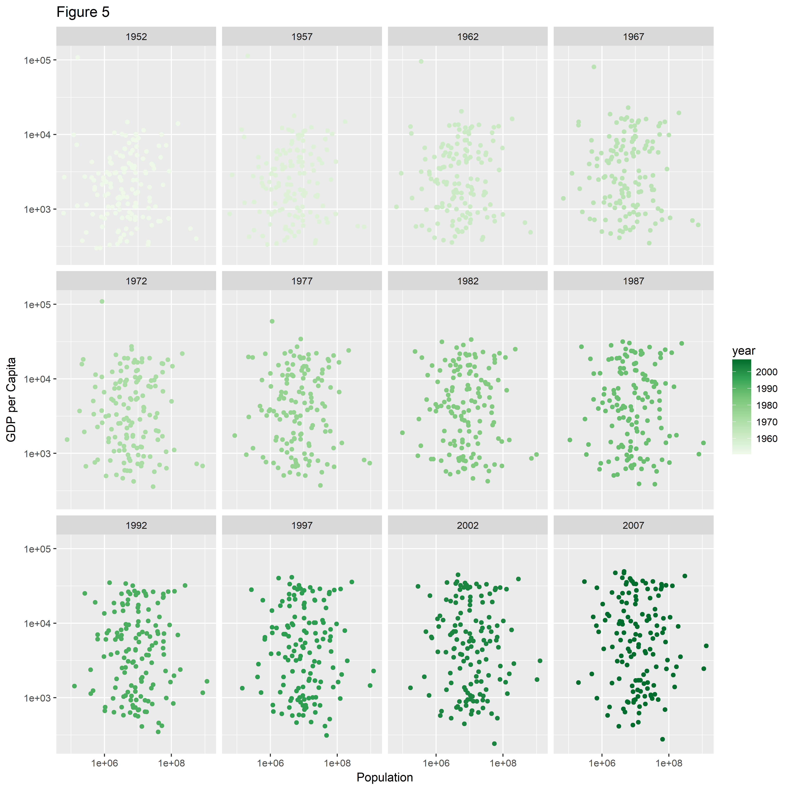

# Report process
1. Problems I ran into

    - Drop factor level. I tried to pipe gapminder into `droplevels()` but failed. But I realized that this problem can be solved in 2 ways (see below).
    - I tried to use `write_csv()` to export table into a PDF. Obviously, this is wrong since the function is call "csv", not PDF. I also tried to export to .xlsx using `dput()`. The file can be found but it is broken. If the file is exported in .xls form, it can be opened. I don't know why.
    - I had trouble in adding picture into the MD file. This is because when using `` I did not remove "path" when the figure is in the same subfolder as the RMD/MD file.
    - I finished the "want to do more" question. However, I solved it in a stupid way. Look forward to getting new ways to solve it.
    - I tried to export figures using high resolution. However, it took a very long time to adding the figure into the file using ``. So do not try dpi>1000.
    
2. Useful resources
    - R for Data Science
    - Lecture notes
    - R documentation online

3. Conclusion

This homework is not difficult after I reviewed all lecture notes. I applied what I learted in class to this homework. Look forward to improve my skills in STAT 547M.


# Factor management

## Step goals
- Define factor variables;
- Drop factor / levels;
- Reorder levels based on knowledge from data.

## Preparation: load libraries
```{r}
library(gapminder)
library(tidyverse)
library(devtools)
library(tidyverse)
library(dplyr)
library(gapminder)
library(RColorBrewer)
library(readxl)
library(forcats)
library(gridExtra)
library(knitr)
```

## Gapminder version
__Drop Oceania.__ Filter the Gapminder data to remove observations associated with the continent of Oceania. Additionally, remove unused factor levels. Provide concrete information on the data before and after removing these rows and Oceania; address the number of rows and the levels of the affected factors.

Answer:

First, I remove the Oceania data using `filter()`. By checking the level of `continent` factors, I can see that Oceania is still there (5 levels in total). There are still 142 countries. There are 1704 rows in total.
```{r}
# Before removing Oceania, how many rows are there?
nrow(gapminder)

# Remove Oceania from gapminder
a1 <- gapminder %>%
        filter(continent != "Oceania")
str(a1$continent)
str(a1$country)
```

Since the dataset is too long, I do not display the result above. In order to prove that Oceania is completely removed, I used the following codes and got `0 rows`.
```{r}
a1 %>%
        filter(continent == "Oceania")
```

Now, I wan to remove unused factor levels, Oceania and corresponding countries. From the result, it is obvious that Oceania disappears from the `continent` factors (4 levels in total). The number of countries decreases to 140 (two Oceania countries disappeared). There are only 1680 rows left.
```{r}
# Remove unused factor levels
a1$continent <- factor(a1$continent)
a1$country <- factor(a1$country)
str(a1$continent)
str(a1$country)
nrow(a1)
```

Alternatively, I can also use `droplevels()` to remove the unused factor level. The results are the same as above, which are not repeated here again.
```{r}
a2 <- droplevels(a1)
str(a2$continent)
str(a2$country)
```

By comaring the results above, we can see that the factor levels of `continent` and `country` are influenced by the removal of Oceania and `droplevels`. If `deoplevels` is not used, the factor level will not change. The number of rows are also changed of course.

__Reorder the levels of `country` or `continent`.__ Use the forcats package to change the order of the factor levels, based on a principled summary of one of the quantitative variables. Consider experimenting with a summary statistic beyond the most basic choice of the median.

Answer:

I would like to reorder `country` by maximum `gdpPercap` and make it in the decent order. The results is correct because the countries at the beginning have the highest GDP/cap while countries at the end (usually in Africa) has the lowest value. This matches our common sense.
```{r}
fct_reorder(gapminder$country, gapminder$gdpPercap, max, .desc = TRUE) %>%
        levels()
```

Let me try to reorder `continent' by minimum `pop` and make it in the increase order. This result matches our knowledge that Asia has the largest population and Oceania has the lowest.
```{r}
fct_reorder(gapminder$continent, gapminder$pop, max, .desc = FALSE) %>%
        levels()
```

## Common part
While you’re here, practice writing to file and reading back in (see next section).

Characterize the (derived) data before and after your factor re-leveling.

- Explore the effects of `arrange()`. Does merely arranging the data have any effect on, say, a figure?
- Explore the effects of reordering a factor and factor reordering coupled with `arrange()`. Especially, what effect does this have on a figure?

These explorations should involve the data, the factor levels, and some figures.

Answer:

First, let me explore whether `arrange()` has any influence on a figure with/withoout re-ordering factors. I would like to see the GDP/cap of each country in `Americas` in 1997. In Figure 1, I used `arrange(desc(gdpPercap))` to see if it worked. In Figure 2, I re-ordered `country` by `gdpPercap`.

By comparing the figure, it is obvious that `arrange()` does not change the figure at all. In Figure 1, although `arrange(desc(gdpPercap))` is used, the points are still distributed randomly instead of in the decreasing order.

I think `arrange()` will only influence a plot when `geom_path()` is used. This is because `arrange()` changes the order of rows and `geom_path()` connects points together in the original order. If the order of points changes, the figure will change too. Otherwise, all items will be plotted in the alphabetical order, by default, just like this example.

```{r}
# Generate the data
gap_america_1997 <- gapminder %>%
        filter(year == 1997, continent == "Americas")

# Figure 1: before reordering the factor
gap_america_1997 %>%
        arrange(desc(gdpPercap)) %>%
        ggplot(aes(x = gdpPercap, y = country)) +
        geom_point() +
        labs(x="GDP per Capita", y="Country", title="Figure 1: Before Re-ordering Factors")

# Figure 2: after reordering the factor
gap_america_1997 %>%
        ggplot(aes(x = gdpPercap, y = fct_reorder(country, gdpPercap, max, .desc = TRUE))) +
        geom_point() +
        labs(x="GDP per Capita", y="Country (Re-ordered factor)", title="Figure 2: After Re-ordering Factors")
```

Second, let me explore the effects of reordering a factor and factor reordering coupled with `arrange()`. I would like to copy the Figure 2 above (called Figure 3 below) and compare it with another figure with `arrange()`. Since the factor is already re-ordered in decend order, I arrange `gdpPercap` in an increasing order to see the change.

According to the figures below, `arrange()` does not work. It did not change the figure at all. The reason is the same as above.

As is discussed above, `arrange()` will only influence a plot when `geom_path()` is used.
```{r}
# Figure 3: Re-order factor without arrange()
gap_america_1997 %>%
        ggplot(aes(x = gdpPercap, y = fct_reorder(country, gdpPercap, max, .desc = TRUE))) +
        geom_point() +
        labs(x="GDP per Capita", y="Country (Re-ordered factor)",
             title="Figure 3: Re-order factors without arrange()")

# Figure 4: Re-order factor without arrange()
gap_america_1997 %>%
        arrange(gdpPercap) %>%
        ggplot(aes(x = gdpPercap, y = fct_reorder(country, gdpPercap, max, .desc = TRUE))) +
        geom_point() +
        labs(x="GDP per Capita", y="Country (Re-ordered factor)",
             title="Figure 4: Re-order factors with arrange()")
```

# File I/O
Experiment with one or more of `write_csv()/read_csv()` (and/or TSV friends), `saveRDS()/readRDS()`,  `dput()/dget()`. Create something new, probably by filtering or grouped-summarization of Singer or Gapminder. I highly recommend you fiddle with the factor levels, i.e. make them non-alphabetical (see previous section). Explore whether this survives the round trip of writing to file then reading back in.

Answer:

First, create dataset to be exported and imported. I select the Europe data and get the maximum GDP/cap. Unused level is removed. The rest levels are re-ordered in a decend order.
```{r}
gap_eu_gdp <- gapminder %>%
        filter(continent == "Europe") %>%
        group_by(country, continent) %>% 
        summarise(GDP_cap_max = max(gdpPercap)) %>%
        ungroup() %>%
        droplevels()

fct_reorder(gap_eu_gdp$country, gap_eu_gdp$GDP_cap_max, max, .desc = TRUE) %>%
        levels()
```

Now, I am going to export the data in two different ways.
```{r}
# Method 1
write_csv(gap_eu_gdp, "gap_eu_gdp_1.csv")

# Method 2
dput(gap_eu_gdp, "gap_eu_gdp_2.xls")
```

Next, import data from saved files.
```{r}
# Method 1
import_1 <- read_csv("gap_eu_gdp_1.csv")

# Method 2
import_2 <- dget("gap_eu_gdp_2.xls")
```

# Visualization design
Remake at least one figure or create a new one, in light of something you learned in the recent class meetings about visualization design and color. Maybe juxtapose your first attempt and what you obtained after some time spent working on it. Reflect on the differences. If using Gapminder, you can use the country or continent color scheme that ships with Gapminder.

Answer:

I plotted `pop` vs `gdpPercap` in log scale. The colors are modified by using `scale_colour_distiller()`.
```{r}
(f5 <- gapminder %>%
        ggplot(aes(pop, gdpPercap)) +
        geom_point(aes(colour=year)) +
        scale_x_log10() +
        scale_y_log10() +
        facet_wrap(~year) +
        scale_colour_distiller(palette="Greens", direction=1) +
        labs(x="Population", y="GDP per Capita", title="Figure 5"))
```

Here is another trial. Plot `pop` vs `year`. Use `scale_fill_manual()` and `brewer.pal()` to change the color.
```{r}
gapminder %>% 
        filter(year > 1970 & year < 2000) %>%
        ggplot(aes(x=year)) +
        geom_bar(aes(weight=pop, fill=continent),
                 position="dodge",
                 colour="black") +
        scale_y_log10() +
        scale_y_continuous("Population") +
        scale_fill_manual(values=brewer.pal(n=5, "RdYlGn")) +
        labs(x="Year", y="Population", title="Figure 6")
```

# Writing figures to file
Use `ggsave()` to explicitly save a plot to file. Then use `` to load and embed it in your report. You can play around with various options, such as:

Arguments of `ggsave()`, such as width, height, resolution or text scaling.
Various graphics devices, e.g. a vector vs. raster format.
Explicit provision of the plot object `p` via `ggsave(..., plot = p)`. Show a situation in which this actually matters.

Answer:

I would like to save Figure 5 in the previous question. The figure is saved to both PDF and PNG format. The size and resolution are also specified.
```{r}
# Vector form
ggsave("Figure 5.pdf", plot = f5, width = 10, height = 10, dpi = 450)

# Raster form
ggsave("Figure_5.png", plot = f5, width = 10, height = 10, dpi = 450)
```

Load and embed `Figure 5.png` in my report.



# Clean up your repo!
You have 6 weeks of R Markdown and GitHub experience now. You’ve reviewed 4 peer assignments. Surely there are aspects of your current repo organization that could be better. Deal with that. Ideas:

- A nice Table of Contents in top-level README that links to individual pieces of work.
        - Good for future: `hw03 dplyr verbs`
        - Bummer in the future: `hw03`
        - Include a slug with content info!
- Remove all downstream stuff, e.g. figures, html, etc. and re-render everything. It will be nice to not have weird, vestigial files lying around to puzzle you in future.
- Anything that’s `Rmd` but that could be `md`? Convert it.

Answer:

1. The top-level table of content has been updated with a description of each homework.


# But I want to do more! (Gapminder version)
Pick a handful of countries, each of which you can associate with a stereotypical food (or any other non-controversial thing … sport? hobby? type of music, art or dance? animal? landscape feature?). Create an excerpt of the Gapminder data, filtered to just these countries. Create a new factor – you pick the name! – by mapping the existing country factor levels to the new levels.

Examples: Italy –> wine, Germany –> beer, Japan –> sake. (Austria, Germany) –> German, (Mexico, Spain) –> Spanish, (Portugal, Brazil) –> Portuguese. Let your creativity flourish.

Answer:

I would like to use the example above to associate selected countries with a stereotypical food. Italy –> wine, Germany –> beer, Japan –> sake.

I solved this question in a stupid way but it worked! First, I create a vector containing all food (repeat 12 times each). Since the country is in the alphabetical order, I put three food names according to the order of countries. Second, I added the new column into the seleceted data and drop unused level. Finally, I converted the the new column into a factor. Since the food level is in alphabetical order, I re-ordered them. By checking the result, we can see that Germany is with beer, Italy is with wine and Japan is with sake.

```{r}
# Create a new column called food
food <- c(rep("beer", 12), rep("wine", 12), rep("sake", 12))

# Add the new column to the data and remove unused factor level
data <- gapminder %>%
        filter(country %in% c("Italy", "Germany", "Japan")) %>%
        mutate(food) %>%
        droplevels()

# Factorize the new column and display the table
data$food <- as.factor(data$food)
data$food %>% fct_relevel("beer", "wine") %>% levels()
kable(data)

# Check the result
data$country %>% levels()
data$food %>% levels()
```


[This is the end of Homework 5.]
